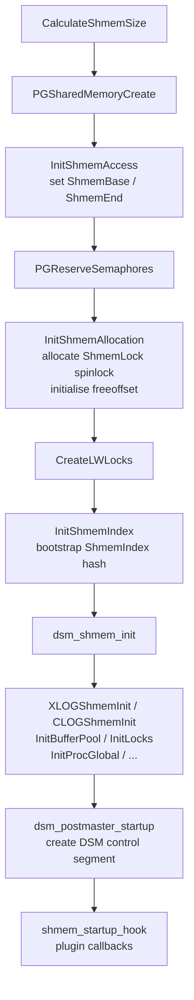
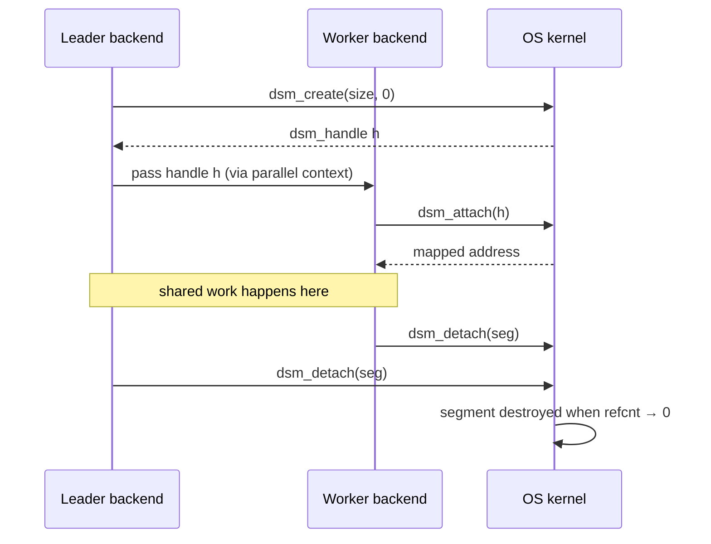

# Shared Memory Layout

All PostgreSQL backends in a cluster share a single region of operating-system shared memory. This shared region is the foundation for the buffer pool, WAL buffers, lock tables, process arrays, and all other cross-backend state. Without a shared memory region, every backend would require its own copy of those structures. This approach would make cache sharing impossible. It would also require expensive IPC for every lock acquisition or buffer lookup. The fundamental constraint driving this design is that a PostgreSQL cluster is a multi-process, not a multi-thread, architecture. Each backend is a separate OS process with its own virtual address space. Pages read from disk must therefore live somewhere that every backend can access, without copying data across process boundaries. The operating system shared memory mechanisms — POSIX `shm_open`, System V `shmget`, or anonymous `mmap` — provide a region. The OS maps this region simultaneously into the virtual address space of every process that attaches to it.

Because all pointers in shared memory are real virtual addresses (not offsets), PostgreSQL requires that every process map the segment at the same virtual address. `src/include/storage/shmem.h` notes this constraint:

> "each process must map the shared memory region at the same address. This means shared memory pointers can be passed around directly between different processes."

`CreateSharedMemoryAndSemaphores` (`src/backend/storage/ipc/ipci.c`) creates the shared memory segment exactly once per cluster lifetime, at postmaster startup. Child backends inherit both the virtual address mapping and the C-level pointers to every sub-structure through `fork()`. On platforms that require `EXEC_BACKEND` (Windows), each new backend re-runs the same initialization sequence against the already-created segment instead.

## Startup: calculating and creating the segment

### Calculating the Total Segment Size

Before allocating anything, `CalculateShmemSize` (`src/backend/storage/ipc/ipci.c`) calls every subsystem's `*ShmemSize()` function. It sums the results and then rounds the total up to an 8192-byte page boundary:

```c
size = 100000;   /* baseline slack */
size = add_size(size, BufferShmemSize());
size = add_size(size, LockShmemSize());
size = add_size(size, ProcGlobalShmemSize());
size = add_size(size, XLOGShmemSize());
size = add_size(size, CLOGShmemSize());
/* ... many more ... */
size = add_size(size, total_addin_request);  /* from shared_preload_libraries */
size = add_size(size, 8192 - (size % 8192)); /* page-align */
```

All arithmetic uses `add_size()` which detects overflow. PostgreSQL stores the resulting value in the `shared_memory_size` GUC.

### PGSharedMemoryCreate and the segment header

`PGSharedMemoryCreate` (`src/backend/port/sysv_shmem.c` or `mmap_shmem.c`) allocates the OS-level segment. It writes a `PGShmemHeader` at its very beginning:

| Field | Type | Purpose |
|---|---|---|
| `magic` | `int32` | `PGShmemMagic` (679834894) — identifies a live Postgres segment |
| `creatorPID` | `pid_t` | PID of the postmaster that created the segment |
| `totalsize` | `Size` | Total bytes in the segment |
| `freeoffset` | `Size` | Byte offset of next free space (the bump pointer) |
| `dsm_control` | `dsm_handle` | Handle of the DSM control segment |
| `index` | `void *` | Pointer to the `ShmemIndex` hash table once initialised |
| `device` / `inode` | `dev_t` / `ino_t` | Data directory identity — prevents re-use after a restart on the same key |

`InitShmemAccess` stores the three module-global pointers `ShmemBase`, `ShmemEnd`, and `ShmemSegHdr` from this header. These are the only globals the allocator needs.

### Initialization order in CreateSharedMemoryAndSemaphores



The ordering is constrained: [[subsystems/locking/lwlocks|LWLocks]] must exist before `InitShmemIndex` because every `ShmemInitStruct` call acquires `ShmemIndexLock`. Startup bootstraps the spinlock used by the allocator itself (`ShmemLock`) via `ShmemAllocUnlocked`, before the full allocator comes online.

## The bump-pointer allocator

### ShmemAlloc / ShmemAllocRaw

The allocator draws all shared memory from a single monotonically-advancing pointer, stored as `ShmemSegHdr->freeoffset`. There is no `free()`. Every allocation is permanent for the lifetime of the cluster.

`ShmemAllocRaw` (`shmem.c`) advances the pointer under `ShmemLock`:

```c
size = CACHELINEALIGN(size);   /* round up to cache-line boundary */
SpinLockAcquire(ShmemLock);
newStart = ShmemSegHdr->freeoffset;
newFree  = newStart + size;
if (newFree <= ShmemSegHdr->totalsize) {
    newSpace = (char *) ShmemBase + newStart;
    ShmemSegHdr->freeoffset = newFree;
} else
    newSpace = NULL;
SpinLockRelease(ShmemLock);
```

The allocator cache-line aligns every allocation (`CACHELINEALIGN`) to prevent false sharing between adjacent structures. The earlier `ShmemAllocUnlocked` variant used during bootstrap applies only `MAXALIGN`.

### Named Allocation via the Shmem Index

Each subsystem registers its allocation by name in the `ShmemIndex` hash table (`ShmemInitStruct()`, `shmem.c`):

```c
void *ShmemInitStruct(const char *name, Size size, bool *foundPtr);
```

On first call (postmaster), the function allocates `size` bytes via `ShmemAllocRaw`. It records `(name → {location, size, allocated_size})` in `ShmemIndex`. It returns a pointer to the fresh region with `*foundPtr = false`. On subsequent calls (backends after `fork()`, or `EXEC_BACKEND` re-initialization), the function finds the existing entry instead. It returns the same pointer, with `*foundPtr = true`. This lets the caller skip initialization.

`ShmemInitStruct` bootstraps the `ShmemIndex` itself with a special case: when `ShmemIndex == NULL` and the name is `"ShmemIndex"`, the function allocates the hash table without trying to look itself up.

| Call pattern | Effect |
|---|---|
| `ShmemInitStruct(name, size, &found)` | Allocate or attach a fixed-size structure |
| `ShmemInitHash(name, init, max, ctl, flags)` | Allocate or attach a shared hash table |
| `ShmemAlloc(size)` | Raw bump allocation with no name registration |
| `ShmemAllocNoError(size)` | Same, returns NULL rather than erroring on exhaustion |

### ShmemIndexEnt

```c
typedef struct {
    char   key[SHMEM_INDEX_KEYSIZE]; /* 48-byte string name */
    void  *location;                  /* address in shared memory */
    Size   size;                      /* bytes requested */
    Size   allocated_size;            /* bytes actually consumed (CACHELINEALIGN) */
} ShmemIndexEnt;
```

PostgreSQL caps the index at `SHMEM_INDEX_SIZE` = 64 buckets (soft limit; the hash table degrades gracefully beyond that). This matches the ~50 named regions registered in a default configuration.

## Major residents and their sizes

The table below gives the dominant consumers of shared memory in a default installation and the source of each size estimate.

| Region | Size formula | Source |
|---|---|---|
| Buffer descriptors | `NBuffers × sizeof(BufferDescPadded)` | `buf_init.c:BufferShmemSize()` |
| Buffer data blocks | `NBuffers × BLCKSZ` (+ `PG_IO_ALIGN_SIZE` padding) | `buf_init.c:BufferShmemSize()` |
| Buffer condition variables | `NBuffers × sizeof(ConditionVariableMinimallyPadded)` | `buf_init.c:BufferShmemSize()` |
| WAL buffers | `XLOGbuffers × XLOG_BLCKSZ` | `xlog.c:XLOGShmemSize()` |
| WAL write-location array | `XLOGbuffers × sizeof(XLogRecPtr)` | `xlog.c:XLOGShmemSize()` |
| PGPROC array | `TotalProcs × sizeof(PGPROC)` | `proc.c:ProcGlobalShmemSize()` |
| Lock hash table | `≈NLOCKENTS() × sizeof(LOCK)` | `lock.c:LockShmemSize()` |
| Proclock hash table | `≈2×NLOCKENTS() × sizeof(PROCLOCK)` | `lock.c:LockShmemSize()` |
| LWLock array | `NUM_FIXED_LWLOCKS × sizeof(LWLockPadded)` | `lwlock.c:LWLockShmemSize()` |
| [[subsystems/storage/clog|CLOG]] (Xact SLRU) | `Min(128, Max(4, NBuffers/512)) × BLCKSZ per buffer` | `clog.c:CLOGShmemSize()` |
| Shared inval buffer | `offsetof(SISeg, procState) + MaxBackends × sizeof(ProcState)` | `sinvaladt.c:SInvalShmemSize()` |
| Background worker data | `max_worker_processes × sizeof(BackgroundWorkerSlot)` | `bgworker.c:BackgroundWorkerShmemSize()` |
| DSM control space (main shmem portion) | `dsm_estimate_size()` | `dsm.c:dsm_shmem_init()` |
| Misc / baseline slack | 100 000 bytes | `ipci.c:CalculateShmemSize()` |

`NBuffers` is the value of `shared_buffers` expressed in pages. `BLCKSZ` is 8192 bytes. `TotalProcs` = `MaxBackends + NUM_AUXILIARY_PROCS + max_prepared_xacts` (`proc.c`). `XLOGbuffers` defaults to `auto` which resolves to roughly 3% of `shared_buffers` (min 32 buffers, capped at 1/32 of a WAL segment-size multiple).

### Buffer pool

The buffer pool dominates shared memory for any non-trivial `shared_buffers` setting. For each 8KB page there is one `BufferDescPadded` descriptor that holds the buffer tag (relfilenode + block number), reference count, usage count, content lock, and I/O lock. PostgreSQL pads descriptors to a cache-line multiple, to avoid false sharing on multi-socket systems.

### WAL buffers

WAL buffers are a ring of pages in shared memory. `wal_buffers` controls their size. The value -1 (default) triggers auto-tuning in `XLOGShmemSize`: 3% of `shared_buffers` rounded to the nearest `XLOG_BLCKSZ` (8192 bytes), with a minimum of 2 buffers and an upper bound near one WAL segment.

### PGPROC array and process slots

`InitProcGlobal` allocates a flat array of `PGPROC` structures sized to `MaxBackends + NUM_AUXILIARY_PROCS + max_prepared_xacts`. Each `PGPROC` contains the process's transaction state, wait event, latch, and 16 fast-path lock slots (`FP_LOCK_SLOTS_PER_BACKEND = 16`, `src/include/storage/proc.h`). The fast-path slots hold relation OIDs for weak locks (AccessShareLock, RowShareLock, RowExclusiveLock). They avoid acquiring the heavyweight lock table for the common case.

`MaxBackends` = `max_connections + autovacuum_max_workers + 1 + max_worker_processes + max_wal_senders`.

### Lock tables

The heavyweight lock subsystem (`lock.c`) keeps two hash tables in shared memory:

| Hash table | Key | Value | Purpose |
|---|---|---|---|
| Lock table | `LOCKTAG` | `LOCK` | One entry per lockable object currently held or waited on |
| Proclock table | `(PGPROC *, LOCK *)` | `PROCLOCK` | One entry per (backend, lock) pair; holds granted/waiting modes |

`LockShmemSize` pre-sizes both to `NLOCKENTS()` = `max_locks_per_transaction × MaxBackends`, plus an additional 10% as a safety margin. This sizing is conservative by design. If the table fills at runtime, the backend raises an error rather than growing the segment.

### CLOG / SLRU caches

PostgreSQL stores transaction status on disk in `pg_xact` (formerly `pg_clog`). It caches transaction status in a fixed ring of shared memory pages, which the SLRU (Simple Least Recently Used) mechanism manages. `CLOGShmemBuffers` calculates the ring size as `Min(128, Max(4, NBuffers / 512))` pages. Similar SLRU rings exist for:

| SLRU | Directory | Shared name |
|---|---|---|
| Transaction status (CLOG) | `pg_xact` | `"Xact"` |
| Subtransaction status | `pg_subtrans` | `"SubTrans"` |
| MultiXact members | `pg_multixact/members` | `"MultiXactMember"` |
| MultiXact offsets | `pg_multixact/offsets` | `"MultiXactOffset"` |
| Commit timestamps | `pg_commit_ts` | `"CommitTs"` |

`SimpleLruInit` initializes each SLRU segment. It calls `ShmemInitStruct` internally.

### Shared invalidation message queue (SISeg)

`CreateSharedInvalidationState` allocates an `SISeg` structure containing a circular buffer of 4096 `SharedInvalidationMessage` entries (`MAXNUMMESSAGES = 4096`, `sinvaladt.c`). Each backend has a `ProcState` slot in the same structure that tracks which messages it has consumed. When a backend's catalog cache is invalidated (e.g., after a DDL operation), PostgreSQL posts the invalidation message to this ring. Every other backend reads it at its next transaction boundary.

### Other named regions

| Name | Struct | Purpose |
|---|---|---|
| `"shmInvalBuffer"` | `SISeg` | Shared catalog invalidation queue |
| `"Background Worker Data"` | `BackgroundWorkerArray` | Slot array for registered background workers |
| `"AutoVacuum Ctl"` | `AutoVacuumShmemStruct` | [[subsystems/background/autovacuum|Autovacuum]] launcher state |
| `"Checkpointer Ctl"` | `CheckpointerShmemStruct` | Checkpointer request flags |
| `"WAL Sender State"` | `WalSndCtlData` | Array of `max_wal_senders` WAL sender slots |
| `"Wal Receiver Ctl"` | `WalRcvData` | Single WAL receiver state |
| `"ReplicationSlotCtl"` | `ReplicationSlotCtlData` | Replication slot array |
| `"XLOG Ctl"` | `XLogCtlData` | WAL control: ring pointers, flushed LSN, insert locks |
| `"ShmemIndex"` | `HTAB` | The meta-index of all named shared regions |

## pg_shmem_allocations view (PG 13+)

The SQL function `pg_get_shmem_allocations()` (`shmem.c`) iterates the `ShmemIndex` hash table under a shared `ShmemIndexLock`. It returns one row per named region, plus a pseudo-row for the unnamed overhead and one for still-free space:

```sql
SELECT name, off, size, allocated_size
FROM pg_shmem_allocations
ORDER BY allocated_size DESC;
```

| Column | Meaning |
|---|---|
| `name` | String key used in `ShmemInitStruct` (NULL for free space row) |
| `off` | Byte offset from the start of the segment (NULL for anonymous row) |
| `size` | Bytes requested by the subsystem |
| `allocated_size` | Bytes actually consumed after `CACHELINEALIGN` rounding |

The `<anonymous>` row accounts for allocations made through `ShmemAlloc` directly (bypassing the index), most notably the spinlock array and the LWLock array. The final NULL-name row shows the remaining uncommitted space.

## Dynamic shared memory (DSM)

Startup fixes the size of the main shared memory segment. It cannot grow after that. For workloads that need temporary cross-process memory — parallel query workers sharing a hash table or sort space — PostgreSQL provides dynamic shared memory (DSM) (`src/backend/storage/ipc/dsm.c`).

### Segment lifecycle



`dsm_create` picks a random 32-bit handle. It calls `dsm_impl_op(DSM_OP_CREATE, ...)`. It registers the handle in the DSM control segment with `refcnt = 2` (one for the segment's existence, one for the creator's mapping). It returns a `dsm_segment *`.

`dsm_attach` increments the reference count in the control segment. It maps the segment into the calling process's address space.

When all processes release their mappings, the reference count drops to 1 (the "keep-alive" reference). When the last holder calls `dsm_detach`, or at postmaster shutdown, the OS destroys the segment.

### dsm_segment and dsm_control structures

```
struct dsm_segment {             /* backend-local */
    dsm_handle   handle;
    uint32       control_slot;
    void        *mapped_address;
    Size         mapped_size;
    slist_head   on_detach;      /* cleanup callbacks */
};

typedef struct dsm_control_item {   /* in main shared memory */
    dsm_handle  handle;
    uint32      refcnt;          /* 2+ active, 1 moribund, 0 gone */
    size_t      first_page;
    size_t      npages;
    bool        pinned;
} dsm_control_item;

typedef struct dsm_control_header { /* in main shared memory */
    uint32             magic;    /* PG_DYNSHMEM_CONTROL_MAGIC = 0x9a503d32 */
    uint32             nitems;
    uint32             maxitems; /* PG_DYNSHMEM_FIXED_SLOTS + 5×MaxBackends */
    dsm_control_item   item[];
} dsm_control_header;
```

The control segment itself is a separate OS shared memory segment (not the main segment). `dsm_postmaster_startup` creates it at postmaster startup. PostgreSQL stores its handle in `PGShmemHeader->dsm_control`, so that backends can find it on attach.

`dsm_shmem_init` pre-allocates the control segment in main shared memory for small DSM regions, to avoid creating OS segments for the common parallel-query case.

### DSM implementation backends

| Value | `dsm_impl.h` constant | OS mechanism | Default on |
|---|---|---|---|
| 1 | `DSM_IMPL_POSIX` | `shm_open` / `ftruncate` / `mmap` | Linux, macOS, most Unices |
| 2 | `DSM_IMPL_SYSV` | `shmget` / `shmat` | `EXEC_BACKEND` builds |
| 4 | `DSM_IMPL_MMAP` | anonymous `mmap` into a file | Fallback |

The `dynamic_shared_memory_type` GUC selects the implementation.

## Huge pages

On Linux, the postmaster can request that the shared memory segment be backed by huge pages (2 MB or 1 GB), reducing TLB pressure for large `shared_buffers` settings.

`GetHugePageSize` (`src/backend/port/sysv_shmem.c`) reads the system's huge page size from `/proc/meminfo`. It returns the appropriate `MAP_HUGETLB` flags. The `huge_pages` GUC governs this behavior:

| `huge_pages` value | Behaviour |
|---|---|
| `off` | Always use standard pages |
| `try` (default) | Attempt `MAP_HUGETLB`; fall back silently on failure |
| `on` | Require huge pages; abort if unavailable |

When `shared_memory_type = mmap` (the default on Linux without `EXEC_BACKEND`), PostgreSQL makes the `mmap` call with `MAP_HUGETLB | MAP_ANONYMOUS`. If huge pages are available and the pool is large enough to have huge-page-aligned boundaries, the TLB covers the entire buffer pool in far fewer entries than with standard 4 KB pages.

`shared_memory_size_in_huge_pages` (a computed GUC, PG 15+) reports the number of huge pages the segment would occupy, useful for sizing `vm.nr_hugepages` on the OS before starting the cluster.

### Extension hooks

Third-party extensions request additional shared memory before PostgreSQL creates the segment, by implementing `_PG_init` with a call to `RequestAddinShmemSpace(size)` inside a `shmem_request_hook`. After the segment exists, they initialize their structures inside a `shmem_startup_hook`. `CreateSharedMemoryAndSemaphores` (`ipci.c`) calls both hooks in the correct order.

## See also

- [[architecture/shared-memory]] — higher-level overview of the segment and its residents
- [[architecture/overview]]
- [[architecture/process-architecture]]
- [[subsystems/storage/buffer-manager]]
- [[subsystems/wal/overview]]
- [[subsystems/locking/overview]]
- [[subsystems/storage/slru]]
- [[subsystems/transactions/transaction-lifecycle]]
