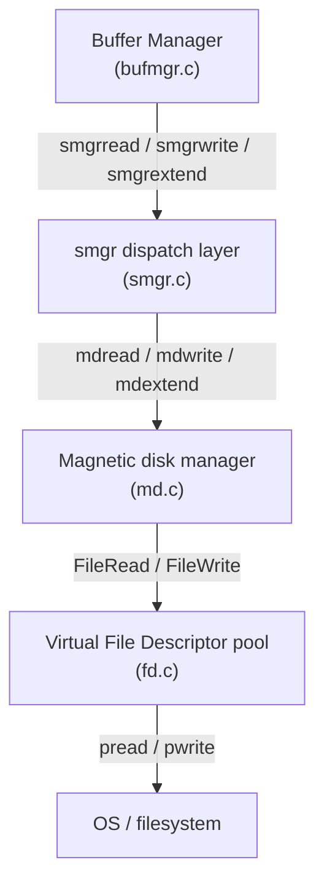

# Storage Manager (smgr)

The storage manager is the layer that sits between the [[subsystems/storage/buffer-manager|buffer manager]] and the filesystem. When the buffer manager needs to load a page into shared memory or flush a dirty page back to disk, it never calls filesystem functions directly — it calls `smgrread()`, `smgrwrite()`, or `smgrextend()` on a storage manager handle. The dispatch layer routes those calls through a function pointer table, to whichever storage implementation is currently registered.

In practice, there is exactly one implementation: the magnetic disk manager in `md.c`. The abstraction is nonetheless real. The `smgr.c` dispatch layer defines a clean interface. Only the code in `md.c` knows anything about file paths, open file descriptors, or the 1 GB segment layout. Adding a new storage backend (hypothetically: an in-memory store, or a networked block device) would mean providing a new entry in the `f_smgr` function table without touching `bufmgr.c`.

## The dispatch table

A struct of function pointers (`f_smgr`) defines the smgr API, containing one slot for each operation: open, close, create, unlink, read, write, extend, zero-extend, prefetch, writeback, nblocks, truncate, and immedsync. At startup, `smgrinit()` iterates over a statically allocated array of registered managers (`smgrsw[]`). It calls each manager's `smgr_init` hook.

Currently `smgrsw` has exactly one entry — the magnetic disk manager. Whenever smgr.c dispatches, it indexes into this array via `reln->smgr_which`, which is always `0`. There is no run-time registration mechanism. Adding a new manager today would require a code change (smgr.c).



## SMgrRelation: the smgr handle

`smgropen()` returns an `SMgrRelation`, which is the smgr's cached handle for a relation. The handle is a hashtable entry, keyed by `RelFileLocatorBackend` (tablespace OID, database OID, relation file number, and backend ID for temporary relations). Creating an `SMgrRelation` via `smgropen()` does not open any files; it just ensures an entry exists in the hash table.

The `SMgrRelationData` struct (smgr.h) holds:

- **`smgr_rlocator`** — the lookup key identifying which relation this handle belongs to.
- **`smgr_owner`** — a back-pointer to whatever external object holds a reference. The relcache sets this when it attaches an `SMgrRelation` to a `RelationData`. When the `SMgrRelation` is closed, smgr.c NULLs out the owner's pointer, preventing dangling references. Each handle permits only one owner.
- **`smgr_targblock`** — the current insertion target block, used by the heap to track where to try inserting next without re-asking smgr on every tuple.
- **`smgr_cached_nblocks[]`** — per-fork cached relation size. This avoids repeated `stat()` calls during recovery (where file sizes are stable). Outside recovery, truncation or extension invalidates the cached value. Code that queries relation size should generally call `smgrnblocks()`, which checks and updates this cache.
- **`md_num_open_segs[]` and `md_seg_fds[]`** — arrays, one slot per fork, holding the count of open segments and their `MdfdVec` descriptors. These fields belong to the md.c implementation. They are embedded directly in `SMgrRelationData` for efficiency.

### Ownership and lifetime

An `SMgrRelation` without an owner is called *transient*. Transient handles live in an `unowned_relns` doubly-linked list. At transaction end (`AtEOXact_SMgr()`), PostgreSQL closes all transient handles. This is a deliberate compromise. Keeping handles around during the transaction amortizes the cost of repeatedly opening the same file across multiple block writes. Closing them at commit or abort ensures that file descriptors do not leak across transactions and that deleted files are cleaned up promptly.

Relations owned by the relcache (`smgrsetowner()`) live longer — as long as the corresponding `RelationData` is kept in the relcache. When the relcache flushes a relation entry, it calls `smgrclearowner()`, which returns the handle to the unowned list. PostgreSQL sweeps it at the next transaction boundary.

## Relation forks and file naming

Every relation is split into up to four *forks*, each stored as a separate file (or set of segment files). The fork number is passed to every smgr operation so the right file is targeted. The four forks are:

| Fork | Constant | File suffix | Contents |
|------|----------|-------------|----------|
| Main | `MAIN_FORKNUM` | *(none)* | Heap or index data pages |
| [[subsystems/storage/fsm|Free Space Map]] | `FSM_FORKNUM` | `_fsm` | Available space per page |
| [[subsystems/storage/visibility-map|Visibility Map]] | `VISIBILITYMAP_FORKNUM` | `_vm` | All-visible / all-frozen bits |
| Init | `INIT_FORKNUM` | `_init` | Empty template for unlogged table resets |

The md.c layer translates a `(RelFileLocator, ForkNumber, BlockNumber)` triple into a file path and byte offset using `relpath()` for the base path and arithmetic for the segment and offset. See [[subsystems/storage/relation-forks|Relation Forks]] for the full path construction rules.

## The magnetic disk manager (md.c)

The md.c implementation provides the concrete file I/O behind the smgr interface. Its name is historical — Berkeley's original storage manager targeted spinning disks — but it works on any filesystem the OS can provide.

### Segments: splitting large relations

Operating systems and filesystems once imposed strict per-file size limits. To handle relations larger than those limits, md.c splits each relation fork into *segment files* of at most `RELSEG_SIZE` blocks (configured at compile time; the default yields ~1 GB segments). Segment 0 is the base file (`relfilenode`), segment 1 is `relfilenode.1`, and so on.

Any I/O request targeting block number `B` maps to:

```
segment number = B / RELSEG_SIZE
offset within segment = (B % RELSEG_SIZE) * BLCKSZ
```

The `_mdfd_getseg()` internal function locates the right `MdfdVec` for a given block, opening additional segments as needed.

A relation must consist of zero or more full segments (each exactly `RELSEG_SIZE` blocks), followed by exactly one partial segment. md.c leaves inactive segments — those that remain after a `mdtruncate()` but are now empty — on disk at size zero, rather than unlinking them immediately. This prevents other backends that still hold open file descriptors to those segments from writing into a file that no longer exists at its old path. If the relation grows again, md.c simply reuses the previously-inactive segment.

### MdfdVec: tracking open segments

`MdfdVec` (md.c) is a minimal struct holding two fields:

- `mdfd_vfd` — a virtual file descriptor (VFD) index into `fd.c`'s descriptor pool.
- `mdfd_segno` — the segment number this entry represents.

Each `SMgrRelation` stores, per fork, a dynamically-sized array of `MdfdVec` entries (`md_seg_fds[forknum]`) and a count of how many are currently open (`md_num_open_segs[forknum]`). md.c grows the array on demand, as backends access segments. It does not pre-populate the array for all existing segments.

### Read and write paths

`mdread()` and `mdwrite()` both follow the same pattern: call `_mdfd_getseg()` to get the right `MdfdVec`, compute the byte offset within the segment, then call `FileRead()` or `FileWrite()` from `fd.c` with the VFD, buffer pointer, size (`BLCKSZ`), and offset. PostgreSQL treats a short read or write as an error, except during recovery with `zero_damaged_pages` enabled.

After a write, if `skipFsync` is false and the relation is not temporary, `register_dirty_segment()` queues an fsync request — it does not fsync immediately.

`mdextend()` works identically to `mdwrite()`, but callers use it when writing at or past the current end of the file. A variant, `mdzeroextend()`, extends by multiple blocks at once using `posix_fallocate()` where available (falling back to writing zeroes), which is more efficient for bulk operations like CREATE TABLE AS or index builds.

## The virtual file descriptor pool

Opening a file is expensive. Operating systems also impose hard limits on open file descriptors per process. `fd.c` implements a *virtual file descriptor* (VFD) pool that decouples the number of logically-open files from the number of real OS file descriptors in use.

`PathNameOpenFile()` returns an integer VFD handle. The VFD layer maintains an LRU list of physically-open files. When the pool is full and a caller needs to open a new file, the VFD layer closes the least-recently-used entry, releasing its OS fd. On the next access to that VFD, `fd.c` re-opens the file transparently before performing the I/O.

This allows PostgreSQL to have hundreds of relations "open" in the smgr layer simultaneously without exceeding `ulimit -n`. From md.c's perspective, every `FileRead()` or `FileWrite()` call simply works — the VFD layer handles any necessary close-and-reopen behind the scenes.

## Fsync and the pending-sync queue

PostgreSQL uses write-ahead logging (WAL): the buffer manager writes data pages to the heap or index files as it flushes dirty pages, but the WAL guarantees durability, not an immediate fsync of each data file. PostgreSQL only requires an actual fsync of a relation file at checkpoint time.

When `mdwrite()` or `mdextend()` writes a block, it records the segment as dirty by calling `register_dirty_segment()`. This function posts a `SYNC_REQUEST` to the sync infrastructure (`sync.c`) using a `FileTag` that identifies the specific segment (`mdsyncfiletag` is the callback the sync subsystem calls to actually perform the fsync at checkpoint). The sync infrastructure forwards the request to the checkpointer process. If the checkpointer's request queue is full, the backend falls back to performing the fsync inline instead (a rare slow path).

At checkpoint time, the checkpointer drains the pending-sync queue. It calls `mdsyncfiletag()` for each entry, which opens the file and calls `fsync()`. This batched approach is far more efficient than syncing on every write.

For use cases that bypass this mechanism — notably index builds that skip WAL logging — `smgrimmedsync()` (and its underlying `mdimmedsync()`) perform a synchronous fsync of all segments of a fork before the operation commits. This trades latency for correctness: the file is durable before the transaction is visible to others.

## Relation creation and deletion

### Creation

`smgrcreate()` → `mdcreate()` creates the initial segment file for a fork using `PathNameOpenFile()` with `O_CREAT | O_EXCL`. It also calls `TablespaceCreateDbspace()` to ensure the per-database subdirectory exists within the tablespace — a mild layering violation acknowledged in the source (md.c). After creation, `mdcreate()` registers the segment as dirty, so the checkpointer will fsync it at the next checkpoint.

### Deletion

Deleting a relation's files is more involved than simply calling `unlink()`, because of the interaction with crash recovery and WAL replay. The sequence is:

1. **Drop buffer pool pages** — `DropRelationsAllBuffers()` discards any in-memory pages for the relations being removed, without writing them out.
2. **Send a cache-invalidation message** — `CacheInvalidateSmgr()` broadcasts to all backends that this relation's smgr handle is stale, causing them to close their own file descriptors. This happens *before* any filesystem operation. That way, if the process crashes between steps, other backends do not hold open fds to a half-deleted file.
3. **Unlink the files** — `mdunlink()` / `mdunlinkfork()` physically removes the segments.

For the *main* fork of a non-temporary relation, `mdunlinkfork()` does not unlink the first segment immediately on the first call. Instead, it truncates the segment to zero length and posts a `SYNC_UNLINK_REQUEST` to the sync subsystem. The actual unlink happens after the next checkpoint. The reason: if a new relation were to reuse the same relation file number before the next checkpoint (possible because OIDs wrap), WAL replay after a crash could recreate the old file and then try to replay writes into it, corrupting the new relation's data. Leaving the empty file in place stops the relfilenumber allocator from reassigning the file number until it is safe (the allocator skips over existing files). `mdunlinkfork()` unlinks secondary segments and non-main forks immediately, since they carry no such risk.

Errors during unlink are reported as `WARNING` rather than `ERROR`, because by the time this code runs the transaction has already committed or aborted and it is too late to undo anything.

## Truncation

`smgrtruncate()` (or the internal `smgrtruncate2()`) shrinks relation forks to a specified block count. The caller must hold `AccessExclusiveLock` on the relation. Before touching the files, `smgrtruncate()` sends a shared-invalidation message, to force all other backends to close their smgr handles (and thus their VFDs) for the relation. This prevents them from holding file descriptors to segments that are about to disappear.

`mdtruncate()` processes segments from the last open one backwards:

- `mdtruncate()` truncates segments entirely beyond the new size to zero length (without unlinking them) and closes their VFDs. The zero-truncation serves the same purpose as during deletion: it reclaims disk space even if other backends still hold open fds.
- `mdtruncate()` truncates the last segment that still contains valid data (via `ftruncate()`) to the correct byte length.
- `mdtruncate()` leaves segments entirely before the truncation point alone.

After truncation, `mdtruncate()` updates the cached block count in `smgr_cached_nblocks`.

## Interplay with the buffer manager

The smgr and buffer manager are tightly coupled, but a clean interface separates them. The buffer manager calls only three core I/O operations: `smgrread()` to load a page from disk into a shared buffer frame, `smgrwrite()` to flush a dirty frame back to disk, and `smgrextend()` to append a new block to a relation. The buffer manager knows nothing about segments, file descriptors, or fsync scheduling.

Conversely, smgr.c and md.c know nothing about the buffer pool. When `smgrdounlinkall()` deletes relation files, it calls `DropRelationsAllBuffers()` first — but that call goes back up to the buffer manager through its public API rather than through smgr. The smgr is also uninvolved in page locking or pin management, which are entirely the buffer manager's concern.

This separation makes it straightforward to reason about each layer independently. A bug in page eviction logic stays in `bufmgr.c`; a bug in file-segmentation logic stays in `md.c`.

## See also

- [[subsystems/storage/buffer-manager|Buffer Manager]] — the consumer of smgr I/O operations
- [[subsystems/storage/relation-forks|Relation Forks]] — fork naming, path construction, and file layout
- [[subsystems/storage/temp-files|Temporary Files]] — how temp files bypass the smgr layer
- [[subsystems/wal/overview|WAL Overview]] — why smgr writes do not require immediate fsync
