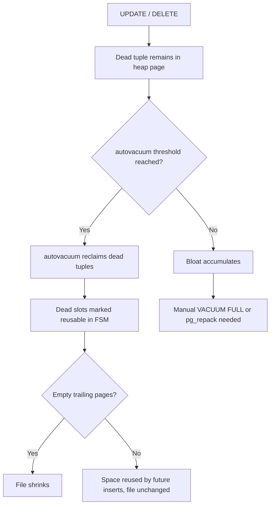

## What Bloat Is

Bloat is wasted space inside relation files: pages that are allocated on disk but contain little or no useful data. It manifests in two forms.

**Dead tuples** are row versions that are no longer visible to any transaction. MVCC requires that UPDATE write a completely new tuple version and mark the old one dead with an `xmax`. DELETE similarly marks the existing version dead. These dead versions occupy space in the heap until VACUUM reclaims them. `HeapTupleIsSurelyDead` (in `heapam_handler.c`) is the hot path that decides whether a tuple can be vacuumed: it checks whether the tuple's `xmax` is committed and older than the oldest running transaction (`OldestXmin`).

**Free space in pages** remains after VACUUM reclaims dead tuples. VACUUM marks those item pointer slots dead (`LP_DEAD` or `LP_UNUSED`). It records available bytes in the FSM (Free Space Map) so future inserts can reuse them. But it does not truncate the file or return pages to the OS. Only `VACUUM FULL` (a full table rewrite) can shrink the physical file. Even then, it requires an exclusive lock. The result is that a table that once held 10 million rows but now holds 2 million may still occupy its historical peak on disk.

The MVCC design is non-negotiable: readers must never block writers, and vice versa. As a result, old versions must persist until no transaction can see them. Heavy UPDATE or DELETE workloads generate dead tuples faster than autovacuum can reclaim them under default settings. Long-running transactions prevent `OldestXmin` from advancing. This freezes dead tuples in place even after autovacuum runs, because autovacuum skips tuples that might still be visible to old snapshots.

Index bloat accumulates independently. A B-tree index entry pointing to a dead heap tuple is not immediately removed. The nbtree code marks such entries `LP_DEAD` during scans (`_bt_killitems`). A subsequent vacuum pass removes them via `lazy_vacuum_heap_rel`. If vacuuming is infrequent, index pages accumulate dead entries. Leaf density drops. The tree may grow extra levels.

## How Bloat Hurts Queries

**Sequential scans** must read every page in the relation, including pages that are mostly empty. A table with 90% bloat forces nine times more I/O than necessary, evicts useful pages from `shared_buffers`, and wastes CPU on visibility checks for dead tuples.

**Index scans** visit index leaf pages to find TIDs, then fetch the heap page for each TID. If the heap tuple is dead (`LP_DEAD` in the index), the executor discards the row but the page fetch already happened. In extreme cases the planner's cost model breaks down: it estimates random I/O based on `pg_class.relpages`, which `vac_update_relstats` updates at vacuum time. If vacuum has not run and `relpages` is stale, the planner may underestimate scan costs and choose a bad plan.

**Buffer pool dilution**: bloated tables consume buffer pool slots with useless data. With a fixed `shared_buffers`, bloat evicts useful data sooner. This increases cache miss rates globally across the instance.

## Measuring and Addressing Bloat

`pgstattuple` and `pgstatindex` can measure both dimensions of bloat exactly, or catalog statistics can estimate them cheaply without scanning the relation. Reclaiming the space then means either marking it reusable in place (`VACUUM`) or physically rewriting the relation into a smaller file (`VACUUM FULL`, `pg_repack` for tables, `REINDEX CONCURRENTLY` for indexes) — the right choice depends on how much downtime the table can tolerate. See [[troubleshooting/bloat|Diagnosing and Remediating Bloat]] for the measurement queries, health thresholds, and a decision tree for choosing between remediation tools.

## Bloat Accumulation Over Time

Bloat accumulates when [[subsystems/background/autovacuum|autovacuum]] falls behind the rate of dead-tuple production. The default trigger (`autovacuum_vacuum_scale_factor = 0.2`) targets small tables: on a 100-million-row table, it allows 20 million dead rows to accumulate before a vacuum even starts. Long-running transactions compound this by pinning `OldestXmin`. This prevents autovacuum from reclaiming any dead tuple no matter how aggressively administrators tune it. See [[subsystems/background/vacuum-tuning|Vacuum Tuning]] and [[troubleshooting/bloat|Diagnosing and Remediating Bloat]] for the specific knobs and prevention strategy.

## Related Topics

- [[subsystems/transactions/mvcc|MVCC]] — the multi-version concurrency model that makes dead tuples unavoidable; understanding snapshot visibility explains why bloat accumulates.
- [[subsystems/storage/fillfactor|Fillfactor]] — per-relation storage parameter that reserves space within pages for updates, directly controlling how quickly HOT chains form and index bloat accumulates.
- [[subsystems/indexes/index-maintenance|Index Maintenance]] — covers the lifecycle of index entries including dead-entry removal, `LP_DEAD` marking, and when REINDEX is necessary.
- [[subsystems/background/vacuum-tuning|Vacuum Tuning]] — deep coverage of autovacuum cost parameters and per-table overrides that determine how aggressively bloat is reclaimed.
- [[troubleshooting/bloat|Bloat Troubleshooting]] — diagnostic runbook for identifying and resolving bloat in production, including pg_repack guidance.
- [[subsystems/observability/pg-stat-all-tables|pg_stat_all_tables]] — the primary view for monitoring `n_dead_tup`, `last_autovacuum`, and vacuum activity that signals bloat accumulation.
- [[subsystems/transactions/xid-wraparound|XID Wraparound]] — long-running transactions and freeze failures that pin `OldestXmin`, preventing vacuum from removing dead tuples across the instance.
- [[subsystems/storage/heap|Heap Storage]] — the tuple format and page layout that dead tuples occupy on disk until vacuum reclaims them.
- [[subsystems/storage/visibility-map|Visibility Map]] — tracks which heap pages contain no dead tuples, letting vacuum and index-only scans skip pages that don't need attention.
- [[subsystems/storage/fsm|Free Space Map]] — records reusable free space per page so new inserts can fill the gaps that bloat leaves behind instead of extending the file.
- [[subsystems/background/autovacuum|Autovacuum]] — the background process responsible for reclaiming dead tuples before they accumulate into bloat.
- [[code-paths/vacuum|VACUUM Code Path]] — the full execution path VACUUM takes to scan, prune, and reclaim space from bloated relations.
- [[subsystems/indexes/btree|B-tree Index Internals]] — index bloat mirrors heap bloat; page splits and dead-entry cleanup determine how quickly a B-tree grows independently of table size.
