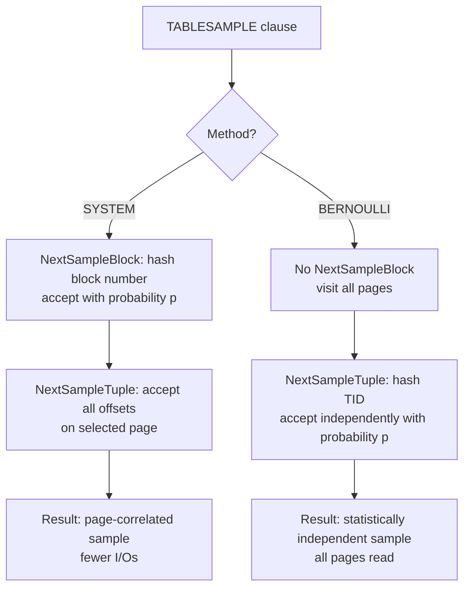

A pluggable access-method layer backs PostgreSQL's `TABLESAMPLE` clause. It separates *which rows to return* from *how to iterate the heap*. Each sampling method is a loadable handler that returns a `TsmRoutine` vtable — a small set of callbacks the executor calls to drive block and tuple selection. The two built-in methods, `BERNOULLI` and `SYSTEM`, expose the fundamental tradeoff in statistical sampling: independence of samples versus cost of I/O. This page covers the access-method side. [[code-paths/tablesample|TABLESAMPLE code path]] documents the executor node that drives the loop.

## Block-level versus tuple-level sampling

The two built-in methods differ in where they apply the sampling decision.

`SYSTEM` decides at the **block** level. It evaluates each page number against the desired fraction. The scan reads accepted pages in full and returns every visible tuple on them. Because the scan reads only a fraction of pages, the I/O cost scales with the sampling percentage rather than with the table size. The cost is low, but the result is not statistically independent: two rows on the same page are either both included or both excluded together. On a table where rows of the same type cluster onto the same pages — for example, orders inserted in bulk during a single transaction — a `SYSTEM` sample can be systematically skewed.

`BERNOULLI` decides at the **tuple** level. It reads every page of the relation, but for each individual tuple offset it independently decides whether to include that tuple. `BERNOULLI` makes each decision without looking at neighbouring tuples. This makes the sample statistically unbiased. The cost is that `BERNOULLI` must fetch every page. This makes it roughly as expensive as a full sequential scan regardless of the sampling percentage. For small sample fractions on large tables, `SYSTEM` is dramatically cheaper. For high fractions or tables that fit in the buffer pool, the difference narrows.

## The TsmRoutine API

A sampling method is registered in the system catalogs as a table access method whose handler function returns a `TsmRoutine` struct (`tsmapi.h`). The struct acts as a vtable. All pointer fields are optional except `BeginSampleScan` and `NextSampleTuple`.

| Callback | Required | Purpose |
|---|---|---|
| `SampleScanGetSampleSize` | yes | Planner cost estimate: how many pages and tuples will be visited |
| `InitSampleScan` | no | Allocate private state in the executor's [[subsystems/memory/contexts|memory context]] |
| `BeginSampleScan` | yes | Receive evaluated parameters and seed; set up state for a scan |
| `NextSampleBlock` | no | Return the next block to read; omit to receive all blocks |
| `NextSampleTuple` | yes | Return the next accepted offset within the current block |
| `EndSampleScan` | no | Release resources at scan end |

The `parameterTypes` list declares the SQL argument types the method accepts. Both built-in methods take a single `float4` percentage. The `repeatable_across_queries` and `repeatable_across_scans` flags tell the executor whether the method can reproduce the same result given the same seed — both built-in methods set both flags to `true`.

The `NextSampleBlock` field is the key structural distinction between the two built-in methods. A method that provides it takes ownership of block selection. The executor calls it once per page to visit, reads that page, then calls `NextSampleTuple` to filter within it. A method that leaves `NextSampleBlock` as `NULL` tells the executor to feed it every block via the normal scan path, and does all filtering inside `NextSampleTuple`.

`GetTsmRoutine()` (`tablesample.c`) is the single entry point the executor uses to obtain a `TsmRoutine`: it calls the handler OID stored in `TableSampleClause.tsmhandler` and validates that the result is a proper `TsmRoutine` node.

## How SYSTEM selects blocks

The `SYSTEM` method converts the sampling percentage into a `uint64` cutoff proportional to `(UINT32_MAX + 1)` (`system_beginsamplescan`, `system.c`). For each candidate block number, `NextSampleBlock` hashes the pair `(blockno, seed)` using `hash_any` and accepts the block if the hash is below the cutoff. Because the block number and the seed alone determine the hash, the decision is entirely history-independent. Inserting or deleting rows elsewhere in the table does not change which blocks the scan selects. The method does not need to track which blocks it has already evaluated. The scan simply walks block numbers from 0 upward, calling the hash test at each position, and stops when it finds a hit or exhausts the relation.

Within accepted blocks, `NextSampleTuple` performs no filtering at all — it returns every offset from `FirstOffsetNumber` through `maxoffset` in sequence, leaving visibility checking to the executor.

`SYSTEM` enables page-mode visibility checking unconditionally (`use_pagemode = true`) because it reads all tuples on each selected page. It enables the bulkread buffer strategy only when the fraction is at least 1%, since very small fractions visit so few pages that the extra setup is not worth it.

## How BERNOULLI selects tuples

The `BERNOULLI` method applies the same cutoff/hash pattern at the tuple level rather than the block level. Its private state (`BernoulliSamplerData`, `bernoulli.c`) stores a `cutoff` computed from the percentage and a `seed`. For each tuple offset on each page, `NextSampleTuple` hashes the triple `(blockno, offset, seed)` and accepts the offset if the hash is below the cutoff. Because both `blockno` and `offset` are in the hash input, the decision for any given `(block, offset)` pair is independent of any other pair. The method has no memory of which tuples it selected on previous pages.

The history-independence property is critical for correctness under syncscan. If PostgreSQL's synchronised scan starts a sequential scan mid-table rather than at block 0, the decision for a particular tuple must not depend on where the scan began. Hashing the TID ensures this.

`BERNOULLI` enables the bulkread strategy unconditionally (it always reads every page) and enables page-mode visibility checking only at fractions of 25% or higher. Below that threshold, the overhead of acquiring page-level visibility information exceeds the benefit for the small number of tuples accepted per page.

## Repeatability and seed flow

Both methods accept a `REPEATABLE(seed)` clause that makes the sample deterministic. At the SQL level the seed is a `float8`. The executor hashes it with `hashfloat8` to produce a `uint32` that it passes to `BeginSampleScan`. Using a hash rather than a direct cast ensures that the same seed value produces the same `uint32` on all platforms. This matters for regression tests that use `REPEATABLE(0)`.

Without a `REPEATABLE` clause, the executor draws a random seed once at scan initialisation. The seed is fixed for the lifetime of the scan node. As a result, rescanning the same node without a new seed produces a different sample on each rescan. This is intentional. The executor does not re-randomise the seed on rescan. It randomises the seed only once, when the scan is first initialised.

The seed becomes part of every hash input in both methods. Changing the seed by even one bit changes the hash outputs for all blocks and tuples, producing a completely different sample set. This is what makes `REPEATABLE` reliable: the same seed, same relation, same data, same percentage always maps to the same set of hashes and therefore the same set of accepted blocks or tuples.

## Planner interaction

Each method provides a `SampleScanGetSampleSize` callback that gives the planner estimates of how many pages and tuples the scan will visit. `BERNOULLI` reports that it will visit all pages of the relation (since it must) and estimates tuples as `relation_tuples * fraction`. `SYSTEM` reports a page count of `relation_pages * fraction` and scales tuples proportionally. These estimates feed into the cost model for `SampleScan` nodes and affect join-order decisions.

## Writing a custom sampling method

A custom method is a PostgreSQL extension that provides a C function returning `internal` (the `TsmRoutine` pointer) and registers it with `CREATE ACCESS METHOD ... TYPE TABLESAMPLE`. The handler function should allocate the `TsmRoutine` with `makeNode(TsmRoutine)`, which zero-initialises all fields. This way, unimplemented optional callbacks are safely `NULL`.

Methods can store arbitrary private state by allocating into `node->tsm_state` during `InitSampleScan`. That pointer persists for the life of the scan. The method should set the `use_bulkread` and `use_pagemode` flags on `SampleScanState` in `BeginSampleScan` to communicate I/O strategy hints to the storage layer. `use_bulkread` selects the ring-buffer access strategy appropriate for sequential I/O. `use_pagemode` enables page-level MVCC checks that amortise per-tuple visibility overhead when many tuples per page are visited.

A method that leaves `NextSampleBlock` as `NULL` must be prepared to accept any block order, including syncscan mid-table starts. A method that provides `NextSampleBlock` controls the order entirely and can implement strategies like stratified sampling or geographically clustered sampling.

## Related Topics

- [[code-paths/tablesample|TABLESAMPLE]] — SQL syntax, the built-in methods, performance trade-offs, and the executor node and scan loop
- [[subsystems/storage/heap|heap storage]] — the underlying page and tuple format
- [[subsystems/storage/table-am|Table Access Method API]] — the broader AM framework
