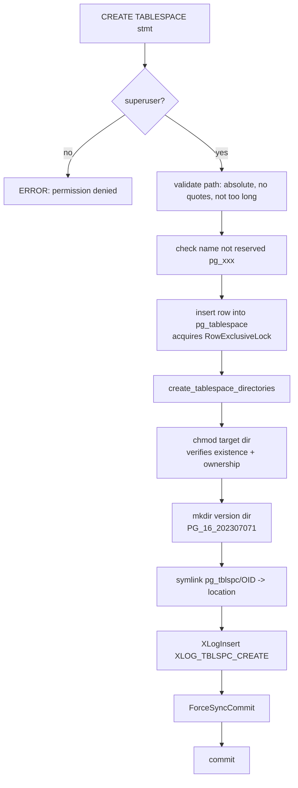
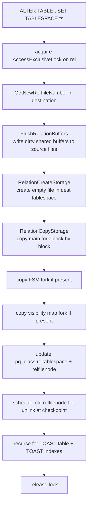

A tablespace is a named mapping from a logical name to a directory on the filesystem. PostgreSQL uses tablespaces to spread data across multiple storage volumes, letting operators place hot indexes on fast NVMe while archiving cold tables on slower storage — all within a single database cluster.

## What a tablespace actually is

From the kernel's perspective, a tablespace is a symlink. PostgreSQL maintains a directory `$PGDATA/pg_tblspc/`. Its entries are symbolic links named by tablespace OID. Each link points to the target directory that `CREATE TABLESPACE` specified. `create_tablespace_directories()` creates the symlinks:

```c
static void
create_tablespace_directories(const char *location, const Oid tablespaceoid)
{
    char *linkloc = psprintf("pg_tblspc/%u", tablespaceoid);
    char *location_with_version_dir = psprintf("%s/%s", location,
                                                TABLESPACE_VERSION_DIRECTORY);

    /* chmod() verifies the target exists and is owned by the postgres OS user */
    if (chmod(location, pg_dir_create_mode) != 0)
        ereport(ERROR, ...);

    /* version directory prevents two clusters from sharing a tablespace */
    if (MakePGDirectory(location_with_version_dir) < 0)
        ereport(ERROR, ...);

    if (symlink(location, linkloc) < 0)
        ereport(ERROR, ...);
}
```

PostgreSQL constructs `TABLESPACE_VERSION_DIRECTORY` at compile time as `"PG_" PG_MAJORVERSION "_" CATALOG_VERSION_NO` (e.g. `PG_16_202307071`). Its presence inside the tablespace directory serves two purposes. It prevents two different major-version clusters from accidentally sharing storage. It also prevents any single directory from hosting more than one tablespace. The `stat()` check for a pre-existing version directory would catch such a collision and raise an error.

## Directory structure

The full path to a relation file goes through four levels of directory:

```
$PGDATA/
├── base/                          # pg_default tablespace (shortcut, no symlink)
│   └── <dboid>/
│       └── <relfilenode>
├── global/                        # pg_global tablespace (shortcut, no symlink)
│   └── <relfilenode>
└── pg_tblspc/
    └── <spcoid> -> /mnt/fast-nvme/pg_data/  # symlink created by CREATE TABLESPACE
        └── PG_16_202307071/
            └── <dboid>/
                └── <relfilenode>
```

`GetRelationPath()` in `src/common/relpath.c` produces the path string given `(dbOid, spcOid, relNumber, backendId, forkNumber)`:

```c
char *
GetRelationPath(Oid dbOid, Oid spcOid, RelFileNumber relNumber,
                int backendId, ForkNumber forkNumber)
{
    if (spcOid == GLOBALTABLESPACE_OID)
        return psprintf("global/%u", relNumber);
    else if (spcOid == DEFAULTTABLESPACE_OID)
        return psprintf("base/%u/%u", dbOid, relNumber);
    else
        return psprintf("pg_tblspc/%u/%s/%u/%u",
                        spcOid, TABLESPACE_VERSION_DIRECTORY,
                        dbOid, relNumber);
}
```

Temporary relations use a `t<backendId>_<relNumber>` prefix inside the same per-database subdirectory, keeping them isolated from permanent files without needing a separate directory.

## Default tablespaces: pg_default and pg_global

`initdb` creates two tablespaces. They are permanent and cannot be dropped.

| Tablespace | OID | Physical path | Contains |
|---|---|---|---|
| `pg_default` | 1663 | `$PGDATA/base/<dboid>/` | All ordinary relations |
| `pg_global` | 1664 | `$PGDATA/global/` | Shared system catalogs (`pg_database`, `pg_authid`, …) |

The codebase special-cases these two tablespaces throughout. `GetDatabasePath()` and `GetRelationPath()` detect their OIDs and return a hardcoded path without going through `pg_tblspc/`. This means they work even on platforms that do not support symlinks. There are no entries under `pg_tblspc/` for them.

`pg_global` has no per-database subdirectory. PostgreSQL accesses shared relations with `dbOid == 0`. The path is just `global/<relfilenode>`.

## Catalog representation

Tablespace metadata lives in two system catalogs.

### pg_tablespace

```
oid       | spcname    | spcowner | spcacl | spcoptions
----------+------------+----------+--------+-----------
1663      | pg_default | 10       |        |
1664      | pg_global  | 10       |        |
<new_oid> | fast_nvme  | 10       |        |
```

`pg_tablespace` has only two indexes: a unique index on `oid` and a unique index on `spcname`. `get_tablespace_oid()` deliberately uses a sequential heap scan rather than an index scan because the table will rarely have more than a handful of rows.

### pg_class.reltablespace

Every relation in `pg_class` carries a `reltablespace` column (OID, foreign-key to `pg_tablespace`). A value of `0` (`InvalidOid`) means "inherit the database's default tablespace" — it does **not** mean `pg_default`. When the database itself has `pg_default` as its default, these are equivalent. If a database was created with `CREATE DATABASE ... TABLESPACE ts`, then `reltablespace = 0` on its relations means `ts`. This indirection avoids having to rewrite `pg_class` for every relation when an administrator runs `ALTER DATABASE SET TABLESPACE`.

The index `pg_class_tblspc_relfilenode_index` covers `(reltablespace, relfilenode)`, which recovery uses to find relations by physical location.

## Creating a tablespace

```sql
-- The directory must exist and be owned by the OS user running postgres
CREATE TABLESPACE fast_nvme LOCATION '/mnt/fast-nvme/pgdata';

-- Optionally owned by another role (but only a superuser can create)
CREATE TABLESPACE fast_nvme OWNER some_role LOCATION '/mnt/fast-nvme/pgdata';
```

`CreateTableSpace()` enforces several invariants before touching the filesystem:

- Caller must be a superuser.
- `location` must be an absolute path (PostgreSQL refuses relative paths as risky).
- The path cannot contain single quotes (to prevent injection in some downstream uses).
- The path length must leave room for the longest possible file suffix (`TABLESPACE_VERSION_DIRECTORY` + `/` + OID + `_` + fork name + `.` + segment number).
- PostgreSQL emits a warning if the path is inside `$PGDATA`. It works but is unusual.
- PostgreSQL reserves names beginning with `pg_` for system use.

`CreateTableSpace()` inserts the catalog row into `pg_tablespace` **before** the filesystem work. If the filesystem operations fail, the transaction rolls back and removes the catalog row. After successfully creating the symlink and version directory, `CreateTableSpace()` calls `ForceSyncCommit()` to minimise the window between the on-disk symlink and the commit record. A crash in that window would leave a dangling symlink that `DROP TABLESPACE` or a re-`CREATE` attempt would need to handle.

`CreateTableSpace()` WAL-logs the creation via `XLOG_TBLSPC_CREATE` with the tablespace OID and path, allowing standbys and point-in-time recovery targets to recreate the symlink.

## Dropping a tablespace

```sql
DROP TABLESPACE fast_nvme;
DROP TABLESPACE IF EXISTS fast_nvme;
```

`DropTableSpace()` checks `pg_shdepend` for any remaining objects before touching the filesystem. If objects exist, the drop fails with a dependency error listing them. After `DropTableSpace()` deletes the catalog row, `destroy_tablespace_directories()` attempts to `rmdir` each per-database subdirectory it finds under the version directory. If any subdirectory is non-empty, it returns `false`.

`DROP TABLE` schedules file unlinking for the next checkpoint rather than deleting immediately (see `mdunlink()`). This creates a race: lingering segment files may still be present when `DROP TABLESPACE` runs. PostgreSQL handles this by forcing an immediate checkpoint if the first removal attempt fails, then retrying. On Windows, it also emits a `PROCSIGNAL_BARRIER_SMGRRELEASE` to force all backends to close their file handles before retrying.

`ProcessUtility` **prohibits `DROP TABLESPACE` inside a transaction block**. This is because the operation must be atomic with respect to filesystem state. Partial rollback after directory removal would be unrecoverable.

## Using tablespaces

### At object creation time

```sql
CREATE TABLE measurements (
    ts  timestamptz,
    val float8
) TABLESPACE fast_nvme;

CREATE INDEX measurements_ts_idx ON measurements (ts) TABLESPACE fast_nvme;

-- Partitioned tables: tablespace applies to the parent's metadata only;
-- each partition must set its own tablespace
CREATE TABLE logs (ts timestamptz, msg text)
    PARTITION BY RANGE (ts) TABLESPACE archive;
```

### Session-level defaults

```sql
-- All objects created in this session go to fast_nvme unless overridden
SET default_tablespace = 'fast_nvme';

-- Revert to database default
SET default_tablespace = '';
```

DDL commands call `GetDefaultTablespace()` to resolve the effective tablespace. An empty string returns `InvalidOid`, which causes objects to inherit the database's default. Partitioned tables disallow specifying the database's own default tablespace because the result would be silently surprising.

### Temporary files

```sql
SET temp_tablespaces = 'fast_nvme, archive';
```

`temp_tablespaces` is a comma-separated list. When a backend needs to spill a sort or hash join to disk, it calls `GetNextTempTableSpace()` to pick the next tablespace from the list. `PrepareTempTablespaces()` parses the list once per transaction and stores the result in `TopTransactionContext`. To minimise contention between concurrent backends sharing the same GUC, PostgreSQL randomises the starting position within the list at parse time:

```c
void
SetTempTablespaces(Oid *tableSpaces, int numSpaces)
{
    tempTableSpaces = tableSpaces;
    numTempTableSpaces = numSpaces;

    /* start at a random position to spread I/O across backends */
    if (numSpaces > 1)
        nextTempTableSpace = pg_prng_uint64_range(&pg_global_prng_state,
                                                  0, numSpaces - 1);
    else
        nextTempTableSpace = 0;
}
```

Within a single transaction, successive spill files advance through the list in round-robin order. A large multi-batch hash join that creates five spill segments will distribute them across five tablespaces if the list is long enough, naturally spreading I/O.

Temporary files land in `<tablespace_dir>/PG_<version>/pgsql_tmp/pgsql_tmp<pid>.<counter>`. The `pgsql_tmp/` directory is `PG_TEMP_FILES_DIR` from `fd.h`. PostgreSQL creates it on demand inside the per-database version directory.

## Moving objects between tablespaces

```sql
-- Table and all its indexes, toast table, and toast indexes move together
ALTER TABLE measurements SET TABLESPACE archive;

-- Move just one index
ALTER INDEX measurements_ts_idx SET TABLESPACE fast_nvme;

-- Move all objects in the database to a new default
ALTER DATABASE mydb SET TABLESPACE new_default;
```

`ATExecSetTableSpace()` holds `AccessExclusiveLock` on the relation throughout the operation. It:

1. Allocates a new `relfilenode` in the destination tablespace with `GetNewRelFileNumber()`.
2. Opens the new relation storage via `smgropen()`.
3. Calls `FlushRelationBuffers()` to write any dirty shared buffers for the source relation to disk (since the physical copy bypasses shared buffers).
4. Calls `heapam_relation_copy_data()` (or `index_copy_data()` for indexes), which copies every fork (main, [[subsystems/storage/fsm|FSM]], [[subsystems/storage/visibility-map|visibility map]]) block by block via `RelationCopyStorage()`.
5. Updates `pg_class.reltablespace` and `pg_class.relfilenode` atomically.
6. Schedules the old file for deletion.
7. Recursively moves the [[subsystems/storage/toast|TOAST]] relation and its indexes if present.

```c
static void
heapam_relation_copy_data(Relation rel, const RelFileLocator *newrlocator)
{
    SMgrRelation dstrel = smgropen(*newrlocator, rel->rd_backend);

    FlushRelationBuffers(rel);
    RelationCreateStorage(*newrlocator, rel->rd_rel->relpersistence, true);

    RelationCopyStorage(RelationGetSmgr(rel), dstrel, MAIN_FORKNUM,
                        rel->rd_rel->relpersistence);

    for (ForkNumber forkNum = MAIN_FORKNUM + 1; forkNum <= MAX_FORKNUM; forkNum++)
    {
        if (smgrexists(RelationGetSmgr(rel), forkNum))
        {
            smgrcreate(dstrel, forkNum, false);
            RelationCopyStorage(RelationGetSmgr(rel), dstrel, forkNum,
                                rel->rd_rel->relpersistence);
        }
    }

    RelationDropStorage(rel);
    smgrclose(dstrel);
}
```

The lock requirement means `ALTER TABLE ... SET TABLESPACE` blocks all reads and writes for the entire duration of the file copy. On a 500 GB table this can take many minutes. There is no incremental or online move capability in core PostgreSQL (contrast with `pg_repack` which can move tables with much shorter lock windows).

## Execution flow: CREATE TABLESPACE



## Execution flow: ALTER TABLE SET TABLESPACE



## GUC reference

| GUC | Type | Default | Scope |
|---|---|---|---|
| `default_tablespace` | string | `''` (database default) | session |
| `temp_tablespaces` | string | `''` (database default) | session |
| `allow_in_place_tablespaces` | bool | `off` | superuser only |

`allow_in_place_tablespaces` is a developer-only GUC for regression testing. When enabled, `CREATE TABLESPACE ... LOCATION ''` creates a real directory inside `pg_tblspc/` rather than a symlink. This lets tests exercise tablespace code paths on filesystems that do not support symlinks.

## Performance use cases

**Indexes on NVMe, tables on HDD**

```sql
CREATE TABLESPACE nvme LOCATION '/mnt/nvme0/pg';
CREATE TABLESPACE hdd  LOCATION '/mnt/hdd0/pg';

-- Frequently queried lookup table
CREATE TABLE users (id bigserial PRIMARY KEY, email text)
    TABLESPACE hdd;
CREATE INDEX users_email_idx ON users (email)
    TABLESPACE nvme;
```

Index scans are random-access workloads, and sequential table scans benefit from high throughput. Placing indexes on low-latency NVMe and tables on high-capacity HDDs therefore maximises hardware utilisation.

**Temp files on a dedicated volume**

```sql
SET temp_tablespaces = 'scratch';
```

Routing sort and hash spill I/O to a separate spindle (or NVMe) prevents analytic query spills from competing with OLTP I/O. The scratch volume can also have different durability settings (e.g. a `noatime` mount, or a filesystem without journaling) since PostgreSQL always rebuilds temp files from scratch after a crash.

**Large archived tables on cheap storage**

```sql
ALTER TABLE events_2022 SET TABLESPACE cold_storage;
```

This requires an exclusive lock and a full file copy. Administrators should therefore do it during a maintenance window or via `pg_repack`.

## Limitations

**Same machine only.** Tablespace directories must be accessible on the same filesystem as the data directory. PostgreSQL does not support network tablespaces (NFS is technically possible but unsupported and unreliable under concurrent write workloads).

**Logical replication subscribers.** Logical replication does not propagate a publisher's tablespace names to subscribers. If the publisher has objects in a custom tablespace, the subscriber must have a tablespace with the same name, or an administrator must manage `CREATE SUBSCRIPTION` / `CREATE TABLE ... TABLESPACE` manually.

**PITR and base backups.** `pg_basebackup` produces a `tablespace_map` file alongside `backup_label`. This file maps each tablespace OID to the path that was in effect on the primary at backup time. During point-in-time recovery, `read_tablespace_map()` reads this file and recreates the symlinks under `pg_tblspc/` before WAL replay begins. If the target machine uses different mount points, the administrator must edit `tablespace_map` before starting recovery.

**Streaming replication standbys.** The standby mirrors the primary's `pg_tblspc/` symlinks exactly. The symlink targets must exist and be accessible on the standby machine with the same paths as on the primary. If the standby uses different mount points, administrators can pre-create the symlinks manually before starting the standby. WAL replay will use whatever the symlink points to rather than the path stored in the WAL record.

**relfilenode uniqueness is per-tablespace.** Relfilenodes are unique within a tablespace, not globally. Two relations in different tablespaces can have the same relfilenode. Code that works with `RelFileLocator` (the triple `(spcOid, dbOid, relNumber)`) must always use all three components to identify a file.

## Inspecting tablespace usage

```sql
-- All tablespaces and their locations
SELECT oid, spcname, pg_tablespace_location(oid) AS location
FROM pg_tablespace;

-- Size of each tablespace
SELECT spcname, pg_size_pretty(pg_tablespace_size(oid))
FROM pg_tablespace
ORDER BY pg_tablespace_size(oid) DESC;

-- Objects in a given tablespace
SELECT relname, relkind, pg_size_pretty(pg_relation_size(oid))
FROM pg_class
WHERE reltablespace = (SELECT oid FROM pg_tablespace WHERE spcname = 'fast_nvme')
ORDER BY pg_relation_size(oid) DESC;

-- Relations using the database default (reltablespace = 0)
SELECT relname FROM pg_class WHERE reltablespace = 0 AND relkind = 'r';

-- Verify symlinks in pg_tblspc
SELECT pg_ls_dir('pg_tblspc') AS entry;
```

```sql
-- Database default tablespace
SELECT datname, spcname
FROM pg_database d
JOIN pg_tablespace t ON d.dattablespace = t.oid;
```

## Tablespace inheritance for partitions

Partitioned tables store a `reltablespace` in `pg_class` but have no physical storage. New partitions inherit the value only if `CREATE TABLE ... PARTITION OF` specifies it explicitly. PostgreSQL deliberately disallows setting `default_tablespace` to the database's own default tablespace when creating partitioned tables (`GetDefaultTablespace()` raises an error in that case). The semantics would otherwise be confusing: each partition would silently ignore the parent's tablespace setting and fall back to the database default.

```sql
-- Parent stores tablespace preference in pg_class but has no files
CREATE TABLE events (ts timestamptz, data jsonb)
    PARTITION BY RANGE (ts) TABLESPACE cold;

-- Partition does NOT automatically inherit 'cold'; must be explicit
CREATE TABLE events_2024 PARTITION OF events
    FOR VALUES FROM ('2024-01-01') TO ('2025-01-01')
    TABLESPACE cold;
```

## Related Topics

- [[subsystems/storage/relation-forks|Relation Forks]] — tablespace moves copy every fork (main, FSM, visibility map) block by block; understanding fork layout is essential for following `heapam_relation_copy_data`.
- [[subsystems/storage/smgr|Storage Manager (smgr)]] — the storage manager layer (`smgropen`, `smgrcreate`, `RelationCopyStorage`) is the interface through which tablespace-aware path resolution is consumed at runtime.
- [[subsystems/storage/temp-files|Temporary Files]] — `temp_tablespaces` controls which tablespaces absorb sort and hash-join spill files; temp file lifecycle is managed by the file descriptor layer on top of tablespace paths.
- [[subsystems/catalog/pg-class|pg_class]] — `reltablespace` and `relfilenode` columns in `pg_class` are the catalog record of which tablespace each relation lives in and are updated atomically during `ALTER TABLE SET TABLESPACE`.
- [[subsystems/replication/base-backup|Base Backup]] — `pg_basebackup` produces a `tablespace_map` file that records OID-to-path mappings; PITR reconstruction relies on this to recreate `pg_tblspc/` symlinks before WAL replay.
- [[subsystems/storage/fsm|Free Space Map (FSM)]] — the FSM fork is one of the forks copied during a tablespace move, and its path is resolved through the same `GetRelationPath` machinery as the main fork.
- [[subsystems/partitioning/overview|Partitioning Overview]] — partitioned tables carry a `reltablespace` in `pg_class` but hold no physical files; each partition must declare its tablespace explicitly, making tablespace management a notable concern for partitioned workloads.
- [[subsystems/storage/heap|Heap Storage]] — tablespaces relocate the main heap fork; heap page layout is what `heapam_relation_copy_data` actually copies block by block.
- [[subsystems/storage/page-layout|PostgreSQL Page Layout]] — the on-disk page format that is copied byte-for-byte when a relation moves between tablespaces.
- [[architecture/overview|Architecture Overview]] — how the data directory, tablespaces, and the `pg_tblspc` symlink layer fit into the overall process and storage architecture.
- [[subsystems/replication/streaming|Streaming Replication]] — a standby needs matching tablespace directories, or matching symlinks, for WAL replay to succeed when the primary uses non-default tablespaces.
- [[subsystems/replication/hot-standby|Hot Standby and Recovery Conflicts]] — replaying tablespace creation and drop WAL records on a standby is one of the recovery conflict scenarios this article covers.
