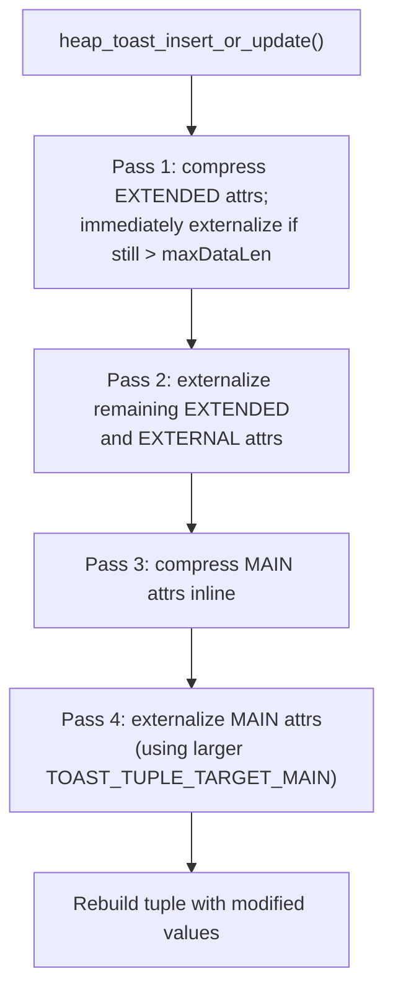
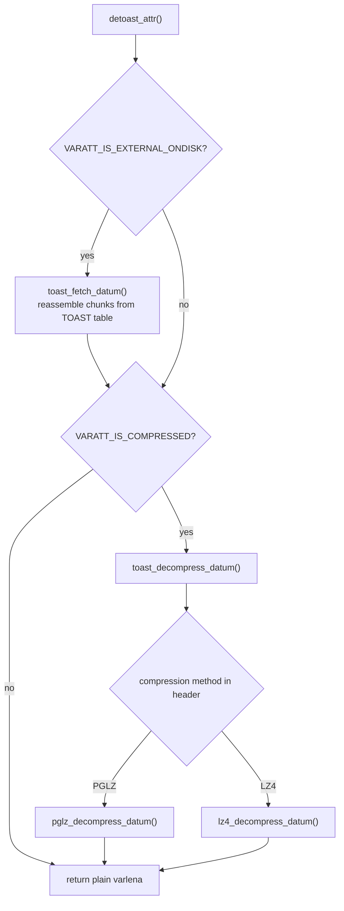
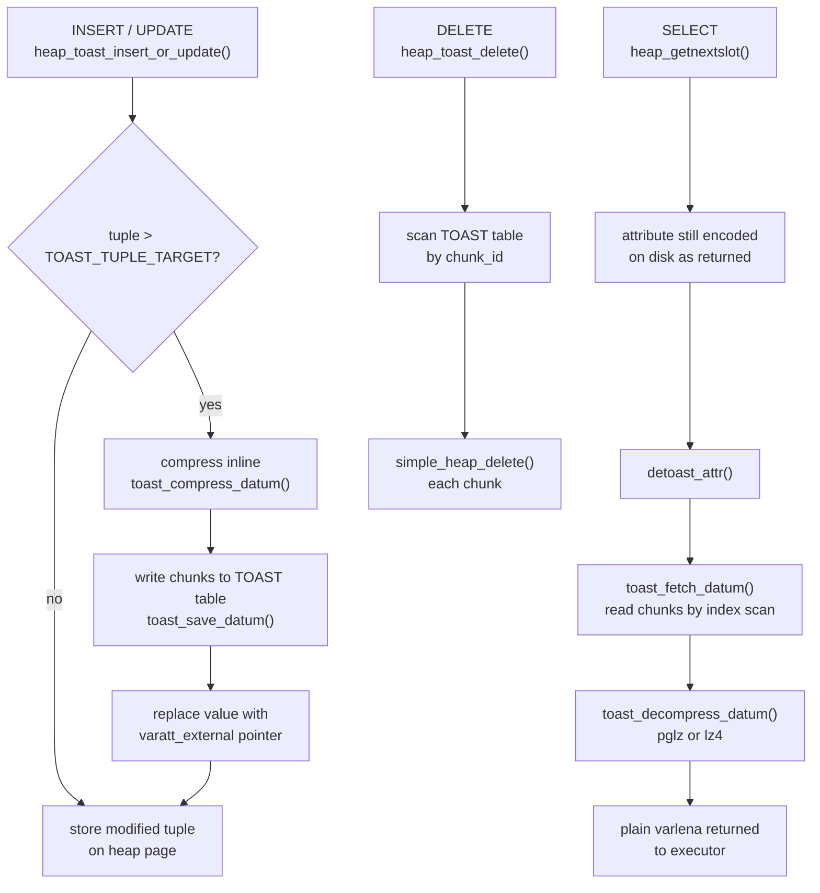

# TOAST: Oversized Attribute Storage

Heap pages are fixed at 8 KB. A tuple must fit entirely on a single page — PostgreSQL's page layout provides no mechanism to chain a tuple across pages. A plain `text` column holding an essay, a `bytea` column holding an image, or a `jsonb` column holding a large document would all violate this constraint without special handling. TOAST (The Oversized Attribute Storage Technique) is the subsystem that resolves the tension between unbounded variable-length values and the fixed page size by compressing values in-line and, when that is not enough, moving them out of the main tuple entirely into a dedicated side table.

## The heap page constraint

With `BLCKSZ = 8192` and the overhead of the page header, item ID array, and tuple header, a usable tuple data payload is roughly 8 KB minus a few hundred bytes. PostgreSQL computes the exact threshold dynamically:

```c
// src/include/access/heaptoast.h
#define TOAST_TUPLES_PER_PAGE   4
#define TOAST_TUPLE_THRESHOLD   MaximumBytesPerTuple(TOAST_TUPLES_PER_PAGE)
#define TOAST_TUPLE_TARGET      TOAST_TUPLE_THRESHOLD
```

`MaximumBytesPerTuple(N)` calculates the largest tuple size that still permits N tuples per page. With `N = 4` this works out to approximately 2 KB. A tuple that exceeds `TOAST_TUPLE_THRESHOLD` triggers the TOAST machinery. The goal is to shrink it to no more than `TOAST_TUPLE_TARGET` bytes (currently the same constant).

MAIN-strategy attributes have a looser fallback target defined as:

```c
#define TOAST_TUPLES_PER_PAGE_MAIN  1
#define TOAST_TUPLE_TARGET_MAIN     MaximumBytesPerTuple(TOAST_TUPLES_PER_PAGE_MAIN)
```

This is roughly 8 KB. The system will only move a MAIN attribute out-of-line when there is truly no other way to fit the tuple on a page at all.

The `toast_tuple_target` storage parameter allows per-table tuning of the target below the default, triggering earlier toasting to improve access patterns for tables with wide tuples.

## Storage strategies

Every variable-length (`attlen = -1`) column has a storage strategy recorded in `pg_attribute.attstorage` and defined in `src/include/catalog/pg_type.h`:

| Strategy constant | Letter | Meaning |
|---|---|---|
| `TYPSTORAGE_PLAIN` | `p` | No toasting. Value is always stored inline, uncompressed. Used for types that should never be toasted (e.g. `int4` aliased as variable-length, or columns explicitly set `STORAGE PLAIN`). |
| `TYPSTORAGE_EXTENDED` | `x` | Fully toastable. Compress first; move out-of-line if still too large. This is the default for `text`, `bytea`, `jsonb`, and most other variable-length types. |
| `TYPSTORAGE_EXTERNAL` | `e` | Out-of-line storage only; skip compression. Useful when random access to substrings via `substring()` is common, since compressed data cannot be sliced without full decompression. |
| `TYPSTORAGE_MAIN` | `m` | Prefer inline storage. Compress inline if over the threshold, but only move out-of-line as a last resort (using the larger `TOAST_TUPLE_TARGET_MAIN` threshold). |

`heap_toast_insert_or_update()` consults the strategy at each compression and externalization pass (see below). `ALTER TABLE ... ALTER COLUMN ... SET STORAGE` can change it, though changing it does not retroactively rewrite existing values.

## The varlena header

All variable-length values use the `varlena` encoding defined in `src/include/varatt.h`. The first byte (or first four bytes) encodes the length and the encoding variant via its high-order bits:

```
Big-endian bit patterns:
  00xxxxxx  4-byte header, aligned, uncompressed data (up to 1 GB)
  01xxxxxx  4-byte header, aligned, compressed data
  10000000  1-byte header, TOAST pointer (external)
  1xxxxxxx  1-byte header, short uncompressed data (up to 126 bytes)

Little-endian bit patterns:
  xxxxxx00  4-byte header, aligned, uncompressed data
  xxxxxx10  4-byte header, aligned, compressed data
  00000001  1-byte header, TOAST pointer (external)
  xxxxxxx1  1-byte header, short uncompressed data
```

The key variants relevant to TOAST are:

- **4-byte uncompressed** (`VARATT_IS_4B_U`): standard varlena, inline, not compressed.
- **4-byte compressed** (`VARATT_IS_4B_C`, `VARATT_IS_COMPRESSED`): value was compressed inline. The four bytes after the length header contain `va_tcinfo`: 30 bits of original (decompressed) size plus 2 bits identifying the compression method (`TOAST_PGLZ_COMPRESSION_ID = 0`, `TOAST_LZ4_COMPRESSION_ID = 1`).
- **1-byte short** (`VARATT_IS_1B`, `VARATT_IS_SHORT`): a special compact form where values up to 126 bytes of payload use a single header byte. No alignment padding is required, saving space.
- **1-byte external** (`VARATT_IS_1B_E`, `VARATT_IS_EXTERNAL`): a TOAST pointer. The second byte is a tag (`vartag_external`) distinguishing on-disk, indirect, and expanded variants.

The `VARATT_IS_EXTENDED` macro returns true for anything that is not a plain 4-byte uncompressed datum — it is the broadest test that something non-trivial is happening.

### On-disk TOAST pointer: `varatt_external`

When a value is moved to the TOAST table, the column in the main tuple stores an 18-byte on-disk pointer (`VARTAG_ONDISK = 18`):

```c
// src/include/varatt.h
typedef struct varatt_external
{
    int32   va_rawsize;     /* original size including 4-byte header */
    uint32  va_extinfo;     /* 30-bit stored payload size + 2-bit compression method */
    Oid     va_valueid;     /* OID identifying this value in the TOAST table */
    Oid     va_toastrelid;  /* OID of the TOAST relation */
} varatt_external;
```

`va_rawsize` is the size the caller would see after full decompression and detoasting (including `VARHDRSZ`). This lets `toast_raw_datum_size()` report the logical size without fetching any chunks. `va_extinfo` stores the actual number of bytes in the TOAST table. A value less than `va_rawsize - VARHDRSZ` indicates the value is stored compressed. `VARATT_EXTERNAL_IS_COMPRESSED` tests this relationship directly.

There are also in-memory pointer variants. `VARTAG_INDIRECT` points to a `varlena` in memory (used during tuple construction). `VARTAG_EXPANDED_RO` / `VARTAG_EXPANDED_RW` point to expanded-format objects (arrays, records in their manipulable form). Neither of these ever reaches disk.

## The TOAST table

Every heap relation whose columns could be toasted gets a dedicated side table named `pg_toast.pg_toast_NNNN`, where `NNNN` is the OID of the main relation. PostgreSQL stores the OID of the TOAST relation in `pg_class.reltoastrelid` and caches it in the relcache as `rd_rel->reltoastrelid`.

The TOAST table has exactly three columns:

| Column | Type | Meaning |
|---|---|---|
| `chunk_id` | `oid` | Groups all chunks belonging to one logical value. Matches `va_valueid` in the pointer. |
| `chunk_seq` | `int4` | Zero-based sequence number of this chunk within the value. |
| `chunk_data` | `bytea` | The raw bytes of this chunk (at most `TOAST_MAX_CHUNK_SIZE` bytes of payload). |

A B-tree index on `(chunk_id, chunk_seq)` allows efficient ordered retrieval. Each chunk is a normal heap tuple in the TOAST table, subject to its own MVCC visibility rules and its own TOAST processing (though chunks themselves are never toasted recursively).

PostgreSQL chooses `TOAST_MAX_CHUNK_SIZE` so that a fully-populated TOAST tuple fits on a single heap page given four chunks per page:

```c
// src/include/access/heaptoast.h
#define EXTERN_TUPLES_PER_PAGE  4
#define TOAST_MAX_CHUNK_SIZE    \
    (EXTERN_TUPLE_MAX_SIZE -           \
     MAXALIGN(SizeofHeapTupleHeader) - \
     sizeof(Oid) -                     \
     sizeof(int32) -                   \
     VARHDRSZ)
```

This value is typically around 2000 bytes. Because the on-disk format bakes it in, changing `TOAST_MAX_CHUNK_SIZE` requires `initdb`.

## TOAST table creation at DDL time

PostgreSQL does not create a TOAST table unconditionally for every new table. When `CREATE TABLE` finishes, the catalog machinery calls into `toasting.c` to decide whether a side table is warranted. The catalog machinery makes the decision by checking whether any column of the new relation has a variable-length type with a storage strategy other than `TYPSTORAGE_PLAIN`. Only those columns can ever produce out-of-line data. PostgreSQL excludes partitioned tables because their partitions own the actual storage. Shared relations (those visible in every database, such as `pg_authid`) cannot acquire a TOAST table after `initdb` because there is no cross-database mechanism to record `reltoastrelid` for them. PostgreSQL similarly excludes system catalog relations from post-`initdb` TOAST table creation. The catalog schema definition determines explicitly which catalogs get TOAST tables.

When creation proceeds, `toasting.c` builds the new TOAST relation with a fixed three-column schema (`chunk_id oid`, `chunk_seq int4`, `chunk_data bytea`). It forces all columns to `TYPSTORAGE_PLAIN` so the TOAST table cannot recursively toast its own `chunk_data` column. Immediately after it creates the relation, it builds a unique B-tree index on `(chunk_id, chunk_seq)`. This index is what makes efficient ordered chunk retrieval and the slice-access optimisation possible. It then writes the TOAST relation's OID back into the parent's `pg_class.reltoastrelid` row, and records an internal dependency so that dropping the parent table automatically cascades to the TOAST table. The whole operation ends with a `CommandCounterIncrement()` so the new catalog rows are visible to subsequent commands within the same transaction (`toasting.c`).

`ALTER TABLE` follows the same path. Any command that adds a toastable column to a table without one calls `AlterTableCreateToastTable()` (for example, `ALTER TABLE ... ADD COLUMN` with a `text` column on a table that previously held only fixed-width types). This function requires `AccessExclusiveLock` on the parent. The check-and-create logic is idempotent: if `reltoastrelid` is already set, the function returns immediately without creating a duplicate. This means `ALTER TABLE` is safe to call even when the TOAST table already exists. It also means `pg_upgrade` can request a TOAST table with a specific pre-assigned OID (via `OIDOldToast`) to preserve physical file identity across major-version upgrades.

Temporary tables get their TOAST table in a per-backend temporary namespace (`pg_toast_NNN_temp_BACKEND`) rather than in `pg_toast`. This keeps temporary TOAST data isolated to the owning backend and avoids catalog bloat in `pg_toast` itself. `toasting.c` selects the namespace based on whether the parent relation's namespace is already a temp namespace.

## Toasting on insert and update

When a candidate tuple exceeds `TOAST_TUPLE_THRESHOLD` or already contains external references, the TOAST machinery runs before the tuple reaches the heap page. The goal is to reduce the tuple to at most `TOAST_TUPLE_TARGET` bytes by first compressing values in place and then, if that is still not enough, shipping them to the TOAST side table. This ordering — compress before externalize — avoids the cost of chunked storage for values that compress well enough to fit inline. The implementation is in `heap_toast_insert_or_update()` (`heaptoast.c`), called from both `heap_insert()` and `heap_update()`.

The reduction proceeds in four ordered passes, always targeting the largest eligible attribute first within each pass:



Each pass repeats until either the tuple fits within the target or there are no more eligible attributes. The passes interleave compression and externalization to avoid compressing attributes that are about to be moved out anyway.

In the first pass, `toast_compress_datum()` (`toast_internals.c`) compresses each EXTENDED attribute. If an attribute is still larger than the available inline budget after compression, the pass moves it out-of-line immediately rather than waiting for the second pass. EXTERNAL attributes skip compression in this pass but are still eligible for externalization. The second pass then externalizes any remaining EXTENDED or EXTERNAL attributes still held inline, provided the relation has a TOAST table (`reltoastrelid != InvalidOid`). Passes three and four handle MAIN attributes analogously, using the larger `TOAST_TUPLE_TARGET_MAIN` threshold before resorting to out-of-line storage.

Externalization splits the datum into chunks of at most `TOAST_MAX_CHUNK_SIZE` bytes. It assigns a fresh OID as the value's identity (`va_valueid`, allocated via `GetNewOidWithIndex()`). It inserts each chunk as a heap tuple into the TOAST table. Then it replaces the original attribute in the main tuple with an 18-byte `varatt_external` pointer. The result is either the original `HeapTuple`, if the value needed no toasting, or a freshly allocated one with modified attribute values and adjusted `t_hoff` / `t_infomask`. The externalization logic lives in `toast_save_datum()` (`toast_internals.c`).

## Detoasting on read

PostgreSQL detoasts values lazily. When a scan returns a tuple, individual attributes still carry whatever encoding they had on disk — a short header, a compressed 4-byte header, or a TOAST pointer. Code that needs the actual value calls one of the detoasting functions declared in `src/include/access/detoast.h`:

- `detoast_attr()` — returns a fully decompressed, non-external datum with a standard 4-byte header. This is what `PG_DETOAST_DATUM()` ultimately calls.
- `detoast_external_attr()` — fetches external data but leaves it in whatever compressed/short form it had in the TOAST table. Callers that only care about the physical bytes (e.g. for re-insertion) use this to avoid unnecessary decompression.
- `detoast_attr_slice()` — detoasts only a substring. For `TYPSTORAGE_EXTERNAL` (uncompressed out-of-line) values, this is efficient: a range scan over `(chunk_id, chunk_seq)` retrieves only the needed chunks. For compressed out-of-line values, PGLZ allows a similar prefix scan via `pglz_maximum_compressed_size()`, but LZ4 requires fetching all chunks first.

Reassembling a full out-of-line value means opening the TOAST relation via the OID in `va_toastrelid`, scanning the index for all chunks with the matching `chunk_id`, and concatenating them in sequence order into a contiguous buffer (`toast_fetch_datum()`, `detoast.c`). PostgreSQL then dispatches decompression based on the two-bit compression method ID embedded in the header:



`init_toast_snapshot()` initializes the TOAST snapshot used when reading chunks. It uses the oldest active MVCC snapshot. Detoasting must happen within the same transaction that fetched the TOAST pointer. Committing between obtaining the pointer and detoasting it can cause the referenced chunks to be vacuumed away. `init_toast_snapshot()` detects this by checking `HaveRegisteredOrActiveSnapshot()`.

## Chunk deletion on delete and update

TOAST chunks are ordinary heap tuples. Foreign-key constraints do not track them. They do not share the MVCC visibility of the main tuple that references them. When PostgreSQL deletes a heap tuple, it must explicitly delete all chunks belonging to any out-of-line values that tuple holds.

`heap_delete()` and `heap_update()` (for the old row version) trigger chunk deletion via `heap_toast_delete()` (`heaptoast.c`). `heap_toast_delete()` first deforms the tuple into its attribute array. Then, for each attribute that carries an on-disk TOAST pointer (`VARATT_IS_EXTERNAL_ONDISK`), it removes the chunks. Removal works by scanning the TOAST relation's index for all rows with the matching `chunk_id = va_valueid` and deleting them one by one (`toast_delete_datum()`, `toast_internals.c`).

This explicit chunk deletion is why VACUUM on the main table alone is not sufficient to reclaim space used by TOAST data. VACUUM must also process the TOAST table. `heap_toast_delete()` holds the locks on the TOAST relation until commit (passing `NoLock` to `table_close`), so a concurrent `REINDEX` on the TOAST relation will wait rather than corrupt the index mid-deletion.

For speculative insertions (used by `INSERT ... ON CONFLICT`), PostgreSQL calls `heap_abort_speculative()` on each chunk instead of `simple_heap_delete()`. This lets it roll back speculative TOAST chunks cleanly.

## Inline compression: pglz and lz4

PostgreSQL draws the compression algorithm for a column from `pg_attribute.attcompression`, falling back to the `default_toast_compression` GUC (default: `pglz`). `toast_compression.c` implements both algorithms. `toast_compress_datum()` (`toast_internals.c`) selects between them.

**pglz** (`TOAST_PGLZ_COMPRESSION`) is PostgreSQL's built-in LZ77-style compressor. It respects `PGLZ_strategy_default`, which imposes `min_input_size` and `max_input_size` bounds. pglz does not compress very small or very large inputs. The implementation is in `src/common/pg_lzcompress.c`.

**lz4** (`TOAST_LZ4_COMPRESSION`) requires `--with-lz4` at compile time. It generally achieves similar compression ratios to pglz but compresses and decompresses significantly faster. `#ifdef USE_LZ4` guards lz4 throughout. Attempting to use it on a build without lz4 support raises `ERRCODE_FEATURE_NOT_SUPPORTED`.

Regardless of algorithm, `toast_compress_datum()` accepts the result only if the compressed representation is smaller by more than 2 bytes. This ensures that compression header overhead does not cause a net increase in stored size. Incompressible data causes the function to return `NULL`. The caller then leaves the value uncompressed.

The compression method identity is stored in two places:
- For **inline compressed** values: in the two high-order bits of `va_tcinfo` in the 4-byte compressed header (`varattrib_4b.va_compressed`).
- For **out-of-line compressed** values: in the two high-order bits of `va_extinfo` in the `varatt_external` pointer.

This means PostgreSQL preserves the original compression method end-to-end. Decompression never needs to guess.

## TOAST and index storage

Index tuples face tighter constraints than heap tuples. They must fit on a single index page. Out-of-line storage is not an option: an index tuple cannot hold a TOAST pointer referencing the heap's TOAST table, because the index must remain independently consistent.

To enforce this, `index_form_tuple()` (`indextuple.c`) detoasts any EXTERNAL attribute inline before building the index tuple. If the resulting value still exceeds `TOAST_INDEX_TARGET` (`MaxHeapTupleSize / 16`, roughly 512 bytes) and the column strategy permits compression, it attempts inline compression. The code below handles both steps:

```c
// src/backend/access/common/indextuple.c
if (VARATT_IS_EXTERNAL(DatumGetPointer(values[i])))
    untoasted_values[i] = PointerGetDatum(detoast_external_attr(...));

if (!VARATT_IS_EXTENDED(DatumGetPointer(untoasted_values[i])) &&
    VARSIZE(...) > TOAST_INDEX_TARGET &&
    (att->attstorage == TYPSTORAGE_EXTENDED || att->attstorage == TYPSTORAGE_MAIN))
    cvalue = toast_compress_datum(untoasted_values[i], att->attcompression);
```

If the compressed form also does not fit, PostgreSQL truncates the value or fails the index build with an error. This is the practical reason why you cannot create a B-tree index on an arbitrary `text` column containing very long values without a functional index that extracts a bounded prefix. GIN and GiST indexes handle this differently (through their own value splitting logic), but they equally cannot store raw out-of-line TOAST pointers.

The `TOAST_INDEX_TARGET` limit also explains why expression indexes over large `jsonb` or `text` columns that extract a bounded subvalue are more reliable than indexing the full column directly.

## End-to-end data flow



The main tuple on the heap page always fits within 8 KB. TOAST pointers are compact (18 bytes for the `varatt_external` form) and opaque to the executor until explicitly detoasted. PostgreSQL pays the cost of detoasting only when a query actually accesses the value. `detoast_attr_slice()` can avoid materializing the entire value for substring operations on EXTERNAL (uncompressed) columns.

## Related Topics

- [[subsystems/storage/page-layout|Page Layout]] — describes the fixed 8 KB page format that makes TOAST necessary, including the page header and item ID array overhead that constrain tuple size.
- [[subsystems/storage/heap|Heap Storage]] — covers heap tuple format and how `t_hoff`, `t_infomask`, and attribute offsets interact with the modified tuples produced by the TOAST machinery.
- [[subsystems/types/variable-length-types|Variable-Length Types]] — explains the varlena encoding that TOAST builds on, including the 1-byte and 4-byte header variants and their alignment implications.
- [[subsystems/types/expanded-datum|Expanded Datum]] — covers the in-memory expanded representation referenced by `VARTAG_EXPANDED_RO` / `VARTAG_EXPANDED_RW` TOAST pointer variants that never reach disk.
- [[subsystems/storage/table-and-index-bloat|Table and Index Bloat]] — discusses how dead TOAST chunks accumulate when VACUUM is delayed and the space reclamation mechanics that follow.
- [[subsystems/catalog/pg-class|pg_class]] — the `reltoastrelid` column in `pg_class` is what the relcache uses to locate the TOAST side table for each relation.
- [[subsystems/storage/reloptions|Reloptions]] — covers per-table storage parameters including `toast_tuple_target`, which tunes the threshold at which TOAST compression and externalization are triggered.
- [[code-paths/insert|INSERT Code Path]] — full INSERT path including TOAST trigger points
- [[code-paths/delete|DELETE Code Path]] — full DELETE path and TOAST cascade
- [[code-paths/vacuum|VACUUM Code Path]] — VACUUM processing of TOAST tables
