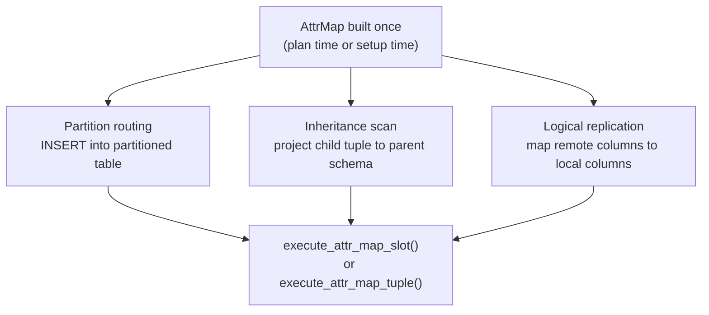

When the executor consumes a row produced by one relation in the context of a different but logically compatible relation, the attribute positions of the two `TupleDesc`s may not line up. Tuple conversion is the mechanism that remaps attribute values from source positions to destination positions, handling dropped columns and absent attributes along the way. It is an essential bridge between the physical layouts of tables in inheritance hierarchies and partitioned tables, and also between remote and local schemas in logical replication.

A [[subsystems/table-inheritance|table inheritance]] child or a [[subsystems/partitioning/overview|partitioned table]] child is a fully independent heap relation with its own `TupleDesc`. The child's column order is determined by the order in which columns were added to that specific relation. Two tables can be logically equivalent — having the same column names and types — while differing in their physical attribute numbering. A child table may have added columns after the parent fixed its schema. One or both relations may have had columns dropped via `ALTER TABLE ... DROP COLUMN`, leaving holes in the `pg_attribute` sequence: the attribute number remains for on-disk format compatibility, but the column is invisible. A child in a multiple-inheritance hierarchy inherits columns from several parents in a merge order that differs from either parent individually. In logical replication, the remote publisher and local subscriber may have independently evolved schemas where administrators added or dropped columns in different orders. In all these cases, attribute `n` in the source `TupleDesc` does not necessarily correspond to attribute `n` in the destination `TupleDesc`. Without remapping, the executor would silently place values in the wrong columns.

## The Attribute Map

An `AttrMap` (`attmap.h`) is an integer array indexed by destination attribute number (one-based), where each element holds the source attribute number that should fill that destination slot:

```c
typedef struct AttrMap {
    AttrNumber *attnums;   /* attnums[i] = source attnum for dest att i+1 */
    int         maplen;    /* number of destination attributes */
} AttrMap;
```

A value of zero at position `i` means the destination attribute has no corresponding source attribute. PostgreSQL fills the slot with NULL. This covers both dropped destination columns and destination columns that exist only in the destination schema and not in the source (legitimate for `missing_ok` builds).

Building a map is a one-time cost, done at plan time or at COPY/replication setup time, so that the map can be reused for every tuple processed in that session. Two build strategies exist (`attmap.c`):

**By name** (`build_attrmap_by_name()`): iterates the destination `TupleDesc`, finds each non-dropped column in the source by name, and verifies that the type and typmod match. This is the strategy used for inheritance and logical replication, where the relationship between tables is structural rather than strictly positional. `build_attrmap_by_name()` optimises the search on the assumption that columns tend to appear in the same order in both relations. A `nextindesc` counter wraps around rather than always starting from zero, so matching a common case (same order, some dropped columns) runs in near-linear time.

**By position** (`build_attrmap_by_position()`): pairs source and destination non-dropped columns in ordinal sequence, ignoring dropped columns in both. PostgreSQL uses this strategy when it expects the rowtypes to have the same number of non-dropped columns in the same type order, such as when projecting a function return value into a query result. It is stricter: a column count mismatch is an error rather than a NULL fill.

After building the raw map, both strategies call `check_attrmap_match()` to determine whether the map is trivially the identity — every destination attribute `i+1` maps to source attribute `i+1`, no dropped columns with missing attributes exist. If it is, `check_attrmap_match()` frees the map and returns `NULL` to the caller, signalling that no runtime conversion is needed.

## The Tuple Conversion Map

`TupleConversionMap` (`tupconvert.h`) pairs an `AttrMap` with the source and destination `TupleDesc`s, plus pre-allocated workspace arrays for deconstructed and reconstructed Datum values:

```c
typedef struct TupleConversionMap {
    TupleDesc   indesc;      /* source rowtype descriptor */
    TupleDesc   outdesc;     /* destination rowtype descriptor */
    AttrMap    *attrMap;     /* source attnum for each dest att, or 0 */
    Datum      *invalues;    /* workspace: deconstructed source values */
    bool       *inisnull;
    Datum      *outvalues;   /* workspace: assembled destination values */
    bool       *outisnull;
} TupleConversionMap;
```

The setup code allocates the workspace arrays once and reuses them across calls, avoiding per-tuple allocations. It permanently sets `invalues[0]` to a NULL Datum so that `attrMap->attnums[i] == 0` entries can index directly into position zero without a branch.

`convert_tuples_by_name()` and `convert_tuples_by_position()` (`tupconvert.c`) are the standard entry points. Both return `NULL` when no conversion is necessary. Callers should treat a NULL map as a pass-through, avoiding any tuple copying at all for the common case where source and destination are structurally identical.

## Applying the Conversion

`execute_attr_map_tuple()` (`tupconvert.c`) performs the actual remapping for HeapTuples. It deconstructs the source tuple into the `invalues`/`inisnull` workspace with `heap_deform_tuple()`, then iterates the destination attribute count, copying `invalues[attrMap->attnums[i]]` into `outvalues[i]` for each slot. `invalues` is 1-indexed (offset by one from the array base). `attnums` stores 1-based source attribute numbers. Because of this, a value of zero falls into `invalues[0]`, the pre-set NULL entry, cleanly handling absent attributes without a conditional.

`execute_attr_map_slot()` provides the same mapping for `TupleTableSlot`s, which are the executor's preferred in-flight tuple representation. Rather than forming a HeapTuple at all, it operates directly on the slot's `tts_values`/`tts_isnull` arrays. This is the path used in the executor during scans of inheritance children and partition routing, where the overhead of materialising a HeapTuple just to immediately deconstruct it would be wasteful.

`execute_attr_map_cols()` maps a column bitmap (`Bitmapset`) rather than tuple data, used when the planner or executor needs to translate a set of attribute references across the schema boundary — for example, when propagating column-level permissions or recheck requirements from a parent to a child.

## Where Conversion Is Used



**Partition INSERT routing**: when a row targets a partitioned table, the executor evaluates the partition key and routes the tuple to the correct leaf partition via `ExecFindPartition()`. The leaf partition's `TupleDesc` may differ from the parent's. A `TupleConversionMap` built at executor startup therefore translates the parent-shaped slot into a partition-shaped one before the heap insert.

**Inheritance scans**: when a query scans an inheritance hierarchy without `ONLY`, the executor produces an Append plan that reads each child as an independent scan. `execute_attr_map_slot()` projects child tuples into the parent's schema using a per-child map. This lets the node above the Append see a uniform column layout regardless of which child produced each row.

**Logical replication**: the apply worker builds a name-based `AttrMap` from the remote relation's column list (carried in the replication stream) to the local relation's `TupleDesc`. This allows the subscriber to handle cases where the publisher and subscriber have independently dropped or reordered columns, as long as the types of shared columns match. The apply worker builds the mapping when it first sees the relation in the stream, and reuses it for every subsequent change to that relation.

## The No-Conversion Fast Path

The most important optimisation in the conversion framework is the check inside `check_attrmap_match()` (`attmap.c`) that detects when no runtime work is needed. The check verifies:

- Source and destination have the same total attribute count.
- Each position `i` in the map holds `i+1` (the identity permutation).
- No source attribute has a `atthasmissing` flag set (which would require the missing-value substitution path).
- Dropped columns at the same position in both relations agree on `attlen` and `attalign`.

When all conditions hold, both `build_attrmap_by_name_if_req()` and `build_attrmap_by_position()` free the map and return `NULL`. The callers (`convert_tuples_by_name()`, `convert_tuples_by_position()`) propagate this as a `NULL` `TupleConversionMap`. Code that uses conversion maps should test for `NULL` before calling `execute_attr_map_tuple()` or `execute_attr_map_slot()`, and should pass the source tuple through unchanged if the map is absent.

This fast path is the common case for simple partitioned tables where `CREATE TABLE ... PARTITION OF` created all partitions from the parent's schema without subsequent `ALTER TABLE` changes. PostgreSQL still pays the map-build cost once at setup time, but every tuple in the query avoids the deform-remap-reform cycle.

## Related Topics

- [[subsystems/partitioning/overview|table partitioning]]
- [[subsystems/table-inheritance|table inheritance]]
- [[subsystems/replication/logical|logical replication]]
- [[subsystems/storage/heap|heap storage]]
