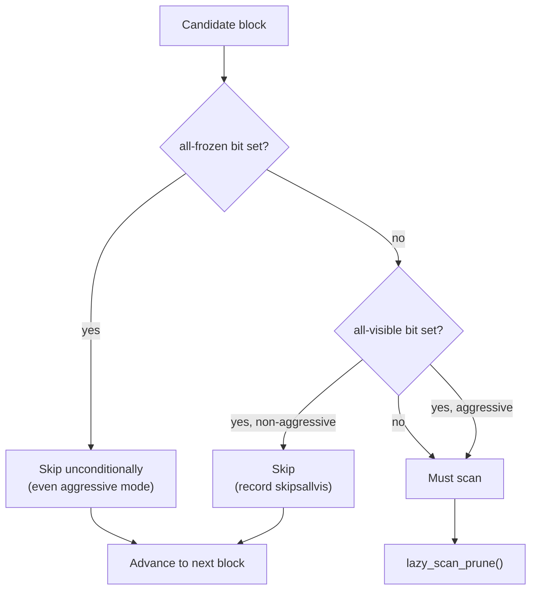

# Visibility Map

The visibility map (VM) is a per-relation bitmap that answers two questions about each heap page without reading the heap itself: are all tuples on the page visible to every current and future transaction, and have all those tuples been frozen? Compact answers to those two questions power two of PostgreSQL's most consequential performance mechanisms — index-only scans that skip heap I/O entirely, and VACUUM passes that skip pages requiring no work. The VM is also the instrument that keeps [[subsystems/transactions/xid-wraparound|XID wraparound]] prevention tractable on large tables: its all-frozen bit is the signal that lets aggressive VACUUM skip a page even when it must scan every other unfrozen page in the relation.

The VM does not record the actual visibility state of individual tuples. It records confirmed aggregate properties of whole pages. A set bit is a strong guarantee. A clear bit is merely ignorance. This conservative asymmetry is central to every part of the design.

## Physical Layout

The VM lives in a dedicated relation fork identified as `VISIBILITYMAP_FORKNUM`. The underlying file sits alongside the main heap file and shares its relfilenode with a `_vm` suffix. PostgreSQL creates the fork on demand the first time something needs to set a VM bit, so newly created tables have no VM file at all until VACUUM first visits them. As the heap grows the VM grows automatically.

Each VM page is a standard 8 KB buffer page. After subtracting the standard page header (rounded up to `MAXALIGN`), the entire remaining area — `MAPSIZE` bytes — is a flat bitmap. There are no per-page item arrays, no line pointer arrays, no special space: just bytes of bitmap data. With two bits per heap page, a single VM page covers approximately 32,768 heap pages, which corresponds to around 256 MB of heap at the default 8 KB block size. A table of several hundred gigabytes will have a multi-page VM, but the VM is still several orders of magnitude smaller than the heap it describes (visibilitymap.c, `MAPSIZE` and `HEAPBLOCKS_PER_PAGE` macros).

Finding the two bits for a given heap block requires only integer arithmetic. `HEAPBLK_TO_MAPBLOCK` gives the VM page number. `HEAPBLK_TO_MAPBYTE` gives the byte offset within that page's content area. `HEAPBLK_TO_OFFSET` gives the bit offset within that byte. The lower bit (bit position 0) of the pair carries `VISIBILITYMAP_ALL_VISIBLE`. The upper bit (bit position 1) carries `VISIBILITYMAP_ALL_FROZEN`.

## The Two Bits

### All-Visible

A page is all-visible when every tuple it contains is visible to all present and future transactions. In MVCC terms, every tuple's inserting transaction has committed. Every tuple's deleting xmax, if present, has either not committed or has committed but is old enough that no snapshot anywhere could still want it. No tuple is from an in-progress transaction. When VACUUM has confirmed all this, it stamps the all-visible bit. Any reader that trusts the bit can skip per-tuple visibility checks entirely — every tuple on the page is unconditionally visible without consulting the commit log or comparing XIDs against a snapshot.

The guarantee is one-sided: a set bit is definitive. A clear bit says nothing about the actual state of the page — it only means VACUUM has not confirmed the page as all-visible. Code that acts on a set bit is correct. Code that encounters a clear bit falls back to the slower, always-correct path of checking individual tuples. This asymmetry is load-bearing throughout the design.

### All-Frozen

A page is all-frozen when VACUUM has replaced every tuple's XID with the special `FrozenTransactionId` marker. Frozen tuples carry no real XID. Every transaction treats them as committed and in the past, removing any risk of XID wraparound. Because frozen tuples are necessarily visible to all transactions, a frozen page is by definition also all-visible. Consequently, the two bits are always set together: VACUUM never sets the all-frozen bit without also setting the all-visible bit. `visibilitymap_set()` catches any attempt to do otherwise with an assertion (visibilitymap.c). Symmetrically, clearing the all-visible bit always clears the all-frozen bit too.

The relationship between the two bits defines four states, three of which are valid:

| all-visible | all-frozen | Meaning |
|---|---|---|
| 0 | 0 | Unknown — VACUUM must inspect the page |
| 1 | 0 | All tuples visible but may carry real XIDs |
| 1 | 1 | All tuples frozen — no XID work remains |
| 0 | 1 | Impossible — rejected by assertion |

The progression from "unknown" to "all-visible" to "all-frozen" is monotone during normal operation. The only event that reverses it is a write to the page, which resets both bits to zero simultaneously.

## Setting Bits

Only VACUUM sets VM bits. The setting procedure separates I/O from the critical path that must hold a heap buffer lock, using a two-phase approach. In the first phase, `visibilitymap_pin()` reads the appropriate VM page into a buffer — extending the VM file if necessary — without holding any lock on the heap page. This is safe because reading or extending the VM file can block on I/O. Holding a heap buffer lock across I/O would block every other backend that wants that page. In the second phase, after VACUUM has acquired the heap buffer lock and confirmed the page still meets the all-visible condition, `visibilitymap_set()` acquires an exclusive lock on the VM buffer and writes the bits atomically within a critical section.

Before calling `visibilitymap_set()`, VACUUM must have already set the page-level `PD_ALL_VISIBLE` flag on the heap page itself. The VM bit and the page-level flag are siblings: both signal the same condition, but to different audiences. Code that already holds the page lock and wants to avoid a second buffer read checks the page-level flag. Code operating without any lock on the heap page checks the VM bit. They must stay in sync, so VACUUM sets both together (vacuumlazy.c).

### WAL Logging of Bit-Set Operations

Setting a VM bit always generates a WAL record via `log_heap_visible()`. This may seem unnecessary for something that is conceptually a hint — if the bit gets lost, VACUUM will simply re-establish it later. The necessity arises from the interaction between the VM bit and the page-level `PD_ALL_VISIBLE` flag during crash recovery.

Consider a sequence. VACUUM sets `PD_ALL_VISIBLE` on the heap page and then sets the VM bit. The VM page flushes to disk. Then a crash occurs before the heap page flushes. On recovery, redo reads the heap page from its pre-crash state, which lacks the `PD_ALL_VISIBLE` flag. A subsequent INSERT or DELETE on that page checks `PD_ALL_VISIBLE` to decide whether to call `visibilitymap_clear()`. Without the flag, it skips the clearing step. The VM bit still shows as set, even though the page is no longer truly all-visible. Index-only scans would therefore read stale or incorrect data. The WAL record for the bit-set operation ensures that redo restores `PD_ALL_VISIBLE` on the heap page, keeping both signals synchronized even across crashes (visibilitymap.c, NOTES section).

When data checksums are on or `wal_log_hints` is on, `visibilitymap_set()` also updates the heap page's LSN after logging, to protect against torn pages. When neither is active, `visibilitymap_set()` deliberately leaves the heap page's LSN unchanged, because the WAL record does not include a full-page image.

## Clearing Bits

Every heap write — insert, update, delete, and lock operations that alter visibility — clears the VM bits for the modified page. The clearing happens inside the same critical section that logs the heap modification. The writer clears the bits while it still holds the heap buffer lock, and before the modification becomes visible to other backends. This strict ordering is what makes the VM safe for lockless readers.

An index-only scan checks the VM without holding any lock on the heap page. If bit clearing were deferred or lazy, a window would exist in which a write had already made the page not-all-visible but the VM still said otherwise. During that window, an index-only scan could skip the heap visit for a page whose visibility guarantee had just been revoked.

The clearing protocol eliminates this window. The writer holds the heap buffer lock. It clears the VM bit atomically within the same critical section as the heap modification. Only then does it release the lock. An index-only scan that reads the all-visible bit as true has done so before the writer locked the page. Once the writer releases the lock, the bit is already cleared. The memory barriers embedded in buffer locking enforce the necessary ordering between the writer and any concurrent scanner (visibilitymap.c, LOCKING section).

Clearing a VM bit does not require its own WAL record. A heap modification that is itself WAL-logged always drives clearing. Because of this, the redo handler for that modification calls `visibilitymap_clear()` on recovery, mirroring the original execution path without additional log overhead.

The `visibilitymap_clear()` function always receives `VISIBILITYMAP_VALID_BITS` — clearing both bits together — in response to any DML operation. It asserts that no caller ever clears the all-visible bit while leaving the all-frozen bit set, which would be an incoherent state. Clearing only the all-frozen bit while leaving all-visible set is legal. Certain operations use it, such as `CLUSTER` with `HEAP_INSERT_FROZEN`. The function supports this through its `flags` parameter.

## Reading the Map

`visibilitymap_get_status()` returns the two-bit status for a given heap page as a single byte extracted from the VM buffer, without acquiring a buffer lock. A single-byte read is atomic on all platforms PostgreSQL supports, so there is no risk of reading a torn value that blends old and new bits. The lock-free design is intentional. VM status checks happen on every candidate index tuple in an index-only scan. Acquiring a buffer lock per tuple would demolish the performance gains the VM is meant to provide.

The lockless read means the result can be stale. A stale zero — the VM says not-all-visible when the page is actually all-visible — causes an unnecessary heap fetch. That is a performance miss, not a correctness problem. A stale one — the VM says all-visible when a concurrent write has just invalidated it — cannot cause wrong results. The write protocol guarantees that the writer clears the bit before the modification completes. The index buffer lock that the index-only scan holds when it checks the VM acts as a memory barrier that prevents it from seeing an old VM value after seeing the new index state.

Two macros in `visibilitymap.h` wrap the status check for callers that only care about one bit at a time:

```c
#define VM_ALL_VISIBLE(r, b, v) \
    ((visibilitymap_get_status((r), (b), (v)) & VISIBILITYMAP_ALL_VISIBLE) != 0)
#define VM_ALL_FROZEN(r, b, v) \
    ((visibilitymap_get_status((r), (b), (v)) & VISIBILITYMAP_ALL_FROZEN) != 0)
```

These macros appear throughout the index-only scan node, VACUUM's skip logic, and the upgrade path that promotes already-all-visible pages to all-frozen.

## Index-Only Scans

The all-visible bit's most performance-sensitive consumer is the index-only scan node (`nodeIndexonlyscan.c`). After matching an index entry, the node checks the VM for the corresponding heap block. If the bit is set, the scan returns the column values directly from the index tuple without fetching the heap page. If the bit is clear, the scan must fetch the heap page to confirm the tuple's visibility against the current snapshot.

For a table where most pages are all-visible, an index-only scan becomes nearly I/O-free: it reads only index pages, which are smaller, more tightly packed, and more cache-friendly than heap pages. The benefit is especially large on tables where the heap does not fit in `shared_buffers`: every avoided heap fetch is also an avoided buffer eviction and potentially an avoided physical read. For queries that touch many rows through an index, the difference between a table with high all-visible coverage and one with low coverage can be an order of magnitude.

The structural prerequisite for an index-only scan is that the index covers all columns the query needs. The VM is what converts that structural possibility into an actual runtime benefit. Without the VM, every matching index entry would require a heap visit to confirm visibility, turning an index-only scan into an ordinary index scan at higher I/O cost.

Note that on hot standby replicas, index-only scans trust only the VM bit, not the page-level `PD_ALL_VISIBLE` flag (heapam.c). The WAL logging of VM set operations is what makes this work correctly. The standby uses the cutoff XID recorded when the primary marks a page all-visible to decide which read-only transactions must wait or get canceled before it can apply the optimization.

## VACUUM and Page Skipping

The VM organizes VACUUM's heap scan entirely. Before beginning each block range, `lazy_scan_skip()` (vacuumlazy.c) walks forward through the VM, counting consecutive skippable pages and returning the first block that cannot be skipped. What "skippable" means depends on VACUUM mode:



VACUUM always skips an all-frozen page. Its tuples carry no real XIDs — there is no visibility work and no freezing work to do regardless of how old the transaction horizon has become. VACUUM skips an all-visible-but-not-all-frozen page only during non-aggressive mode. Aggressive VACUUM — triggered when the table's `relfrozenxid` age approaches `autovacuum_freeze_max_age` — must scan even all-visible pages because their tuples may still carry real XIDs that need freezing.

Skipping activates only for runs of at least `SKIP_PAGES_THRESHOLD` (32) consecutive skippable pages (vacuumlazy.c). Below this threshold the overhead of individual VM reads and the disruption to sequential I/O patterns outweigh the savings. This threshold also enables more frequent `relfrozenxid` advancement during non-aggressive passes: a short run of skippable pages does not delay the freeze horizon, while a long run would.

When a non-aggressive VACUUM chooses to skip a range that includes all-visible-but-not-all-frozen pages, it sets the `skippedallvis` flag in the vacuum state. At the end of the pass, if `skippedallvis` is set, VACUUM does not advance `relfrozenxid` — it cannot certify the freeze horizon without having inspected every unfrozen page (vacuumlazy.c, `heap_vacuum_rel()`).

This is the critical asymmetry between the two bits from a maintenance standpoint:

- VACUUM can skip all-frozen pages while `relfrozenxid` still advances. A complete aggressive VACUUM that skips only all-frozen pages makes full progress on the freeze horizon.
- VACUUM cannot skip all-visible-only pages without forfeiting `relfrozenxid` progress. A table that accumulates many all-visible-but-not-all-frozen pages must either sacrifice freeze-horizon advancement during non-aggressive passes or scan those pages on every aggressive pass.

A table that progresses toward having most pages all-frozen — through regular VACUUM that freezes tuples and promotes pages — gains the ability to conduct aggressive VACUUM cheaply in perpetuity. A table that stalls at mostly all-visible must pay full scan cost on every anti-wraparound pass.

## Page Pruning and the Prune-Then-Mark Cycle

For each page that is not skipped, `lazy_scan_prune()` (vacuumlazy.c) examines every line pointer. It removes dead tuple versions (LP_DEAD items). It processes surviving tuples and freezes those that qualify. It also computes two aggregate results — `prunestate.all_visible` and `prunestate.all_frozen` — that drive subsequent VM updates.

After `lazy_scan_prune()` returns, VACUUM applies one of several outcomes based on the current VM state and the prunestate results:

**Promoting a page to all-visible.** If VACUUM had not previously marked the page all-visible but `prunestate.all_visible` is now true, it sets `PD_ALL_VISIBLE` on the page header and calls `visibilitymap_set()` with `VISIBILITYMAP_ALL_VISIBLE`. If `prunestate.all_frozen` is also true, VACUUM sets both bits in the same call.

**Promoting an already-all-visible page to all-frozen.** Consider a page that the VM already marks all-visible. If this pass has now confirmed all its tuples frozen, but the all-frozen bit is not yet set, VACUUM upgrades the entry by calling `visibilitymap_set()` with both bits. This upgrade path is how pages accumulate all-frozen bits over successive VACUUM passes — each pass can freeze tuples on pages already marked all-visible and promote them without a full re-evaluation of the all-visible condition.

**Repairing inconsistencies.** VACUUM also audits consistency between the VM bit and the page-level `PD_ALL_VISIBLE` flag. If the VM says all-visible but the page header flag is absent, or if LP_DEAD items are present on an allegedly all-visible page, VACUUM logs a warning and clears the VM bits. These are rare conditions that can arise after a crash before WAL replay fully completes. VACUUM self-heals them rather than propagating the inconsistency.

The consistency checking means VACUUM never blindly trusts the existing VM state. Every page scan is also a lightweight audit that can repair any discrepancy it finds.

## XID Wraparound Prevention

PostgreSQL's 32-bit transaction ID space wraps around after approximately two billion transactions. A tuple that still carries a real XID older than the wraparound horizon would appear to be in the future from the perspective of new transactions, making it invisible — a form of silent data corruption. The freeze mechanism prevents this by replacing real XIDs with `FrozenTransactionId`, which every transaction unconditionally treats as committed and in the past.

When a table's `relfrozenxid` age approaches `autovacuum_freeze_max_age` (default 200 million transactions), [[subsystems/background/autovacuum|autovacuum]] triggers an aggressive VACUUM. That pass must freeze every tuple whose XID is older than `FreezeLimit`, then advance `relfrozenxid` to record that no unfrozen XIDs below that limit remain in the table. The GUCs `vacuum_freeze_min_age` and `vacuum_freeze_table_age` control when freezing begins relative to the current XID.

The all-frozen VM bit is what makes aggressive VACUUM tractable on large tables. Without it, every aggressive VACUUM would have to scan every heap page, regardless of size, to ensure it missed no freezable XID. With it, the scan can skip every page already confirmed all-frozen, concentrating work only on pages that still carry real XIDs. The effective cost of an anti-wraparound pass becomes proportional to the unfrozen fraction of the table rather than its absolute size.

A table that VACUUM visits regularly builds up all-frozen pages over time: each VACUUM pass freezes eligible tuples and promotes pages to all-frozen once all their tuples qualify. Subsequent aggressive passes skip those pages. A table that has been neglected — large, infrequently written, rarely vacuumed — may have very few all-frozen pages even if most of its content is old. An anti-wraparound pass on such a table must scan nearly every page, potentially disrupting concurrent workloads for an extended period.

`VACUUM FREEZE` forces aggressive mode unconditionally. After a `VACUUM FREEZE` on a quiescent table, every qualifying page carries the all-frozen VM bit. `relfrozenxid` advances close to the current XID. This is a useful operation for tables that are loaded once and then become read-only — historical fact tables, lookup tables, archive tables — to eliminate all future anti-wraparound work on them.

## Interaction with pg_class and the Planner

VACUUM writes two `pg_class` columns that reflect VM state at the end of each pass.

VACUUM obtains `relallvisible`, the count of all-visible heap pages, by calling `visibilitymap_count()`, and writes it through `vac_update_relstats()` (vacuumlazy.c). The query planner reads this column when costing index-only scans. In `costsize.c`, the estimated heap-fetch fraction is approximately `1.0 - (relallvisible / relpages)`. A high all-visible fraction lowers the estimated heap-fetch cost, making index-only scan plans more attractive. If `relallvisible` is stale — for instance, after a large write workload ran since the last VACUUM — the planner may underestimate heap-fetch cost and favour an index-only scan that turns out to touch far more heap pages than predicted.

`relfrozenxid` records the oldest XID that could still appear unfrozen anywhere in the table. VACUUM advances it only when the pass was complete enough to guarantee that all tuples with older XIDs have been frozen. When `skippedallvis` is set — meaning VACUUM skipped some all-visible-only pages — it abandons any update it was tracking for `relfrozenxid`, since it cannot certify the freeze horizon.

These two columns together provide a quick read on a table's maintenance health:

```sql
SELECT relname,
       relpages,
       relallvisible,
       round(relallvisible::numeric / nullif(relpages, 0) * 100, 1) AS pct_all_visible,
       age(relfrozenxid) AS xid_age
FROM pg_class
WHERE relkind = 'r'
ORDER BY xid_age DESC;
```

A table with a high `xid_age` and a low `pct_all_visible` is the worst case: autovacuum will need to scan most pages on the anti-wraparound pass. A table with a high `xid_age` but a high `pct_all_visible` — and a large proportion of all-frozen pages within that — survives aggressive VACUUM cheaply because VACUUM will skip most pages.

`pg_class` exposes only `relallvisible`, not an all-frozen count. The `pg_visibility` extension gives page-level VM detail:

```sql
SELECT all_visible, all_frozen, COUNT(*) AS pages
FROM pg_visibility(oid)
GROUP BY all_visible, all_frozen
ORDER BY all_visible DESC, all_frozen DESC;
```

A large gap between all-visible and all-frozen page counts signals a table that is clean for reads but still accumulating XID age — a candidate for `VACUUM FREEZE` before it triggers a costly anti-wraparound pass.

## Consistency Between the VM and the Heap Page

PostgreSQL maintains the VM bit and the page-level `PD_ALL_VISIBLE` flag as siblings that must always agree. Neither is the single source of truth. Each serves a different audience. Code that does not hold the heap buffer lock uses the VM bit (index-only scan nodes, VACUUM's skip logic). Code that already holds the heap buffer lock and wants to skip a VM buffer read uses the page-level flag instead (the DML path in heapam.c checks `PageIsAllVisible()` before deciding whether to call `visibilitymap_clear()`).

When the two signals diverge — which can happen after a crash before recovery has fully replayed the relevant WAL records, or in the presence of bugs — VACUUM detects the inconsistency on the next pass and repairs it. The conservative setting policy (bit set only after thorough confirmation) and the WAL logging of bit-set operations together make such divergences rare. The VACUUM repair logic handles the remaining edge cases.

The fundamental invariant is: a set VM bit is a true guarantee. It is always safe to have a clear bit when the condition is actually met (unnecessary heap fetches, but no incorrect results). Having a set bit when the condition is not met would allow index-only scans to return tuples that are not actually visible to the query's snapshot, producing incorrect results. Every mechanism in the VM design — the eager clearing protocol, the WAL logging, the heap page flag synchronization, the VACUUM consistency checks — exists to defend this invariant.

## Bit Counting and File Lifecycle

`visibilitymap_count()` scans all VM pages without locking them and uses 64-bit popcount operations — with separate bitmasks for the all-visible (`VISIBLE_MASK64 = 0x5555...`) and all-frozen (`FROZEN_MASK64 = 0xaaaa...`) bit positions — to tally the counts quickly (visibilitymap.c). The count is an approximation: concurrent changes can affect pages being scanned. This is acceptable because VACUUM only uses the count to update `pg_class.relallvisible`, which the planner uses for estimation purposes.

PostgreSQL can also truncate the VM fork. When `TRUNCATE` truncates the heap, `visibilitymap_prepare_truncate()` clears the trailing bits in the last remaining VM page (for heap pages that no longer exist) and returns the new VM size to the caller, which then calls `smgrtruncate()`. Clearing trailing bits is necessary. If an INSERT later extends the heap again, those pages would otherwise falsely appear to carry bits set from before the truncation.

## See Also

- [[subsystems/storage/fsm|Free Space Map]] — the FSM fork that lives alongside the VM
- [[subsystems/storage/heap|Heap]] — how VM bits are cleared on every insert, update, and delete
- [[subsystems/transactions/mvcc|MVCC]] — what "visible to all transactions" means in snapshot terms
- [[code-paths/vacuum|VACUUM]] — the full VACUUM process including how the VM drives its heap scan
- [[code-paths/index-scan|Index-Only Scans]] — how the index-only scan node uses the VM to skip heap fetches

## Related Topics

- [[subsystems/transactions/mvcc|MVCC]] — the visibility rules that define what "all-visible" means for every tuple on a page
- [[subsystems/transactions/xid-wraparound|XID Wraparound]] — the problem the all-frozen bit exists to solve cheaply
- [[subsystems/transactions/hint-bits|Hint Bits]] — tuple-level visibility caches that interact with the page-level all-visible flag
- [[subsystems/background/autovacuum|Autovacuum]] — the background worker that triggers aggressive VACUUM when relfrozenxid age grows
- [[subsystems/storage/fsm|Free Space Map]] — the companion fork that lives alongside the VM in every relation
- [[subsystems/storage/heap|Heap]] — where VM bits are cleared on every insert, update, and delete
- [[subsystems/indexes/index-only-scans|Index-Only Scans]] — the primary read-path consumer of the all-visible bit
- [[subsystems/storage/buffer-manager|Buffer Manager]] — the buffer infrastructure used by lockless VM reads and pinned VM pages
