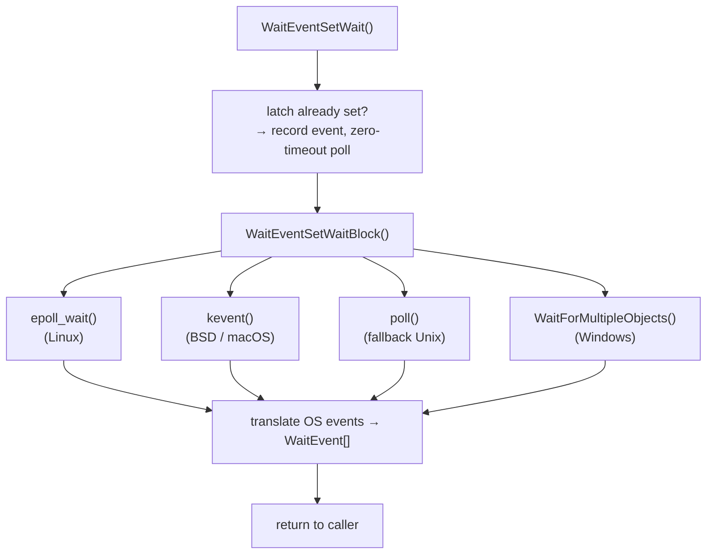

`WaitEventSet` is PostgreSQL's abstraction for blocking a backend process until one of several heterogeneous conditions becomes true simultaneously. It plays the role of `ppoll()` or `pselect()` for PostgreSQL's own process model. A backend can register interest in a latch being set, one or more sockets becoming readable or writable, and postmaster death. It can then block on all of them at once and learn which condition woke it. The walsender, libpq, the parallel query Gather node, and many background workers all rely on it rather than issuing raw OS wait calls directly. A naive approach of blocking on individual conditions in sequence — check the latch, then poll the socket, then sleep — has an inherent race. A signal could arrive between the latch check and the `poll()` call. Because signals do not reliably interrupt `poll()` on all platforms, the backend would then sleep until the next timeout. `WaitEventSet` solves this by ensuring that the backend will still see any notification that arrives between the pre-sleep check and the blocking call before the timeout expires. That race-free guarantee is the central design requirement. A second motivation is efficiency. Some callers need to watch many sockets over the lifetime of a connection. Building an epoll or kqueue interest set once and reusing it across calls is far cheaper than reconstructing the watched-FD list on every iteration. `WaitEventSet` is therefore explicitly long-lived by design.

## Lifecycle and Ownership

`CreateWaitEventSet(resowner, nevents)` allocates a set, making a single contiguous allocation in `TopMemoryContext` large enough for the `WaitEventSet` header, the `WaitEvent` array, and the platform-specific output buffer (`epoll_event`, `kevent`, or `pollfd` array). On Linux, it also calls `epoll_create1()` to obtain the epoll file descriptor. On BSD/macOS, it calls `kqueue()` instead. The caller declares the maximum number of events at creation time and cannot exceed it.

`CreateWaitEventSet()` associates the set with a [[subsystems/memory/resource-owner|ResourceOwner]], which releases it automatically if the owning subtransaction or query aborts. Passing `NULL` as the owner creates a session-lifetime set that must be freed manually with `FreeWaitEventSet()`. This ownership model ensures that error recovery does not leak OS file descriptors held by epoll or kqueue sets.

After a `fork()`, a child process that inherited a `WaitEventSet` must call `FreeWaitEventSetAfterFork()` rather than the normal free function. On Linux, this closes the inherited epoll FD (kqueue FDs are not inherited on BSD). `InitializeWaitEventSupport()` separately reinitialises the child's latch infrastructure.

## Registering Events

Callers add events one at a time with `AddWaitEventToSet(set, events, fd, latch, user_data)`. The `events` bitmask selects which conditions to watch for that slot:

| Flag | Meaning |
|---|---|
| `WL_LATCH_SET` | Wake when the associated `Latch` is set |
| `WL_SOCKET_READABLE` | Wake when `fd` has data to read (or EOF/error) |
| `WL_SOCKET_WRITEABLE` | Wake when `fd` has buffer space for writing |
| `WL_SOCKET_CONNECTED` | Wake when an async `connect()` completes (Windows-distinct; maps to `WL_SOCKET_WRITEABLE` elsewhere) |
| `WL_SOCKET_ACCEPT` | Wake when a listening socket has a pending connection (Windows-distinct; maps to `WL_SOCKET_READABLE` elsewhere) |
| `WL_SOCKET_CLOSED` | Wake when the remote peer closes the connection |
| `WL_POSTMASTER_DEATH` | Wake when the postmaster process dies |
| `WL_EXIT_ON_PM_DEATH` | Like `WL_POSTMASTER_DEATH` but calls `proc_exit(1)` immediately rather than returning to the caller |

`AddWaitEventToSet()` stores the `user_data` pointer in the event slot and returns it verbatim in any `WaitEvent` that fires, allowing callers to correlate a wake-up with application state without a secondary lookup.

A set may hold at most one latch event and must not mix latch events with events that use a different `Latch *`. The current process must own the latch — `AddWaitEventToSet` enforces this with a pid comparison. Sockets may appear in multiple event slots. A single slot may combine multiple `WL_SOCKET_*` flags.

`ModifyWaitEvent()` updates the event mask or the associated latch for an existing slot without removing and re-adding it. On epoll, this issues `EPOLL_CTL_MOD`. On kqueue, it computes the delta between old and new filter sets. The common case — toggling a socket between read-wait and write-wait — hits an early-exit fast path that avoids the system call when the mask has not changed.

## Blocking and Waking

`WaitEventSetWait(set, timeout, occurred_events, nevents, wait_event_info)` blocks until at least one registered condition fires, a timeout expires, or a signal arrives. It stamps the supplied `wait_event_info` code into shared memory via `pgstat_report_wait_start()` before sleeping and clears it on return, making the wait visible in [[subsystems/observability/wait-events|wait events]] and `pg_stat_activity`.

Before delegating to the OS, the function checks whether the latch is already set. If it is, the function places the latch event into the output array immediately. If the output buffer still has room, it then calls into the platform backend with a zero timeout to collect any additional events that are ready right now, avoiding a round trip to the kernel when the answer is already known.

The platform-specific inner loop is `WaitEventSetWaitBlock()`. It calls `epoll_wait()`, `kevent()`, `poll()`, or `WaitForMultipleObjects()`. It converts the OS-level result back into `WaitEvent` structs. Then it returns the count of events collected. The outer loop in `WaitEventSetWait` retries when the inner call returns zero (an EINTR on Unix), recalculating the remaining timeout each time.

Each returned `WaitEvent` carries the `pos` (slot index), `fd`, `events` bitmask of what actually fired, and the `user_data` pointer from registration. A caller that registers multiple socket slots can distinguish them by `pos` or `user_data` without comparing file descriptors.

## Latch Integration and the Signal Race

The trickiest part of the implementation is ensuring that the backend does not lose a latch notification that another process sends between the pre-sleep check and the blocking call. The solution differs by platform.

On Linux (epoll path), PostgreSQL blocks `SIGURG` from normal delivery and redirects it through a `signalfd` file descriptor. PostgreSQL adds that file descriptor to the epoll set as the backing FD for the latch event. When `SetLatch()` in another process sends `SIGURG`, the kernel deposits it into the signalfd, which becomes readable and wakes `epoll_wait()`. There is no signal handler and no pipe, so the race that classic `poll()` has with signals does not arise.

On platforms that use `poll()`, PostgreSQL uses the self-pipe trick instead. `InitializeWaitEventSupport()` creates a process-local non-blocking pipe. The latch event's backing FD is the read end of this pipe. A `SIGURG` signal handler writes a byte to the write end. The write either succeeds or returns `EAGAIN` (pipe full), so it is safe to call from a signal handler. A byte in the pipe also persists until something drains it. This means the backend still sees a signal that arrives before it enters `poll()`, once `poll()` starts.

On BSD/macOS (kqueue path), an `EVFILT_SIGNAL` filter for `SIGURG` backs the latch. The kqueue kernel note fires when the kernel delivers the signal to the waiting process.

On Windows, latches are Windows event objects. `WaitForMultipleObjects()` waits on the array of handles directly.

The `maybe_sleeping` flag on the `Latch` struct coordinates the transition into sleep. `WaitEventSetWait` sets `maybe_sleeping = true` and inserts a memory barrier before the final `is_set` check. `SetLatch()` in the setter's process reads `maybe_sleeping` after a matching barrier: if both the flag is set and `is_set` is being written, the setter sends the wakeup signal. `WaitEventSetWaitBlock` clears `maybe_sleeping` on return. This pairing avoids both missed wakeups (the barrier ensures the flag write is visible before the `is_set` check) and spurious signals (the setter only sends if `maybe_sleeping` is true).

## Postmaster Death Detection

Every backend that runs under the postmaster should add a `WL_POSTMASTER_DEATH` or `WL_EXIT_ON_PM_DEATH` event. On Unix, the postmaster holds one end of a pipe (`postmaster_alive_fds`). When it exits, the pipe's write end closes. The read end (`POSTMASTER_FD_WATCH`) then becomes readable or produces `POLLHUP`. All three platform backends (epoll, kqueue, poll) watch that FD. On kqueue, PostgreSQL uses an `EVFILT_PROC/NOTE_EXIT` filter on the postmaster's PID instead. This is more direct, but it requires special handling for the case where the postmaster has already exited by the time PostgreSQL installs the filter.

When a caller uses `WL_EXIT_ON_PM_DEATH`, `AddWaitEventToSet` stores the `exit_on_postmaster_death` flag on the set rather than registering a different event type. When `WaitEventSetWaitBlock` detects the death, the code calls `proc_exit(1)` immediately. The caller therefore never returns from `WaitEventSetWait`. This pattern is the correct way for worker processes to make postmaster death fatal without requiring every call site to check the return value.

## Platform Backends

The epoll path is the most efficient. It returns only the FDs that fired. The `epoll_event.data.ptr` field carries a direct pointer to the `WaitEvent` struct. It also needs no iteration over the full event list. The poll path iterates through all slots on every call, which is acceptable for small sets but degrades linearly with set size. The kqueue path is comparable to epoll in efficiency. It additionally supports `EVFILT_PROC` for postmaster death detection without a pipe.

## Related Topics

- [[subsystems/observability/wait-events]]
- [[subsystems/storage/latch-and-ipc]]
- [[architecture/process-architecture]]
- [[subsystems/memory/resource-owner]]
- [[subsystems/locking/lwlocks]]
