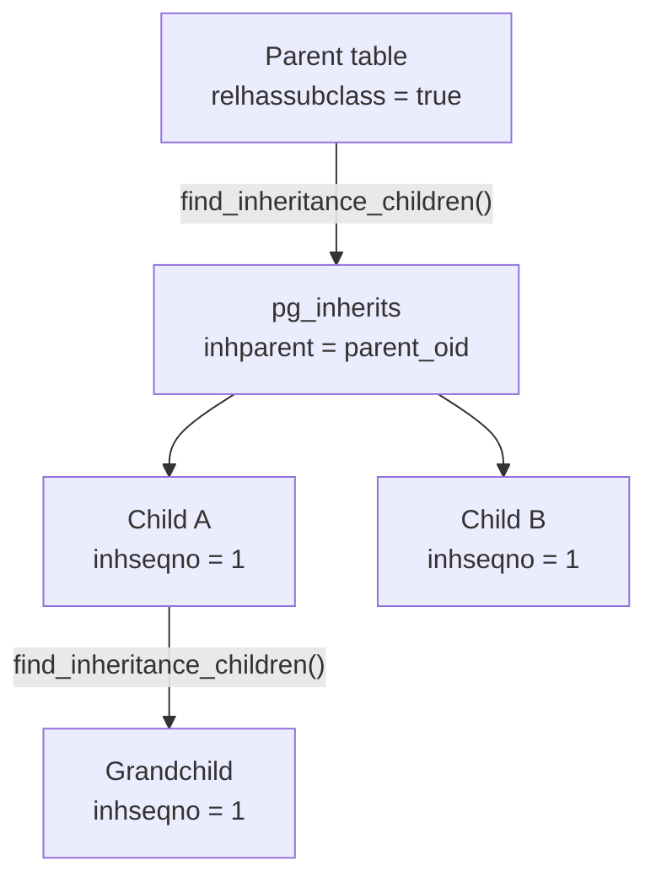
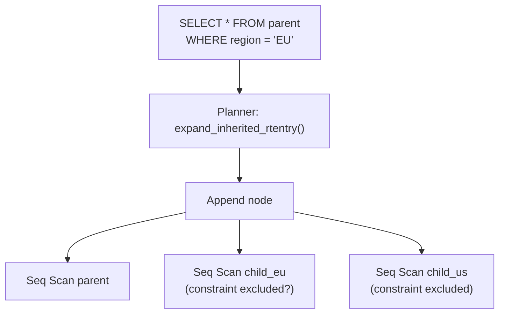

# Table Inheritance

Table inheritance is a PostgreSQL-specific mechanism that lets a child table absorb all columns of one or more parent tables while adding its own. The child is a full, independent relation with its own storage, indexes, and statistics — not a view or a projection. Querying the parent without the `ONLY` keyword automatically scans the parent and every descendant. This makes the hierarchy appear as a single logical table, even though the physical data sits in separate heap files.

Inheritance predates declarative partitioning by many years. It also fills a different niche. Understand precisely what it is, and what it is not, before reaching for it.

## What Inheritance Is Not

**Not SQL standard.** No other major RDBMS implements table inheritance in this form. SQL has no equivalent feature, so code relying on it is PostgreSQL-specific.

**Not the same as partitioning.** Both mechanisms write rows to `pg_inherits`. Both make a parent table fan out into child scans. But their semantics diverge sharply. Partitioning enforces disjoint bounds and routes inserts automatically; inheritance has no routing and no enforcement of which rows belong where. A partitioned parent stores no rows itself; an inheritance parent stores its own rows alongside its children's. See [[subsystems/partitioning/overview]] for the full contrast.

**Not the same as `LIKE`.** `CREATE TABLE child (LIKE parent)` copies the column structure at creation time and then severs the relationship entirely. There is no `pg_inherits` row, no query fan-out, and no DDL propagation. `LIKE` produces an independent table that happens to have the same shape.

## The pg_inherits Catalog

Every parent-child relationship is recorded in `pg_inherits` (`src/include/catalog/pg_inherits.h`), one row per direct (child, parent) pair:

| Column | Type | Meaning |
|---|---|---|
| `inhrelid` | `oid` | OID of the child relation |
| `inhparent` | `oid` | OID of the parent relation |
| `inhseqno` | `int4` | Position of this parent in the child's INHERITS list (1-based) |
| `inhdetachpending` | `bool` | Set during a concurrent partition detach |

`inhseqno` matters for multiple inheritance. When a child has two parents, the parent listed first gets `inhseqno = 1`. This position also drives the column ordering that `MergeAttributes()` produces.

Two indexes serve the catalog: a unique index on `(inhrelid, inhseqno)` for child-side lookups, and a non-unique index on `inhparent` for the parent-side query "who are my children?" used by `find_inheritance_children()`.

### The relhassubclass Fast-Path Flag

`pg_class.relhassubclass` is the efficiency gate for inheritance queries. When the planner encounters a rangetable entry with `rte->inh = true`, it calls `has_subclass()` in `pg_inherits.c`. This function simply reads the flag from the syscache. If the flag is false, the planner treats the table as a plain base relation and never consults `pg_inherits`.

The flag has a deliberate asymmetry. It is safe to leave it set to `true` even after all children have been dropped: a planner that checks `pg_inherits` and finds no rows simply produces a single-table scan. Clearing it to `false` prematurely would cause the planner to silently skip child scans. For this reason, dropping a child relation does not immediately clear `relhassubclass` on its parent. The flag is cleared lazily — ANALYZE on a childless table is one mechanism that eventually corrects it. The comment in `tablecmds.c` makes the policy explicit: "It's always safe to set this field to true, because all SQL commands are ready to see true and then find no children."



## Query Semantics: the Append Plan

A query against an inheritance parent without `ONLY` expands into an Append plan covering the parent and all descendants. The planner detects this in `subquery_planner()` (`plan/planner.c`). This function calls `has_subclass()` and sets `rte->inh = true` when the flag is set. Later, `expand_inherited_rtentry()` in `optimizer/util/inherit.c` walks `pg_inherits` recursively and adds a rangetable entry for each child relation, marked with `inh = false` so it is treated as a leaf. It also builds the `AppendRelInfo` structures that the planner uses to map attribute numbers from the parent to attribute numbers in the child.

The result is an `Append` executor node over parent + all children. For queries that require ordered output, the planner may substitute a `MergeAppend` node. This node merges pre-sorted child streams rather than concatenating arbitrary ones.



The `ONLY` keyword (`SELECT ... FROM ONLY parent`) sets `rte->inh = false` in the parse tree, preventing the expansion entirely. The planner then scans the parent as a plain relation.

## What Is Inherited

**Columns.** `MergeAttributes()` in `tablecmds.c` merges the parent's column list into the child's schema before the `TupleDesc` is built. Inherited columns in `pg_attribute` carry `attislocal = false` and `attinhcount` counting how many parents contribute that column. If the child re-declares a column that already exists in a parent, `MergeAttributes()` verifies type compatibility and merges the definitions. The child's own default takes precedence over any inherited default.

**CHECK constraints.** Parent CHECK constraints propagate to child `pg_constraint` rows with `conislocal = false` and `coninhcount` tracking the number of contributing parents. A constraint inherited from two parents gets `coninhcount = 2`. It requires both parents to be dropped, or the constraint altered, before it disappears from the child.

**NOT NULL.** `MergeAttributes()` inherits NOT NULL simply by copying the `attnotnull` flag. Inherited NOT NULL constraints get no separate `pg_constraint` row; the flag on `pg_attribute` is sufficient.

**Column defaults.** Inherited defaults are stored in `pg_attrdef` and marked as non-local. The child's own default, if any, takes precedence. Conflicting defaults from two parents with no child override raise an error at `CREATE TABLE` time.

## What Is Not Inherited

The asymmetry here is a common source of surprises for users coming from object-oriented inheritance intuitions.

**Indexes.** Each child's physical layout is independent. An index on the parent covers only the parent's own rows. Creating an index on every child requires explicit `CREATE INDEX` statements on each. The `pg_class.relhasindex` flag and any index entries in `pg_index` for the parent have no bearing on the children.

**Foreign key constraints.** FK enforcement is per-relation. A FK defined on the parent does not constrain inserts into children. A FK referencing the parent does not automatically catch references to rows stored only in children. This is a significant correctness concern for inheritance-based designs.

**Triggers.** Triggers must be created separately on each child. A trigger on the parent fires only for rows in the parent's own storage. DML on a child does not activate parent triggers.

**Row-level security policies.** RLS policies are per-relation. A child has no policies unless they are explicitly created on it; inserting into a child bypasses parent policies entirely.

**Privileges.** Each child has its own ACL in `pg_class`. `GRANT SELECT ON parent` does not grant access to children. Privileges must be granted on each child individually, or a default privilege mechanism must be used.

## Multiple Inheritance

A child can inherit from more than one parent:

```sql
CREATE TABLE stud_emp (percent int4) INHERITS (emp, student);
```

`MergeAttributes()` processes the parent list in `inhseqno` order, building the inherited column list left-to-right. When the same column name appears in more than one parent, `MergeAttributes()` verifies that the types are identical (or one is a strict subtype). If they match, the column appears once in the child with `attinhcount` equal to the number of parents contributing it. If they are incompatible, `CREATE TABLE` raises an error. `MergeAttributes()` appends the child's explicitly declared columns after all inherited columns in the final `TupleDesc`.

The source comments illustrate a diamond pattern (`tablecmds.c` near `MergeAttributes`):

```
                        person {1:name, 2:age, 3:location}
                        /    \
           {6:gpa}  student   emp {4:salary, 5:manager}
                        \    /
                       stud_emp {7:percent}
```

`person`'s columns arrive once through the diamond, with the path through `emp` (listed first) determining their positions. `student` contributes only `gpa` as a new column. By the time `student` is processed, `name`, `age`, and `location` are already in the schema, so `MergeAttributes()` merges them in place and increments `attinhcount`. The final child column `percent` lands last.

Default value resolution in multiple inheritance follows a strict precedence. The child's own default wins. If neither the child nor any parent declares a default, the column has none. If two parents declare different defaults and the child does not override, `MergeAttributes()` raises an error rather than choosing arbitrarily. The same logic applies to generated column expressions — a column must be generated if and only if all contributing parents require it to be generated.

## DDL Propagation

ALTER TABLE on a parent propagates structural changes downward to all children when the change affects inherited structure:

- Adding a CHECK constraint with `ALTER TABLE parent ADD CONSTRAINT ...` propagates to children with `conislocal = false` and increments `coninhcount`.
- Adding a NOT NULL constraint propagates by setting `attnotnull` on children via `ATExecSetNotNull()` walking the inheritance tree.
- Adding a column propagates the new column to all descendants, inserting a `pg_attribute` row on each with `attislocal = false` and `attinhcount = 1`.

`ALTER TABLE ... ONLY parent ...` limits the change to the parent alone, leaving children unaffected. This is the escape hatch when you need asymmetric schema changes across the hierarchy — for example, adding a constraint that applies only to rows in the parent's storage.

Dropping an inherited constraint on the parent decrements `coninhcount` on children. When `coninhcount` reaches zero and `conislocal` is also false, PostgreSQL deletes the constraint row from the child. A constraint defined locally on both the parent and child (`conislocal = true`) survives on the child even when the parent's version is dropped.

DROP TABLE on a parent fails if any children exist. `DROP TABLE parent CASCADE` drops the parent and all descendants in dependency order. `StoreCatalogInheritance1()` creates the `pg_depend` entries that drive this order. This is an all-or-nothing operation; there is no partial cascade.

TRUNCATE propagates to children by default. `TRUNCATE ONLY parent` truncates only the parent's own storage, leaving child rows intact.

`ALTER TABLE child INHERIT parent` can establish an inheritance relationship after creation. `ATExecAddInherit()` in `tablecmds.c` opens the parent with `ShareUpdateExclusiveLock`. It checks that no circular inheritance would result. It calls `MergeAttributesIntoExisting()` to verify that the child's column list is a superset of the parent's, with compatible types and collations. It also checks that all non-local CHECK constraints on the parent exist on the child. Only after all compatibility checks pass does `StoreCatalogInheritance1()` write the `pg_inherits` row and call `SetRelationHasSubclass(parentOid, true)`.

`ALTER TABLE child NO INHERIT parent` (`ATExecDropInherit()`) severs the relationship. It deletes the `pg_inherits` row. It decrements `attinhcount` on each column that came from that parent, setting `attislocal = true` when the count reaches zero. It also decrements `coninhcount` on inherited constraints. The parent's `relhassubclass` flag is not immediately cleared — that happens lazily, as described above.

## Inheritance vs. Declarative Partitioning

Both mechanisms use `pg_inherits` and produce Append plans. The practical differences determine which to choose:

| Aspect | Inheritance | Declarative Partitioning |
|---|---|---|
| Insert routing | None — application or trigger must route | Automatic via executor |
| Parent storage | Yes — parent stores its own rows | No — parent is storage-less (`relfilenode = 0`) |
| Child schema | Children may have extra columns | All partitions must have identical schemas |
| Pruning mechanism | Constraint exclusion on CHECK constraints | Dedicated `partprune.c` with bound-based logic |
| Pruning quality | Conservative, depends on CHECK shapes | More precise, optimizer-integrated |
| Catalog representation | `pg_inherits` only | `pg_inherits` + `pg_partitioned_table` + `relpartbound` |
| Cross-partition UPDATE | Not applicable | Automatic delete-then-insert |
| FK referencing parent | Does not cover child rows | Works correctly with partitioned tables |

For new designs that want to partition data, declarative partitioning (PostgreSQL 10+) is almost always the right choice. Inheritance remains useful when children need genuinely different schemas — extra columns, different storage parameters, or per-child indexes that do not apply globally.

## Constraint Exclusion for Query Optimization

When a child table has a CHECK constraint that contradicts the query's WHERE clause, the planner can eliminate that child from the Append plan entirely without scanning it. This is constraint exclusion, described in detail in [[subsystems/planner/constraint-exclusion]].

The mechanism: `set_append_rel_pathlist()` in `allpaths.c` iterates the children in the Append. For each child it calls `relation_excluded_by_constraints()` in `plancat.c`, which fetches the child's CHECK constraints and runs `predicate_refuted_by()` in `predtest.c` to see whether the constraint and the WHERE clause are logically contradictory. A child with `CHECK (region = 'EU')` is excluded when the query has `WHERE region = 'US'`.

This requires the CHECK constraints to be present, immutable, and expressed in a form the prover recognizes (comparisons using btree operators on the partition key). The `constraint_exclusion` GUC must be `partition` (the default) or `on`. The default `partition` setting applies constraint exclusion only to inheritance children and partition members (`RELOPT_OTHER_MEMBER_REL`), avoiding the overhead on plain base relations where it yields nothing.

Constraint exclusion for inheritance is the older, less capable predecessor to the partition pruning logic introduced in PostgreSQL 10. For declarative partitioned tables, `partprune.c` handles elimination based on partition bounds and is more precise; constraint exclusion plays a secondary role there. For inheritance hierarchies, it remains the primary optimization mechanism and is worth designing around: CHECK constraints should use simple comparisons on the partitioning column with immutable operators so that `predicate_refuted_by()` can recognize and apply them.

## Performance Characteristics

Each child is a separate relation. [[subsystems/background/autovacuum|Autovacuum]] tracks and processes each child independently, which is both a strength and a burden. Fine-grained vacuum scheduling is possible: an administrator can lower one hot child's `autovacuum_vacuum_cost_delay` setting without affecting its siblings. But at large numbers of children, the aggregate scheduling overhead grows proportionally. Administrators must run ANALYZE on each child to collect per-child statistics; the parent's statistics in `pg_statistic` cover only its own rows, not the entire hierarchy.

The planner's Append overhead scales with the number of children. Each child produces its own `RelOptInfo`, its own set of paths, and its own subplan node. At dozens of children this is negligible; at hundreds it becomes measurable planning overhead because the planner explores join ordering and cost estimation for every child independently. At thousands of children it can dominate query latency. Declarative partitioning has the same Append overhead. It benefits from partition pruning, which can eliminate large fractions of the tree before path generation runs.

Constraint exclusion for inheritance requires the planner to fetch and evaluate CHECK constraints for every child that is not pruned by other means. The cost is `O(children × constraints)` per query. This is one reason the `constraint_exclusion` GUC defaults to `partition` rather than `on`: applying it to plain base relations in every query adds overhead without benefit.

Because each child has independent storage, tablespace placement, fill factor, and autovacuum parameters, inheritance offers fine-grained physical control. An administrator can place a child that receives heavy writes on faster storage; a cold archive child can go on slower, larger disks. Declarative partitioning supports the same per-partition tablespace control, so this advantage is not unique to inheritance.

Index maintenance is entirely per-child. `VACUUM` and auto-analyze run independently on each child, so the pool of autovacuum workers naturally parallelizes the work. Large inheritance hierarchies with many children can benefit from this distribution in ways that a monolithic table cannot.

## Dependency Tracking

The dependency infrastructure (`pg_depend`) ties the inheritance hierarchy together so that DROP CASCADE works correctly. `StoreCatalogInheritance1()` calls `recordDependencyOn()` with a dependency type that varies by whether the child is a partition (`DEPENDENCY_INTERNAL_AUTO`) or a plain inheritance child (`DEPENDENCY_NORMAL`). For plain inheritance, a `DEPENDENCY_NORMAL` link from the child relation to the parent means that dropping the parent cascades to the child only when `CASCADE` is specified. Otherwise, the drop fails with an error. For partitions, `DEPENDENCY_INTERNAL_AUTO` causes PostgreSQL to drop the partition automatically when it drops the parent, even without `CASCADE`. This matches user expectations for the partitioning model.

When `ALTER TABLE child NO INHERIT parent` runs, `ATExecDropInherit()` removes the dependency. It scans `pg_depend` for the specific `(child, parent)` pair and deletes the matching row. It then deletes the `pg_inherits` row and adjusts `attinhcount` and `coninhcount` accordingly. This bookkeeping ensures that a column or constraint with multiple parents stays non-local until every parent is severed.

## Practical Patterns and Pitfalls

The most common use of table inheritance today is log-style or audit-trail designs. A parent table defines the shared schema, and children hold data for specific time periods, regions, or sources. Each child has a `CHECK` constraint that enables constraint exclusion. Queries against the parent transparently scan all relevant children; maintenance operations (archiving, purging) target individual children.

A recurring pitfall is the missing-index problem: after creating an index on the parent and several children, a newly added child will not automatically have the corresponding index. Any tooling that manages the hierarchy must track this. The same applies to privileges, triggers, and RLS policies.

Another pitfall is INSERT behavior. An `INSERT INTO parent (...)` stores the row in the parent's own heap, regardless of any CHECK constraints on the children. Unlike declarative partitioning, inheritance has no routing; the application or a `BEFORE INSERT` trigger must direct rows to the correct child if that is the desired layout. Writing to the parent while expecting rows to appear only in children is a common misconfiguration. Constraint exclusion will not catch this mistake, because it only eliminates scans and does not validate writes.

The `ONLY` keyword is easily forgotten. `DELETE FROM parent WHERE ...` without `ONLY` deletes from both the parent and all children that match the WHERE clause. This is correct behavior. But it surprises users who expect `FROM parent` to mean "from the parent table only." The same applies to `UPDATE` and `SELECT`: all three DML statements obey the inheritance fan-out by default. Using `ONLY` consistently in maintenance scripts that should target one table is essential for avoiding unintended cascading effects across the hierarchy.

## See Also

- [[code-paths/create-table]] — how `MergeAttributes()` and `StoreCatalogInheritance()` work during `CREATE TABLE`
- [[subsystems/partitioning/overview]] — declarative partitioning architecture and contrast with inheritance
- [[subsystems/planner/constraint-exclusion]] — how the planner eliminates child scans using CHECK constraints
- [[subsystems/transactions/mvcc]] — visibility rules apply per-child; each child is an independent heap
- [[subsystems/locking/overview]] — DDL propagation locking on parent and children

## Related Topics

- [[subsystems/partitioning/partition-pruning|Partition Pruning]] — the more precise successor to constraint exclusion for declarative partitioned tables
- [[subsystems/catalog/pg-class|pg_class]] — home of the `relhassubclass` flag that gates inheritance expansion in the planner
- [[subsystems/storage/heap|Heap Storage]] — each child is an independent heap file with its own page layout and vacuum state
- [[subsystems/background/autovacuum|Autovacuum]] — tracks and schedules each child relation independently; large hierarchies multiply autovacuum overhead
- [[subsystems/planner/statistics|Planner Statistics]] — ANALYZE must be run per-child; parent statistics cover only the parent's own rows
- [[subsystems/triggers|Triggers]] — must be created on each child separately; parent triggers do not fire for child DML
- [[subsystems/row-level-security|Row-Level Security]] — RLS policies are per-relation; children have no policies unless explicitly defined
