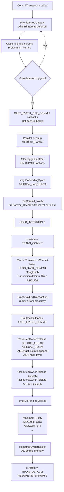
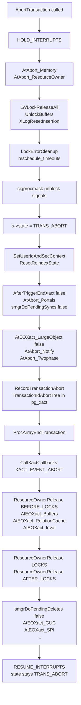
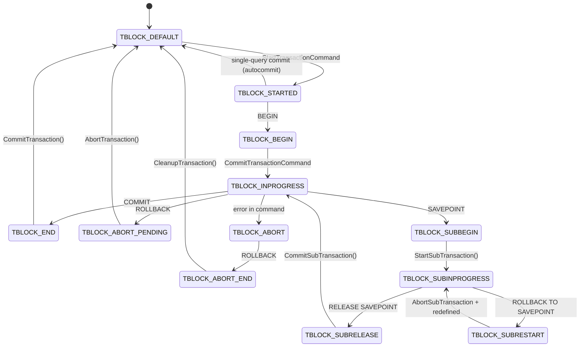
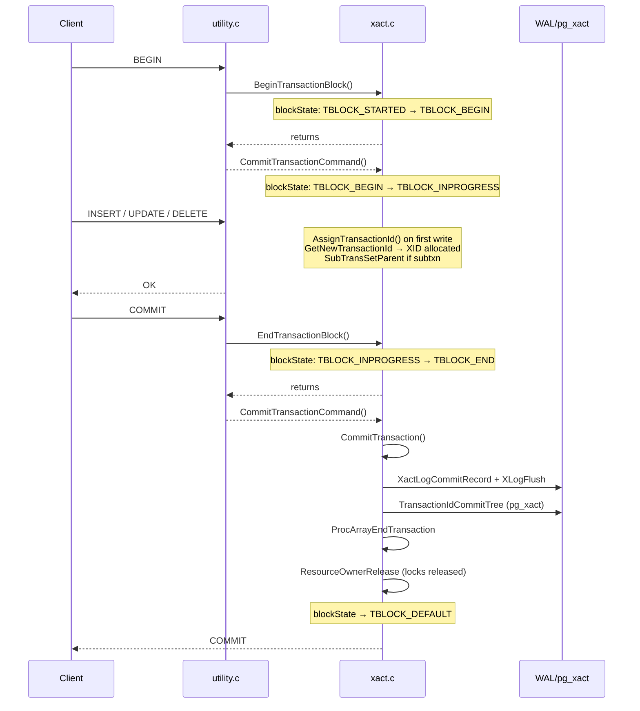

# BEGIN / COMMIT / ROLLBACK / SAVEPOINT Code Path

This article traces how the SQL transaction control statements `BEGIN`, `START TRANSACTION`, `COMMIT`, `ROLLBACK`, `SAVEPOINT`, `RELEASE SAVEPOINT`, and `ROLLBACK TO SAVEPOINT` are dispatched and executed inside a PostgreSQL backend. The authoritative source is `src/backend/access/transam/xact.c` (~6 500 lines) together with `src/include/access/xact.h` and `src/backend/tcop/utility.c`.

---

## Dispatching Transaction Control Statements

Every SQL utility statement — including all transaction control commands — arrives at `standard_ProcessUtility()` (`src/backend/tcop/utility.c`, `standard_ProcessUtility`). The parser produces a `TransactionStmt` node (node tag `T_TransactionStmt`) with a `kind` field of type `TransactionStmtKind`.

```
standard_ProcessUtility
  switch (nodeTag(parsetree))
    case T_TransactionStmt:
      switch (stmt->kind)
        TRANS_STMT_BEGIN / TRANS_STMT_START  → BeginTransactionBlock()
        TRANS_STMT_COMMIT                    → EndTransactionBlock()
        TRANS_STMT_ROLLBACK                  → UserAbortTransactionBlock()
        TRANS_STMT_SAVEPOINT                 → DefineSavepoint()
        TRANS_STMT_RELEASE                   → ReleaseSavepoint()
        TRANS_STMT_ROLLBACK_TO               → RollbackToSavepoint()
        TRANS_STMT_PREPARE                   → PrepareTransactionBlock()
        TRANS_STMT_COMMIT_PREPARED           → FinishPreparedTransaction(true)
        TRANS_STMT_ROLLBACK_PREPARED         → FinishPreparedTransaction(false)
```

`TRANS_STMT_BEGIN` and `TRANS_STMT_START` are handled identically; `START TRANSACTION` is SQL-standard syntax for `BEGIN`.

After `BeginTransactionBlock()` / `EndTransactionBlock()` / `UserAbortTransactionBlock()` return, they have only mutated `blockState`. The real work happens later when the portal exits and `CommitTransactionCommand()` runs the state machine (see §State machine dispatch loop below).

---

## The Two-Level State Machine

There are two orthogonal state enumerations, both defined in `src/backend/access/transam/xact.c`:

### TransState — low-level execution state

```c
typedef enum TransState {
    TRANS_DEFAULT,       /* idle */
    TRANS_START,         /* transaction starting */
    TRANS_INPROGRESS,    /* inside a valid transaction */
    TRANS_COMMIT,        /* commit in progress */
    TRANS_ABORT,         /* abort in progress */
    TRANS_PREPARE        /* prepare in progress */
} TransState;
```

`TransState` reflects the *execution* phase of the current `StartTransaction` / `CommitTransaction` / `AbortTransaction` call. It is not directly visible to the SQL layer.

### TBlockState — high-level block state

```c
typedef enum TBlockState {
    /* not-in-transaction-block */
    TBLOCK_DEFAULT,              /* idle */
    TBLOCK_STARTED,              /* single-query autocommit */

    /* explicit transaction block */
    TBLOCK_BEGIN,                /* BEGIN received, not yet processed */
    TBLOCK_INPROGRESS,           /* live, inside BEGIN...END */
    TBLOCK_IMPLICIT_INPROGRESS,  /* live, implicit BEGIN (e.g. PL/pgSQL) */
    TBLOCK_PARALLEL_INPROGRESS,  /* inside parallel worker */
    TBLOCK_END,                  /* COMMIT received */
    TBLOCK_ABORT,                /* error, awaiting ROLLBACK */
    TBLOCK_ABORT_END,            /* ROLLBACK received after error */
    TBLOCK_ABORT_PENDING,        /* ROLLBACK received on live xact */
    TBLOCK_PREPARE,              /* PREPARE received */

    /* subtransaction states */
    TBLOCK_SUBBEGIN,
    TBLOCK_SUBINPROGRESS,
    TBLOCK_SUBRELEASE,
    TBLOCK_SUBCOMMIT,
    TBLOCK_SUBABORT,
    TBLOCK_SUBABORT_END,
    TBLOCK_SUBABORT_PENDING,
    TBLOCK_SUBRESTART,
    TBLOCK_SUBABORT_RESTART
} TBlockState;
```

`TBlockState` is what SQL-layer functions (`BeginTransactionBlock`, etc.) read and write. `CommitTransactionCommand()` inspects it on every command boundary to decide which low-level function to call.

---

## TransactionStateData — The Per-Backend Transaction State Node

`CurrentTransactionState` is a pointer to the active `TransactionStateData` node. For a top-level transaction it points to the statically allocated `TopTransactionStateData`. Each subtransaction allocates a new node on the heap via `PushTransaction()`.

```c
typedef struct TransactionStateData {
    FullTransactionId fullTransactionId;  /* XID (epoch + local XID) */
    SubTransactionId  subTransactionId;   /* subxact ID within this top-xact */
    char             *name;               /* savepoint name, if any */
    int               savepointLevel;     /* savepoint nesting level */
    TransState        state;              /* low-level state */
    TBlockState       blockState;         /* high-level state */
    int               nestingLevel;       /* subtransaction depth */
    int               gucNestLevel;       /* GUC context nesting depth */
    MemoryContext     curTransactionContext;
    ResourceOwner     curTransactionOwner;
    TransactionId    *childXids;          /* committed child XIDs */
    int               nChildXids;
    int               maxChildXids;
    Oid               prevUser;
    int               prevSecContext;
    bool              prevXactReadOnly;
    bool              startedInRecovery;
    bool              didLogXid;          /* XID appeared in a WAL record */
    int               parallelModeLevel;
    bool              chain;              /* AND CHAIN requested */
    bool              topXidLogged;       /* for subxact WAL logging */
    struct TransactionStateData *parent;  /* NULL at top level */
} TransactionStateData;
```

Key fields:

| Field | Purpose |
|---|---|
| `fullTransactionId` | Epoch-qualified XID; invalid until `AssignTransactionId()` is called |
| `subTransactionId` | Sequential counter within the top-level transaction; starts at 1 |
| `state` | `TransState` for the low-level execution phase |
| `blockState` | `TBlockState` for the SQL-visible block state |
| `nestingLevel` | 0 = top-level, 1 = first SAVEPOINT, etc. |
| `curTransactionOwner` | `ResourceOwner` for this level's resources |
| `childXids` | Committed subxact XIDs that must be recorded in the commit WAL record |
| `parent` | Linked list back to parent; NULL at top level |

---

## Lazy XID Assignment

A fundamental optimization: PostgreSQL does *not* assign an XID when a transaction begins. XIDs are 32-bit resources, and the system must conserve them; read-only transactions need no XID at all.

`GetCurrentTransactionId()` is the gateway:

```c
TransactionId
GetCurrentTransactionId(void)
{
    TransactionState s = CurrentTransactionState;
    if (!FullTransactionIdIsValid(s->fullTransactionId))
        AssignTransactionId(s);
    return XidFromFullTransactionId(s->fullTransactionId);
}
```

`AssignTransactionId()` is called only when:
- A row is first written (heap_insert, heap_update, etc. call `GetCurrentTransactionId()`).
- A lock that must be stamped with an XID is acquired.
- A subtransaction needs a subxid (which also forces the parent to get an XID first).

When assigned, `AssignTransactionId()` does the following in order:

1. Recursively ensures all ancestor states have XIDs (invariant: child XID > parent XID).
2. Calls `GetNewTransactionId(isSubXact)` to allocate from the shared XID counter.
3. If it is a subtransaction, calls `SubTransSetParent(subxid, parentxid)` to record the mapping in `pg_subtrans`.
4. Calls `RegisterPredicateLockingXid()` for serializable isolation.
5. Acquires the XID lock via `XactLockTableInsert()`.
6. If `wal_level=logical` and this is a subtransaction with an unlogged top-level XID, emits an `XLOG_XACT_ASSIGNMENT` WAL record.

Read-only transactions (SELECT without any writes) may complete without ever calling `AssignTransactionId()`. They therefore never appear in `pg_xact` or consume XID space.

---

## BEGIN / START TRANSACTION

```
Client: BEGIN
  parser → TransactionStmt
  standard_ProcessUtility → BeginTransactionBlock()
```

`BeginTransactionBlock()` (`xact.c:3780`) is a purely *state-setting* function:

```c
void BeginTransactionBlock(void)
{
    TransactionState s = CurrentTransactionState;
    switch (s->blockState)
    {
        case TBLOCK_STARTED:
        case TBLOCK_IMPLICIT_INPROGRESS:
            s->blockState = TBLOCK_BEGIN;   /* <-- only change made */
            break;
        case TBLOCK_INPROGRESS:
        ...
            ereport(WARNING, "there is already a transaction in progress");
            break;
        ...
    }
}
```

No transaction work happens yet. The command returns, the portal exits, and the main loop calls `CommitTransactionCommand()`. There it sees `TBLOCK_BEGIN` and advances the state:

```
CommitTransactionCommand:
  case TBLOCK_BEGIN:
    s->blockState = TBLOCK_INPROGRESS;
    /* no actual commit, just transition */
```

The transaction is now in `TBLOCK_INPROGRESS`. The backend responds with `BEGIN` to the client. The main loop already called `StartTransaction()` at the start of the command cycle (when `blockState` was `TBLOCK_DEFAULT → TBLOCK_STARTED`), so `state` is already `TRANS_INPROGRESS`.

`standard_ProcessUtility` applies any transaction-level options passed with `BEGIN` (isolation level, read only, deferrable) immediately after `BeginTransactionBlock()`, via `SetPGVariable()` calls.

---

## COMMIT

```
Client: COMMIT
  standard_ProcessUtility → EndTransactionBlock()
  ... portal exits ...
  CommitTransactionCommand → CommitTransaction()
```

`EndTransactionBlock()` only sets `blockState = TBLOCK_END` (and handles error cases). `CommitTransactionCommand()` then drives `CommitTransaction()`.

### CommitTransaction phases

`CommitTransaction()` (`xact.c:2162`) executes in the following strict sequence:



**Durability boundary**: `RecordTransactionCommit()` is the point of no return.

Inside `RecordTransactionCommit()`:
1. Collects pending deletes (`nrels`), committed child XIDs (`nchildren`), invalidation messages.
2. Sets `MyProc->delayChkptFlags |= DELAY_CHKPT_START` to prevent checkpoint races (`START_CRIT_SECTION`).
3. Calls `XactLogCommitRecord()` to write `XLOG_XACT_COMMIT` (or `XLOG_XACT_COMMIT_PREPARED` for 2PC).
4. If `synchronous_commit > off` (or files are being deleted), calls `XLogFlush(XactLastRecEnd)` — this is the synchronous WAL flush.
5. Calls `TransactionIdCommitTree(xid, nchildren, children)` to mark the XID (and all committed subxids) as `TRANSACTION_STATUS_COMMITTED` in `pg_xact` (CLOG).

**After durability is assured**, `ResourceOwnerRelease(RESOURCE_RELEASE_LOCKS)` releases the locks by calling `LockReleaseAll()`. Only then can other backends waiting on those locks proceed.

### WAL record xinfo flags

```c
#define XLOG_XACT_COMMIT              0x00
#define XLOG_XACT_HAS_INFO            0x80   /* xinfo field present */

/* xinfo bits */
#define XACT_XINFO_HAS_DBINFO         (1U << 0)
#define XACT_XINFO_HAS_SUBXACTS       (1U << 1)
#define XACT_XINFO_HAS_RELFILELOCATORS (1U << 2)
#define XACT_XINFO_HAS_INVALS         (1U << 3)
#define XACT_XINFO_HAS_TWOPHASE       (1U << 4)
#define XACT_XINFO_HAS_ORIGIN         (1U << 5)
#define XACT_XINFO_HAS_AE_LOCKS       (1U << 6)
#define XACT_XINFO_HAS_GID            (1U << 7)
```

Only the sub-records corresponding to set bits are physically present in the WAL record, keeping commit records compact for the common case.

---

## ROLLBACK

```
Client: ROLLBACK
  standard_ProcessUtility → UserAbortTransactionBlock()
  ... portal exits ...
  CommitTransactionCommand → AbortTransaction() + CleanupTransaction()
```

`UserAbortTransactionBlock()` sets `blockState = TBLOCK_ABORT_PENDING` (live transaction) or `TBLOCK_ABORT_END` (already in error state).

### AbortTransaction phases

`AbortTransaction()` (`xact.c:2707`) follows this sequence:



Key differences from commit:
- `AbortTransaction()` releases LW locks *first* (before any cleanup), because the cleanup code may need to re-acquire them.
- `AbortTransaction()` holds regular (heavyweight) locks until *after* `RecordTransactionAbort()` and `ProcArrayEndTransaction()` run, so other backends see the abort before they are granted the locks.
- `RecordTransactionAbort()` writes an `XLOG_XACT_ABORT` record and calls `TransactionIdAbortTree()` to mark `TRANSACTION_STATUS_ABORTED` in `pg_xact`. Unlike commit, there is no `XLogFlush` — loss of an abort record is safe, because crash recovery assumes the transaction aborted if it finds no commit record.
- State remains `TRANS_ABORT` until `CleanupTransaction()` runs, called from `CommitTransactionCommand()`. `CleanupTransaction()` resets the state to `TRANS_DEFAULT` and frees the transaction's [[subsystems/memory/contexts|memory context]].

---

## State Machine Dispatch Loop

`CommitTransactionCommand()` is called by the backend main loop after every command completes. It acts as a state machine that moves `blockState` through its legal transitions:



The `AND CHAIN` option (SQL standard) is implemented via `s->chain = true`; when `CommitTransactionCommand()` completes the commit/abort, it calls `StartTransactionCommand()` immediately to begin the next transaction.

---

## SAVEPOINT / RELEASE SAVEPOINT / ROLLBACK TO SAVEPOINT

### Creating a Savepoint

`standard_ProcessUtility` calls `DefineSavepoint()` (`xact.c:4229`) after checking that a transaction block is active (`RequireTransactionBlock`). It calls `PushTransaction()`, which:

1. Allocates a new `TransactionStateData` on the heap.
2. Copies relevant fields from the current state (user, security context, GUC nesting level, etc.).
3. Sets `blockState = TBLOCK_SUBBEGIN`.
4. Links it via `parent` and increments `nestingLevel`.
5. Points `CurrentTransactionState` to the new node.

The name is stored in `TopTransactionContext` so it survives across command boundaries. The next `CommitTransactionCommand()` call actually starts the subtransaction: it sees `TBLOCK_SUBBEGIN` and calls `StartSubTransaction()`.

`StartSubTransaction()` (`xact.c:4922`) initializes the subtransaction's memory context (`AtSubStart_Memory`) and resource owner (`AtSubStart_ResourceOwner`). It then transitions `state = TRANS_INPROGRESS` and fires `SUBXACT_EVENT_START_SUB` callbacks.

### SubTransactionId and pg_subtrans

Every `TransactionStateData` has a `subTransactionId` (type `SubTransactionId`, a `uint32`). The counter `currentSubTransactionId` is global to the top-level transaction. It increments for each subtransaction. Top-level transactions use `TopSubTransactionId = 1`.

When `AssignTransactionId()` is called for a subtransaction, it calls:
```c
SubTransSetParent(XidFromFullTransactionId(s->fullTransactionId),
                  XidFromFullTransactionId(s->parent->fullTransactionId));
```
This writes into `pg_subtrans` (an SLRU file) so that visibility checks can walk from a subxid to its parent XID without needing the original `TransactionStateData`.

### RELEASE SAVEPOINT

`ReleaseSavepoint()` (`xact.c:4314`) walks up the `parent` chain to find the named savepoint, then marks all subtransaction states between the current state and the target as `TBLOCK_SUBRELEASE`. `CommitTransactionCommand()` processes these by calling `CommitSubTransaction()` for each.

`CommitSubTransaction()` (`xact.c:4959`) does *not* write a commit XLOG record — the subxid's final fate is recorded atomically as part of the top-level transaction commit. It does:
1. Calls `SUBXACT_EVENT_PRE_COMMIT_SUB` callbacks.
2. Sets `s->state = TRANS_COMMIT`.
3. Calls `CommandCounterIncrement()`.
4. Calls `AtSubCommit_childXids()` to propagate the subxid to the parent's `childXids` array (which will be included in the top-level commit record).
5. Releases resources via `ResourceOwnerRelease()`.
6. Calls `PopTransaction()` to free the `TransactionStateData` and restore `CurrentTransactionState` to the parent.

### ROLLBACK TO SAVEPOINT

`RollbackToSavepoint()` (`xact.c:4423`) walks up the chain and marks subtransactions between the current state and the target as `TBLOCK_SUBABORT_PENDING` (live) or `TBLOCK_SUBABORT_END` (already aborted). The target itself is marked `TBLOCK_SUBRESTART`.

`CommitTransactionCommand()` then calls `AbortSubTransaction()` and `CleanupSubTransaction()` for each marked level. After unwinding to the target, it calls `DefineSavepoint(NULL)` to re-establish a new unnamed subtransaction at the same savepoint, so the savepoint name remains valid for future `ROLLBACK TO`.

`AbortSubTransaction()` (`xact.c:5068`) mirrors `AbortTransaction()` at the subtransaction level:
- Releases LW locks, buffer pins.
- Sets `s->state = TRANS_ABORT`.
- Calls `AtSubAbort_*` cleanup hooks.
- Writes the subxid to `pg_xact` as `TRANSACTION_STATUS_ABORTED` via `RecordSubTransactionAbort()` — unlike top-level abort, this *does* write a WAL record (`XLOG_XACT_ABORT`) because the subxid status must survive crashes independently.

---

## [[subsystems/memory/resource-owner|ResourceOwner]]

`ResourceOwner` (`src/include/utils/resowner.h`) is an opaque object that tracks the resources a transaction or subtransaction holds. Each `TransactionStateData` has its own `curTransactionOwner`.

There are three globally known ResourceOwners:

| Global | Scope |
|---|---|
| `TopTransactionResourceOwner` | Entire top-level transaction |
| `CurTransactionResourceOwner` | Current subtransaction level |
| `CurrentResourceOwner` | Current query (may differ during portal execution) |

Resources tracked include: buffer pins, relation cache references, plan cache references, tupdesc references, snapshot references, and heavyweight lock slots.

`ResourceOwnerRelease()` runs in three phases to maintain correct ordering:

| Phase | Constant | What is released |
|---|---|---|
| 1 | `RESOURCE_RELEASE_BEFORE_LOCKS` | Buffer pins, snapshots, tupdesc refs, file descriptors |
| 2 | `RESOURCE_RELEASE_LOCKS` | Heavyweight locks via `LockReleaseAll()` |
| 3 | `RESOURCE_RELEASE_AFTER_LOCKS` | Remaining references (plan cache, etc.) |

On commit, `CommitTransaction()` calls `ResourceOwnerRelease` with `isCommit=true`; this asserts that no unexpected resources remain (buffer pins leaked at commit are a warning/error). On abort, `ResourceOwnerRelease` silently discards everything.

When `CommitSubTransaction()` commits a subtransaction, it transfers locks to the parent resource owner rather than releasing them outright: `ResourceOwnerRelease(RESOURCE_RELEASE_LOCKS, true, false)` (the `false` means "not top-level") moves lock slots up the chain.

---

## PREPARE TRANSACTION / COMMIT PREPARED / ROLLBACK PREPARED

Two-phase commit (2PC) reuses the commit infrastructure with a divergence at `RecordTransactionCommit`.

```
PREPARE TRANSACTION 'gid'
  PrepareTransactionBlock('gid')
    → EndTransactionBlock()       -- sets TBLOCK_END
    → s->blockState = TBLOCK_PREPARE
  ... portal exits ...
  CommitTransactionCommand
    → PrepareTransaction()
```

`PrepareTransaction()` (`xact.c:2422`):
1. Forces XID assignment: `xid = GetCurrentTransactionId()`.
2. Calls `PrePrepare_*` hooks.
3. Writes a `XLOG_XACT_PREPARE` WAL record (via `StartPrepare()` / `EndPrepare()`).
4. Flushes WAL synchronously.
5. Marks the `GlobalTransaction` entry in shared memory as `GXACT_FLAG_VALID`.
6. Calls `ProcArrayClearTransaction()` to remove the XID from the active transaction list without marking it committed or aborted in `pg_xact`.
7. Releases locks and cleans up — but the lock state is saved into the 2PC state file under `pg_twophase/`.

`FinishPreparedTransaction(gid, isCommit)` (`src/backend/access/transam/twophase.c`) later:
- Loads the saved state.
- Re-acquires the locks recorded in the 2PC state.
- If `isCommit`: calls `RecordTransactionCommitPrepared()` to write `XLOG_XACT_COMMIT_PREPARED` and marks `pg_xact` committed.
- If `!isCommit`: writes `XLOG_XACT_ABORT_PREPARED` and marks `pg_xact` aborted.
- Removes the `pg_twophase/` file.

---

## Mermaid: Full Transaction Lifecycle



---

## See also

- [[subsystems/transactions/transaction-lifecycle]]
- [[subsystems/transactions/mvcc]]
- [[subsystems/transactions/subtransactions]]
- [[subsystems/locking/overview]]
- [[subsystems/storage/clog]]
- [[subsystems/transactions/two-phase-commit]]
