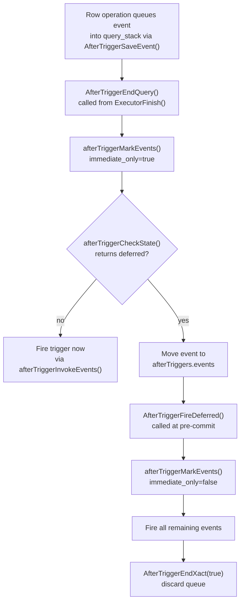
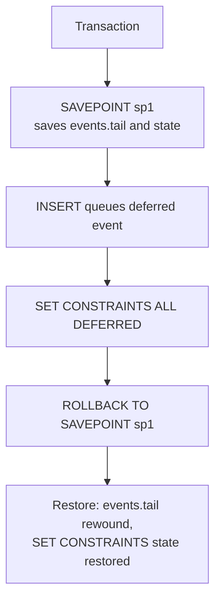

A deferrable constraint is one whose violation check can be postponed from the end of the modifying statement to the end of the transaction. This makes it possible to temporarily violate a constraint while a transaction is in progress — allowing bulk loading with circular references, reordering rows that must maintain uniqueness, or any transformation that passes through an intermediate invalid state.

## Constraint Deferrability

Every constraint that supports deferrability carries two independent bits in `pg_constraint`: `condeferrable` (whether deferring is allowed at all) and `condeferred` (whether deferring is the default at session start).

| Syntax | condeferrable | condeferred |
|---|---|---|
| `NOT DEFERRABLE` | false | false |
| `DEFERRABLE INITIALLY IMMEDIATE` | true | false |
| `DEFERRABLE INITIALLY DEFERRED` | true | true |

`NOT DEFERRABLE` is the default. Within a session, `SET CONSTRAINTS` can push a `DEFERRABLE INITIALLY IMMEDIATE` constraint to end-of-transaction, but the constraint starts each transaction in immediate mode. `DEFERRABLE INITIALLY DEFERRED` reverses that default.

Only four constraint types support deferrability: `UNIQUE`, `PRIMARY KEY`, `REFERENCES` (foreign key), and `EXCLUDE`. `CHECK` and `NOT NULL` are always immediate. The executor evaluates them inline, before the row becomes visible to other statements. There is no deferred-trigger path for them. The parser rejects `DEFERRABLE` on those types via the `SUPPORTS_ATTRS` macro in `parse_utilcmd.c`.

Writing `INITIALLY DEFERRED` without `DEFERRABLE` is legal syntax; the parser implicitly adds the `DEFERRABLE` flag rather than rejecting the clause.

## How Deferral Is Stored and Signalled

For `UNIQUE` and `PRIMARY KEY` constraints, deferral has two representations:

1. `pg_constraint.condeferrable` and `.condeferred` hold the logical state.
2. PostgreSQL sets `pg_index.indimmediate` to `false` for deferrable indexes. The executor reads this in `ExecInsertIndexTuples()` (`execIndexing.c`) to choose `UNIQUE_CHECK_PARTIAL` instead of `UNIQUE_CHECK_YES`. With `UNIQUE_CHECK_PARTIAL`, the index AM inserts the entry and returns a flag indicating a potential conflict but does not block or throw. PostgreSQL records the conflicting TID on a recheck list and queues a deferred trigger.

For `EXCLUDE` constraints, the same `indimmediate = false` flag applies. But the recheck goes to `check_exclusion_constraint()` rather than the btree uniqueness path.

For foreign key constraints, `pg_index.indimmediate` does not change — the FK's backing index on the referenced table is always a plain unique index. The deferred behaviour lives entirely in the constraint triggers registered by the FK.

## The Trigger Machinery Behind Constraint Checks

PostgreSQL implements every deferrable constraint check through its AFTER trigger infrastructure. When `index.c` creates a deferrable unique or primary key constraint, it explicitly creates an AFTER ROW trigger:

```c
/* src/backend/catalog/index.c */
if (deferrable)
{
    CreateTrigStmt *trigger = makeNode(CreateTrigStmt);
    trigger->funcname = SystemFuncName("unique_key_recheck");
    trigger->timing  = TRIGGER_TYPE_AFTER;
    trigger->events  = TRIGGER_TYPE_INSERT | TRIGGER_TYPE_UPDATE;
    trigger->deferrable    = true;
    trigger->initdeferred  = initdeferred;
    (void) CreateTrigger(trigger, ...);
}
```

The trigger function is `unique_key_recheck()` (`constraint.c`), which handles both uniqueness and exclusion rechecks. Its logic is:

1. Locate the row by TID using `SnapshotSelf`. If the row is dead (it was inserted and then deleted within the same transaction), skip the check — no live row, no violation.
2. Re-evaluate the index entry with `FormIndexDatum()`.
3. For uniqueness: call `index_insert(..., UNIQUE_CHECK_EXISTING, ...)`, which verifies uniqueness using the current transaction snapshot. It raises an error if another live row holds the same key.
4. For exclusion: call `check_exclusion_constraint()`, now with error-raising enabled.

The deferred check thus observes the final state of the transaction, not the state at the time the row was written.

For foreign key constraints, `ri_triggers.c` provides the enforcement triggers. On the FK table, `RI_FKey_check_ins` and `RI_FKey_check_upd` verify that a newly inserted or updated FK row still references a valid PK row. On the PK table, `RI_FKey_noaction_del` and `RI_FKey_noaction_upd` verify that deleting or updating a PK row does not orphan FK rows. All four are registered as deferrable when the FK constraint is `DEFERRABLE`.

The distinction between `NO ACTION` and `RESTRICT` referential actions exists solely because of deferrability. Both ultimately call the same `ri_restrict()` function. But `RESTRICT` triggers are always `NOT DEFERRABLE` and fire at statement level regardless of any `SET CONSTRAINTS`. `NO ACTION` triggers, by contrast, can be deferred. `CASCADE`, `SET NULL`, and `SET DEFAULT` actions are also always non-deferrable.

## The AfterTrigger Event Queue

The global `afterTriggers` variable (`AfterTriggersData`, `trigger.c`) is a process-global struct that holds the full deferred-event state for the current transaction:

```c
typedef struct AfterTriggersData
{
    CommandId              firing_counter;  /* next firing ID */
    SetConstraintState     state;           /* SET CONSTRAINTS overrides */
    AfterTriggerEventList  events;          /* transaction-level deferred list */
    MemoryContext          event_cxt;       /* memory context owning event chunks */
    int                    query_depth;     /* nesting level of current query */
    AfterTriggersQueryData *query_stack;    /* per-query event lists */
    AfterTriggersTransData *trans_stack;    /* per-subtransaction saved state */
} AfterTriggersData;
```

Each entry in the event lists is an `AfterTriggerEventData` record carrying status flags (`AFTER_TRIGGER_DONE`, `AFTER_TRIGGER_IN_PROGRESS`) and up to two CTIDs. Events that share the same trigger OID and relation OID within a chunk share a single `AfterTriggerSharedData` header, keeping per-row overhead small for large batch operations.

The shared header embeds two bitmask flags copied at queue time from the trigger's catalog columns:

- `AFTER_TRIGGER_DEFERRABLE` — set when `pg_trigger.tgdeferrable` is true
- `AFTER_TRIGGER_INITDEFERRED` — set when `pg_trigger.tginitdeferred` is true

These flags are the runtime signal that determines whether each event fires at statement end or at commit.

## Statement End vs. Commit

Hooks in `xact.c` and `executor.c` drive the lifecycle:

| Function | When called |
|---|---|
| `AfterTriggerBeginXact()` | Transaction starts |
| `AfterTriggerBeginQuery()` | Each statement begins |
| `AfterTriggerEndQuery()` | Statement finishes (from `ExecutorFinish()`) |
| `AfterTriggerFireDeferred()` | Pre-commit, called by `xact.c` |
| `AfterTriggerEndXact(isCommit)` | Transaction ends |



`afterTriggerCheckState()` makes the decision per event:

```c
/* src/backend/commands/trigger.c */
static bool
afterTriggerCheckState(AfterTriggerShared evtshared)
{
    /* Non-deferrable triggers never defer */
    if ((evtshared->ats_event & AFTER_TRIGGER_DEFERRABLE) == 0)
        return false;

    if (state != NULL)
    {
        /* Per-trigger SET CONSTRAINTS override wins */
        for (i = 0; i < state->numstates; i++)
            if (state->trigstates[i].sct_tgoid == tgoid)
                return state->trigstates[i].sct_tgisdeferred;

        /* SET CONSTRAINTS ALL override is next */
        if (state->all_isset)
            return state->all_isdeferred;
    }

    /* Fall back to the trigger's INITIALLY flag */
    return ((evtshared->ats_event & AFTER_TRIGGER_INITDEFERRED) != 0);
}
```

At commit, `AfterTriggerFireDeferred()` loops until all deferred events are consumed. The loop is necessary because firing a deferred RI trigger may itself use SPI to execute statements that queue additional events:

```c
/* src/backend/commands/trigger.c */
void
AfterTriggerFireDeferred(void)
{
    while (afterTriggerMarkEvents(events, NULL, false))
    {
        CommandId firing_id = afterTriggers.firing_counter++;
        if (afterTriggerInvokeEvents(events, firing_id, NULL, true))
            break;  /* all fired */
    }
}
```

If any trigger raises an error, the transaction aborts. The deferred check enforces the constraint as of the commit point, seeing the final state of all rows written in the transaction.

## SET CONSTRAINTS

`SET CONSTRAINTS` modifies the deferred/immediate state of named constraints (or all deferrable constraints) for the remainder of the current transaction. The implementation is in `AfterTriggerSetState()` (`trigger.c`), which maintains a `SetConstraintStateData` object in `afterTriggers.state`:

```c
typedef struct SetConstraintStateData
{
    bool  all_isset;           /* SET CONSTRAINTS ALL was used */
    bool  all_isdeferred;      /* if all_isset: the new ALL state */
    int   numstates;           /* number of per-trigger entries */
    SetConstraintTriggerData trigstates[FLEXIBLE_ARRAY_MEMBER];
} SetConstraintStateData;
```

`SET CONSTRAINTS ALL DEFERRED` clears the per-trigger array and sets `all_isset = true, all_isdeferred = true`. `SET CONSTRAINTS name` looks up the constraint's triggers in `pg_constraint` and `pg_trigger` and adds or updates entries in `trigstates[]`.

```sql
-- Defer everything for this transaction
SET CONSTRAINTS ALL DEFERRED;

-- Defer a specific constraint
SET CONSTRAINTS orders_customer_id_fkey DEFERRED;

-- Make a deferred constraint fire now
SET CONSTRAINTS orders_customer_id_fkey IMMEDIATE;
```

When a constraint is set to `IMMEDIATE`, SQL requires that any queued events for it fire at that moment. `AfterTriggerSetState()` therefore immediately scans the deferred event list and fires any events that have become immediate. This happens before the command returns. This makes `SET CONSTRAINTS ... IMMEDIATE` a way to perform a mid-transaction constraint check without committing.

`SET CONSTRAINTS` cannot affect `NOT DEFERRABLE` constraints; naming one explicitly raises an error.

### Subtransaction Interaction

`SetConstraintStateData` is saved and restored at subtransaction boundaries. `AfterTriggerBeginSubXact()` records the current events list tail position in `trans_stack[nest_level]`. If the subtransaction aborts, `AfterTriggerEndSubXact(false)` restores the saved state. It truncates the events list back to the saved tail pointer, discarding events queued inside the subtransaction. It also restores the `SET CONSTRAINTS` overrides to their pre-savepoint state:



## DEFERRABLE on BEGIN — A Different Mechanism

The `DEFERRABLE` keyword in `BEGIN` / `START TRANSACTION` is unrelated to constraint deferrability:

```sql
START TRANSACTION ISOLATION LEVEL SERIALIZABLE READ ONLY DEFERRABLE;
```

This combination is only meaningful for `SERIALIZABLE READ ONLY` transactions. It instructs PostgreSQL to delay acquiring the transaction's snapshot until it finds one that is guaranteed not to conflict with any concurrent read-write transaction. This eliminates any possibility of a serialization failure during the transaction. The implementation is in `GetSafeSnapshot()` (`predicate.c`):

```c
static Snapshot
GetSafeSnapshot(Snapshot origSnapshot)
{
    Assert(XactReadOnly && XactDeferrable);

    while (true)
    {
        snapshot = GetSerializableTransactionSnapshotInt(origSnapshot, NULL, InvalidPid);

        /* No concurrent r/w transactions: safe immediately */
        if (MySerializableXact == InvalidSerializableXact)
            return snapshot;

        /* Wait for concurrent transactions that might conflict */
        MySerializableXact->flags |= SXACT_FLAG_DEFERRABLE_WAITING;
        while (!(dlist_is_empty(&MySerializableXact->possibleUnsafeConflicts) ||
                 SxactIsROUnsafe(MySerializableXact)))
            ProcWaitForSignal(WAIT_EVENT_SAFE_SNAPSHOT);
        MySerializableXact->flags &= ~SXACT_FLAG_DEFERRABLE_WAITING;

        if (!SxactIsROUnsafe(MySerializableXact))
            break;  /* safe snapshot found */

        /* Snapshot was unsafe; release locks and retry */
        ReleasePredicateLocks(false, false);
    }

    /* Release predicate locks — no further checks needed */
    ReleasePredicateLocks(false, true);
    return snapshot;
}
```

Once PostgreSQL establishes a safe snapshot, it releases all predicate locks. The transaction then proceeds without any serialization overhead. The cost is startup latency — potentially blocking until all current writers complete. This is the correct mode for long-running analytics queries that need true serializable consistency but cannot tolerate `ERROR: could not serialize access` failures.

`XactDeferrable` is stored in `xact.c` as a session-level boolean, entirely separate from `pg_constraint.condeferrable`.

## Practical Patterns

**Loading data with circular foreign keys.** Two tables that mutually reference each other cannot both have non-deferrable FKs during bulk loading:

```sql
BEGIN;
SET CONSTRAINTS ALL DEFERRED;

INSERT INTO category (id, parent_id) VALUES (1, 2);  -- parent doesn't exist yet
INSERT INTO category (id, parent_id) VALUES (2, 1);

COMMIT;  -- both rows exist now; FK check passes
```

Both FK constraints must be declared `DEFERRABLE`. A single `NOT DEFERRABLE` FK anywhere in the chain breaks the pattern.

**Swapping unique values.** Exchanging two values in a uniquely-constrained column requires a transient duplicate at statement level without deferral:

```sql
BEGIN;
SET CONSTRAINTS tasks_rank_key DEFERRED;

UPDATE tasks SET rank = rank + 1 WHERE rank BETWEEN 1 AND 5;

COMMIT;  -- ranks are all distinct again; unique check passes
```

**Copying rows between schemas or tables.** Bulk-copying a normalized dataset with FK relationships avoids having to topologically sort the inserts:

```sql
BEGIN;
SET CONSTRAINTS ALL DEFERRED;

INSERT INTO staging.orders    SELECT * FROM orders    WHERE ...;
INSERT INTO staging.lines     SELECT * FROM lines     WHERE ...;
INSERT INTO staging.payments  SELECT * FROM payments  WHERE ...;

COMMIT;
```

**Inspecting deferrable constraints.** The current constraint trigger configuration is visible via catalog queries:

```sql
SELECT
    c.conname,
    c.condeferrable,
    c.condeferred,
    t.tgname,
    t.tgdeferrable,
    t.tginitdeferred
FROM pg_constraint c
JOIN pg_trigger t ON t.tgconstraint = c.oid
WHERE c.condeferrable
ORDER BY c.conname, t.tgname;
```

## Limitations

Deferrable constraints cannot serve as `ON CONFLICT` arbiters in `INSERT ... ON CONFLICT DO UPDATE`. Conflict detection in that path requires an immediate uniqueness check so the planner can choose the right conflict action; a deferred constraint cannot provide that.

Deferrable constraint triggers cannot use transition tables (`NEW TABLE` / `OLD TABLE`). Statement-level triggers with transition tables must fire at end-of-statement, because the tuplestore they reference is scoped to the query level. `AfterTriggerEndQuery()` frees it at that point.

Deferrable constraint triggers are not supported on foreign tables (via FDW). `AfterTriggerEndQuery()` must also free the tuplestore used to buffer FDW trigger tuples at query end, for the same reason. The comment at line 3635 of `trigger.c` makes this explicit.

## Related Topics

- [[subsystems/transactions/subtransactions|Subtransactions]] — explains how savepoints save and restore the AfterTrigger event queue and SET CONSTRAINTS state at each nesting level.
- [[subsystems/transactions/transaction-lifecycle|Transaction Lifecycle]] — covers the commit hooks (`AfterTriggerFireDeferred`, `AfterTriggerEndXact`) that drive deferred constraint firing at pre-commit.
- [[subsystems/locking/predicate-locking|Predicate Locking]] — documents the serializable snapshot machinery behind `DEFERRABLE` on `BEGIN`, including `GetSafeSnapshot()`.
- [[subsystems/transactions/isolation-levels|Isolation Levels]] — describes how `SERIALIZABLE READ ONLY DEFERRABLE` interacts with SSI conflict detection.
- [[subsystems/constraints|Constraints]] — surveys all PostgreSQL constraint types, including which support deferrability and how they are stored in `pg_constraint`.
- [[code-paths/insert|INSERT]] — shows how `ExecInsertIndexTuples()` chooses `UNIQUE_CHECK_PARTIAL` for deferrable indexes and enqueues the recheck event.
- [[code-paths/upsert|Upsert (INSERT ... ON CONFLICT)]] — explains why deferrable unique constraints cannot act as ON CONFLICT arbiters, a key limitation of the deferred-trigger model.
