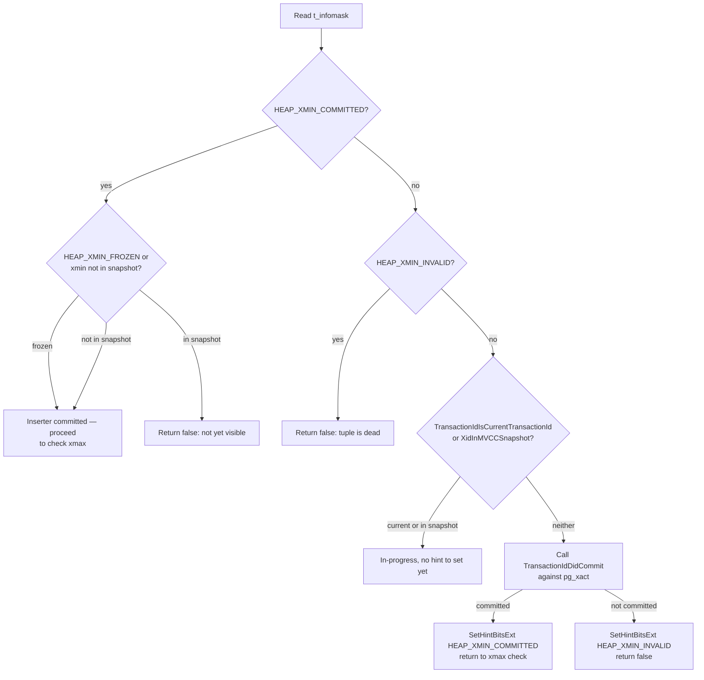
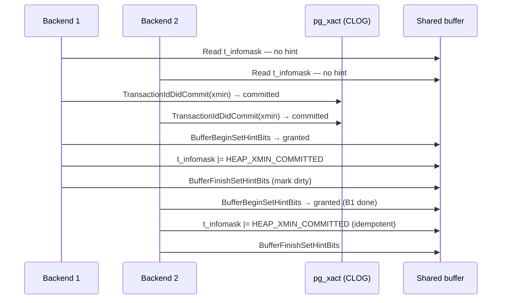
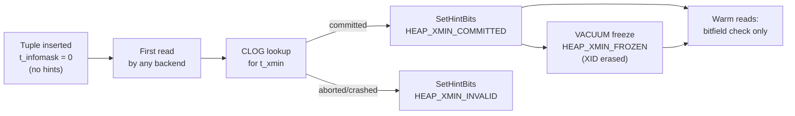

# Hint Bits

Every heap tuple carries a 2-byte `t_infomask` field in its `HeapTupleHeaderData`. Four of those bits — the *hint bits* — serve as a write-once cache for the commit status of `t_xmin` and `t_xmax`. Without hint bits, every visibility check would have to read the commit log (`pg_xact`, formerly `pg_clog`) to determine whether the inserting or deleting transaction committed. Hint bits eliminate that I/O once the answer is known, converting a lookup in a shared data structure into a single in-memory bitfield test.

## The four hint bits

All four are defined in `src/include/access/htup_details.h`:

| Bit value | Name | Meaning |
|---|---|---|
| `0x0100` | `HEAP_XMIN_COMMITTED` | `t_xmin` (the inserting XID) is known committed |
| `0x0200` | `HEAP_XMIN_INVALID` | `t_xmin` is known aborted or crashed |
| `0x0300` | `HEAP_XMIN_FROZEN` | Both xmin bits set: tuple is frozen, visible to all transactions |
| `0x0400` | `HEAP_XMAX_COMMITTED` | `t_xmax` (the deleting/locking XID) is known committed |
| `0x0800` | `HEAP_XMAX_INVALID` | `t_xmax` is absent, aborted, or crashed |

`HEAP_XMIN_FROZEN` is not an independent bit. It is the combination `HEAP_XMIN_COMMITTED | HEAP_XMIN_INVALID` (`0x0300`), chosen because that value could never arise legitimately from two independent facts (a transaction cannot be both committed and invalid). The accessor macros in `htup_details.h` encode this:

```c
#define HEAP_XMIN_FROZEN    (HEAP_XMIN_COMMITTED | HEAP_XMIN_INVALID)

static inline bool HeapTupleHeaderXminCommitted(HeapTupleHeader tup)
{ return (tup->t_infomask & HEAP_XMIN_COMMITTED) != 0; }

static inline bool HeapTupleHeaderXminInvalid(HeapTupleHeader tup)
{ return (tup->t_infomask & (HEAP_XMIN_COMMITTED | HEAP_XMIN_INVALID))
         == HEAP_XMIN_INVALID; }

static inline bool HeapTupleHeaderXminFrozen(HeapTupleHeader tup)
{ return (tup->t_infomask & HEAP_XMIN_FROZEN) == HEAP_XMIN_FROZEN; }
```

`HeapTupleHeaderXminInvalid` only returns true when `HEAP_XMIN_INVALID` is set but `HEAP_XMIN_COMMITTED` is not. The frozen state (`0x0300`) is therefore excluded from the "invalid" test. This is correct: a frozen tuple is visible, not dead.

## How visibility checks use hint bits

The canonical path is `HeapTupleSatisfiesMVCC()` in `src/backend/access/heap/heapam_visibility.c`. The pattern is check-hint → fall back to CLOG → set hint:



The xmax side mirrors this: if `HEAP_XMAX_INVALID` is already set the tuple is live; if `HEAP_XMAX_COMMITTED` is set and the snapshot confirms the delete, the tuple is dead. When neither hint is set, the code calls `TransactionIdDidCommit` and caches the result.

Note from the source comment: MVCC visibility intentionally does *not* try to set hint bits when the XID is still in-progress according to the snapshot. This holds even if the transaction has actually committed in the meantime. The cost of that missed opportunity (one extra `TransactionIdIsCurrentTransactionId` call) is lower than the cost of probing `ProcArrayLock` on every tuple read.

## SetHintBits and SetHintBitsExt

Setting a hint bit modifies a shared buffer page, so it cannot be done without protocol. The internal workhorse is `SetHintBitsExt()`:

```c
static inline void
SetHintBitsExt(HeapTupleHeader tuple, Buffer buffer,
               uint16 infomask, TransactionId xid,
               SetHintBitsState *state);
```

Single-tuple callers use the wrapper `SetHintBits()` (which passes `state = NULL`); batch callers (such as the bulk MVCC path in `HeapTupleSatisfiesMVCC` when scanning many tuples) pass a `SetHintBitsState *` to amortize the cost of `BufferBeginSetHintBits()` across tuples on the same page.

The protocol enforced by `SetHintBitsExt`:

1. **LSN interlock for commit hints** — For a committed-XID hint on a permanent relation, the function checks whether the transaction's commit WAL record has already been flushed (`XLogNeedsFlush(commitLSN)`). If the commit record has not yet been flushed and the buffer's own LSN does not already postdate it, the function silently skips the hint. This prevents PostgreSQL from writing the hint bit to the data file before the WAL record that proves the transaction committed. A crash at that point could otherwise leave the tuple appearing committed when it was not.

2. **Share-exclusive lock upgrade** — `BufferBeginSetHintBits()` checks the current lock mode. If the caller holds only a shared content lock, it attempts an atomic upgrade to `BUFFER_LOCK_SHARE_EXCLUSIVE`. If another backend holds a conflicting lock (exclusive or share-exclusive), the function returns `false`. The hint is dropped for this visit; another backend will set it later. Only one backend can set hint bits on a given page at a time.

3. **Marking the buffer dirty** — Once the code writes the bit into the in-memory page, it must mark the buffer dirty. `MarkBufferDirtyHint()` / `BufferSetHintBits16()` perform this. They are deliberately distinct from `MarkBufferDirty()`, because hint bits are non-critical. Losing them on a crash is acceptable; they will simply be recalculated.

### WAL full-page image for hint bits

When `wal_level` is high enough to require checksums protection (`XLogHintBitIsNeeded()`), dirtying a page for the first time since the last checkpoint requires a WAL `XLOG_FPI_FOR_HINT` record — a full-page image — to protect against torn writes. `MarkSharedBufferDirtyHint()` makes the decision:

```c
if (XLogHintBitIsNeeded() && (lockstate & BM_PERMANENT))
{
    if (RecoveryInProgress() || RelFileLocatorSkippingWAL(...))
        return;   /* cannot WAL-log; drop the dirty mark silently */
    wal_log = true;
}
```

This is why enabling checksums (or `wal_level = logical/replica`) has a measurable write-amplification cost on cold databases: the first scan after restart triggers one FPI WAL record per page touched.

## Hint bits on hot-standby replicas

The `RecoveryInProgress()` guard in `MarkSharedBufferDirtyHint()` is the key. If the server is in recovery (including hot-standby mode), setting a committed-XID hint would require emitting a WAL record. Standbys cannot do that — they are WAL consumers, not producers. Rather than silently skip the dirty mark and lose the hint on eviction, PostgreSQL skips the entire dirty-marking step. The in-memory page gets the hint bit set, benefiting queries that reuse the pinned buffer. But the page will not reach disk with that hint until the primary generates such a WAL record, or the server comes out of recovery.

This means a hot-standby replica that services many read queries will repeatedly pay the CLOG-lookup cost. This happens on pages that replication WAL has not touched since the last checkpoint.

## The concurrent-update race condition

Because any backend that examines a tuple can set its hint bits, two backends can race to set the same bit simultaneously. This is safe because:

- Both backends perform the same CLOG lookup and reach the same conclusion (committed or aborted).
- The bits are monotonic: once set, they are never cleared. A tuple cannot move from "xmin committed" back to "xmin unknown."
- The write is to a single aligned `uint16` field; on any platform PostgreSQL supports, a 16-bit store is atomic from the perspective of other readers.

The requirement that only one backend hold `BUFFER_LOCK_SHARE_EXCLUSIVE` at a time is not about preventing data races in the memory-safety sense. It is about preventing a hint bit write from colliding with a concurrent page flush. Such a collision could corrupt a checksum or cause a filesystem checksum error (a known issue with btrfs).



## HEAP_XMIN_FROZEN: the frozen tuple

`HEAP_XMIN_FROZEN` (`0x0300`, both xmin bits set simultaneously) signals that `t_xmin` has been *frozen*. VACUUM has erased its original XID. The tuple is considered inserted by a transaction that committed before the beginning of time. No CLOG lookup is ever needed. No snapshot can exclude it based on xmin age.

The visibility check for a frozen tuple short-circuits early:

```c
if (!HeapTupleHeaderXminFrozen(tuple) &&
    XidInMVCCSnapshot(HeapTupleHeaderGetRawXmin(tuple), snapshot))
    return false;   /* treat as still in progress */
/* else: frozen tuples are always past any snapshot's horizon */
```

VACUUM performs freezing via `heap_execute_freeze_tuple()` (`src/include/access/heapam.h`), which writes the final `t_infomask` (including `HEAP_XMIN_FROZEN`) directly into the on-disk page under an exclusive buffer lock. The WAL record for a freeze operation is a proper `XLOG_HEAP2_FREEZE_PAGE` record — not a hint-bit FPI — so it participates in normal WAL ordering.

```c
static inline void
heap_execute_freeze_tuple(HeapTupleHeader tuple, HeapTupleFreeze *frz)
{
    HeapTupleHeaderSetXmax(tuple, frz->xmax);
    /* ... xvac handling ... */
    tuple->t_infomask  = frz->t_infomask;   /* includes HEAP_XMIN_FROZEN */
    tuple->t_infomask2 = frz->t_infomask2;
}
```

Before executing freeze plans, `heap_pre_freeze_checks()` deliberately avoids relying on hint bits (`/* Deliberately avoid relying on tuple hint bits here */`) and instead calls `TransactionIdDidCommit` directly, because a corrupt or missing hint bit should not prevent a necessary freeze.

## Relation to VACUUM

VACUUM interacts with hint bits in two distinct phases:

| Phase | What VACUUM does | Effect on hint bits |
|---|---|---|
| Pruning / dead-tuple removal | Calls `HeapTupleSatisfiesVacuumHorizon()` on each tuple | Sets `HEAP_XMIN_COMMITTED`, `HEAP_XMIN_INVALID`, `HEAP_XMAX_COMMITTED`, `HEAP_XMAX_INVALID` as a side-effect of determining liveness |
| Freezing | Calls `heap_prepare_freeze_tuple()` + `heap_execute_freeze_tuple()` | Replaces individual xmin/xmax hint bits with `HEAP_XMIN_FROZEN`; the original XID is discarded |

Once a tuple is frozen, no future VACUUM, backend, or checkpoint needs to consult `pg_xact` for that tuple's xmin. This is the mechanism that allows PostgreSQL to advance `relfrozenxid` and eventually truncate old CLOG segments. A table that has never been vacuumed will have no frozen tuples and no hint bits. Every visibility check must hit CLOG. CLOG segments cannot be recycled.

## Performance implications

The cost difference between a cold database (no hint bits set) and a warm one (all committed tuples hinted) is measurable in two dimensions:

| Scenario | Per-tuple cost |
|---|---|
| Hint bit set and matches snapshot | Single bitfield AND — essentially free |
| No hint bit, XID in MVCC snapshot | `XidInMVCCSnapshot` (binary search over snapshot array) |
| No hint bit, XID not in snapshot | `TransactionIdDidCommit` (SLRU buffer lookup in `pg_xact`) |
| First hint write, page not yet dirty | `XLogSaveBufferForHint` FPI + `MarkBufferDirtyHint` |

A freshly restored database from a base backup, or a database that has never been read since startup, has no hint bits set. The first sequential scan is significantly more expensive than subsequent ones. Every tuple requires a CLOG lookup, and every modified page triggers an FPI WAL record (when checksums are enabled). This is sometimes called the "cold read" penalty.

`pg_xact` uses an SLRU cache with a small number of 8KB buffers. A workload that reads very old tuples (before any VACUUM-and-freeze pass) can thrash that cache even when the data pages themselves are in `shared_buffers`. Freezing old pages eliminates this problem permanently.

## Hint-bit lifecycle



## See also

- [[subsystems/storage/heap]] — full description of `HeapTupleHeaderData`, `t_infomask` field layout, and tuple structure
- [[subsystems/storage/clog]] — SLRU-based commit log that hint bits cache, including segment lifecycle and truncation
- [[subsystems/transactions/mvcc]] — how `t_xmin`, `t_xmax`, snapshots, and hint bits combine to determine tuple visibility
- [[subsystems/wal/overview]] — WAL ordering requirements that constrain when commit-hint bits can be durably written
