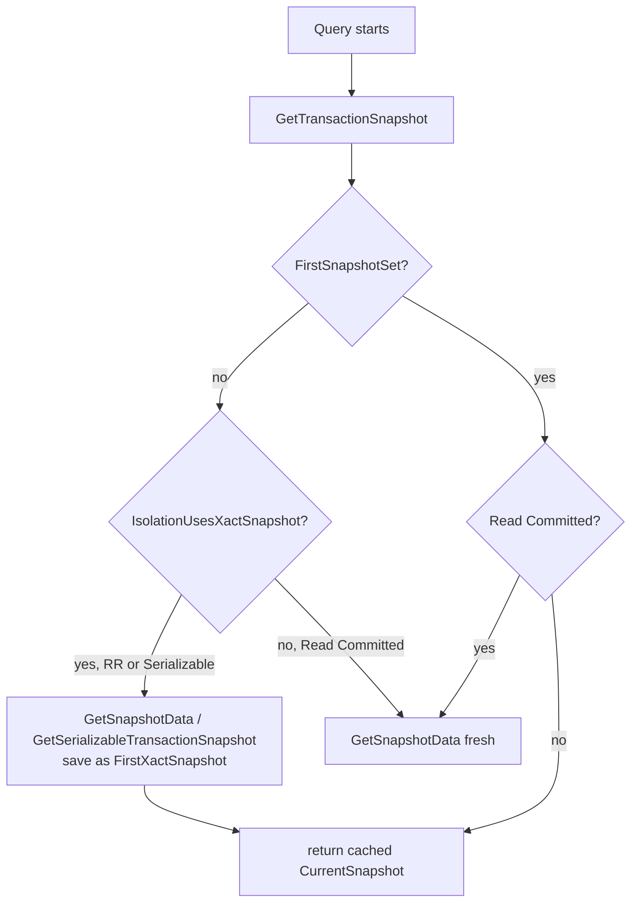

# Transaction Isolation Levels

PostgreSQL implements the four isolation levels defined by the SQL standard on top of its MVCC engine. In practice only two distinct snapshot behaviours underlie all four levels. READ UNCOMMITTED is accepted syntactically but behaves identically to READ COMMITTED, because MVCC makes dirty reads impossible by construction. An uncommitted row version is simply never visible to any other transaction, regardless of isolation level. The real differentiation comes from when snapshots are taken and whether a second layer of conflict detection (SSI) is active.

## Anomalies and the levels that prevent them

The SQL standard defines isolation levels by which anomalies they permit. PostgreSQL meets or exceeds the standard definition at every level:

| Anomaly | Read Committed | Repeatable Read | Serializable |
|---|---|---|---|
| Dirty read | prevented | prevented | prevented |
| Non-repeatable read | possible | prevented | prevented |
| Phantom read | possible | prevented | prevented |
| Write skew | possible | possible | prevented |

PostgreSQL's REPEATABLE READ prevents phantom reads even though the SQL standard only requires that of SERIALIZABLE. This is a consequence of snapshot-based visibility: the snapshot taken at the start of the transaction filters out all rows inserted after that point, making range-level phantoms impossible without any predicate locking. The SQL standard's definition of REPEATABLE READ was written with locking implementations in mind, where preventing phantoms requires range locks.

## How snapshots drive isolation

The core mechanism is straightforward: a snapshot records which transactions were in progress at the moment it was taken. Any row whose inserting transaction is in that in-progress set is invisible; any row whose deleting transaction is in that set remains visible. The difference between isolation levels is entirely about when `GetTransactionSnapshot` returns a new snapshot versus a cached one (`snapmgr.c`).



`IsolationUsesXactSnapshot()` is the predicate that separates READ COMMITTED from the other two. When it returns true (REPEATABLE READ or SERIALIZABLE), `GetTransactionSnapshot` returns the same `CurrentSnapshot` on every call after the first. For READ COMMITTED it always calls `GetSnapshotData` to build a fresh snapshot, so each statement starts with a new view of the world.

For SERIALIZABLE, `GetSerializableTransactionSnapshot` creates the first snapshot, rather than `GetSnapshotData`. This path registers the transaction with the SSI subsystem (`predicate.c`) before building the snapshot, so the predicate lock tracking begins at the exact point the snapshot is taken.

`GetLatestSnapshot` bypasses the isolation level logic entirely. It always calls `GetSnapshotData` and returns a current-instant snapshot. PostgreSQL uses it internally for things like referential integrity checks, where the constraint must be tested against the latest committed state, regardless of what the current transaction's snapshot sees.

## Snapshot internals

A snapshot (`SnapshotData`, `src/include/utils/snapshot.h`) records three things at the moment it is taken:

| Field | Meaning |
|---|---|
| `xmin` | All transactions with XID below this are committed and visible |
| `xmax` | All transactions with XID at or above this had not yet started |
| `xip[]` | XIDs of transactions that were in progress (between xmin and xmax) |

A tuple is visible if its inserting XID is committed and not in `xip[]`, and if its deleting XID (if any) is either still in progress or above `xmax`. The `XidInMVCCSnapshot` function performs the in-progress check, first doing a fast range check against `xmin` and `xmax` before searching the `xip` array (`snapmgr.c`).

Snapshots also carry `subxip[]` for subtransaction XIDs and a `suboverflowed` flag. When there are too many concurrent subtransactions to store individually, PostgreSQL sets `suboverflowed`. Visibility checks then fall back to looking up the top-level XID via `pg_subtrans`.

The snapshot manager maintains a `RegisteredSnapshots` pairing-heap ordered by `xmin`. Each backend's `MyProc->xmin` tracks the oldest xmin across all its held snapshots. This in turn determines the global horizon; VACUUM can reclaim dead tuples only below that horizon.

## Read Committed

The default isolation level. PostgreSQL acquires a fresh snapshot at the start of every statement, so each query sees all rows committed before that statement began — including commits that happened after the transaction started. Two queries in the same transaction can return different results for the same `SELECT`. This is the non-repeatable read anomaly. Phantom rows can also appear: rows matching a WHERE clause that a concurrent transaction inserted and committed between two identical queries.

The practical cost of READ COMMITTED is low. `GetSnapshotData` builds the snapshot by scanning the process array for active XIDs. This is fast but not free. Because the snapshot is discarded at statement end, there is no need to hold an old xmin. VACUUM can reclaim dead tuples promptly.

### UPDATE and DELETE under Read Committed

An UPDATE or DELETE can find a target row that another transaction has just modified and committed. In that case, the row's current version is not the version the snapshot originally saw. PostgreSQL handles this with `EvalPlanQual`. It re-fetches the current committed version of the row, then re-evaluates the WHERE clause against that version.

If the WHERE clause still matches the new version, the update proceeds against that version. If not, PostgreSQL silently skips the row. The assumption is that the concurrent transaction "won", so the current transaction's predicate no longer applies.

This creates the classic lost-update scenario: two concurrent `UPDATE accounts SET balance = balance - 100 WHERE id = 1` statements both read the same original balance, compute the same new balance, and both apply it. The second writer overwrites the first. Preventing this requires either `SELECT ... FOR UPDATE` to acquire a row lock before reading, application-level optimistic locking, or switching to REPEATABLE READ.

## Repeatable Read

The snapshot is taken once at the first statement and held for the entire transaction. Every subsequent query sees exactly the same committed data set. Because rows inserted after the snapshot point carry an inserting XID that is in `xip[]` or above `xmax`, they are invisible. This eliminates non-repeatable reads and phantom reads simultaneously, without range locks.

### Write conflicts cause serialization errors

Under REPEATABLE READ, a transaction might try to update or delete a row that another transaction concurrently updated and committed after the snapshot was taken. In that case, PostgreSQL cannot silently re-fetch the way READ COMMITTED does. The snapshot is fixed, so there is no valid "latest version" to re-evaluate against. Instead, PostgreSQL aborts the transaction:

```
ERROR:  could not serialize access due to concurrent update
```

The application must retry the transaction. This error arises from the same `heap_update`/`heap_delete` code path that generates the silent re-fetch for READ COMMITTED. The difference is purely in how PostgreSQL resolves the conflict: READ COMMITTED retries silently, REPEATABLE READ aborts loudly.

### Write skew: the remaining anomaly

Write skew is the anomaly that REPEATABLE READ cannot prevent. Both transactions read overlapping data, make decisions based on what they read, then each writes to a different part of that data. Neither individual write conflicts with the other at the row level. But the combined result violates an invariant that held at the start of both transactions.

```sql
-- Two doctors must be on call; both are currently on call (on_call = true)
-- T1 and T2 both read: SELECT count(*) FROM doctors WHERE on_call = true  → 2

-- T1: UPDATE doctors SET on_call = false WHERE name = 'Alice';
-- T2: UPDATE doctors SET on_call = false WHERE name = 'Bob';
-- Both commit successfully → count = 0, invariant violated
```

T1 and T2 each read data that the other modifies. But neither modifies data that the other has read in a conflicting way. MVCC snapshot isolation has no mechanism to detect this class of conflict.

## Serializable (SSI)

PostgreSQL implements **Serializable Snapshot Isolation** (SSI), described in the academic literature by Cahill, Röhm, and Fekete. SSI adds a second layer on top of snapshot isolation. It tracks read-write antidependencies between concurrent transactions. It aborts any transaction that forms a dangerous cycle.

The key insight is that write skew and other serialization anomalies require a cycle of at least two rw-antidependencies. An rw-antidependency from T1 to T2 exists when T1 reads a version of some data that T2 subsequently modifies. SSI tracks these using SIREAD locks — non-blocking predicate locks that record reads without preventing concurrent writers.

### Predicate locks

When a SERIALIZABLE transaction reads a tuple, page, or relation, it acquires a SIREAD lock on that object. SIREAD locks do not block; they exist only for conflict detection. When a writer modifies data, `predicate.c` checks for existing SIREAD locks on the affected data held by other transactions. If it finds one, `predicate.c` records an rw-antidependency.

PostgreSQL acquires SIREAD locks at tuple granularity when possible. It can promote them to page or relation granularity to keep memory usage bounded. The GUC `max_pred_locks_per_transaction` controls the promotion threshold: when a transaction holds too many fine-grained locks, PostgreSQL summarizes them into a single coarser lock.

### The dangerous cycle

A single rw-antidependency is not sufficient to indicate a problem. Two rw-antidependencies forming a cycle are the tell-tale sign:

```
T1 --rw--> T2 --rw--> T1   (dangerous structure)
```

When PostgreSQL detects this pattern, it chooses one of the transactions as the pivot and aborts it:

```
ERROR:  could not serialize access due to read/write dependencies among transactions
DETAIL:  The transaction might succeed if retried.
SQLSTATE: 40001
```

The choice of which transaction to abort is heuristic; `predicate.c` prefers to abort the one that has done the least work. Applications must retry on `SQLSTATE 40001`.

### SSI and the write skew example

Returning to the on-call doctors example: under SERIALIZABLE, T1 acquires SIREAD locks on the rows it reads. When T2 updates one of those rows (Bob's record), PostgreSQL records a T1→T2 antidependency. Similarly, when T1 updates Alice's record (which T2 had read), PostgreSQL records a T2→T1 antidependency. PostgreSQL detects the cycle and aborts one transaction before the invariant breaks.

### False abort rate

SSI is not perfect: it can abort transactions that would in fact have produced a serializable result. These are false positives in the cycle detection. The false abort rate increases with lock promotion to coarser granularity (a relation-level SIREAD lock creates apparent conflicts with every write to the relation, even ones that are not actually dangerous). In practice, with normal OLTP workloads, false abort rates are low.

### Read-only transactions and safe snapshots

A read-only SERIALIZABLE transaction cannot be the pivot of a dangerous write cycle because it never writes. However, it can still be part of an rw-antidependency chain where its reads affect the cycle. PostgreSQL may be able to prove that all write transactions concurrent with the read-only transaction have already committed cleanly. When it can, it grants the read-only transaction a **safe snapshot**. The transaction can then proceed without participating in further conflict tracking.

This check may cause a brief delay at transaction start, visible as `wait_event = 'SafeSnapshot'` in `pg_stat_activity`. Once PostgreSQL grants the safe snapshot, the read-only transaction bears no SSI overhead for the rest of its lifetime.

## Deferrable transactions

`SET TRANSACTION DEFERRABLE` (combined with `SERIALIZABLE READ ONLY`) trades startup latency for guaranteed serialization without any false aborts. The transaction waits at its start point until PostgreSQL can assign it a snapshot known to be conflict-free — that is, no currently running read-write transaction could possibly conflict with it. Once started, the transaction runs with no predicate lock overhead. PostgreSQL will never abort it for serialization reasons.

```sql
BEGIN TRANSACTION ISOLATION LEVEL SERIALIZABLE READ ONLY DEFERRABLE;
-- waits here until a clean snapshot is available
SELECT ...;
COMMIT;
```

This is ideal for long-running reports that need a consistent view of the entire database without risking abort. The wait is typically very short in practice. DEFERRABLE has no effect unless the transaction also sets both SERIALIZABLE and READ ONLY.

## Performance comparison

The overhead of each level is tied directly to its mechanism:

**READ COMMITTED** is the cheapest. Each statement builds a fresh snapshot by scanning the procarray. This takes shared memory access proportional to the number of active backends. PostgreSQL retains no snapshot between statements, so the backend's `xmin` contribution to global xmin is as short-lived as possible.

**REPEATABLE READ** holds a snapshot for the transaction's lifetime. This pins `MyProc->xmin` at the snapshot's xmin, preventing VACUUM from advancing the global horizon past that point for as long as the transaction runs. Long-running REPEATABLE READ transactions are the primary reason for "table bloat" from dead tuples that VACUUM cannot reclaim.

**SERIALIZABLE** adds the predicate lock overhead on top of REPEATABLE READ's snapshot cost. Every heap scan acquires SIREAD locks; every write checks for conflicting SIREAD locks held by other transactions. The `predicate.c` subsystem maintains shared memory structures (`SxactGlobalXmin`, the lock hash table) that require additional locking. On workloads with many concurrent short transactions and low actual conflict rates, the overhead is typically 5–15% compared to REPEATABLE READ. On workloads with heavy write-write contention, the cost of false aborts and retries can dominate.

## Setting the isolation level

```sql
BEGIN TRANSACTION ISOLATION LEVEL REPEATABLE READ;
BEGIN TRANSACTION ISOLATION LEVEL SERIALIZABLE;
BEGIN TRANSACTION ISOLATION LEVEL SERIALIZABLE READ ONLY DEFERRABLE;

-- After BEGIN, before first statement:
SET TRANSACTION ISOLATION LEVEL SERIALIZABLE;
```

A session must issue `SET TRANSACTION` before the first statement in the transaction. `GetTransactionSnapshot` checks `FirstSnapshotSet` and rejects level changes after that point. The `default_transaction_isolation` GUC sets the default for all new connections.

Snapshot import (`SET TRANSACTION SNAPSHOT 'token'`) requires REPEATABLE READ or SERIALIZABLE; `ImportSnapshot` in `snapmgr.c` explicitly rejects the call for READ COMMITTED because each statement would get a fresh snapshot anyway, making the imported snapshot meaningless.

## See also

- [[subsystems/transactions/mvcc]] — how snapshots are used to determine tuple visibility
- [[subsystems/transactions/transaction-lifecycle]] — the transaction state machine
- [[subsystems/transactions/subtransactions]] — subtransaction XID tracking in snapshots
- [[subsystems/locking/predicate-locking]] — SSI predicate lock implementation details
- [[subsystems/storage/heap]] — EvalPlanQual and row re-fetch mechanics
