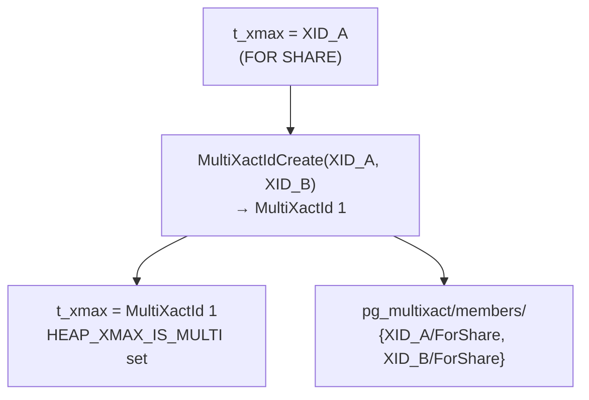

# MultiXactId — Multiple Row Lockers

A heap tuple's `t_xmax` field is 32 bits wide — wide enough for one transaction ID. When multiple transactions hold row-level locks on the same tuple simultaneously, PostgreSQL uses a **MultiXactId** as an indirection: `t_xmax` stores the MultiXactId, and the set of individual transactions and their lock modes is recorded in the `pg_multixact` directory.

## The problem

Row-level locking (`SELECT … FOR SHARE`, `SELECT … FOR UPDATE`, etc.) sets `t_xmax` to the locking transaction's XID. If a second transaction then tries to lock the same row, there is nowhere to store both XIDs in the 4-byte `t_xmax`. MultiXact solves this by allocating a new ID that represents the group.

## HEAP_XMAX_IS_MULTI

When `t_xmax` contains a MultiXactId rather than a plain XID, the bit `HEAP_XMAX_IS_MULTI` is set in `t_infomask`. Visibility code checks this flag before interpreting `t_xmax`.

## MultiXactMember

Each MultiXactId maps to an array of `MultiXactMember` entries, one per participating transaction:

| Field | Type | Values |
|---|---|---|
| `xid` | `TransactionId` | The member transaction's XID |
| `status` | `MultiXactStatus` | Lock mode (see below) |

### MultiXactStatus values

| Value | Name | Corresponds to |
|---|---|---|
| `0` | `MultiXactStatusForKeyShare` | `SELECT … FOR KEY SHARE` |
| `1` | `MultiXactStatusForShare` | `SELECT … FOR SHARE` |
| `2` | `MultiXactStatusForNoKeyUpdate` | `SELECT … FOR NO KEY UPDATE` |
| `3` | `MultiXactStatusForUpdate` | `SELECT … FOR UPDATE` |
| `4` | `MultiXactStatusNoKeyUpdate` | `UPDATE` (non-key columns) |
| `5` | `MultiXactStatusUpdate` | `UPDATE` (key columns) or `DELETE` |

## Storage: pg_multixact

Two SLRU-backed files live in `$PGDATA/pg_multixact/`:

| File | Purpose |
|---|---|
| `members/` | Sequential list of `MultiXactMember` entries |
| `offsets/` | Per-MultiXactId index: maps each MultiXactId to its start offset in `members/` |

Each SLRU file is paged. PostgreSQL caches pages in shared memory in a fixed-size ring buffer. The layout mirrors [[subsystems/storage/clog|CLOG]]: PostgreSQL maps a MultiXactId to a page and byte offset within `offsets/`, and that offset yields the start index into `members/`.

## Creating a MultiXact

When a second locker arrives on a row already locked by one transaction:

1. `heap_lock_tuple` detects `HEAP_XMAX_IS_MULTI` or a plain XID in `t_xmax`.
2. `MultiXactIdExpand` (for an existing MultiXact) or `MultiXactIdCreate` (converting a plain XID) allocates a new MultiXactId.
3. The new `MultiXactMember` list is written to `members/` at the offset recorded in `offsets/`.
4. `t_xmax` is set to the new MultiXactId with `HEAP_XMAX_IS_MULTI` set.

`GetMultiXactIdMembers` retrieves the member list for a given MultiXactId from the SLRU cache.

An important invariant is that an existing MultiXactId is **never modified in place**. `MultiXactIdExpand` always allocates a fresh MultiXactId containing the surviving old members plus the new one. This is necessary because another backend might be in the middle of waiting on the old MultiXactId; mutating its membership would be a race.

## A concrete scenario

Consider three transactions operating on the same row in sequence.

**Step 1 — Transaction A locks the row for share.**

`heap_lock_tuple` finds `t_xmax` is zero (no prior locker). It stores A's XID directly in `t_xmax` and sets `HEAP_XMAX_LOCK_ONLY | HEAP_XMAX_SHR_LOCK` in `t_infomask`. No MultiXact yet.

```
t_xmax = XID_A
t_infomask = HEAP_XMAX_LOCK_ONLY | HEAP_XMAX_SHR_LOCK
```

**Step 2 — Transaction B also locks the row for share.**

`heap_lock_tuple` finds a plain XID in `t_xmax`. Two lockers cannot fit in four bytes, so it calls `MultiXactIdCreate(XID_A, ForShare, XID_B, ForShare)`, which allocates `MultiXactId 1` and writes two `MultiXactMember` entries to `pg_multixact/members/`. The tuple header is updated atomically under the buffer lock:

```
t_xmax = MultiXactId 1   (members: {XID_A/ForShare, XID_B/ForShare})
t_infomask = HEAP_XMAX_IS_MULTI | HEAP_XMAX_LOCK_ONLY | HEAP_XMAX_SHR_LOCK
```



**Step 3 — Transaction C tries to lock the row for update.**

`heap_lock_tuple` reads `t_xmax`, sees `HEAP_XMAX_IS_MULTI`, and calls `DoesMultiXactIdConflict(MultiXactId 1, infomask, LockTupleExclusive, ...)`. The conflict check maps C's desired lock (`FOR UPDATE` → `AccessExclusiveLock`) against each member's lock mode:

- XID_A holds `ForShare` → `RowShareLock`. `AccessExclusiveLock` conflicts with `RowShareLock`. XID_A is still in progress → **conflict**.
- XID_B holds `ForShare` → `RowShareLock`. Same reasoning → **conflict**.

Because there is a conflict, C must wait. It first acquires the heavyweight tuple lock to establish queue position, then calls `MultiXactIdWait(MultiXactId 1, ForUpdate, ...)` which sleeps on XID_A and XID_B in turn via `XactLockTableWait`.

Once both A and B have committed or rolled back, C wakes up. It re-acquires the buffer lock and re-reads `t_xmax`. If another transaction has raced in and changed `t_xmax` in the meantime, C loops back to the top of `heap_lock_tuple` and re-evaluates. Otherwise it proceeds to record its own lock:

```
t_xmax = MultiXactId 2   (members: {XID_C/ForUpdate})
t_infomask = HEAP_XMAX_IS_MULTI | HEAP_XMAX_LOCK_ONLY | HEAP_XMAX_EXCL_LOCK
```

(In this case, `MultiXactIdExpand` runs. But because A and B have already finished, it prunes their entries, leaving only C. The resulting "MultiXact" has a single member. A single-member MultiXact is slightly wasteful. But the code always goes through the MultiXact path once `HEAP_XMAX_IS_MULTI` has been set, to avoid misinterpreting `t_xmax` as a plain XID.)

## Lock mode conflicts and the wait protocol

The wait protocol is selective: a waiter only sleeps on MultiXact members whose lock mode **conflicts** with its own requested mode. The conflict relationship follows the standard PostgreSQL heavyweight lock compatibility matrix, because each `MultiXactStatus` maps to a heavyweight lock mode:

| MultiXactStatus | Heavyweight lock |
|---|---|
| `ForKeyShare` | `AccessShareLock` |
| `ForShare` | `RowShareLock` |
| `ForNoKeyUpdate` | `ExclusiveLock` |
| `ForUpdate` | `AccessExclusiveLock` |
| `NoKeyUpdate` | `ExclusiveLock` |
| `Update` | `AccessExclusiveLock` |

This mapping (defined in `tupleLockExtraInfo[]`, `heapam.c`) means that the compatibility rules reduce to the standard lock table. The practical result for common cases:

- **FOR KEY SHARE vs FOR KEY SHARE** — compatible; neither waits on the other.
- **FOR SHARE vs FOR SHARE** — compatible; both can coexist.
- **FOR SHARE vs FOR NO KEY UPDATE** — `RowShareLock` vs `ExclusiveLock` conflict; the `FOR NO KEY UPDATE` waiter must wait for the `FOR SHARE` holder.
- **FOR SHARE vs FOR UPDATE** — `RowShareLock` vs `AccessExclusiveLock` conflict; `FOR UPDATE` waits for all `FOR SHARE` holders.
- **FOR UPDATE vs FOR UPDATE** — `AccessExclusiveLock` conflicts with itself; two `FOR UPDATE` requesters are mutually exclusive.

`DoesMultiXactIdConflict` (`heapam.c`) performs this check before deciding whether to sleep. For locking-only members (status ≤ `ForUpdate`), it treats a member as conflicting only if its transaction is still in progress; it ignores already-committed or aborted lock-only members. For update/delete members (`NoKeyUpdate`, `Update`), a committed updater remains a conflict because it modified the row; `DoesMultiXactIdConflict` ignores an aborted one.

Once a conflict is confirmed, `MultiXactIdWait` iterates the member list and calls `XactLockTableWait` for each **conflicting** member individually. It skips non-conflicting members entirely — those whose lock mode is compatible with what the waiter wants — so a `FOR KEY SHARE` waiter will not block waiting for another `FOR KEY SHARE` holder even if they share a MultiXact. It also skips members belonging to the current transaction, since waiting for oneself would deadlock.

After all conflicting members complete, `MultiXactIdWait` returns. The calling code immediately re-acquires the buffer lock and re-inspects `t_xmax`. Because the buffer was unlocked during the sleep, another transaction may have raced in and modified the tuple. If `t_xmax` or `t_infomask` has changed, the entire lock-acquisition loop restarts from scratch (`goto l3` in `heap_lock_tuple`). This restart loop is the reason the wait logic does not need to be atomic with the subsequent tuple modification: the caller always works from the freshest version of the tuple after waking.

## Visibility checks with MultiXact

When the visibility code sees `HEAP_XMAX_IS_MULTI` in `t_infomask`:

1. It calls `GetMultiXactIdMembers` to retrieve the member list.
2. It checks whether any member with an update/delete status (`MultiXactStatusNoKeyUpdate` or `MultiXactStatusUpdate`) has committed.
3. If an updating member committed, the tuple is dead (to snapshots that see that commit).
4. If only locking members are present, the tuple is still live.

## Freezing MultiXacts

VACUUM must freeze MultiXactIds just as it freezes XIDs. A MultiXactId is frozen when all its members are no longer needed for visibility:

- All member XIDs are older than `vacuum_freeze_min_age`.
- The tuple's lock status is resolved (no in-progress locker).

`pg_class.relminmxid` tracks the oldest unfrozen MultiXactId in each table, analogous to `relfrozenxid` for XIDs.

## MultiXact wraparound

The MultiXactId counter is 32 bits and wraps around just like XIDs. PostgreSQL monitors `age(relminmxid)` alongside `age(relfrozenxid)`. [[subsystems/background/autovacuum|Autovacuum]]'s anti-wraparound logic triggers a forced vacuum when either counter approaches the safety limit (`autovacuum_multixact_freeze_max_age`, default 400 million).

`pg_multixact/offsets/` and `pg_multixact/members/` are truncated by CHECKPOINT once all MultiXactIds in the old pages are no longer referenced by any live tuple or open transaction.

## Performance implications

MultiXact operations carry overhead that plain single-locker tuples do not. Every MultiXact creation or expansion requires at least one SLRU write to `pg_multixact/members/` and one to `pg_multixact/offsets/`. Every subsequent visibility check or wait-conflict evaluation requires SLRU reads via `GetMultiXactIdMembers`. In contrast, a row locked by a single transaction records only an XID in `t_xmax`. Its visibility decisions reduce to a CLOG lookup or a simple in-progress check.

The impact compounds under workloads that involve heavy row-level locking. Each new concurrent locker on the same row forces `MultiXactIdExpand` to allocate a new MultiXactId, because it never reuses an existing one. So a row that is repeatedly locked by overlapping transactions can accumulate a sequence of MultiXactIds over its lifetime. VACUUM must resolve and freeze each of those MultiXactIds in turn: it calls `GetMultiXactIdMembers` for each tuple whose `t_xmax` carries `HEAP_XMAX_IS_MULTI`, checks whether all members have completed, and only then rewrites the tuple header to remove the MultiXact reference. This extra work shows up as increased VACUUM duration and higher `pg_multixact/` SLRU I/O on tables that see many concurrent `SELECT … FOR SHARE` or `SELECT … FOR UPDATE` statements.

Tables designed for high-concurrency locking patterns — such as advisory-lock emulation via row locks, or optimistic-concurrency workflows that re-read and lock rows frequently — should be vacuumed aggressively to prevent `relminmxid` from drifting far behind the current MultiXactId counter.

## See also

- [[subsystems/transactions/mvcc]] — snapshot visibility and t_xmax interpretation
- [[subsystems/locking/row-level-locking]] — FOR SHARE / FOR UPDATE lock modes
- [[subsystems/transactions/xid-wraparound]] — the analogous XID freeze mechanism
- [[subsystems/storage/heap]] — t_infomask flags and HEAP_XMAX_IS_MULTI
- [[subsystems/storage/slru]] — the SLRU cache backing pg_multixact
