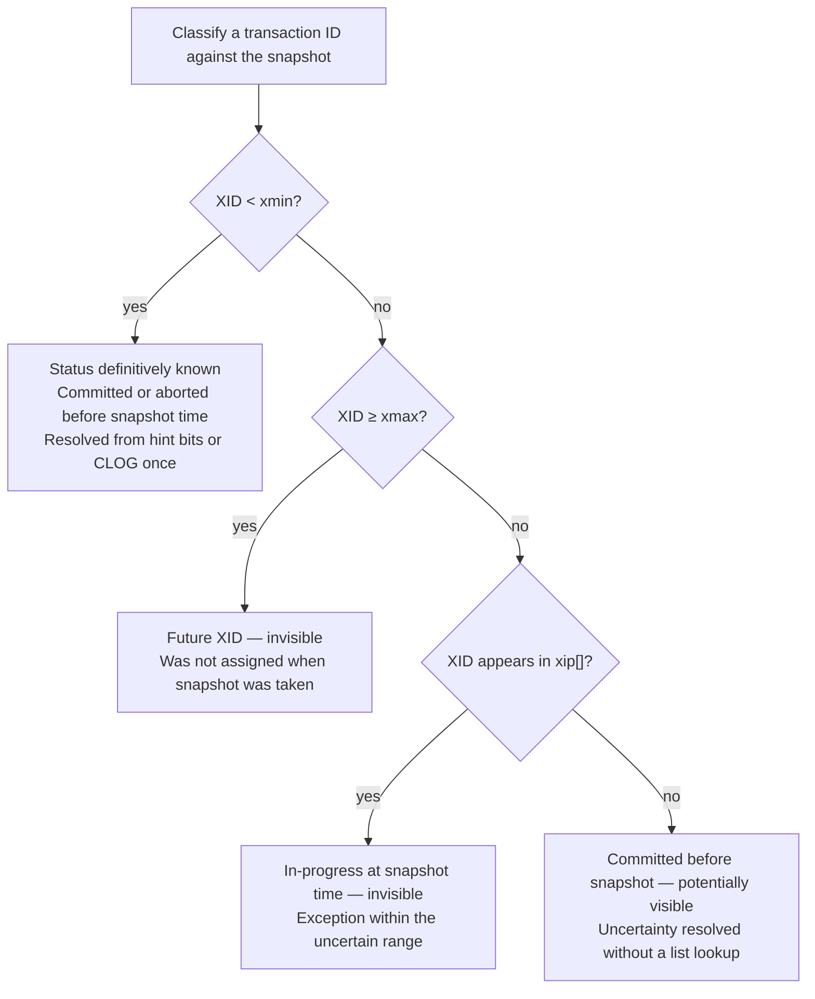
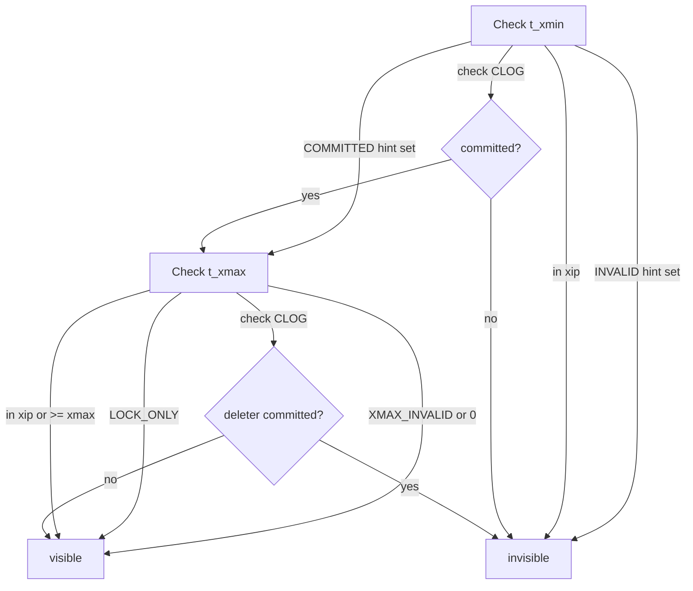

# MVCC and Transaction Visibility

PostgreSQL implements multiversion concurrency control (MVCC): readers never block writers and writers never block readers. Instead of locking rows for reads, each transaction gets a *snapshot* — a consistent point-in-time view of which transactions have committed. Multiple versions of a row can coexist on disk simultaneously; each version is visible only to transactions whose snapshot says the inserting transaction committed and the deleting transaction had not.

## Snapshots

A snapshot (`SnapshotData`, `src/include/utils/snapshot.h`) captures the state of running transactions at the moment it is taken. The key fields:

| Field | Purpose |
|---|---|
| `xmin` | All transactions with XID < xmin are either committed or aborted — their effect is definitively known |
| `xmax` | All transactions with XID ≥ xmax were not yet assigned when the snapshot was taken |
| `xip[]` | Array of XIDs in the range [xmin, xmax) that were still in progress when the snapshot was taken |
| `xcnt` | Length of `xip[]` |
| `subxip[]` | Subtransaction XIDs in progress |
| `curcid` | Command ID cutoff — within the current transaction, only commands before this ID are visible |



`xmin` and `xmax` together bound the "uncertain" range. Any XID outside [xmin, xmax) has a known status without consulting the active-transaction list. XIDs in `xip[]` are exceptions within the range: they were still running at snapshot time.

## Building a Consistent Snapshot

A snapshot must be internally consistent: it cannot reflect a commit that happened after the snapshot was taken, nor miss a commit that happened before. `GetSnapshotData()` (`procarray.c`) achieves this with a single shared `ProcArrayLock`. It holds the lock for the entire scan of the `PGPROC` array — the shared structure where each backend records its current transaction ID — so that no transaction can commit between reading `latestCompletedXid` and enumerating active backends. The result is a coherent instant in transaction history rather than a smeared observation.

Within that critical section, `GetSnapshotData()` sets `xmax` to `latestCompletedXid + 1`, giving the next XID that will be assigned. It reads every active backend's XID. Backends still in progress lower `xmin` and get added to `xip[]`, along with their subtransaction XIDs in `subxip[]`. Setting `MyProc->xmin` to the snapshot's `xmin` is an equally important side effect: it pins the snapshot in place for VACUUM. VACUUM must not reclaim row versions that any live snapshot still needs.

Several implementation details guard against subtle races. `GetSnapshotData()` fetches each slot with a single `UINT32_ACCESS_ONCE` read from the flat `ProcGlobal->xids[]` array rather than through pointer chasing, avoiding torn reads. It excludes backends running lazy VACUUM or logical decoding from `xip[]`, because they manage their own `xmin` pinning separately. When any backend's subtransaction cache overflows, it sets `snapshot->suboverflowed`. The visibility check must then fall back to a slower per-backend lookup rather than relying on `subxip[]`.

The executor obtains a snapshot before each query through `GetTransactionSnapshot()` (`snapmgr.c`). For `READ COMMITTED`, it constructs a fresh snapshot on every call, so each statement sees all transactions that committed before it began. For `REPEATABLE READ` and `SERIALIZABLE`, it constructs the snapshot once on the first statement of the transaction, then returns it unchanged for all subsequent calls. `IsolationUsesXactSnapshot()` controls this branching. PostgreSQL stores the chosen snapshot in `EState.es_snapshot` (`execMain.c`), and it flows to every visibility check during that query. Internal catalog lookups that must always see the very latest state call `GetLatestSnapshot()` instead, which bypasses the isolation-level guard and always builds a fresh snapshot.

## Isolation levels and snapshot timing

PostgreSQL maps SQL isolation levels onto two snapshot regimes:

| Isolation level | Snapshot taken | Snapshot reused |
|---|---|---|
| `READ COMMITTED` | once per statement | no — fresh `GetSnapshotData()` each time |
| `REPEATABLE READ` | first statement of transaction | yes — `CurrentSnapshot` frozen for the transaction |
| `SERIALIZABLE` | first statement of transaction | yes — additionally tracked by `predicate.c` for SSI |

`READ UNCOMMITTED` is accepted by the parser but behaves identically to `READ COMMITTED` — PostgreSQL never exposes dirty (uncommitted) data regardless.

The practical effect: under `READ COMMITTED`, a long-running query in the same transaction will see rows committed by other transactions between statements but not between rows in a single sequential scan. Under `REPEATABLE READ`, the snapshot is frozen at transaction start, so all queries in the transaction see a consistent point-in-time view even if other transactions commit concurrently.

## Tuple visibility

For every heap tuple encountered during a scan, PostgreSQL must decide whether that tuple belongs to the current snapshot (`HeapTupleSatisfiesMVCC()`, `heapam_visibility.c`). Two independent questions govern this: did the row's insertion commit before the snapshot was taken, and if so, did its deletion also commit before the snapshot was taken? A row is visible only when the answer to the first is yes and the second is no.

The insert side examines `t_xmin` — the XID of the transaction that created this tuple version. If the `HEAP_XMIN_COMMITTED` [[subsystems/transactions/hint-bits|hint bit]] is already set, the inserter is known committed and this half of the check passes immediately. Otherwise the tuple is invisible if the inserter aborted (`HEAP_XMIN_INVALID`), if the inserter is the current transaction but ran a later command than `curcid`, or if the inserter's XID appears in `xip[]` (meaning it was in flight when the snapshot was taken). If none of those conditions apply, PostgreSQL consults the commit log ([[subsystems/storage/clog|CLOG]]) and caches the result as a hint bit so future scans skip this work.

The delete side then examines `t_xmax` — the XID of any transaction that deleted or updated this tuple version. A zero or `HEAP_XMAX_INVALID` value means no deletion occurred and the tuple is visible. A `HEAP_XMAX_LOCK_ONLY` flag means the XID represents a row lock rather than a delete, so the tuple remains visible. If `t_xmax` belongs to the current transaction, the row disappears only if the delete command ran before `curcid`. If the deleter's XID is in `xip[]`, or is at or beyond `snapshot->xmax`, the deletion had not committed at snapshot time, and the row is still visible. Otherwise PostgreSQL consults CLOG. If the deleter committed, the tuple is invisible; if not, it remains visible.

One subtlety arises when `HEAP_XMAX_COMMITTED` is already set as a hint: a concurrent backend with a newer snapshot may have written that hint, but from the current snapshot's perspective the deletion may not yet be visible. The visibility check therefore runs `XidInMVCCSnapshot()` even when the hint is set, ensuring that the hint does not override the snapshot boundary.

`XidInMVCCSnapshot()` binary-searches `snapshot->xip[]` for the XID, or scans `subxip[]` when the subxid cache overflowed and a direct `PGPROC` check is needed. The check deliberately avoids calling `TransactionIdIsInProgress()`, which would acquire `ProcArrayLock` and introduce contention; relying solely on the already-captured snapshot data is sufficient.



## Hint bits

The four visibility-related bits in `t_infomask` (`src/include/access/htup_details.h`):

| Bit constant | Hex | Meaning |
|---|---|---|
| `HEAP_XMIN_COMMITTED` | `0x0100` | inserting XID is known committed |
| `HEAP_XMIN_INVALID` | `0x0200` | inserting XID aborted or crashed |
| `HEAP_XMAX_COMMITTED` | `0x0400` | deleting XID is known committed |
| `HEAP_XMAX_INVALID` | `0x0800` | deleting XID aborted, or no valid xmax |

When both `HEAP_XMIN_COMMITTED` and `HEAP_XMIN_INVALID` are set simultaneously, the tuple is *frozen* — visible to all snapshots regardless of XID age (`HEAP_XMIN_FROZEN = 0x0300`).

Hint bits trade a one-time CLOG lookup for a permanent two-bit annotation on the tuple, so that every subsequent scan reads the transaction outcome directly from the tuple header without touching shared memory. For a hot table scanned repeatedly, the first post-commit scan pays the CLOG cost and sets the hint; every scan thereafter reads two bits and moves on.

Setting a hint bit modifies a shared buffer page, so PostgreSQL must mark the page dirty (`MarkBufferDirtyHint(buffer, true)`). A commit hint carries an additional constraint: it must not be written until the transaction's WAL commit record has been flushed to disk, because otherwise a crash could leave a page on disk whose hint bit claims a transaction committed when the WAL says otherwise. The check compares `BufferGetLSNAtomic(buffer)` against the transaction's commit LSN and withholds the hint if the WAL flush has not yet occurred. Abort hints carry no such restriction — the absence of a commit record in WAL is itself sufficient proof of abort. When `wal_level >= replica` and the page has not received a full-page image since the last checkpoint, the buffer manager emits an `XLOG_FPI_FOR_HINT` WAL record at page-flush time, ensuring that crash recovery leaves page and CLOG in agreement. This happens at most once per page per checkpoint cycle, making the overhead negligible.

## Commit log (CLOG)

The commit log (`src/backend/access/transam/clog.c`) stores 2 bits per transaction ID indicating its status:

| Status | Bits | Meaning |
|---|---|---|
| `IN_PROGRESS` | 00 | Transaction is running |
| `COMMITTED` | 01 | Transaction committed |
| `ABORTED` | 10 | Transaction rolled back |
| `SUB_COMMITTED` | 11 | Subtransaction committed (parent not yet determined) |

CLOG is organised as a SLRU (simple LRU) page cache over files in `pg_xact/`. Each 8KB page holds 32,768 transaction statuses. Active pages are cached in shared memory; older pages are on disk. VACUUM truncates old CLOG pages once all transactions in the range are old enough to be frozen.

`TransactionIdGetStatus()` (`clog.c`) computes the page number, byte offset, and bit shift directly from the XID, then reads the status from the SLRU cache. When the status is `SUB_COMMITTED`, CLOG alone cannot determine the outcome — PostgreSQL must resolve the parent transaction. `TransactionIdDidCommit()` (`transam.c`) handles this by following the subtransaction chain through `SubTransGetParent()`, which reads `pg_subtrans` to walk up to a top-level committed or aborted status. `TransactionIdDidAbort()` applies the same chain-following logic.

## Committing and aborting

Committing a transaction must satisfy two goals simultaneously: durability (the outcome survives a crash) and visibility (other transactions see the commit only after it is complete and durable). These goals impose a strict ordering on what must happen and when (`CommitTransaction()`, `xact.c`).

Deferred triggers fire and cursors close first, while the transaction is still fully active. Then PostgreSQL writes a commit WAL record and flushes it to disk. For synchronous commit, the acknowledgment to the client waits until this flush completes. PostgreSQL then marks the XID, along with all its subtransaction XIDs, `COMMITTED` in CLOG. Only after that durable record exists does `ProcArrayEndTransaction()` clear the XID from `PGPROC.xid`, making the transaction invisible to any snapshot taken after this point. PostgreSQL then broadcasts cache-invalidation messages to other backends and releases buffers, locks, and local memory.

Aborting follows a structurally similar sequence but with a different durability obligation (`AbortTransaction()`, `xact.c`). After PostgreSQL emergency-releases any held spinlocks and [[subsystems/locking/lwlocks|LWLocks]], it writes an abort WAL record and marks the XID `ABORTED` in CLOG. Unlike commit, this WAL write does not require a synchronous flush: a crash that prevents the abort record from reaching disk leaves the transaction in an `IN_PROGRESS` state on the CLOG page. But the absence of a commit record in WAL is itself the definitive indicator of abort during recovery. `ProcArrayEndTransaction()` then clears the XID, and PostgreSQL releases resources.

The asymmetry between commit and abort — commit requires durable WAL before acknowledging success, abort does not — is fundamental to the durability guarantee. A committed transaction's outcome survives any subsequent crash; an aborted transaction leaves no lasting effect regardless of what made it to disk.

```mermaid
sequenceDiagram
    participant T as Committing backend
    participant WAL
    participant CL as pg_xact
    participant PA as ProcArray
    participant OB as Other backends

    Note over T: Deferred triggers fire; cursors close
    T->>WAL: Write XLOG_XACT_COMMIT (includes sub-XIDs)
    WAL-->>T: fsync() complete
    Note over T: Client acknowledgment sent here (synchronous_commit = on)
    T->>CL: TransactionIdSetTreeStatus() — mark XID COMMITTED in pg_xact
    T->>PA: ProcArrayEndTransaction() — clear XID from PGPROC
    Note over OB: Snapshots taken after this point will not see this XID as in-progress
    T->>OB: SendSharedInvalidMessages() — cache invalidation broadcast
    T->>T: Release locks, release buffers, free memory contexts
```

## Subtransactions

PostgreSQL assigns subtransactions (savepoints) their own XIDs in the same XID space. This lets it isolate their effects and selectively roll them back without aborting the parent transaction. During commit, PostgreSQL marks all subtransaction XIDs `COMMITTED` in CLOG before it marks the top-level XID committed. This ordering ensures that a crash between the two cannot leave subtransaction XIDs in an ambiguous state. During rollback to a savepoint, PostgreSQL marks only the subtransaction's XIDs `ABORTED`; the parent transaction continues unaffected.

`pg_subtrans` maps subtransaction XIDs to their parent XIDs, allowing `TransactionIdDidCommit()` to follow the chain when it encounters a `SUB_COMMITTED` status.

## Transaction ID wraparound

XIDs are 32-bit unsigned integers. After about 2 billion transactions, XIDs wrap around. PostgreSQL uses a convention that the 2^31 XIDs "before" a given XID are visible and the 2^31 "after" are in the future. VACUUM freezes old tuples by replacing their `t_xmin` with a special `FrozenTransactionId` that is visible to all snapshots, preventing the tuple from becoming invisible after wraparound. The `vacuum_freeze_min_age` and `autovacuum_freeze_max_age` GUCs control when freezing happens.

## See also

- [[subsystems/storage/heap]] — the tuple header fields (t_xmin, t_xmax, hint bits) that visibility reads
- [[subsystems/wal/overview]] — how commit records in WAL relate to CLOG updates
- [[architecture/overview]] — MVCC and isolation levels in the broader architecture
