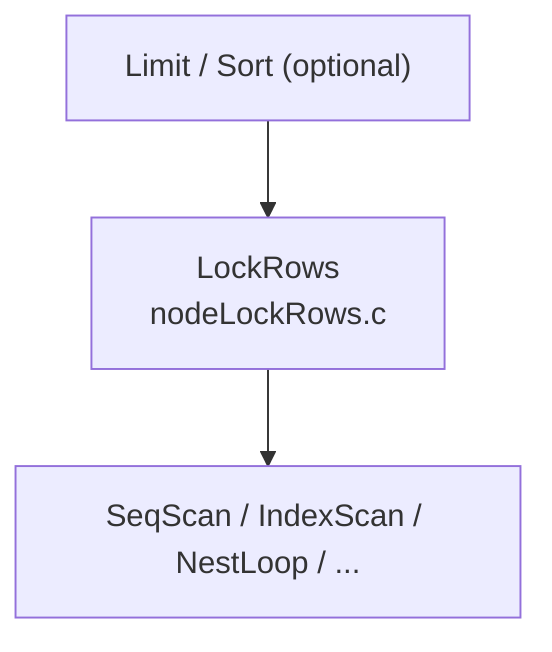
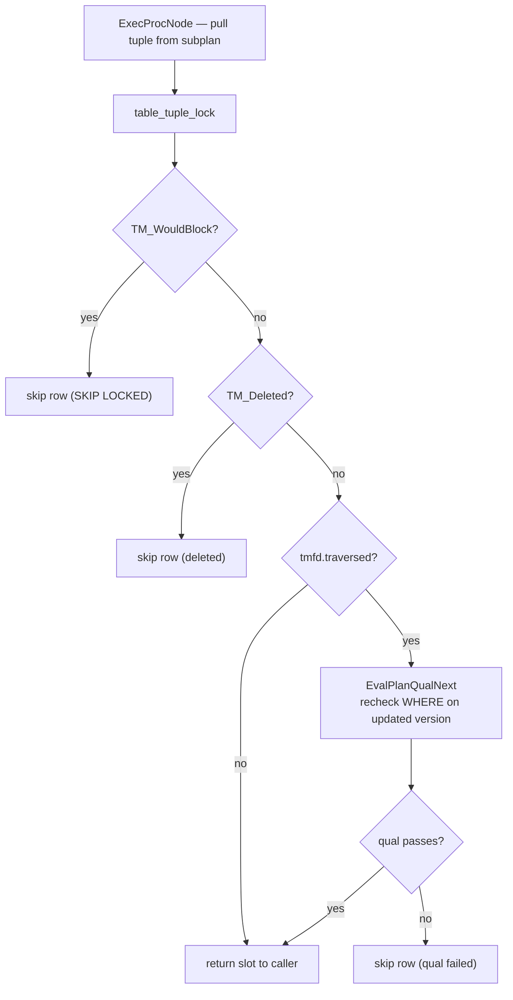

`SELECT ... FOR UPDATE` and its weaker variants let a transaction acquire row-level locks at read time, before deciding whether to modify the locked rows. The canonical use is a read-modify-write cycle: read a row, compute a new value, write it back — without risking a lost update from a concurrent transaction that ran the same cycle in parallel.

## The Four Lock Strengths

PostgreSQL exposes four locking strengths ordered from weakest to strongest. Each maps to a `LockTupleMode` value defined in `src/include/nodes/lockoptions.h` and a corresponding `LockClauseStrength` used during parsing:

| SQL clause | `LockTupleMode` | Prevents |
|---|---|---|
| `FOR KEY SHARE` | `LockTupleKeyShare` | Key column changes and DELETE |
| `FOR SHARE` | `LockTupleShare` | Any modification of the row |
| `FOR NO KEY UPDATE` | `LockTupleNoKeyExclusive` | Any modification; allows concurrent FK child inserts |
| `FOR UPDATE` | `LockTupleExclusive` | All concurrent modifications including FK child inserts |

The ordering is meaningful beyond documentation: when the same base relation appears under multiple locking clauses (through view expansion or subquery pushdown), `applyLockingClause()` always keeps the strongest mode seen.

### Compatibility Matrix

The conflict rules between the four modes — and the tuple-header mechanics that implement them (`HEAP_XMAX_KEYSHR_LOCK`, `HEAP_XMAX_EXCL_LOCK`, the `HEAP_KEYS_UPDATED` bit, and the automatic `LockTupleNoKeyExclusive`/`LockTupleExclusive` downgrade `heap_update()` performs based on which columns actually changed) — are covered in [[subsystems/locking/row-level-locking|Row-Level Locking]]. In short: `FOR KEY SHARE` conflicts only with `FOR UPDATE`; `FOR NO KEY UPDATE` and `FOR SHARE` conflict with each other and with `FOR UPDATE`; `FOR UPDATE` conflicts with everything. This asymmetry is what lets FK-checking `FOR KEY SHARE` locks coexist with a concurrent `FOR NO KEY UPDATE` (or an ordinary non-key `UPDATE`) on the same parent row.

## Syntax

```sql
SELECT ... FOR { UPDATE | NO KEY UPDATE | SHARE | KEY SHARE }
    [ OF table_name [, ...] ]
    [ NOWAIT | SKIP LOCKED ]
```

In a multi-table join, `OF table_name` restricts locking to rows from the named table only. Without it, every reachable base relation in the query's range table acquires the same lock mode. `transformLockingClause()` in `src/backend/parser/analyze.c` propagates the lock mode into subqueries automatically, descending into `RTE_SUBQUERY` entries.

`NOWAIT` and `SKIP LOCKED` are wait-policy options encoded as `LockWaitPolicy` values:

| Option | `LockWaitPolicy` | Behaviour on contention |
|---|---|---|
| *(default)* | `LockWaitBlock` | Wait until the conflicting lock is released |
| `SKIP LOCKED` | `LockWaitSkip` | Silently omit the row from the result |
| `NOWAIT` | `LockWaitError` | Raise an error immediately |

## From Parse to Plan: The LockRows Node

The parser attaches `LockingClause` nodes to the `Query`. During planning, each locked base relation gets a `PlanRowMark` entry. The planner wraps the scan/join plan in a `LockRows` node (`src/backend/optimizer/plan/createplan.c`).

The `LockRows` node sits above the scan/join tree and below any `Sort` or `Limit` node, so it locks rows one by one as they stream upward through the plan — it does not pre-lock them before query execution begins.



Each `PlanRowMark` carries a `markType` that maps directly to the SQL clause:

| `RowMarkType` | SQL clause |
|---|---|
| `ROW_MARK_EXCLUSIVE` | `FOR UPDATE` |
| `ROW_MARK_NOKEYEXCLUSIVE` | `FOR NO KEY UPDATE` |
| `ROW_MARK_SHARE` | `FOR SHARE` |
| `ROW_MARK_KEYSHARE` | `FOR KEY SHARE` |
| `ROW_MARK_REFERENCE` | join-only table (fetch ctid, do not lock) |
| `ROW_MARK_COPY` | non-lockable RTE (function, VALUES) |

Only `markType` values at or below `ROW_MARK_KEYSHARE` require an actual `heap_lock_tuple` call — checked by the macro `RowMarkRequiresRowShareLock()`. Tables joined purely for filtering get a `ROW_MARK_REFERENCE` entry, and PostgreSQL tracks their ctid for EvalPlanQual purposes without any locking overhead.

The executor augments each `PlanRowMark` into an `ExecRowMark`, which pairs the mark with an open `Relation` and the junk-attribute slot numbers for `ctid` and `tableoid`. The scan node below `LockRows` must project these junk attributes as hidden output columns so `ExecLockRows` can locate the physical tuple.

Opening a relation for `SELECT FOR UPDATE` acquires `RowShareLock` at the table level (set in `rte->rellockmode` by the rewriter), which conflicts with `AccessExclusiveLock` from `ALTER TABLE` but not with `RowExclusiveLock` from concurrent `INSERT`/`UPDATE`/`DELETE`.

## Acquiring the Lock: heap_lock_tuple

`ExecLockRows()` in `src/backend/executor/nodeLockRows.c` pulls each tuple from the subplan and calls `table_tuple_lock()`, which for heap tables dispatches to `heap_lock_tuple()` in `src/backend/access/heap/heapam.c`.

### Two-Level Locking

Tuple locks cannot live entirely in shared memory because a transaction might lock arbitrarily many rows. PostgreSQL uses a two-level scheme — a tuple-header infomask write plus a transient heavyweight lock used only for queue ordering, with concurrent compatible lockers folded into a `MultiXactId` when more than one XID needs to occupy `t_xmax`. [[subsystems/locking/row-level-locking|Row-Level Locking]] has the full infomask bit reference, the `tupleLockExtraInfo[]` mapping from `LockTupleMode` to heavyweight `LOCKMODE`, and the MultiXact member layout.

The heavyweight lock is held only transiently: `LockTuple()` → `XactLockTableWait()` → write infomask → `UnlockTuple()`. Once the infomask is updated, the lock's state lives entirely in the tuple header and MultiXact, not in the lock manager's memory — which is what lets `ExecLockRows` process arbitrarily many rows per transaction without exhausting shared memory.

## The EvalPlanQual Retry Loop

`SELECT FOR UPDATE` follows MVCC snapshot semantics for visibility: a tuple must first be visible under the query's snapshot before the executor attempts to lock it. Between visibility check and lock acquisition, another transaction may have committed a modification to that same tuple. This "read-then-lock race" is resolved by EvalPlanQual (EPQ).

When `table_tuple_lock` follows an update chain and sets `TM_FailureData.traversed = true` on return, `ExecLockRows` knows the locked physical version differs from the version the scan originally returned. It then:

1. Loads the locked (newer) tuple version into an EPQ slot via `EvalPlanQualSlot()`.
2. Re-executes the entire WHERE clause of the original query against that newer version via `EvalPlanQualNext()`.
3. If the WHERE clause no longer matches — the row was updated out of the result set — the row is silently dropped (`goto lnext`).
4. If it still matches, the updated version is returned to the caller.



`TUPLE_LOCK_FLAG_FIND_LAST_VERSION` controls whether `heap_lock_tuple` follows update chains at all. In `READ COMMITTED` isolation (`!IsolationUsesXactSnapshot()`), `ExecLockRows` sets this flag so the executor always ends up locking the head of the update chain. In `REPEATABLE READ` and `SERIALIZABLE`, `ExecLockRows` clears the flag. If the target tuple has been updated by a committed transaction, `table_tuple_lock` returns `TM_Updated`, and the executor raises a serialization failure error.

The EPQ infrastructure (`EPQState`, `EvalPlanQualBegin`, `EvalPlanQualEnd`) is initialised once per `LockRows` node at `ExecInitLockRows` time. The actual re-evaluation machinery is only activated when `traversed` is true, so queries where no concurrent modifications occur incur no EPQ overhead.

## SKIP LOCKED

`SKIP LOCKED` (`LockWaitSkip`) makes `heap_lock_tuple` use conditional wait calls (`ConditionalXactLockTableWait`, `ConditionalMultiXactIdWait`) instead of blocking. If the lock is not immediately available, `heap_lock_tuple` returns `TM_WouldBlock`, and `ExecLockRows` handles this with a simple `goto lnext`, omitting the row from the result set entirely — it does not appear as NULL, it simply does not appear.

`SKIP LOCKED` still runs the EPQ recheck on rows that were modified (not just locked) by a concurrent transaction. Skipping applies only when the row cannot be locked immediately. See [[subsystems/locking/row-locking-patterns|Row Locking Patterns]] for the job-queue dequeue pattern and other usage guidance.

## NOWAIT

`NOWAIT` (`LockWaitError`) uses the same conditional wait calls as `SKIP LOCKED`, but on failure raises `ERROR: could not obtain lock on row in relation "..."` (`SQLSTATE 55P03`) and aborts the transaction instead of skipping the row. See [[subsystems/locking/row-locking-patterns|Row Locking Patterns]] for when to reach for `NOWAIT` versus `SKIP LOCKED` versus a retry loop.

## Interaction with Foreign Keys

`FOR KEY SHARE` was designed to accelerate FK enforcement. When a referencing-table row is inserted or updated, the RI trigger (`RI_FKey_check` in `src/backend/utils/adt/ri_triggers.c`) runs a query like:

```sql
SELECT 1 FROM parent_table x
WHERE x.pk = $1
FOR KEY SHARE OF x
```

This acquires just enough lock to prevent the parent key from being deleted or changed, without conflicting with `FOR NO KEY UPDATE` locks held by transactions updating non-key columns of the same parent row. Before `FOR KEY SHARE` was introduced (PostgreSQL 9.3), FK checks used `FOR SHARE`, which blocked all concurrent writers to the parent row — a significant bottleneck for workloads with FK-heavy schemas under write concurrency.

## Interaction with MVCC and Snapshots

`FOR UPDATE` does not bypass MVCC. A row must first be visible under the executor's snapshot before any lock attempt is made. This has several non-obvious consequences:

- A row deleted by a committed transaction before the query snapshot was taken is invisible and will never be locked, even if another session is about to re-insert the same key value.
- A row inserted by a concurrent uncommitted transaction is invisible to the locking session; they will not contend.
- EPQ guarantees that when a row was modified between snapshot time and lock acquisition, the session operates on the latest committed version — the one that will be visible after the current transaction commits.

The table-level lock (`RowShareLock`) acquired at query open time does not prevent concurrent `INSERT`, `UPDATE`, or `DELETE` from proceeding; it only prevents `DROP TABLE`, `TRUNCATE`, and other `AccessExclusiveLock` operations during the query.

## CTEs and FOR UPDATE

`transformLockingClause()` descends into `RTE_SUBQUERY` entries to push lock modes down into inlined subqueries. CTE RTEs, however, fall into the `default: /* ignore JOIN, SPECIAL, FUNCTION, VALUES, CTE RTEs */` branch and are silently skipped. Attaching `FOR UPDATE` to a query that reads from a non-inlined CTE produces no lock on the CTE's underlying tables.

A plain (read-only) CTE that is referenced exactly once and contains no volatility barriers is typically inlined by the planner, after which its tables become reachable and `FOR UPDATE` propagates normally. A data-modifying CTE is never inlined; `FOR UPDATE` on the outer query does not propagate into it.

`FOR UPDATE/SHARE` is not permitted in a recursive (`WITH RECURSIVE`) query at all; the parser raises an error at parse time (`parse_cte.c`).

## Advisory Locks as an Alternative

When the locked resource is a logical concept — a queue slot, a job identifier, a tenant — rather than a specific table row, `pg_advisory_xact_lock()` and `pg_advisory_lock()` are lighter. They live entirely in the lock manager with no heap access, no WAL infomask writes, and no MultiXact involvement.

```sql
-- Lock a logical resource keyed by integer
SELECT pg_advisory_xact_lock(job_id)
FROM jobs
WHERE status = 'pending'
ORDER BY id
LIMIT 1;
```

Transaction-scoped advisory locks (`pg_advisory_xact_lock`) are released automatically at commit or rollback. Session-scoped locks (`pg_advisory_lock`) persist until explicitly released or the session ends. Neither integrates with EPQ or FK enforcement; they are entirely application-defined semantics.

Advisory locks scale better than row locks for producer-consumer queues because they avoid the per-row heavyweight lock acquisition, infomask write, WAL record, and potential MultiXact creation that `heap_lock_tuple` incurs.

## Observability

Tuple-level locks leave traces in two places:

- While the heavyweight lock is briefly held during acquisition, it appears in `pg_locks` with `locktype = 'tuple'`. The lock is released immediately after the infomask is written, so it is rarely visible in practice.
- The locking transaction's XID appears in the tuple's `t_xmax` (readable via the `pageinspect` extension), with `HEAP_XMAX_LOCK_ONLY` set. This persists until the row is vacuumed or updated.

VACUUM treats a `HEAP_XMAX_LOCK_ONLY` tuple as live (not dead) — the lock does not constitute a deletion. After the locking transaction commits or rolls back, the tuple's `t_xmax` remains but is treated as invalid for visibility purposes.

## Performance Notes

In a join query, only rows from tables with an explicit `FOR UPDATE` (or equivalent) clause incur `heap_lock_tuple` calls — tables joined purely for filtering (`ROW_MARK_REFERENCE`) add no locking overhead. For WAL amplification from lock-only workloads, MultiXact I/O under concurrent lockers, and lock-manager contention at high concurrency, see [[subsystems/locking/row-locking-patterns|Row Locking Patterns]].

## Related Topics

- [[subsystems/locking/row-level-locking|Row-Level Locking]] — covers the full locking model that SELECT FOR UPDATE participates in, including tuple lock modes and infomask encoding.
- [[subsystems/locking/row-locking-patterns|Row Locking Patterns]] — practical patterns for using FOR UPDATE, SKIP LOCKED, and advisory locks in application code.
- [[subsystems/transactions/mvcc|MVCC]] — explains the snapshot visibility rules that govern which rows are eligible for locking before heap_lock_tuple is called.
- [[subsystems/transactions/snapshot|Snapshot]] — details how query snapshots are taken and how they interact with the read-then-lock race resolved by EvalPlanQual.
- [[subsystems/transactions/multixact|MultiXact]] — describes the MultiXactId mechanism used when multiple transactions hold compatible tuple locks simultaneously.
- [[subsystems/locking/deadlock|Deadlock Detection]] — explains how the deadlock detector resolves cycles that can arise when multiple sessions race to acquire row locks.
- [[subsystems/locking/advisory-locks|Advisory Locks]] — covers pg_advisory_xact_lock and related functions, the lighter alternative to row locking for logical resources.
