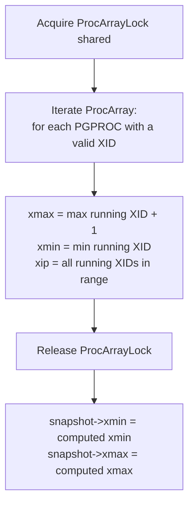
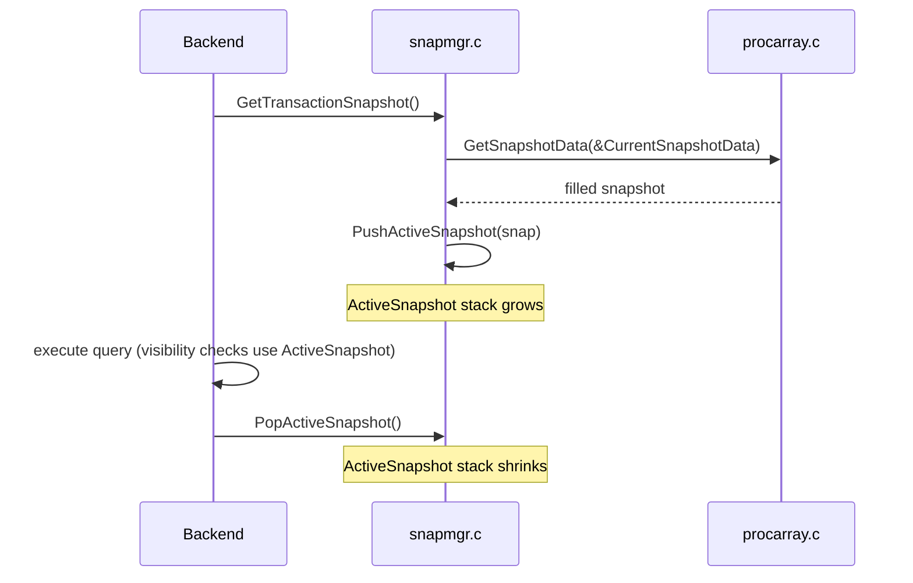

# Snapshot Mechanics

A snapshot is an immutable description of which transactions were in-flight at a specific moment. Every visibility check in the heap compares a tuple's `t_xmin` / `t_xmax` against a snapshot to decide whether that tuple is visible to the current query. Snapshots are the concrete mechanism behind PostgreSQL's MVCC model.

## SnapshotData struct

```c
/* src/include/utils/snapshot.h */
typedef struct SnapshotData
{
    SnapshotType snapshot_type;  /* MVCC, SELF, ANY, TOAST, … */

    TransactionId xmin;          /* oldest xid still active at snapshot time */
    TransactionId xmax;          /* first xid not yet assigned at snapshot time */
    TransactionId *xip;          /* array of in-progress xids in [xmin, xmax) */
    uint32        xcnt;          /* length of xip */

    /* For sub-xids (subtransaction support) */
    TransactionId *subxip;
    int32         subxcnt;
    bool          suboverflowed; /* true if subxip was truncated */

    bool          takenDuringRecovery;
    bool          copied;        /* true if this is a long-lived registered copy */

    CommandId     curcid;        /* current command ID within this transaction */
    uint32        speculativeToken;

    uint32        active_count;  /* number of active PushActiveSnapshot calls */
    uint32        regd_count;    /* number of RegisterSnapshot calls */
    pairingheap_node ph_node;   /* in SnapshotResetXmin heap */

    TimestampTz   whenTaken;     /* timestamp when taken (for snapshot too old) */
    XLogRecPtr    lsn;           /* WAL position when taken (for snapshot too old) */
} SnapshotData;
```

Key fields:

| Field | Meaning |
|---|---|
| `xmin` | Any XID < xmin is committed and visible (or aborted and invisible). Used as the floor for visibility checks. |
| `xmax` | Any XID ≥ xmax had not yet been assigned when the snapshot was taken; those tuples are always invisible. |
| `xip[xcnt]` | XIDs of transactions that were running inside `[xmin, xmax)`. Tuples with `t_xmin` in this array are invisible (in-progress at snapshot time). |
| `curcid` | For statement-level visibility within the same transaction: tuples inserted by earlier commands in the same transaction are visible; tuples from the current command are not. |

## Snapshot types

| `SnapshotType` | Visibility rule | Typical use |
|---|---|---|
| `SNAPSHOT_MVCC` | Standard MVCC: committed tuples whose XID precedes snapshot `xmin` and is not in `xip` | Normal SELECT |
| `SNAPSHOT_SELF` | Also sees tuples inserted by the current transaction (even if not yet committed) | `RETURNING`, triggers |
| `SNAPSHOT_ANY` | Sees all tuples regardless of visibility | Vacuum, logical decoding |
| `SNAPSHOT_TOAST` | Like MVCC but applies to [[subsystems/storage/toast|TOAST]] tables | TOAST detoasting |
| `SNAPSHOT_DIRTY` | Sees latest committed or in-progress version of each row | `SELECT FOR UPDATE` pre-check |
| `SNAPSHOT_HISTORIC_MVCC` | MVCC snapshot at a past LSN | Logical decoding, time-travel |
| `SNAPSHOT_NON_VACUUMABLE` | Sees all non-dead tuples | Catalog access during vacuum |

## GetSnapshotData: the hot path

`GetSnapshotData()` (`src/backend/storage/ipc/procarray.c`) is one of the hottest functions in the system — it is called at the start of every statement that needs MVCC visibility. Its job is to read the active transaction list from shared memory and populate `xmin`, `xmax`, and `xip`.



Every backend that needs a new MVCC snapshot acquires `ProcArrayLock` in shared mode. This lock must be held exclusively during `ProcArrayAdd` (new backend starts) and `ProcArrayEndTransaction` (commit/abort removes XID). At high connection counts, contention on this lock is the primary scalability bottleneck for OLTP workloads with many short transactions. PostgreSQL mitigates this with the **snapshot scalability** optimization (PG 14+): if `xmin`, `xmax`, and `xip` haven't changed since the last call, `GetSnapshotData` returns a cached result without taking the lock.

### Sub-transaction XIDs

Each transaction's `PGPROC` can hold up to `PGPROC_MAX_CACHED_SUBXIDS` (64) sub-transaction XIDs in a fast-path array. If a transaction has more than 64 subtransactions, PostgreSQL sets its overflow flag, and `GetSnapshotData` sets `snapshot->suboverflowed = true`. Visibility checks against an overflowed snapshot must fall back to checking `pg_subtrans`.

## Snapshot lifecycle



### Per-statement vs. per-transaction snapshot acquisition

`GetTransactionSnapshot()` (`snapmgr.c`) is the entry point for queries:

- For `READ COMMITTED`: calls `GetSnapshotData` on every statement to get a fresh snapshot. Each statement sees committed changes from other transactions.
- For `REPEATABLE READ` and `SERIALIZABLE`: takes the snapshot on the first query of the transaction and reuses it for all subsequent statements. `FirstSnapshotSet` is the guard flag.

### PushActiveSnapshot / PopActiveSnapshot

A stack of snapshots (`ActiveSnapshot`) allows nested query execution (e.g., in triggers or SPI calls) each with its own snapshot. `PushActiveSnapshot` increments `active_count` and links the snapshot onto `ActiveSnapshotElt` stack. `PopActiveSnapshot` pops it; when both `active_count` and `regd_count` drop to zero, PostgreSQL frees the snapshot memory.

### RegisterSnapshot / UnregisterSnapshot

Cursors and other long-lived operations use `RegisterSnapshot` to copy the snapshot into `TopTransactionContext` and bump `regd_count`. This prevents PostgreSQL from freeing the snapshot when it pops it off the active stack. `UnregisterSnapshot` decrements the count and frees when it reaches zero.

## Visibility check: HeapTupleSatisfiesMVCC

The actual visibility logic is in `HeapTupleSatisfiesMVCC()` (`src/backend/access/heap/heapam_visibility.c`):

```
given tuple (t_xmin, t_xmax, t_infomask) and snapshot:

if t_xmin is not committed:
    if t_xmin == current transaction XID → visible (own insert)
    else → invisible (inserter aborted or still running)

if committed(t_xmin) and t_xmin >= snapshot.xmax → invisible (inserted after snapshot)
if committed(t_xmin) and t_xmin in snapshot.xip → invisible (inserter was in-progress)

# tuple is inserted-and-visible; now check deletion:
if t_xmax == InvalidXID → visible (not deleted)
if t_xmax is not committed → visible (deleter aborted or still running)
if committed(t_xmax) and t_xmax >= snapshot.xmax → visible (deleted after snapshot)
if committed(t_xmax) and t_xmax in snapshot.xip → visible (deleter was in-progress)
→ invisible (deleted before snapshot)
```

### Hint bits shortcut

The commit/abort status is not stored in the tuple itself — it lives in `pg_xact` (CLOG). Reading CLOG on every visibility check would be prohibitively expensive. Instead, PostgreSQL uses **hint bits** (`HEAP_XMIN_COMMITTED`, `HEAP_XMIN_INVALID`, `HEAP_XMAX_COMMITTED`, `HEAP_XMAX_INVALID`) in `t_infomask`. The first backend to confirm a tuple's XID status writes the appropriate hint bit and marks the page dirty. Subsequent checks read the in-memory bit without touching CLOG.

See [[subsystems/transactions/hint-bits]] for the full protocol.

## Catalog snapshots

System catalog scans use a separate snapshot (`CatalogSnapshot`) obtained via `GetCatalogSnapshot()`. PostgreSQL invalidates the catalog snapshot whenever it processes a catalog cache invalidation message (DDL or `CommandCounterIncrement`), so it always refreshes the snapshot before the next catalog scan. This prevents a long-running query from seeing stale catalog data after a DDL operation in another session.

## Snapshot too old (`old_snapshot_threshold`)

When `old_snapshot_threshold` is set (default: `-1` = disabled), PostgreSQL tracks the oldest snapshot in use via a min-heap ordered by `whenTaken`. Vacuum may aggressively reclaim tuples if the deleting transaction committed more than `old_snapshot_threshold` minutes before the oldest active snapshot. Any query that later tries to read such a reclaimed tuple gets `ERROR: snapshot too old`.

`GetOldestSnapshot()` (`snapmgr.c`) walks the `RegisteredSnapshots` list to find the minimum `xmin`.

## Exported snapshots

`pg_export_snapshot()` serialises the current snapshot to a file in `pg_snapshots/` and returns the file name as a string. Another session calls `SET TRANSACTION SNAPSHOT 'file_name'` which calls `ImportSnapshot()` → `SetTransactionSnapshot()`. Both sessions then share the same `xmin`/`xmax`/`xip`, enabling consistent reads across connections (used by `pg_dump --jobs`).

## See also

- [[subsystems/transactions/mvcc]] — how MVCC visibility rules build on snapshots
- [[subsystems/transactions/isolation-levels]] — how isolation level determines when snapshots are taken
- [[subsystems/transactions/hint-bits]] — how commit status is cached in tuple infomask bits
- [[subsystems/transactions/transaction-lifecycle]] — ProcArray and XID lifecycle
- [[subsystems/storage/clog]] — authoritative commit/abort status storage (pg_xact)
