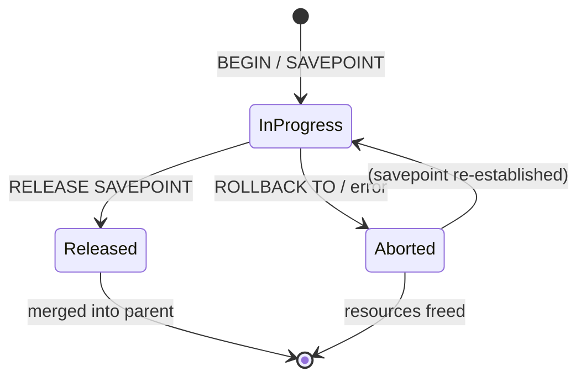

# Subtransactions

A subtransaction is a nested transaction created by a `SAVEPOINT` command or internally by PL/pgSQL exception blocks. It can be rolled back independently without aborting the enclosing transaction. Subtransactions use the same XID space and MVCC machinery as top-level transactions, with a few extra bookkeeping layers to track parentage and maintain snapshot accuracy.

## Tracking nesting with the TransactionState stack

PostgreSQL represents the current transaction context as a linked list of `TransactionStateData` structs (`src/include/access/xact.h`). PostgreSQL tracks nesting levels by pushing a new entry onto this stack when it creates a savepoint. It pops entries as they are released or rolled back. The list always has at least one entry for the top-level transaction; each savepoint adds one more.

Each entry carries enough information to restore the transaction's state at that depth:

| Field | Purpose |
|---|---|
| `fullTransactionId` | The XID assigned to this level (zero until first write) |
| `subTransactionId` | A sequential counter (1, 2, 3…) within the top-level transaction; distinct from XID |
| `name` | Savepoint name, if this is a named savepoint |
| `nestingLevel` | Depth in the stack |
| `blockState` | High-level state machine: `TBLOCK_SUBINPROGRESS`, `TBLOCK_SUBABORT`, etc. |
| `childXids` | XIDs of subtransactions that have committed under this level |
| `parent` | Back pointer to enclosing `TransactionState` |

## Savepoint operations

Creating a savepoint pushes a new `TransactionState` onto the stack without allocating an XID. PostgreSQL assigns subtransaction XIDs lazily, so a read-only savepoint costs nothing in the XID space (`DefineSavepoint()`, `xact.c`).

Releasing a savepoint marks the target subtransaction and all nested ones as ready to commit (`TBLOCK_SUBRELEASE`). The actual merge into the parent happens when the outer `CommitTransactionCommand()` loop processes those entries. This keeps the commit path uniform regardless of nesting depth (`ReleaseSavepoint()`, `xact.c`).

Rolling back to a savepoint marks everything from the current innermost subtransaction down to the target as `TBLOCK_SUBABORT_PENDING`. It marks the target itself as `TBLOCK_SUBRESTART`. `CommitTransactionCommand()` processes the rollback and the re-establishment of the savepoint together, so the savepoint remains usable after the rollback (`RollbackToSavepoint()`, `xact.c`).

## Lazy XID assignment

A subtransaction does not receive an XID until it performs a write. Deferring allocation this way keeps the XID space uncluttered and avoids unnecessary SLRU writes for the common case of read-only savepoints. When a subtransaction does need an XID, the first call to `GetCurrentTransactionId()` within that level triggers `AssignTransactionId()` (`xact.c`). This function allocates a new XID, records its parent in `pg_subtrans`, and registers it in the per-backend shared-memory cache (`PGPROC->subxids`).

## Mapping subtransaction XIDs to their parents

`pg_subtrans` (managed by `src/backend/access/transam/subtrans.c`) solves a fundamental MVCC problem: a tuple's `t_xmin` may be a subtransaction XID, but commit-log status is only recorded for top-level XIDs. To determine whether such a tuple is visible, the visibility check walks the parent chain from the subtransaction's XID up to its top-level ancestor. It then checks that ancestor's commit status.

`pg_subtrans` is an SLRU buffer over files in `pg_subtrans/`, storing one `TransactionId` (4 bytes) per XID slot. `SubTransSetParent()` writes the parent relationship once, at XID assignment time (`subtrans.c`). When MVCC visibility logic encounters a tuple whose `t_xmin` has status `SUB_COMMITTED` in the commit log, it reads the parent chain via `SubTransGetParent()` until it reaches the top-level XID. It then checks whether that XID committed (`TransactionIdDidCommit()`, `transam.c`). A convenience function, `SubTransGetTopmostTransaction()`, walks the entire chain in one call and stops at `TransactionXmin`. XIDs older than that are long committed.

`pg_subtrans` is not crash-safe. PostgreSQL zeroes it at startup and rebuilds it during recovery. This is safe because subtransaction status is always derivable from the top-level XID's commit/abort record.

## Subtransaction XIDs in shared memory

For a running transaction, other backends need to know which XIDs are "in progress" to build accurate snapshots. `PGPROC->subxids` is a fixed-size cache (up to `PGPROC_MAX_CACHED_SUBXIDS` = 64 entries) of the active subtransaction XIDs for one backend. `GetSnapshotData()` (`procarray.c`) copies these into `snapshot->subxip[]` for each active backend, making subtransaction XIDs part of the snapshot's active-XID set.

When a transaction creates more than 64 nested subtransactions, the cache overflows. PostgreSQL then sets `PGPROC->subxidStatus.overflowed`. `GetSnapshotData()` detects this and sets `snapshot->suboverflowed = true`. MVCC visibility checks that encounter a `SUB_COMMITTED` status on a tuple's XID must then call `SubTransGetTopmostTransaction()` to walk the parent chain rather than relying solely on `snapshot->subxip[]`. This is slower but still correct.

## Performance implications of subtransactions

Each subtransaction that performs any write allocates a real XID and an entry in `pg_subtrans`. A transaction that creates hundreds of savepoints — or runs a PL/pgSQL loop where each iteration uses an exception block — accumulates hundreds of sub-XIDs. Once the 64-entry `PGPROC->subxids` cache overflows, PostgreSQL marks every snapshot taken anywhere in the cluster as `suboverflowed = true`. From that point on, any MVCC visibility check on a `SUB_COMMITTED` tuple must walk the `pg_subtrans` parent chain on disk rather than consulting the in-memory snapshot. This turns O(1) snapshot lookups into O(depth) SLRU reads. This is a significant performance cliff for high-subtransaction workloads. It can appear as increased I/O from the `pg_subtrans/` directory.

The second concern is the xmin horizon. PostgreSQL does not clean up sub-XIDs until the top-level transaction commits or rolls back. A long-running transaction with many savepoints holds all of those sub-XIDs "in flight", which widens the xmin horizon visible to VACUUM. As a result, VACUUM cannot clean up tuples that it would otherwise remove until the entire top-level transaction finishes. This can cause table bloat in workloads that mix long-running transactions with frequent writes.

## Commit and abort

Subtransaction commit and abort are deliberately asymmetric, each designed to preserve a different correctness property.

When a subtransaction commits, PostgreSQL passes its XID and the XIDs of all its children up to the parent's `childXids` array. It does not write an entry to the commit log yet. The subtransaction's commit becomes visible to other transactions only when the entire top-level transaction commits. At that point, `TransactionIdCommitTree()` records all of them atomically. This preserves the all-or-nothing guarantee of the enclosing transaction (`CommitSubTransaction()`, `xact.c`).

Abort works differently. When a subtransaction aborts, PostgreSQL marks its XID `ABORTED` in the commit log immediately. This happens before it even pops the stack. Other transactions can therefore determine the abort without waiting for the top-level transaction to finish. PostgreSQL releases resources and removes the stack entry. The enclosing transaction continues unaffected (`AbortSubTransaction()`, `xact.c`).

## PL/pgSQL EXCEPTION blocks

PL/pgSQL uses subtransactions to give exception handlers the ability to catch and recover from errors without aborting the caller's transaction. PL/pgSQL opens an anonymous subtransaction at the start of each `BEGIN … EXCEPTION` block (`BeginInternalSubTransaction()`, `xact.c`). If the block completes without error, PL/pgSQL commits the subtransaction and merges it into the parent (`ReleaseCurrentSubTransaction()`). If PL/pgSQL catches an exception, it rolls back and releases the subtransaction (`RollbackAndReleaseCurrentSubTransaction()`). This undoes any writes made inside the block, while leaving the outer transaction intact.

This mechanism is entirely invisible to the SQL caller, but it carries the same XID and snapshot overhead as an explicit `SAVEPOINT`. A loop that iterates 10,000 times over a body with an `EXCEPTION` clause creates 10,000 sub-XIDs regardless of whether any exceptions are raised. Once the 64-entry cache overflows — after the 65th iteration — snapshot overhead increases for the remainder of the transaction. This is one of the most common performance surprises in PL/pgSQL: using exception handling as ordinary control flow rather than for genuine error recovery can silently degrade the performance of the entire database cluster while the loop runs.

## Subtransactions and two-phase commit

PostgreSQL allows two-phase commit (`PREPARE TRANSACTION`) only from the top-level transaction context. `PrepareTransaction()` asserts `s->parent == NULL` (`xact.c`). This means the backend must commit or roll back any open subtransactions before it reaches `PREPARE`. `PrepareTransactionBlock()` walks up to the root transaction state before it sets the block state to `TBLOCK_PREPARE`. If the current context is still inside a subtransaction, PostgreSQL effectively treats the prepare as a rollback. In practice, attempting `PREPARE TRANSACTION` while a savepoint is open raises an error. `PrepareTransactionBlock()` first issues a `COMMIT`, and that `COMMIT` must resolve the pending subtransactions.

PostgreSQL records subtransaction XIDs that committed before the `PREPARE` in the two-phase state file, alongside the top-level XID. This lets it properly commit or roll back those XIDs when it later resolves the prepared transaction.

## Portal and cursor state at savepoint rollback

Every portal (the execution state behind a named cursor) records the `SubTransactionId` at which it was created in `portal->createSubid` (`portalmem.c`). When a subtransaction aborts, `AtSubAbort_Portals()` scans the portal hash table. `AtSubAbort_Portals()` marks portals whose `createSubid` matches the aborting subtransaction as `PORTAL_FAILED`. It then releases their executor state by deleting subsidiary [[subsystems/memory/contexts|memory contexts]]. `AtSubAbort_Portals()` also marks portals that were merely *active* within the subtransaction (their `activeSubid` matches) as failed. These portals may hold references to objects that no longer exist after the rollback. `AtSubCleanup_Portals()` physically deletes those portals in a subsequent call, once the rest of the subtransaction cleanup has run.

From the user's perspective, rolling back a savepoint also closes any cursor opened inside it. This is correct behavior: the cursor's query plan and any fetched rows may reference tuples or catalog entries that the rollback has invalidated.

## See also

- [[subsystems/transactions/mvcc]] — how subtransaction XIDs participate in snapshot visibility
- [[architecture/overview]] — top-level transaction lifecycle
