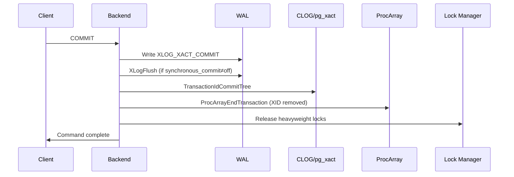
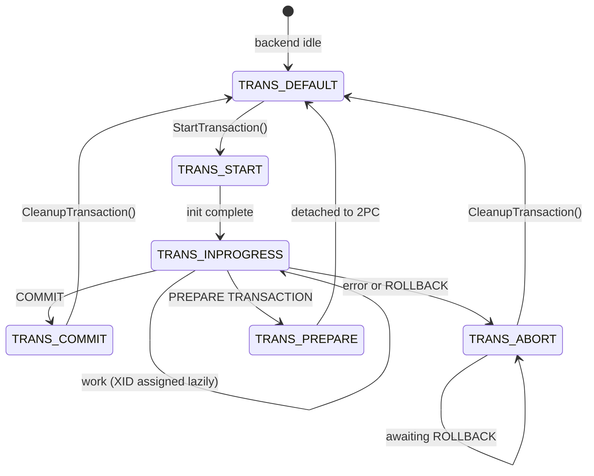

# Transaction Lifecycle

Every interaction with a PostgreSQL backend that touches data happens inside a transaction. Understanding the full arc from `BEGIN` to `COMMIT` or `ROLLBACK` explains why the system can recover cleanly from crashes, why read-only sessions are cheap, and why aborts leave no durable trace. Along the way, it shows what PostgreSQL does, and deliberately does not do, at each stage.

## Two State Machines in One Backend

PostgreSQL tracks transactions at two levels of abstraction simultaneously. Conflating them causes confusion. Both live in `TransactionStateData` (xact.c) and are always in sync.

**`TransState`** is the low-level engine state. It answers "what is this backend physically doing right now?"

| State | Meaning |
|---|---|
| `TRANS_DEFAULT` | Idle — no transaction is open |
| `TRANS_START` | Startup bookkeeping in progress |
| `TRANS_INPROGRESS` | Inside a valid, usable transaction |
| `TRANS_COMMIT` | Commit sequence in progress |
| `TRANS_ABORT` | Abort sequence in progress |
| `TRANS_PREPARE` | Two-phase prepare in progress |

`IsTransactionState()` returns true only for `TRANS_INPROGRESS`. All other states — including the transition states `TRANS_START`, `TRANS_COMMIT`, and `TRANS_PREPARE` — are unsafe for new database operations.

**`TBlockState`** is the client-visible protocol layer. It tracks whether the client has issued an explicit `BEGIN`, whether we are inside a subtransaction, and what the next expected command is (`TBLOCK_END` awaits `COMMIT`, `TBLOCK_ABORT` awaits `ROLLBACK`). The two-layer design lets PostgreSQL auto-wrap single statements in implicit transactions (`TBLOCK_STARTED`) without exposing that to the engine. It also lets PostgreSQL park an errored-out transaction in `TBLOCK_ABORT`, where the backend refuses all commands until the client rolls back.

## Starting a Transaction

`StartTransactionCommand()` calls `StartTransaction()` (xact.c) whenever a command arrives and no transaction is open. It sets `state = TRANS_START`, initialises the `TransactionStateData` frame on the in-memory stack, and does the minimum required to make the backend ready:

- Allocates a `TopTransactionContext` [[subsystems/memory/contexts|memory context]] and makes it current.
- Creates a `TopTransactionResourceOwner` — the root of the resource ownership tree.
- Acquires a virtual transaction ID (VirtualXID): a `(backendId, localTransactionId)` pair that uniquely identifies the session's current transaction to the lock manager *without* touching the global XID counter.
- Advertises the VirtualXID in `MyProc` in the ProcArray, making the transaction visible to snapshot machinery.
- Resets `currentCommandId` to `FirstCommandId` (zero).
- Fires `AtStart_Cache()` to drain pending cache invalidation messages.
- Moves state to `TRANS_INPROGRESS`.

The transaction now exists and is open — but has no XID. That comes later, on demand.

## Lazy XID Assignment

One of the most consequential design decisions in PostgreSQL's transaction model is that PostgreSQL does not allocate a XID at `BEGIN`. Instead, it assigns the XID the first time the transaction needs one — most commonly when the transaction first writes to a non-temporary relation.

`GetCurrentTransactionId()` calls `AssignTransactionId()` (xact.c) whenever a heap tuple needs to record `xmin`. The function calls `GetNewTransactionId()` (transam.c), which atomically increments the global XID counter, writes the new XID into `MyProc->xids` in shared memory, and returns it. From that moment, other backends will see this XID as "in progress" when they check the ProcArray.

The consequences are significant:

- **Read-only transactions complete without ever consuming an XID.** A `SELECT` that reads millions of rows, takes a snapshot, and commits will leave no permanent mark on the XID counter. This matters for systems with very high read rates and for XID exhaustion avoidance.
- **A transaction cannot have a XID that precedes its parent's.** When a subtransaction calls `AssignTransactionId()`, the code walks up the parent chain and ensures every ancestor has been assigned a XID first. The ordering invariant — child XID always greater than parent XID — must hold for correct recovery.
- **PostgreSQL takes the XID lock immediately on assignment.** `XactLockTableInsert()` acquires a lock keyed by the new XID. Waiting on that lock is how `SELECT ... FOR UPDATE` and `XactLockTableWait()` block until a concurrent transaction finishes.

## Command IDs and Intra-Transaction Visibility

Within a single transaction, different commands must be able to see each other's effects selectively. When a command updates a row, subsequent commands in the same transaction should see the updated version. The updating command itself should not see its own in-flight changes on rows it has not yet processed.

PostgreSQL handles this with `CommandId` — a 32-bit counter stored alongside the XID in tuple headers as `cmin` (command that inserted the tuple) and `cmax` (command that deleted or updated it). Every tuple written by the current command gets `cmin = currentCommandId`. Visibility checks compare the tuple's `cmin`/`cmax` against the snapshot's `curcid` (the CommandId at snapshot time).

`CommandCounterIncrement()` advances `currentCommandId` at the end of each SQL statement, but only if the current command actually wrote tuples (tracked by `currentCommandIdUsed`). A read-only command costs nothing here. The increment also flushes local catalog cache invalidations so that DDL effects from earlier commands in the same transaction are visible to later ones.

The maximum `CommandId` is `2^32 - 2`, so a transaction that issues more than about four billion write commands will hit an error — an extreme edge case in practice.

## The Commit Sequence

When `COMMIT` arrives, `CommitTransaction()` drives the backend through a carefully ordered sequence. The ordering is not arbitrary. Each step must happen before the next to preserve durability and correctness guarantees.

```
TRANS_INPROGRESS → TRANS_COMMIT → TRANS_DEFAULT
```

**Pre-commit work** runs first, while the state is still `TRANS_INPROGRESS` and errors can still trigger an abort. It includes: deferred triggers fire, open portals are converted to holdable form or closed, `ON COMMIT` actions on tables execute, and serialization-failure checks run for serializable transactions.

Once `HOLD_INTERRUPTS()` runs, the state moves to `TRANS_COMMIT`. The critical sequence then begins inside `RecordTransactionCommit()`:

1. **Write the WAL commit record.** `XactLogCommitRecord()` emits an `XLOG_XACT_COMMIT` record carrying the timestamp, the list of committed child XIDs, any relations to be deleted, cache invalidation messages, and optional replication-origin data. The commit record is the durability boundary — if it makes it to stable storage, the transaction is committed regardless of what happens next.

2. **Flush WAL to disk (conditional).** Whether this flush is synchronous depends on `synchronous_commit`. With `synchronous_commit = on` (the default), `XLogFlush()` blocks until the WAL record is durable. With `synchronous_commit = off`, PostgreSQL skips the flush here, and the WAL writer handles it lazily. This creates a window where a crash could lose the commit record, but no data corruption can result. Transactions that delete non-temporary relations always flush synchronously. Losing the commit record after the file deletion has already happened would be unrecoverable. See [[subsystems/wal/overview]] for the WAL flush mechanics.

3. **Mark committed in [[subsystems/storage/clog|CLOG]].** `TransactionIdCommitTree()` (or `TransactionIdAsyncCommitTree()` for async commit) stamps the XID and all committed child XIDs as `TRANSACTION_STATUS_COMMITTED` in `pg_xact` (formerly CLOG). CLOG is the authoritative record of committed/aborted status. This step must happen *after* WAL flush so that a checkpoint cannot capture a CLOG state that has no backing WAL record.

4. **Clear the XID from ProcArray.** `ProcArrayEndTransaction()` removes the transaction's XID from `MyProc` in the shared ProcArray. Once this happens, new snapshots will no longer see the XID as in-progress. Those snapshots will consider the transaction's rows visible. The commit is now globally visible.

5. **Release locks.** `ResourceOwnerRelease()` with `RESOURCE_RELEASE_LOCKS` drops all heavyweight locks held by the transaction. Backends waiting on any of those locks are now unblocked. PostgreSQL releases locks *after* ProcArray cleanup, so that waiters see a clean committed state. Otherwise, a waiter might observe the lock release before the XID disappears.

This ordering — WAL flush → CLOG update → ProcArray removal → lock release — is the invariant that makes PostgreSQL's commit protocol crash-safe. Any crash before WAL flush means recovery treats the transaction as aborted. Any crash after WAL flush means recovery replays the commit record and restores the CLOG state.



## The Abort Sequence

`AbortTransaction()` follows a deliberately different path from commit. The key difference is WAL: **abort does not require flushing WAL**.

The reasoning is the default assumption after a crash: if a commit record is not found in WAL, PostgreSQL presumes the transaction aborted. So PostgreSQL writes a WAL abort record (`XactLogAbortRecord()`) and updates CLOG (`TransactionIdAbortTree()`). It does not call `XLogFlush()`. The WAL writer will flush the abort record eventually, which is useful for replication latency. This flush is not a durability requirement for correctness.

This is why aborted transactions leave no durable trace that matters. If the abort record is lost in a crash, recovery replays transactions from the last checkpoint and simply does not find any commit record for this XID. This achieves the same result.

The abort sequence itself:

1. `HOLD_INTERRUPTS()` — protect against signal delivery during cleanup.
2. `AtAbort_Memory()` — switch to `TransactionAbortContext`, a pre-allocated context that exists specifically to provide memory for abort work even when the system is out of memory.
3. Release LW locks immediately — they are not transaction-scoped and must not be held longer than necessary.
4. Write the abort WAL record and update CLOG.
5. `ProcArrayEndTransaction()` — remove the XID from shared memory.
6. Release buffer pins, relcache references, and heavyweight locks via `ResourceOwnerRelease()`.
7. Delete the transaction memory context.

`AbortTransaction()` leaves the state at `TRANS_ABORT` rather than `TRANS_DEFAULT`. The client connection remains open but the backend refuses all commands except `ROLLBACK`. Only after `CleanupTransaction()` runs does the state return to `TRANS_DEFAULT`. Only then does the backend accept new work.

## Subtransactions

`SAVEPOINT` creates a subtransaction: a nested `TransactionStateData` frame pushed onto the per-backend stack via `PushTransaction()`. Each subtransaction gets its own `SubTransactionId` (a separate counter from XID), its own `CurTransactionContext` memory context (a child of the parent's), and its own `ResourceOwner` (a child of the parent's resource owner tree).

A subtransaction does not necessarily need a XID. Like the top-level transaction, it receives one only when it first writes something. When a subtransaction commits (`RELEASE SAVEPOINT`), PostgreSQL adds its XID (if any) to the parent's `childXids` array. It also optionally merges the subtransaction's memory context into the parent's. The sub-XID is not yet committed to CLOG. That happens only when the top-level transaction commits, at which point `TransactionIdCommitTree()` processes the entire tree.

`ROLLBACK TO SAVEPOINT` aborts the subtransaction without aborting the parent. `AbortSubTransaction()` marks the sub-XID aborted in CLOG, calls `XidCacheRemoveRunningXids()` to remove it from `MyProc`'s cached subxid list, and restores the parent's memory context and resource owner. The top-level transaction continues normally. This is how partial rollbacks work without losing the entire transaction.

The ProcArray caches up to `PGPROC_MAX_CACHED_SUBXIDS` sub-XIDs per backend. When that limit is exceeded, PostgreSQL sets the `suboverflowed` flag. Hot-standby servers must then fall back to a slower path for determining which XIDs are running.

## The Resource Owner

The resource owner mechanism solves a fundamental problem. When a transaction aborts unexpectedly, PostgreSQL must release every resource it has acquired — buffer pins, file handles, heavyweight locks — in the right order. This must happen even if the code path that acquired them never had a chance to release them.

Each `ResourceOwner` is a node in a tree. The top is `TopTransactionResourceOwner`, created at `StartTransaction()`. Portal resource owners hang off it. Subtransaction owners form a parallel hierarchy. When the transaction ends (either normally or by abort), `ResourceOwnerRelease()` traverses the tree and releases:

1. Resources that must be freed before locks are released (buffer pins, etc.) — `RESOURCE_RELEASE_BEFORE_LOCKS`
2. Heavyweight locks — `RESOURCE_RELEASE_LOCKS`
3. Resources released after locks (open file references, etc.) — `RESOURCE_RELEASE_AFTER_LOCKS`

The three-phase release order ensures that backends waiting on our locks see a fully cleaned-up state before being unblocked. PostgreSQL must drop buffer pins before locks. This lets another session that the lock release unblocks actually access the buffer.

On abort, PostgreSQL pre-allocates `TransactionAbortContext` at startup, so that `ResourceOwnerRelease()` has memory to work with. This holds even if the system has run out of memory. This is the same philosophy as `ErrorContext`: reserve space when times are good so cleanup can run when times are bad.

## Transaction-Local State Cleanup

Beyond the resource owner, several subsystems maintain transaction-scoped state that must be torn down at end-of-transaction:

- **Portals and cursors**: open portals are closed or converted to holdable form at commit. On abort, all portals are force-closed.
- **Snapshots**: the transaction's registered snapshots are released. `ActiveSnapshot` is cleared.
- **GUC settings**: any `SET LOCAL` changes are rolled back by `AtEOXact_GUC()`.
- **SPI contexts**: SPI procedure contexts are cleaned up.
- **Shared invalidation messages**: catalog changes are broadcast to other backends via `AtEOXact_Inval()`.
- **Relation cache entries**: modified relcache entries are invalidated or refreshed.
- **NOTIFY messages**: pending notifications are either sent (on commit) or discarded (on abort).

PostgreSQL deletes the memory context tree rooted at `TopTransactionContext` at the end, freeing all per-transaction palloc'd memory in a single operation.

## Putting It Together

A full transaction arc looks like this:



A read-only transaction that never writes lives entirely in `TRANS_INPROGRESS` with no XID, no CLOG entries, and no WAL. It acquires a VirtualXID, takes a snapshot, reads rows, releases the snapshot, and returns to `TRANS_DEFAULT`. This leaves only a brief ProcArray entry that other backends may have observed when computing their snapshots.

A write transaction differs only in that `AssignTransactionId()` fires on the first write, planting a XID in the ProcArray. That XID remains there until `ProcArrayEndTransaction()` clears it at commit or abort.

## Related Topics

- [[subsystems/transactions/mvcc|MVCC]] — describes how snapshots built from ProcArray XID state determine which tuple versions are visible to each transaction
- [[subsystems/transactions/subtransactions|Subtransactions]] — covers SAVEPOINT mechanics and how sub-XIDs nest inside the top-level transaction lifecycle
- [[subsystems/transactions/two-phase-commit|Two-Phase Commit]] — extends the commit sequence with a PREPARE phase that detaches the transaction from the backend
- [[subsystems/transactions/snapshot|Snapshots]] — explains how the snapshot taken at transaction start captures the set of in-progress XIDs seen here
- [[subsystems/storage/clog|CLOG]] — the pg_xact store that TransactionIdCommitTree writes to as the final durability step of commit
- [[subsystems/memory/resource-owner|Resource Owner]] — the tree of ResourceOwner nodes that tracks buffer pins and locks released during commit and abort
- [[subsystems/transactions/xid-wraparound|XID Wraparound]] — explains why lazy XID assignment matters for keeping the global XID counter from advancing unnecessarily
- [[subsystems/wal/overview|WAL Overview]] — the WAL subsystem that makes commit records durable
- [[subsystems/locking/overview|Locking Overview]] — heavyweight locks released in the commit/abort sequence
- [[architecture/process-architecture|Process Architecture]] — one backend per connection, with ProcArray entries tracked per backend
- [[subsystems/storage/buffer-manager|Buffer Manager]] — buffer pins tracked by the [[subsystems/memory/resource-owner|ResourceOwner]] tree released during commit and abort
