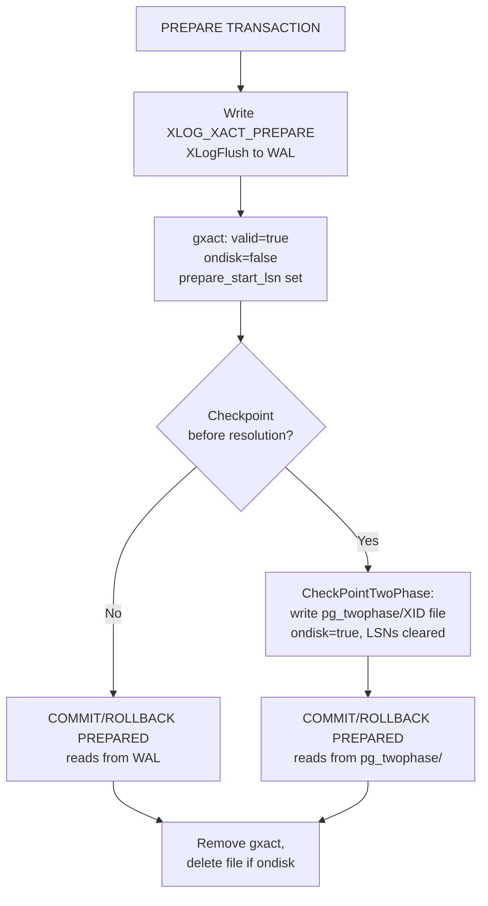

# Two-Phase Commit

Distributed systems face a fundamental tension: a transaction spanning multiple participants must either commit everywhere or commit nowhere. Two-phase commit (2PC) is the protocol that resolves this. PostgreSQL implements the participant side of 2PC. An external transaction coordinator can tell it to `PREPARE TRANSACTION`, which puts it into a durable in-doubt state. The coordinator can then separately tell it to `COMMIT PREPARED` or `ROLLBACK PREPARED`. The protocol's name reflects its structure. The first phase makes the outcome permanent and irreversible within PostgreSQL. The second phase finalises it.

2PC is also useful within a single PostgreSQL instance. Application logic sometimes needs to park a transaction — prepared but not yet committed — and pick it up later, possibly from a different session. The mechanism is the same regardless of whether the coordinator is a distributed system or an application. The most common external context for 2PC is the XA protocol, where a transaction manager coordinates changes across multiple heterogeneous resource managers (databases, message queues, and so on). PostgreSQL acts as one such resource manager.

## When 2PC Is Appropriate

The core use case is a transaction that touches multiple independent databases or services and must commit atomically. Without 2PC, there is no way to guarantee that a crash between the first and second commit leaves the system in a consistent state. With 2PC, each participant prepares first, achieving local durability and lock retention. The coordinator then issues the global commit decision.

Single-database uses are less common but legitimate: a job scheduler that needs to reserve work items and then commit them only after an external acknowledgement, or an application that must hand off a partially-assembled transaction to a different session without releasing its locks.

What 2PC does not do is solve the coordinator failure problem. If the coordinator crashes after some participants have prepared but before issuing the commit decision, those participants remain blocked indefinitely in the in-doubt state. This is the fundamental limitation of 2PC: it converts a consistency problem into an availability problem, trading correctness for the possibility of blocking. Applications that cannot tolerate blocking use three-phase commit variants or consensus protocols such as Paxos or Raft instead.

## Phase One: PREPARE TRANSACTION

`PREPARE TRANSACTION gid` transforms a running transaction into a prepared transaction identified by the application-supplied global transaction identifier (GID). The GID is an arbitrary string up to 200 bytes (`GIDSIZE`) and must be unique across all currently prepared transactions in the cluster. PostgreSQL checks uniqueness under `TwoPhaseStateLock` at the moment of reservation, before it writes any WAL. This means a duplicate GID causes the command to fail cleanly.

Preparing a transaction is not a lightweight operation. It must write enough durable state that the transaction can be completed later. This state must survive even if the server crashes immediately afterward. PostgreSQL assembles this state in memory as a sequence of `StateFileChunk` blocks via `StartPrepare()`, then writes it to WAL as a single `XLOG_XACT_PREPARE` record and synchronously flushes it via `EndPrepare()`. The flush is the moment of commitment for the prepare phase. Once `XLogFlush()` returns inside `EndPrepare()`, the source code comment is exact: "If we crash now, we have prepared: WAL replay will fix things" (`twophase.c`).

The preparing backend sets `DELAY_CHKPT_START` on its `PGPROC` entry before inserting the WAL record. This prevents a checkpoint from completing before the prepare state is visible in shared memory. Otherwise, WAL could reference state that a checkpoint cannot see. `MarkAsPrepared()` clears the flag only after it has inserted the dummy `PGPROC` into the global proc array.

After the WAL flush, `EndPrepare()` calls `SyncRepWaitForLSN()` if synchronous replication is configured. This waits for the prepare record to be confirmed on the required number of standbys before `EndPrepare()` returns to the client. This means that a successful `PREPARE TRANSACTION` on a synchronous-replication cluster guarantees the prepare state exists not just locally but also on the standby.

### What State Is Saved

The prepare state record is a linear buffer assembled by `StartPrepare()` and the `save_state_data()` helper. Each segment is padded to a `MAXALIGN` boundary. The format is:

| Segment | Contents |
|---|---|
| `TwoPhaseFileHeader` | XID, GID, database OID, owner OID, prepare timestamp, counts for all sections below, replication origin LSN and timestamp |
| GID string | The GID as a null-terminated string, padded to `MAXALIGN` |
| Subtransaction XIDs | `TransactionId[]` — child XIDs of any savepoints |
| Commit relations | `RelFileLocator[]` — files to drop on commit (e.g. tables created and dropped within the transaction) |
| Abort relations | `RelFileLocator[]` — files to drop on rollback |
| Commit stats | `xl_xact_stats_item[]` — pg_stat accounting adjustments on commit |
| Abort stats | `xl_xact_stats_item[]` — pg_stat accounting adjustments on abort |
| Invalidation messages | `SharedInvalidationMessage[]` — shared-cache invalidations to send on commit |
| Resource manager records | Per-rmgr state, each prefixed by a `TwoPhaseRecordOnDisk` header |
| End sentinel | `TwoPhaseRecordOnDisk` with `rmid == TWOPHASE_RM_END_ID` |
| CRC-32C | Integrity check over all of the above |

`TwoPhaseFileHeader` is a typedef alias for `xl_xact_prepare` (`twophase.c`), the same struct used in the WAL record. This means the prepare state is identical whether read from WAL or from the on-disk state file — there is no translation step.

Each subsystem that needs to preserve state across the prepare boundary produces the resource manager records. Locks serialize their heavyweight lock table entries so they can be re-acquired on crash recovery. Sequences record any consumed sequence values. Each subsystem registers a pair of callbacks: one to produce the record at prepare time, and one to replay it at recovery. The `TwoPhaseRecordOnDisk` header identifies the resource manager (`rmid`) and carries an `info` field for flags, followed by the rmgr-specific data at the next `MAXALIGN` offset.

### The gxact Lifecycle

When `PREPARE TRANSACTION` succeeds, the preparing backend hands off its transaction identity to a `GlobalTransactionData` (gxact) entry in shared memory. The lifecycle has four stages (`twophase.c`):

1. `MarkAsPreparing()` reserves a free gxact slot, checks for duplicate GIDs, fills in the XID and GID, and marks `valid = false`. It locks the slot to the current backend (`locking_backend = MyBackendId`). If the prepare fails before reaching the WAL write, `AtAbort_Twophase()` removes the entry.

2. `MarkAsPrepared()` sets `valid = true` and calls `ProcArrayAdd()` to insert the dummy `PGPROC` into the global proc array. From this moment, the XID is visible as in-progress to `TransactionIdIsInProgress()`.

3. To begin `COMMIT PREPARED` or `ROLLBACK PREPARED`, `LockGXact()` locates the gxact by GID, verifies ownership and database membership, and sets `locking_backend` to prevent concurrent resolution.

4. On completion, `RemoveGXact()` returns the entry to the free list. `ProcArrayRemove()` removes the dummy PGPROC.

`TwoPhaseShmemInit()` pre-allocates the dummy PGPROC at startup. It stays allocated for the full lifetime of the prepared transaction. Its `pid` is zero (it has no real process). PostgreSQL assigns its `dummyBackendId` starting at `MaxBackends + 1`, placing it in a range immediately following real backend IDs. This lets code that allocates arrays of size `MaxBackends + max_prepared_xacts + 1` reserve a slot for every possible holder. The multixact subsystem relies on this property (`twophase.c`).

## Phase Two: COMMIT PREPARED or ROLLBACK PREPARED

The coordinator decides the outcome and issues either command, which may come from the same session, a different session, or a session that connects after a server restart. The only constraints are:

- The connection must be to the same database that prepared the transaction. PostgreSQL explicitly rejects cross-database resolution because `NOTIFY` and other database-local mechanisms would break (`twophase.c`, `LockGXact()`).
- The issuer must be either the role that prepared the transaction or a superuser.
- Only one backend can hold the lock on a given gxact at a time; concurrent resolution attempts on the same GID fail with an error.

`FinishPreparedTransaction()` handles both outcomes. It reads the prepare state — from the WAL record at `prepare_start_lsn` if the transaction is still in the WAL window, or from the `pg_twophase/` file if a checkpoint has moved it to disk — then executes the following sequence in strict order:

1. Write a `XLOG_XACT_COMMIT_PREPARED` or `XLOG_XACT_ABORT_PREPARED` WAL record and flush it.
2. Mark the transaction committed or aborted in `pg_xact` ([[subsystems/storage/clog|CLOG]]) with `TransactionIdCommitTree()` or `TransactionIdAbortTree()`.
3. Remove the dummy PGPROC from the proc array with `ProcArrayRemove()`.
4. Drop any relation files from the appropriate list (commit or abort).
5. Send shared-cache invalidation messages (commit only).
6. Invoke per-resource-manager post-commit or post-abort callbacks, which release locks.
7. Remove the gxact from shared memory.
8. Delete the on-disk state file if one exists.

The ordering is critical: the WAL write and CLOG update must precede the proc array removal. Otherwise, other transactions might conclude the XID is gone before its outcome is recorded durably. PostgreSQL releases locks only after the WAL and CLOG updates. This maintains the correctness invariant that a committing transaction's effects become visible before its locks are released.

Both the prepare WAL flush and the commit/abort WAL flush are synchronous and unconditional. There is no asynchronous commit path for prepared transactions — the concept of preparing asynchronously is self-contradictory.

## Durability: WAL-First, Files Later

The durability architecture for prepared transactions has two tiers. When a transaction first prepares, its state exists only in WAL. The gxact records `prepare_start_lsn` and `prepare_end_lsn` so that PostgreSQL can reconstruct state by reading the WAL record at that position. This covers the common case: prepared transactions that are resolved quickly, before the next checkpoint.

When a checkpoint occurs, `CheckPointTwoPhase()` iterates the gxact array. For any entry whose `prepare_end_lsn` is at or before the checkpoint's redo horizon, it materialises the state to `$PGDATA/pg_twophase/<xid-in-hex>` via `RecreateTwoPhaseFile()`. The file name is the XID formatted as an 8-character uppercase hex string (e.g. `pg_twophase/000000A3`). Once `CheckPointTwoPhase()` writes and fsyncs the file, it sets `ondisk` to true. It also clears the LSN pointers to `InvalidXLogRecPtr`. From that point, resolution reads from the file rather than WAL.

After iterating all entries, `CheckPointTwoPhase()` unconditionally fsyncs the `pg_twophase` directory itself. This ensures that both newly created files and any deletions (from recently resolved prepared transactions) survive a crash.

The design deliberately defers file writes as late as possible. `CheckPointTwoPhase()` runs near the end of the checkpoint sequence. By that point, most prepared transactions that existed at checkpoint start have typically already been resolved. The source comments note the expectation that in the common case zero files are written. Long-lived prepared transactions — indicating a coordinator failure or operator error — get written to disk. `CheckPointTwoPhase()` also generates a log message at checkpoint time when `log_checkpoints` is enabled.



## Crash Recovery

On crash recovery, PostgreSQL must reconstruct any prepared transactions that had not been resolved before the crash. These transactions remain in-doubt. PostgreSQL must make them available for `COMMIT PREPARED` or `ROLLBACK PREPARED` after recovery completes.

Recovery proceeds in two stages. At the very start, `restoreTwoPhaseData()` scans `pg_twophase/` and loads any existing state files. These represent transactions that had been checkpointed before the crash. Entries added this way have `ondisk = true` and `inredo = true`. `restoreTwoPhaseData()` validates the file names as 8-character hex strings. It ignores anything else in the directory.

As WAL replay proceeds, the startup process encounters `XLOG_XACT_PREPARE` records and calls `PrepareRedoAdd()`, which inserts gxact entries with `inredo = true` and `ondisk = false`. These represent transactions prepared after the last checkpoint but before the crash. `PrepareRedoAdd()` checks whether a file for the same XID already exists in `pg_twophase/`, and skips the WAL entry to avoid duplicates. This situation can happen when a crash occurs mid-checkpoint.

When replay reaches a checkpoint record, `CheckPointTwoPhase()` runs again and writes any in-redo entries behind the redo horizon to `pg_twophase/`. This ensures a complete on-disk set for any subsequent crash during recovery.

`PrescanPreparedTransactions()` runs after WAL replay is complete. It iterates the gxact array to determine the oldest prepared XID, which is needed to initialize `pg_subtrans` correctly. It also advances `nextXid` past any subtransaction XIDs embedded in prepare state, since subxact commits do not write individual WAL records.

At the end of recovery, before normal backends are allowed to write WAL, `RecoverPreparedTransactions()` runs. For each surviving gxact, it reads the prepare state, calls `MarkAsPreparingGuts()` to rebuild the dummy PGPROC, loads subtransaction data with `GXactLoadSubxactData()`, calls `MarkAsPrepared()` to insert the dummy proc back into the proc array, and then invokes the `twophase_recover_callbacks` to reacquire locks. The transaction then waits in-doubt exactly as it would have before the crash. The callback dispatch tables (`twophase_recover_callbacks`, `twophase_postcommit_callbacks`, `twophase_postabort_callbacks`) are defined in `twophase_rmgr.c`. They map each two-phase resource manager ID to its recovery, post-commit, and post-abort handler, routing post-crash recovery to the correct subsystem.

`ProcessTwoPhaseBuffer()` checks `pg_xact` before processing any state, to detect prepared transactions that had already committed or aborted before the crash. Stale entries generate a warning. PostgreSQL discards them.

During hot standby, PostgreSQL calls `StandbyRecoverPreparedTransactions()` (rather than `RecoverPreparedTransactions()`) to set up subtransaction parent linkages in `pg_subtrans`, without fully reinstating the prepared transactions. This allows standby queries to correctly evaluate snapshot visibility for in-doubt XIDs without needing the full lock infrastructure.

## Lock Retention

A prepared transaction retains all heavyweight locks it acquired during execution. This is not a side effect — it is a correctness requirement. If a prepared transaction released its locks, another transaction could modify the same rows between `PREPARE TRANSACTION` and `COMMIT PREPARED`. This would violate the atomicity guarantee that 2PC is meant to provide.

The dummy PGPROC implements lock retention. PostgreSQL associates locks with a PGPROC entry (see [[subsystems/locking/overview]]). By giving the prepared transaction its own persistent PGPROC in the proc array, the lock manager continues to treat it as an active participant. Any transaction trying to acquire a conflicting lock will block as if the original session were still running.

The lock resource manager's prepare callback preserves the lock state across the prepare boundary by serializing the lock table entries into the prepare record. On crash recovery, `RecoverPreparedTransactions()` calls the lock resource manager's recovery callback to re-acquire those locks against the dummy PGPROC. The net effect is that after recovery, the prepared transaction holds exactly the same locks it held before the crash.

Lock retention has important practical consequences. A prepared transaction that is abandoned — never committed or rolled back — becomes a permanent lock holder. It cannot be killed (there is no process to kill), it does not time out, and it does not go away on its own. Rows it touched are locked indefinitely. The `pg_prepared_xacts` view exists specifically to allow operators to identify and manually resolve such transactions.

## pg_prepared_xacts

The `pg_prepared_xacts` view exposes the contents of `TwoPhaseState->prepXacts` to SQL. The `pg_prepared_xact()` set-returning function (`twophase.c`) backs the view. It snapshots the shared array under `TwoPhaseStateLock` and returns one row per gxact entry where `gxact->valid = true`. PostgreSQL silently omits entries that are mid-preparation (valid is still false).

| Column | Type | Meaning |
|---|---|---|
| `transaction` | `xid` | The PostgreSQL XID of the prepared transaction |
| `gid` | `text` | The application-supplied global transaction identifier |
| `prepared` | `timestamptz` | When `PREPARE TRANSACTION` completed |
| `ownerid` | `oid` | OID of the role that issued `PREPARE TRANSACTION` |
| `dbid` | `oid` | OID of the database in which the transaction ran |

The `transaction` column is the internal XID, not the GID. The application chooses the GID and may encode any information the coordinator finds useful in it — a distributed transaction ID, a request UUID, a timestamp, or a combination. Conventions for GID format are entirely up to the application. PostgreSQL treats it as an opaque string.

To inspect abandoned prepared transactions and understand their impact:

```sql
SELECT gid, prepared, owner, database
FROM pg_prepared_xacts
ORDER BY prepared;
```

To resolve an abandoned transaction (requires superuser or ownership):

```sql
ROLLBACK PREPARED 'my-gid';
```

## [[subsystems/transactions/xid-wraparound|XID Wraparound]] Hazard

A prepared transaction holds its XID in the proc array. This means `TransactionIdIsInProgress()` continuously reports its XID as in-progress. The [[subsystems/background/autovacuum|autovacuum]] wraparound prevention mechanism depends on being able to advance the oldest XID horizon, which in turn requires that all in-progress XIDs eventually complete.

A prepared transaction that is never resolved prevents XID wraparound prevention from advancing past its XID. If the XID is old enough, autovacuum will be unable to clean up visibility information older than that XID. This eventually causes the database to refuse new transactions as the wraparound limit approaches. PostgreSQL will log warnings as the horizon approaches, and ultimately trigger a shutdown.

The practical danger is that a coordinator failure can leave prepared transactions abandoned for extended periods. Monitoring `pg_prepared_xacts` for old entries — particularly checking the `age(transaction)` of listed XIDs — is an operational requirement on any system using 2PC. Most deployment playbooks set a maximum age for prepared transactions and configure alerts or automated cleanup for exceeded entries.

## Interaction with Replication

### Physical (Streaming) Replication

Physical replication does not require special treatment for prepared transactions. The `XLOG_XACT_PREPARE` record is part of the WAL stream. Standbys replay it the same as any other WAL record. On the standby, the startup process calls `PrepareRedoAdd()` when it encounters the prepare record. It calls `PrepareRedoRemove()` when it encounters the corresponding commit or abort.

When synchronous replication is configured, `EndPrepare()` calls `SyncRepWaitForLSN()` after writing the prepare WAL record. This blocks the preparing session until the required standbys have confirmed receipt of the prepare record. The durability guarantee is therefore: once `PREPARE TRANSACTION` succeeds on a synchronous-replication cluster, the transaction will eventually commit or roll back, even if the primary crashes. This holds because the prepare state exists on at least one standby.

### Logical Replication

By default, logical replication subscribers do not use 2PC. The subscriber applies transactions as ordinary single-phase commits, regardless of how the publisher prepared them. This is the safer default: it avoids the possibility of abandoned prepared transactions on subscribers if the coordinator fails.

The `two_phase` option on `CREATE SUBSCRIPTION` (introduced in PostgreSQL 14) changes this behaviour. When enabled, the walsender streams `PREPARE` messages to the subscriber, which applies them as prepared transactions. The subscriber then waits for `COMMIT PREPARED` or `ROLLBACK PREPARED` messages before finalising.

The `LookupGXact()` function (`twophase.c`) supports logical decoding. It lets the walsender verify that a given GID with a specific `prepare_end_lsn` and origin timestamp actually exists in the local prepared transaction table, before it streams the prepare to a subscriber. The check uses all three values — GID, origin LSN, and timestamp — because the same GID could in principle be reused across different prepared transactions from different nodes. Matching only the GID would not be sufficient to identify the correct entry.

The logical decoding machinery emits `PREPARE` messages when it decodes a `XLOG_XACT_PREPARE` record and the plugin has opted in. The two-phase decoding path records the origin information from `TwoPhaseFileHeader.origin_lsn` and `TwoPhaseFileHeader.origin_timestamp` so that the subscriber can correctly track replication progress.

## Shared Memory Layout

PostgreSQL allocates the prepared transaction table in shared memory at server startup, bounded by `max_prepared_transactions`. `TwoPhaseShmemInit()` allocates a single contiguous block containing the `TwoPhaseStateData` header, an array of `GlobalTransaction` pointers (the active slots), and an array of `GlobalTransactionData` structs (the actual data, initially placed on the free list).

```c
typedef struct GlobalTransactionData
{
    GlobalTransaction next;         /* free list link */
    int               pgprocno;     /* slot in ProcGlobal->allProcs */
    BackendId         dummyBackendId;
    TimestampTz       prepared_at;
    XLogRecPtr        prepare_start_lsn;
    XLogRecPtr        prepare_end_lsn;
    TransactionId     xid;
    Oid               owner;
    BackendId         locking_backend;
    bool              valid;
    bool              ondisk;
    bool              inredo;
    char              gid[GIDSIZE];
} GlobalTransactionData;
```

`valid` is false during the window between `MarkAsPreparing()` and `MarkAsPrepared()`. It is also false again briefly during `FinishPreparedTransaction()`, after the WAL write but before the entry is removed. `ondisk` transitions from false to true exactly once per entry, during `CheckPointTwoPhase()`. `inredo` marks entries that arrived through WAL replay rather than from a live session.

`StartPrepare()` and `save_state_data()` assemble the prepare state using a chain of `StateFileChunk` blocks, before PostgreSQL writes it as a single WAL record. The in-memory representation is never larger than `MaxAllocSize`. `EndPrepare()` checks this explicitly and rejects oversized state before writing WAL.

## Configuration and Constraints

PostgreSQL disables prepared transactions by default. Setting `max_prepared_transactions = 0` (the default) causes any `PREPARE TRANSACTION` to error immediately. PostgreSQL allocates shared memory for the gxact array and dummy PGPROC slots at server start, proportional to `max_prepared_transactions`. Setting it to zero incurs zero overhead.

When a system uses 2PC, operators should set `max_prepared_transactions` to at least `max_connections`, since every connection could theoretically be mid-prepare simultaneously. Running out of gxact slots raises an error at `PREPARE TRANSACTION` time, not at `BEGIN`.

Several conditions prevent a transaction from being prepared:

- The transaction is inside a subtransaction (savepoint). Subtransaction XIDs are embedded in the prepare state, but PostgreSQL does not allow issuing `PREPARE TRANSACTION` while inside an open savepoint.
- The session has open cursors. Cursor state is session-local and cannot be transferred.
- The session holds session-level advisory locks. These are also session-scoped and cannot be transferred to a prepared transaction.
- The transaction created or dropped a temporary table. Temporary table storage is session-local. A different session cannot commit a prepared transaction that created a temp table, so PostgreSQL rejects this at prepare time.

## Related Topics

- [[subsystems/transactions/transaction-lifecycle|Transaction Lifecycle]] — covers the full path from BEGIN through commit, providing context for where PREPARE TRANSACTION fits in the broader transaction state machine
- [[subsystems/transactions/snapshot|Snapshots]] — explains how in-doubt prepared XIDs are treated as in-progress by snapshot machinery, affecting visibility for concurrent queries
- [[subsystems/wal/checkpoint|Checkpoint]] — describes the checkpoint sequence that triggers `CheckPointTwoPhase()` and drives the write of `pg_twophase/` state files
- [[subsystems/replication/synchronous-replication|Synchronous Replication]] — details the `SyncRepWaitForLSN()` wait that makes a successful PREPARE durable on standbys before returning to the client
- [[subsystems/replication/logical|Logical Replication]] — covers the `two_phase` subscription option and how walsender streams PREPARE messages to subscribers
- [[troubleshooting/xid-exhaustion|XID Exhaustion]] — operational guidance for the wraparound hazard that abandoned prepared transactions create by blocking the oldest-XID horizon
- [[code-paths/transaction|Transaction Code Path]] — traces the executor-level handling of BEGIN, COMMIT, ROLLBACK, and PREPARE TRANSACTION commands
- [[subsystems/transactions/mvcc|MVCC]] — snapshot visibility rules that determine how an in-doubt prepared transaction's XID appears as in-progress to concurrent transactions
- [[subsystems/transactions/subtransactions|Subtransactions]] — how subtransaction XIDs created via SAVEPOINT are embedded in the prepare state and restored during recovery
- [[subsystems/locking/overview|Locking Overview]] — the lock manager mechanics that let a prepared transaction retain its locks across the prepare boundary via the dummy PGPROC
- [[subsystems/wal/overview|WAL Overview]] — WAL record structure and durability guarantees behind the `XLOG_XACT_PREPARE` record
- [[architecture/overview|Architecture Overview]] — process architecture and shared memory layout that hosts the two-phase state array and dummy PGPROC entries
