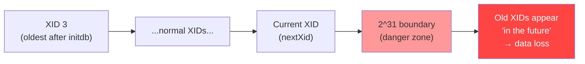
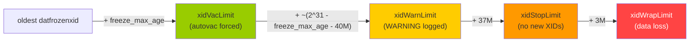
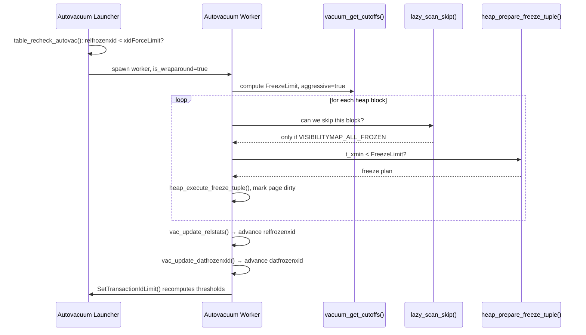
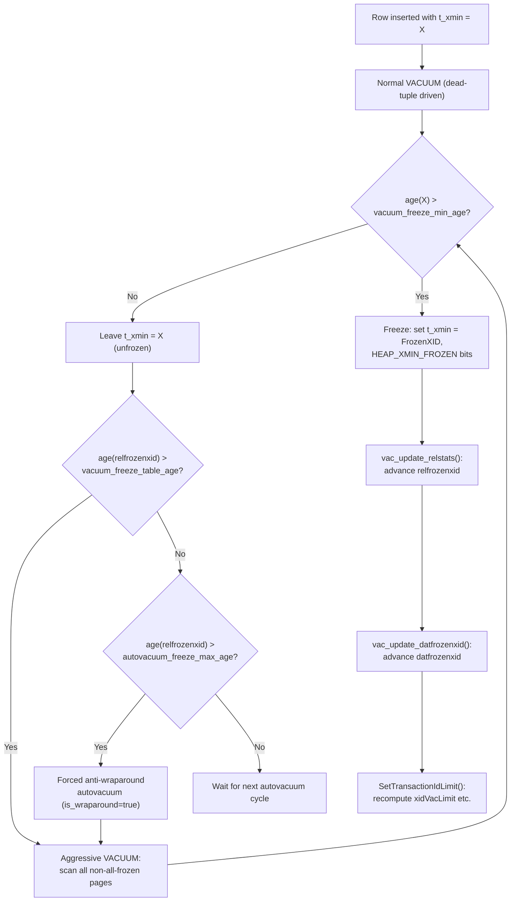

# XID Wraparound and Anti-Wraparound VACUUM

PostgreSQL identifies every row version by the 32-bit transaction ID (XID) of the transaction that inserted it. Because XIDs are assigned sequentially from a 32-bit counter, the space eventually wraps around. Without active countermeasures, rows inserted long ago would appear to be inserted by a *future* transaction, making them invisible to every snapshot — effective data loss. The anti-wraparound system, built around VACUUM's tuple-freezing pass, is the mechanism that prevents this.

## The 32-bit XID Space and Modular Arithmetic

The XID type is `uint32` (unsigned 32-bit integer), giving 2^32 = 4,294,967,296 distinct values. XIDs 0–2 are special:

| Value | Name | Meaning |
|---|---|---|
| `0` | `InvalidTransactionId` | Placeholder; never assigned to a real transaction |
| `1` | `BootstrapTransactionId` | Used only during `initdb` |
| `2` | `FrozenTransactionId` | Permanently committed; always visible to every snapshot |
| `3` | `FirstNormalTransactionId` | First XID available for normal user transactions |

Source: `src/include/access/transam.h` lines 31–34.

Normal XID assignment starts at 3 and increments with `TransactionIdAdvance()`, skipping back over the special values at the top of each 32-bit cycle. The effective usable space for normal transactions is therefore about 4,294,967,293 values.

### Modular "half-space" ordering

PostgreSQL cannot use a simple unsigned integer comparison to determine which XID is older, because the counter wraps around. Instead, `TransactionIdPrecedes()` (`src/backend/access/transam/transam.c`) casts the difference to a *signed* 32-bit integer:

```c
diff = (int32) (id1 - id2);
return (diff < 0);
```

This implements modular arithmetic: PostgreSQL considers exactly half of the XID space — 2^31 values — "in the past" relative to any given XID, and the other half "in the future." `NormalTransactionIdPrecedes()` uses the identical trick as an inline macro for speed when both arguments are known to be normal XIDs.

The consequence is a hard boundary: **an XID that is more than 2^31 transactions older than the current counter wraps around to appear newer**. Once the global XID counter advances far enough past an old XID, that old XID crosses the halfway point and flips from "in the past" to "in the future." Any row version whose `t_xmin` is in the apparent future becomes invisible to every snapshot — the row is lost.



## What Wraparound Means in Practice

If an old tuple's `t_xmin` is more than 2^31 transactions behind the current `nextXid`, `TransactionIdPrecedes(t_xmin, snapshot->xmin)` returns `false`. This happens even though the row was committed long ago. The row becomes invisible: every snapshot considers it to have been inserted by a transaction that has not yet run. The table is effectively unreadable without intervention.

This is not a gradual degradation. The flip is instantaneous: a single new transaction that pushes `nextXid` across the 2^31 threshold relative to `relfrozenxid` can make an entire table dark.

The scope is per-database at the cluster level. Each database tracks its own `datfrozenxid`. The cluster-wide minimum is what drives the safety limits in shared memory.

## Tuple Freezing: Making Rows Immune to Wraparound

The solution is to *freeze* tuples: replace their `t_xmin` with `FrozenTransactionId` (2) and set the `HEAP_XMIN_FROZEN` hint bits. Because `FrozenTransactionId` is outside the normal XID range, it is never subject to modular comparison. Any snapshot considers a frozen tuple's `t_xmin` to be definitely committed (`TransactionIdIsNormal(FrozenTransactionId)` returns false, so the non-modular path `id1 < id2` is taken, and `2 < 3` is always true).

### Tuple header fields and freezing hint bits

The tuple header (`src/include/access/htup_details.h`, `HeapTupleHeaderData`) contains:

| Field | Type | Description |
|---|---|---|
| `t_choice.t_heap.t_xmin` | `TransactionId` | Inserting transaction XID |
| `t_choice.t_heap.t_xmax` | `TransactionId` | Deleting / locking transaction XID |
| `t_infomask` | `uint16` | Hint bits including visibility status |
| `t_infomask2` | `uint16` | Attribute count + additional flags |

The relevant `t_infomask` bits for freezing:

| Bit constant | Hex value | Meaning |
|---|---|---|
| `HEAP_XMIN_COMMITTED` | `0x0100` | `t_xmin` is known committed |
| `HEAP_XMIN_INVALID` | `0x0200` | `t_xmin` is known invalid/aborted |
| `HEAP_XMIN_FROZEN` | `0x0300` | Both bits set together — xmin is frozen |

`HEAP_XMIN_FROZEN` is defined as `(HEAP_XMIN_COMMITTED | HEAP_XMIN_INVALID)` — the combination of both bits signals "this tuple is permanently visible." When a snapshot checks visibility and finds `HEAP_XMIN_FROZEN` set, it treats the tuple as committed by a transaction that predates everything, without consulting CLOG or doing any XID comparison.

### The freeze execution path

The freeze path is split across two functions in `src/backend/access/heap/heapam.c`:

1. **`heap_prepare_freeze_tuple()`** (line 6935): Examines a tuple header and builds a `HeapTupleFreeze` plan describing what changes to make. If `t_xmin < cutoffs->FreezeLimit`, it sets `frz->t_infomask |= HEAP_XMIN_FROZEN` in the plan (line 7136). The function also handles `t_xmax` via `FreezeMultiXactId()` when `t_xmax` holds a `MultiXactId`.

2. **`heap_execute_freeze_tuple()`** (line 7209): Applies the plan to the in-memory tuple header. This is the write that actually modifies the on-disk page (via buffer manager dirty-page marking).

Both functions operate under the page lock held by VACUUM. The WAL record written includes the frozen state so that recovery replays the freeze correctly.

The simpler wrapper `heap_freeze_tuple()` (line 7483) is used by non-VACUUM callers (e.g., during table rewriting) and packages both steps together.

## Freeze Cutoffs: FreezeLimit and OldestXmin

`vacuum_get_cutoffs()` in `src/backend/commands/vacuum.c` (line 1074) computes the XID thresholds that govern a VACUUM run. The key outputs:

| Output field | Description |
|---|---|
| `OldestXmin` | Oldest XID that might still be running; tuples deleted before this can be removed |
| `FreezeLimit` | Tuples with `t_xmin < FreezeLimit` must be frozen (or were already frozen) |
| `MultiXactCutoff` | MultiXactIds older than this must be resolved to plain XIDs or frozen |
| `relfrozenxid` | Current `pg_class.relfrozenxid` for the table (low-water mark at start of this VACUUM) |

`FreezeLimit` is computed as `nextXID - freeze_min_age`, capped to never exceed `OldestXmin`:

```c
cutoffs->FreezeLimit = nextXID - freeze_min_age;
if (TransactionIdPrecedes(cutoffs->OldestXmin, cutoffs->FreezeLimit))
    cutoffs->FreezeLimit = cutoffs->OldestXmin;
```

Source: `src/backend/commands/vacuum.c` lines 1192–1198.

## Per-Table and Per-Database Low-Water Marks

### `pg_class.relfrozenxid`

Every table (and [[subsystems/storage/toast|TOAST]] table, and sequence, and materialized view) has a `relfrozenxid` column in `pg_class`. It is the oldest `t_xmin` that could still exist unfrozen in that relation — equivalently, the lower bound on XIDs that VACUUM has *not* yet frozen. After each VACUUM pass, `vac_update_relstats()` advances `relfrozenxid` to the oldest surviving unfrozen XID on any page that was actually scanned (lines 1511–1535 of `src/backend/commands/vacuum.c`). The value never moves backward in normal operation.

### `pg_database.datfrozenxid`

`datfrozenxid` is the minimum `relfrozenxid` across all relations in the database. After updating `pg_class`, VACUUM calls `vac_update_datfrozenxid()` (line 1607). This function scans all `pg_class` rows and writes the new minimum to `pg_database`. This is the cluster-wide safety signal: `SetTransactionIdLimit()` in `src/backend/access/transam/varsup.c` uses `datfrozenxid` to compute the XID safety thresholds stored in `ShmemVariableCache`.

### `pg_class.relminmxid`

An analogous low-water mark for `MultiXactId` space. Every table tracks the oldest `MultiXactId` that might still live in its pages. The multixact anti-wraparound system mirrors the XID system. The MultiXact section below discusses it in detail.

## GUC Parameters Governing Freezing

| GUC | Default | Scope | Meaning |
|---|---|---|---|
| `vacuum_freeze_min_age` | 50,000,000 | per-session | VACUUM only freezes tuples with `t_xmin < nextXid - vacuum_freeze_min_age`. Young tuples are left unfrozen to avoid re-freezing rows that might still be modified. |
| `vacuum_freeze_table_age` | 150,000,000 | per-session | If `relfrozenxid` is older than `nextXid - vacuum_freeze_table_age`, VACUUM performs an *aggressive* scan (visits all pages, not just non-frozen ones). |
| `autovacuum_freeze_max_age` | 200,000,000 | postmaster | Hard deadline. If `relfrozenxid` is older than `nextXid - autovacuum_freeze_max_age`, autovacuum is *forced* on the table regardless of other settings or even whether autovacuum is disabled. |
| `autovacuum_multixact_freeze_max_age` | 400,000,000 | postmaster | Same role for the MultiXact space. |

Source: `src/backend/utils/misc/guc_tables.c` lines 2545–2560, 3219–3236.

PostgreSQL always caps `freeze_min_age` to at most half of `autovacuum_freeze_max_age` (`vacuum.c` line 1189). This ensures autovacuum always has at least a 100M-XID window in which to freeze before the table would have needed it.

PostgreSQL caps `freeze_table_age` to 95% of `autovacuum_freeze_max_age` (line 1231), to ensure that the aggressive scan trigger fires before the hard limit.

## The Safety Ladder: From Autovacuum Signal to Database Shutdown

`SetTransactionIdLimit()` in `src/backend/access/transam/varsup.c` computes four escalating thresholds from `oldest_datfrozenxid`:

```
xidWrapLimit  = oldest_datfrozenxid + 2^31
xidStopLimit  = xidWrapLimit - 3,000,000
xidWarnLimit  = xidWrapLimit - 40,000,000
xidVacLimit   = oldest_datfrozenxid + autovacuum_freeze_max_age
```

These are stored in `ShmemVariableCache` (`VariableCacheData`, `src/include/access/transam.h` lines 209–255):

| Threshold field | What triggers |
|---|---|
| `xidVacLimit` | `SendPostmasterSignal(PMSIGNAL_START_AUTOVAC_LAUNCHER)` — start an autovacuum cycle immediately |
| `xidWarnLimit` | `WARNING` in the server log: "database X must be vacuumed within N transactions" |
| `xidStopLimit` | `ERROR` refusing all new normal transactions; only read-only queries and VACUUM can proceed |
| `xidWrapLimit` | Theoretical data-loss point; never reached in practice if `xidStopLimit` is respected |

`GetNewTransactionId()` checks `xidVacLimit` on every XID allocation and signals autovacuum when crossed (line 96 in `varsup.c`).



## Aggressive VACUUM: Scanning All Non-Frozen Pages

A regular (non-aggressive) VACUUM can skip pages marked `VISIBILITYMAP_ALL_FROZEN` in the visibility map. Those pages contain only tuples already frozen, so there is nothing to do. It may also skip runs of `VISIBILITYMAP_ALL_VISIBLE` pages (visible to all active snapshots) for dead-tuple collection, although it cannot advance `relfrozenxid` past those skipped ranges.

PostgreSQL triggers an **aggressive VACUUM** when `relfrozenxid` age exceeds `vacuum_freeze_table_age` (computed in `vacuum_get_cutoffs()`, line 1236 of `vacuum.c`). In aggressive mode, VACUUM sets the `vacrel->aggressive` flag (line 456 of `vacuumlazy.c`). The `lazy_scan_skip()` function in `src/backend/access/heap/vacuumlazy.c` enforces:

```c
/* Aggressive VACUUM caller can't skip pages just because they are
 * all-visible.  They may still skip all-frozen pages... */
if ((mapbits & VISIBILITYMAP_ALL_FROZEN) == 0)
{
    if (vacrel->aggressive)
        break;
    ...
}
```

(Line 1338 of `vacuumlazy.c`.)

This means an aggressive VACUUM visits every page that is not already all-frozen, checking each tuple's `t_xmin` against `FreezeLimit`. Only truly all-frozen pages — where every tuple already has `HEAP_XMIN_FROZEN` set — can be skipped. After the scan, VACUUM advances `relfrozenxid` to the new minimum, then propagates it to `datfrozenxid`.

When autovacuum triggers a VACUUM specifically because `relfrozenxid >= xidForceLimit`, it sets the `VacuumParams.is_wraparound` flag to `true` (line 2997 of `autovacuum.c`). This VACUUM logs itself as "automatic aggressive vacuum to prevent wraparound" (line 644 of `vacuumlazy.c`). It also bypasses `VACOPT_SKIP_LOCKED`. The anti-wraparound vacuum will wait for locks rather than skipping a relation that is locked.



## The MultiXact Wraparound Analogon

When multiple transactions hold row-level locks simultaneously on the same row, PostgreSQL stores a `MultiXactId` in `t_xmax` rather than a single XID. `MultiXactId` is itself a 32-bit counter (`src/include/access/multixact.h`, line 26: `#define MaxMultiXactId ((MultiXactId) 0xFFFFFFFF)`) with the same wraparound hazard.

Each `MultiXactId` references a list of `MultiXactMember` entries stored in `pg_multixact/members/`. As the counter advances, PostgreSQL must truncate old member files. It can do this only after every row that could reference those IDs has been frozen.

`pg_class.relminmxid` serves the same role as `relfrozenxid` but for the MultiXact space. `vac_update_relstats()` advances `relminmxid` after VACUUM resolves old MultiXactIds by expanding them back to individual XIDs (via `FreezeMultiXactId()` in `heapam.c`) and then freezing the resulting XID if it is also old enough.

The force-vacuum trigger mirrors the XID logic in `autovacuum.c` (lines 3186–3193):

```c
multiForceLimit = recentMulti - multixact_freeze_max_age;
force_vacuum = MultiXactIdIsValid(classForm->relminmxid) &&
    MultiXactIdPrecedes(classForm->relminmxid, multiForceLimit);
```

If either the XID or MultiXact condition is true, PostgreSQL sets `*wraparound = true` and forces an anti-wraparound VACUUM. The `autovacuum_multixact_freeze_max_age` default (400M) is twice `autovacuum_freeze_max_age` (200M), because MultiXact member storage fills up faster than the ID counter alone suggests. `MultiXactMemberFreezeThreshold()` may return a lower effective limit when member storage is filling up.

## Interaction with `pg_upgrade`

`pg_upgrade` physically copies data files from the old cluster to the new cluster without re-executing each transaction. The new cluster inherits the old tuple headers including their `t_xmin` values. Because the new cluster's `nextXid` is set to the old cluster's value (not reset to 3), those old `t_xmin` values remain valid in the modular ordering. No wraparound occurs from the copy itself.

However, `pg_upgrade` must ensure that the catalog rows it creates in the new cluster have correct `relfrozenxid` and `relminmxid` values. It does this with `set_frozenxids()` (`src/bin/pg_upgrade/pg_upgrade.c` lines 770–810). This function issues direct `UPDATE pg_class SET relfrozenxid = ...` and `UPDATE pg_database SET datfrozenxid = ...` statements against the new cluster, carrying over the old cluster's frozen-XID watermarks. `pg_upgrade` also runs a full `vacuumdb --all --freeze` pass after catalog restoration, to freeze all system catalog rows in the new cluster.

After `pg_upgrade`, the age of `relfrozenxid` on user tables equals the old cluster's XID age of those tables, not a freshly-reset age. A cluster that was already close to `autovacuum_freeze_max_age` before the upgrade will be equally close after. `pg_upgrade` does not grant a fresh wraparound budget.

## Interaction with Logical Replication

A logical replication slot that is not consumed retains a `catalog_xmin` — the oldest XID needed by the slot to decode catalog changes. PostgreSQL exposes this `catalog_xmin` in `procarray.c` as `procArray->replication_slot_catalog_xmin` and includes it in the calculation of `OldestXmin`. VACUUM cannot remove dead rows that are still needed by the slot. `datfrozenxid` cannot advance past what the slot requires.

A stale or abandoned logical replication slot is therefore a wraparound hazard: it pins `OldestXmin` and prevents `datfrozenxid` from advancing, eventually triggering the `xidWarnLimit` and `xidStopLimit` escalations. The server logs warn:

> "You might also need to commit or roll back old prepared transactions, or drop stale replication slots."

(Seen in `varsup.c` lines 466–474 and `vacuum.c` lines 1173–1179.)

## Monitoring

### Key queries

```sql
-- Age of the oldest unfrozen XID, per database (cluster-wide risk)
SELECT datname,
       age(datfrozenxid)              AS xid_age,
       2^31 - age(datfrozenxid)       AS xids_remaining
FROM pg_database
ORDER BY age(datfrozenxid) DESC;

-- Per-table freeze age; tables approaching autovacuum_freeze_max_age
SELECT schemaname, relname,
       age(relfrozenxid)              AS xid_age,
       n_dead_tup,
       last_autovacuum,
       autovacuum_count
FROM pg_stat_user_tables
JOIN pg_class ON relname = pg_stat_user_tables.relname
ORDER BY age(relfrozenxid) DESC
LIMIT 20;

-- Tables triggering forced anti-wraparound (age > autovacuum_freeze_max_age)
SELECT nspname, relname, age(relfrozenxid)
FROM pg_class c
JOIN pg_namespace n ON n.oid = c.relnamespace
WHERE age(relfrozenxid) > current_setting('autovacuum_freeze_max_age')::int
  AND relkind IN ('r','m','t');
```

### What to watch

| Metric | Source | Warning threshold |
|---|---|---|
| `age(datfrozenxid)` | `pg_database` | > 150M (approaching `vacuum_freeze_table_age`) |
| `age(relfrozenxid)` | `pg_class` / `pg_stat_user_tables` | > 150M; alarm at > 180M |
| `n_dead_tup` | `pg_stat_user_tables` | Depends on table size; watch ratio `n_dead_tup / n_live_tup` |
| `autovacuum_count` | `pg_stat_user_tables` | Should increment over time for large/active tables |
| `last_autovacuum` | `pg_stat_user_tables` | Should not be stale (days) for active tables |
| Replication slot `xmin` age | `pg_replication_slots` | Any active slot with large `age(xmin)` is a freeze blocker |

Prometheus / pgbouncer alerting should alert if `age(datfrozenxid) > 1.5 * autovacuum_freeze_max_age` (i.e., > 300M at default settings). This indicates that autovacuum is failing to keep up.

### Understanding the two metrics

**`n_dead_tup`** is the *dead-tuple* metric driven by UPDATE and DELETE churn. It tells autovacuum when to run for the purpose of reclaiming space. A table with zero churn but old rows will have `n_dead_tup ≈ 0` — autovacuum would normally skip it.

**`age(relfrozenxid)`** is the *wraparound* metric. A perfectly static table that was last vacuumed long ago will have a large age even though `n_dead_tup = 0`. This is the scenario that `autovacuum_freeze_max_age` is designed to catch: when age exceeds the threshold, autovacuum runs even with no dead tuples.

The two metrics are largely orthogonal; both must be monitored.

## Anti-Wraparound VACUUM Lifecycle



## See also

- [[subsystems/transactions/mvcc]]
- [[subsystems/storage/heap]]
- [[subsystems/transactions/hint-bits]]
- [[subsystems/background/autovacuum]]
- [[code-paths/vacuum]]
- [[subsystems/storage/visibility-map]]
- [[subsystems/storage/clog]]
