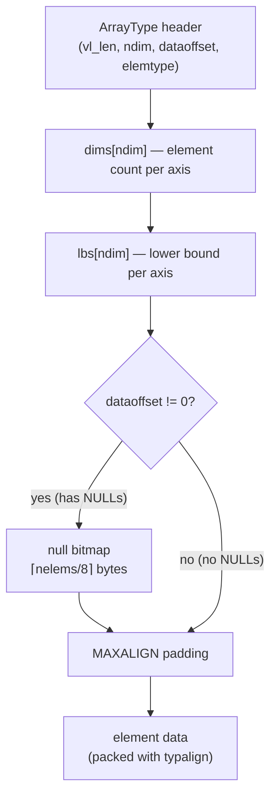

# Array Type Internals

PostgreSQL arrays are full first-class values: you can store them in columns, pass them as function arguments, index them, and aggregate into them. Internally, arrays solve several tensions simultaneously: multiple dimensions, arbitrary element types, arbitrary lower bounds, optional NULLs, and efficient TOAST compression. They do this within a single flat varlena allocation that needs no pointer chasing to traverse.

## On-Disk Format

An array is a standard varlena object. The first four bytes are the total datum size (accessed via `VARSIZE()`/`SET_VARSIZE()`). The `ArrayType` struct (`array.h`) defines what follows:

```
[ vl_len_ | ndim | dataoffset | elemtype | dims[ndim] | lbs[ndim] | [nullbitmap] | data ]
```

The four fixed fields occupy 16 bytes on most platforms. Immediately after them come two C arrays of `int`, each `ndim` elements long: the dimension sizes (`ARR_DIMS()`), and the lower bound of each dimension (`ARR_LBOUND()`). Then, if any element is NULL, a null bitmap. Then, starting on a `MAXALIGN` boundary, the element data.

The `dataoffset` field serves a dual purpose. When it is zero, there is no null bitmap. PostgreSQL must then compute the data offset on-the-fly from the number of dimensions (`ARR_OVERHEAD_NONULLS(ndim)`). When it is nonzero, its value is the byte offset from the start of the `ArrayType` to the first data byte. The null bitmap then starts immediately after the lower-bound array. The `ARR_HASNULL()` macro simply tests whether `dataoffset != 0`.

### Dimensions and Lower Bounds

PostgreSQL supports up to six dimensions (`MAXDIM = 6`). Each dimension has an independent length and lower bound. The default lower bound is 1, so a freshly created `ARRAY[10, 20, 30]` has `dims = {3}` and `lbs = {1}`. This makes valid subscripts 1 through 3. But lower bounds can be any integer. Array slice results and certain explicit constructions produce arrays where the lower bound differs from 1. PostgreSQL preserves this lower bound in the `lbs` array, and it matters for all subscript arithmetic.

PostgreSQL stores elements in row-major order: for a 2D array, the last subscript (column index) varies most rapidly in the flat storage. `ArrayGetOffset()` (`arrayutils.c`) converts a multi-dimensional subscript vector to a linear element number. It walks from the last dimension to the first, accumulating `(indx[i] - lbs[i]) * scale`:

```
offset = sum over i from (ndim-1) down to 0 of (indx[i] - lbs[i]) * product(dims[i+1..ndim-1])
```

### Element Storage and Alignment

Fixed-width element types like `int4` or `float8` are packed directly in the data area, separated only by alignment padding. Variable-width types like `text` are stored inline with their individual varlena headers. Each element is laid out at its natural alignment boundary (`typalign`), using the same `att_align_nominal` / `att_addlength_pointer` macros used for heap tuple attributes.

One important constraint: individual array elements must **not** be out-of-line TOASTed. The tuple toaster cannot locate elements buried inside an array value. It has no knowledge of array structure. Compressed inline storage is permitted, but out-of-line references are not. As a result, large arrays are toasted as a whole — the entire array value is compressed or moved out-of-line together. This is generally the right tradeoff: the toaster compresses the entire element stream, which achieves better ratios than compressing each element individually.

### The NULL Bitmap

If any element is NULL, the `dataoffset` field becomes nonzero. PostgreSQL then inserts a null bitmap between the lower-bound array and the data area. The bitmap follows the same convention as heap tuple null bitmaps: one bit per element, LSB of each byte first, 1 meaning non-null. The `array_get_isnull()` and `array_set_isnull()` helpers in `arrayfuncs.c` read and write individual bits using `nullbitmap[offset / 8]` and `(1 << (offset % 8))`.

Arrays with no NULLs omit the bitmap entirely. This saves ceil(nelems / 8) bytes and removes the bitmap test from the inner loop of every traversal. The savings are meaningful for large arrays of small fixed-width types where the bitmap would be a significant fraction of the total size.



## Subscript Access and Slicing

Reading a single element proceeds in three steps. First, PostgreSQL validates the subscript vector against the lower bounds and dimension sizes stored in the header. Second, `ArrayGetOffset()` computes the linear element index. Third, `array_seek()` walks forward through the data area to find the element's byte position, skipping over NULL entries. These consume no bytes in the data area, only bits in the bitmap. For fixed-width types with no NULLs, `array_seek()` reduces to a single multiplication — `ptr + nitems * aligned_element_size`. This makes random access O(1). For variable-width types, seeking to element *k* is O(*k*) because element sizes differ.

`array_get_element()` (`arrayfuncs.c`) surfaces element access. It handles flat varlena arrays, expanded arrays (see below), and fixed-length array types (like `point`, which are just sequences of fixed-size elements with no overhead). The public wrapper `array_ref()` is a thin shim that calls `array_get_element()`.

`array_get_slice()` handles array slicing — `arr[2:4]` or `arr[1:2][1:3]` for multi-dimensional arrays. The result is a new `ArrayType` whose dimension sizes and lower bounds reflect the slice boundaries. The lower bound of each dimension in the result equals the requested slice start, preserving subscript meaning. The implementation uses the multidimensional array iteration utilities in `arrayutils.c` (`mda_get_range()`, `mda_get_prod()`, `mda_get_offset_values()`, `mda_next_tuple()`) to step through the source array, copying only the elements within the slice region.

### Immutability and Copy-on-Write

Arrays are immutable varlenas. Updating a single element — `arr[3] := 42` — or replacing a slice does not modify the existing array in place. Instead, `array_set_element()` and `array_set_slice()` allocate a fresh `ArrayType`, copy the unchanged portions from the original, and write the new value into the appropriate position. The old array remains intact, which is correct for PostgreSQL's copy-on-write tuple semantics. The write amplification this creates grows linearly with array size. Updating a single element in a 10,000-element array copies all 10,000 elements. An array of 100,000 integers copies roughly 400 kB on every update. For tables where individual array elements are frequently updated in isolation, a junction table is almost always faster.

## The Expanded Array Representation

When PL/pgSQL or other code performs many subscript operations on the same array, the flat representation imposes repeated detoasting and O(k) seek costs. To avoid this, PostgreSQL supports an *expanded* representation (`ExpandedArrayHeader`, `array.h`; implemented in `array_expanded.c`).

An expanded array lives in a private [[subsystems/memory/contexts|memory context]] and holds a Datum array (`dvalues`) plus a bool array (`dnulls`) alongside the dimensionality information and element type metadata. Once expanded, subscript reads are O(1): just index into `dvalues[offset]`. Writes modify the Datum in place without copying the entire array.

The expanded form is interchangeable with the flat form through the `AnyArrayType` union and the `AARR_*` family of macros (`AARR_NDIM`, `AARR_DIMS`, `AARR_LBOUND`, `AARR_HASNULL`, `AARR_ELEMTYPE`). Code that wants to handle both forms without branching calls `DatumGetAnyArrayP()` and then accesses the array through those macros. When the expanded array eventually needs to be written to a heap tuple, `EA_flatten_into()` serializes it back to the flat varlena format.

## Array Construction

### The ARRAY[] Constructor

PostgreSQL represents `ARRAY[1, 2, 3]` in the plan tree as an `ArrayExpr` node. The executor evaluates each element expression and calls `construct_array()` (or the more general `construct_md_array()` for multi-dimensional cases) to build the resulting `ArrayType`. `construct_array()` allocates a single palloc region, writes the header, and calls `CopyArrayEls()` to serialize the Datum values into the element data area, inserting alignment padding as required.

Multi-dimensional array construction from nested `ARRAY[]` expressions works the same way, but requires that all sub-arrays have the same dimensions. The planner checks this during parse analysis.

### Aggregation with array_agg()

`array_agg()` must collect an unbounded number of rows without knowing the final count in advance. It uses `ArrayBuildState` (`array.h`) as its working state: a growable Datum array and a bool array for null flags, allocated in a dedicated memory context. `accumArrayResult()` appends each new element, doubling the allocation when needed. At the end of the aggregate, `makeMdArrayResult()` serializes the accumulated Datums into a final `ArrayType`, computing the correct header fields and null bitmap if any NULLs were encountered.

When aggregating arrays rather than scalars (as in `array_agg()` over an array column), the analogous `ArrayBuildStateArr` accumulates raw element bytes directly. This avoids intermediate Datum representation.

### Expanding an Array into Rows

`unnest(arr)` is a set-returning function that expands an array into one row per element. It uses `array_create_iterator()` / `array_iterate()` to step through the flat storage one element at a time, handling the null bitmap and variable-width element sizing internally. Each call to `array_iterate()` advances a position cursor and returns the next element as a Datum plus an isnull flag.

For multi-dimensional arrays, `unnest()` treats the entire array as a flat sequence: a 3×4 array produces 12 rows. The function does not peel dimensions. It returns individual elements regardless of dimensionality. When multiple `unnest()` calls appear in the same `FROM` clause (or `SELECT` list in PostgreSQL 9.4+), PostgreSQL zips them together: it combines corresponding rows from each call and pads shorter sequences with NULLs.

## GIN Index Support

A B-tree index on an array column is not useful for membership queries: searching for rows where `5 = ANY(arr)` would require scanning the entire array for every row. GIN (Generalized Inverted Index) solves this by storing one posting list per distinct element value, mapping element values to the set of heap TIDs containing that value.

The `gin_array_ops` operator class (`ginarrayproc.c`) provides four support functions that translate between array values and GIN entries:

- `ginarrayextract()` (extractValue): given an indexed array, deconstructs it and returns all element Datums as the set of keys to index.
- `ginqueryarrayextract()` (extractQuery): given a query array and a strategy number, returns the element keys that GIN should look up.
- `ginarrayconsistent()` / `ginarraytriconsistent()`: given the set of which queried keys were found in the index, determines whether the heap row matches the original predicate.

The four supported strategies map to operators:

| Strategy | Operator | Semantics |
|----------|----------|-----------|
| 1 | `&&` | overlap: at least one element in common |
| 2 | `@>` | contains: left has all elements of right |
| 3 | `<@` | contained by: right has all elements of left |
| 4 | `=` | equal (as multisets) |

For the overlap strategy, the consistent function needs to find at least one key in common — GIN's per-element posting lists make this O(log n) rather than O(rows × elements). For containment (`@>`), all queried keys must be present. The consistent function checks that every entry in `check[]` is true. For `<@` (contained-by) and `=`, GIN can filter candidates, but it requires a recheck against the heap tuple. The posting lists alone cannot verify that the indexed array has no extra elements beyond those in the query.

A query written as `WHERE 5 = ANY(arr)` does **not** automatically use a GIN index. Rewriting it as `WHERE arr @> ARRAY[5]` triggers the `@>` operator and GIN scan.

## Performance Considerations

### TOAST and Large Arrays

An array is a varlena and participates in TOAST like any other large value. When an array exceeds roughly 2 kB, PostgreSQL will attempt to compress it in place. If it remains large, PostgreSQL will move it out-of-line to a TOAST table. Reading a TOASTed array requires detoasting before the first element access, which copies the (possibly decompressed) value into memory. For workloads that frequently read single elements from large arrays, this full detoast cost can dominate. The expanded representation amortizes it across multiple accesses within a session.

### NULL Bitmap Overhead

The null bitmap is absent when no element is NULL. This saves both space and a branch per element during traversal. Adding even one NULL to an array forces the bitmap to be present for all future operations on that value. The bitmap's size grows as ceil(nelems / 8) bytes, which is negligible for most arrays but worth noting for arrays of millions of small fixed-width elements.

### GIN Write Cost

GIN maintains a posting list per distinct element value. This means inserting a row with an array of *k* distinct elements inserts *k* entries into the GIN index — potentially into *k* different posting lists. For arrays with high cardinality, GIN write amplification can be substantial. GIN mitigates this with a pending list (fastupdate mode): new entries accumulate in a small linear structure and are merged into the main index in bulk. The tradeoff is that queries may need to scan both the main index and the pending list until the pending list is flushed.

## Operators and Functions

The most commonly used array operators and functions and what they do internally:

- `||` (concatenation), `array_append()`, `array_prepend()`: these all allocate a new `ArrayType` sized for the combined elements and copy both sides in. None of them mutate the inputs.
- `array_length(arr, dim)`: returns `ARR_DIMS(arr)[dim-1]` directly from the header; O(1).
- `cardinality(arr)`: calls `ArrayGetNItems()` on the dims array; the product of all dimension sizes.
- `array_dims(arr)`: formats the per-dimension `[lb:ub]` strings from the header data.
- `array_position(arr, elem)`: linear scan comparing each element using the type's equality operator; no index support.
- `array_positions(arr, elem)`: like `array_position()` but collects all matching subscripts.
- `array_to_string(arr, delim)` / `string_to_array(str, delim)`: use the element type's output/input functions to convert; operate only on 1D arrays.
- `array_fill(value, dims)`: constructs an array of given dimensions where every element is the same value; builds directly from `ARR_OVERHEAD_NONULLS` + replicated element data.

## Related Topics

- [[subsystems/storage/toast|TOAST storage]] — how large arrays are compressed and moved out-of-line
- [[subsystems/indexes/gin|GIN]] — GIN index architecture and the inverted index model
- [[subsystems/types|Type system overview]] — how typalign, typlen, and typbyval are determined per type
