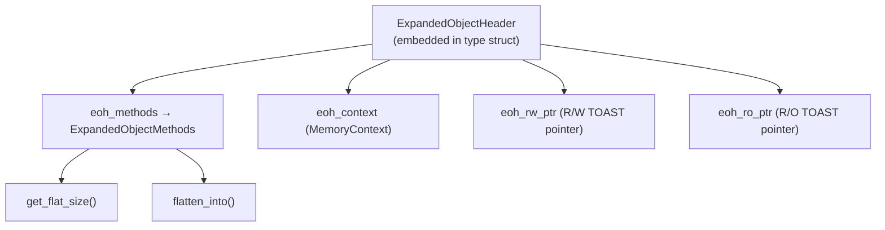

The expanded datum mechanism lets PostgreSQL keep complex values — arrays, composite records, and custom container types — in a decomposed in-memory form that is cheap to read and modify. This avoids the cost of repeatedly decompressing and reparsing the flat on-disk representation. Without it, every read from a [[subsystems/storage/toast|TOAST]]'d large array inside a loop would trigger a full decompression cycle, making operations like element-by-element array updates catastrophically slow.

## The Cost of the Flat Representation

Every varlena value stored on disk is a contiguous blob of bytes — the "flat" or "flattened" form. For simple types this is fine. For containers like arrays, the flat form packs element data, dimension metadata, and null bitmaps into a single allocation. Accessing element `i` requires scanning or indexing into this blob. Modifying it requires producing an entirely new copy. When the value is also TOAST-compressed, each access adds a decompression step on top.

In a PL/pgSQL loop that repeatedly updates elements of a large array, the naïve approach allocates a new flat copy on every iteration. An array with a thousand integers and a thousand-iteration loop produces a thousand allocations and copies of the same data. The expanded representation solves this by holding the array in a form that is convenient for computation — for example, as a C array of `Datum` values. It converts back to the flat form only when the value must be stored, or passed to a function that does not understand the expanded form.

## ExpandedObjectHeader and the Methods Interface

Every expanded object, regardless of type, begins with an `ExpandedObjectHeader` (`expandeddatum.h`). This header is embedded as the first field of a type-specific struct. As a result, a pointer to the header is also a pointer to the object. The header carries three things: a sentinel value (`EOH_HEADER_MAGIC`, `-1` cast to `int32`) that distinguishes it from any legitimate flat varlena; a pointer to the type's method table; and the owning [[subsystems/memory/contexts|memory context]].

The method table (`ExpandedObjectMethods`) has exactly two callbacks:

- `get_flat_size(eohptr)` — returns the number of bytes needed to store the flattened form.
- `flatten_into(eohptr, result, allocated_size)` — writes the flattened form into a caller-supplied buffer.

These two callbacks are the entire contract between the generic expanded-datum infrastructure and a concrete type. The generic code calls `get_flat_size` first to allocate a buffer. It then calls `flatten_into` to fill it. This happens whenever the generic code needs to store or transmit the value. The type-specific code is otherwise free to represent the expanded state however it likes. During heap-tuple construction, the executor calls `get_flat_size` twice — once to size the tuple, once to verify. It must therefore be cheap.

## Read-Write and Read-Only Pointers

PostgreSQL encodes an expanded object reference as an external TOAST pointer (`VARTAG_EXPANDED_RW` or `VARTAG_EXPANDED_RO`) whose payload is simply a pointer to the `ExpandedObjectHeader`. The header pre-builds and stores two such pointers directly inside itself — one read-write (`eoh_rw_ptr`), one read-only (`eoh_ro_ptr`). This means returning either kind of pointer never requires a separate allocation.

The distinction matters for in-place modification. Holding a read-write (`RW`) pointer is an assertion that no other party holds a reference to the same object. The holder is the sole owner. It may modify the expanded state without first making a copy. A read-only (`RO`) pointer carries no such guarantee. Code that wants to modify a value accessed through a RO pointer must first copy it.

`EOHPGetRWDatum` and `EOHPGetRODatum` convert an `ExpandedObjectHeader` pointer into the corresponding Datum in O(1). Going the other way, `DatumGetEOHP` extracts the `ExpandedObjectHeader` pointer from any expanded-object Datum. `MakeExpandedObjectReadOnly` (and its internal counterpart `MakeExpandedObjectReadOnlyInternal`) downgrades a RW Datum to a RO Datum without touching the object. Callers use this when a value must be passed to code that may retain a reference to it beyond the current expression context.

## Memory Context Ownership and Lifetime

Each expanded object owns its own private memory context. The header, the type-specific struct fields, and all subsidiary allocations (element arrays, copied strings, etc.) live inside this context. Deleting the object is therefore just `MemoryContextDelete(eohptr->eoh_context)`. The `DeleteExpandedObject` helper wraps this call.

`TransferExpandedObject` handles ownership transfer. It calls `MemoryContextSetParent` to re-parent the object's context under a new parent. This is how a value created inside a short-lived expression context is promoted to the lifespan of a PL/pgSQL variable. `TransferExpandedObject` moves the object's context to be a child of the function's top-level context. The object then survives the expression's cleanup. It is still freed when the function exits or the variable is reassigned.

When a PL/pgSQL variable is reassigned, the executor must free the old expanded object before installing the new one. Because the old and new objects each have their own context, this is again just a context deletion — no scanning of shared data structures is required.

## PL/pgSQL Array and Record Fast Paths

The primary beneficiary of the expanded representation is PL/pgSQL. PL/pgSQL stores local variables that hold arrays or composite values (records) in expanded form for the entire duration of the function. Assignment operators in PL/pgSQL check whether the source is already an RW expanded object. If so, they transfer ownership directly rather than copying the data.

The most important fast path is array element assignment (`a[i] := x`). In the flat representation this would require decompressing the TOAST'd array, copying the entire element array with the modification applied, then re-compressing. In the expanded representation, the element update modifies the in-memory Datum array in place. It simply marks the flat cache invalid, deferring reconstruction until the value is actually stored. The savings compound dramatically in loops.

When a value does need to leave the expanded world — for example, when it is inserted into a table row, or passed to a built-in function that only understands flat varlena — the executor invokes the `flatten_into` callback to produce a contiguous storable blob. The expanded object is not disturbed. It remains available for further use.

## Passing Expanded Values Through the Executor

Not all executor code is aware of expanded objects. A function that receives an argument through `PG_GETARG_*` macros will typically receive a flat varlena if the argument is a TOAST pointer. The argument-fetching machinery calls `detoast_attr`, which invokes `flatten_into` transparently for an expanded pointer.

Functions that explicitly opt in to the expanded representation call `PG_GETARG_EXPANDED_*` variants. These variants return the `ExpandedObjectHeader` pointer directly. Such functions must also be prepared to handle a plain flat varlena, when the input was not in expanded form to begin with. The first-call code may still need to construct the expanded form from a flat input.

The rule for passing values between expression steps has two parts. A step that produces a new or modified expanded object returns an RW Datum. A step that only reads a value, and may pass it to unknown callers, downgrades it to RO first with `MakeExpandedObjectReadOnly`. This ensures that any code which receives an RW Datum truly has exclusive ownership.

## Related Topics

- [[subsystems/storage/toast]]
- [[subsystems/types/array-internals]]
- [[subsystems/types/expanded-records]]
- [[subsystems/memory/contexts]]
- [[subsystems/plpgsql/overview|PL/pgSQL executor]]
