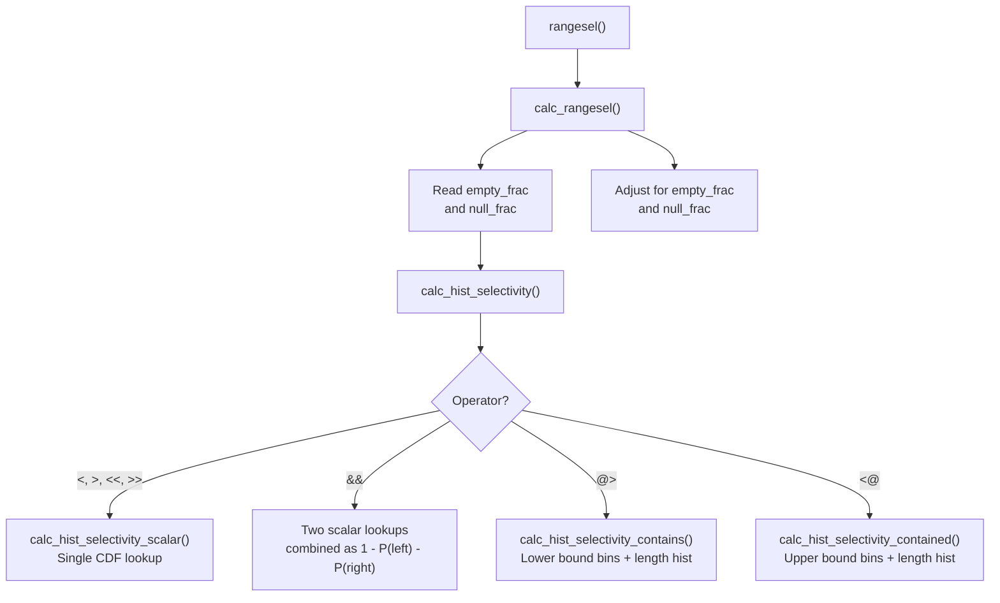

Range operators like `&&` (overlaps), `@>` (contains), and `<@` (contained by) have no scalar equivalent, so the standard MCV-and-histogram machinery that the planner uses for `<` or `=` predicates cannot estimate their selectivity directly. PostgreSQL addresses this by registering a custom `ANALYZE` handler for range columns that collects two additional statistic kinds — a histogram of lower and upper bounds, and a histogram of range lengths. It pairs them with a custom selectivity estimator, `rangesel()`, that understands how to combine those structures for each range operator. Without this infrastructure, any query like `WHERE schedule && '[2024-01-01,2024-01-07)'` would receive a crude default estimate of 1%. That default could cause the planner to choose a sequential scan over an available GiST index, or a nested loop over a hash join.

## What ANALYZE collects for range columns

When ANALYZE encounters a range or multirange column, it invokes `range_typanalyze()` or `multirange_typanalyze()` (`rangetypes_typanalyze.c`) instead of the generic `std_typanalyze()`. Both functions install `compute_range_stats()` as their statistics-computation callback, so the same logic handles both column types.

During the sample pass, `compute_range_stats()` iterates over the sampled rows. It separates them into three groups: NULL values, empty ranges, and non-empty ranges. For each non-empty range, it records the lower and upper `RangeBound` structs. It also computes the range's length. When the subtype has a registered `subdiff` function, `compute_range_stats()` uses it to calculate length as the difference between the two bound values, returned as a `float8`. GiST uses the same `subdiff` function for split-quality estimation. If no `subdiff` is available, `compute_range_stats()` assigns every range a length of 1.0. This degrades subsequent containment estimates. It assigns infinite-bounded ranges a length of `+Infinity`.

For multirange columns, `compute_range_stats()` treats each non-empty multirange as the single contiguous span from its outermost lower bound to its outermost upper bound. This treatment discards the internal gaps. The approximation is consistent with how the selectivity estimator later reads the statistics.

`compute_range_stats()` writes two statistics slots into `pg_statistic` from the collected non-empty samples (`rangetypes_typanalyze.c`):

**`STATISTIC_KIND_BOUNDS_HISTOGRAM`** — a histogram of range values. Each entry is a valid `RangeType` value formed by pairing the i-th sorted lower bound with the i-th sorted upper bound from the sample. Crucially, `compute_range_stats()` sorts the lower bounds and upper bounds independently before pairing them together. This means each entry in the array is not necessarily a range that actually existed in the table. Instead, it is an artificial range. Its lower bound represents the lower-bound distribution at that quantile, and its upper bound represents the upper-bound distribution at the same quantile. The resulting array encodes both bound distributions simultaneously in a single sequence. `statistics_target` controls the number of entries (101 by default, one more than `default_statistics_target`).

**`STATISTIC_KIND_RANGE_LENGTH_HISTOGRAM`** — a histogram of range lengths, stored as an array of `float8` values sorted in ascending order. Its `stanumbers[0]` slot holds the fraction of non-null values that are empty ranges. `calc_rangesel()` reads this fraction to handle empty-range edge cases.

`compute_range_stats()` also records the fraction of empty ranges and the fraction of NULL values. The NULL fraction goes into the standard `stanullfrac` field of `pg_statistic`. The empty fraction is stored alongside the length histogram in the same slot. Neither of these is a histogram entry — they are scalar statistics used as adjustments on top of the histogram estimates.

## The structure of the bounds histogram

Understanding why PostgreSQL builds the bounds histogram this way matters for understanding how it estimates selectivity. Building the histogram sorts all sampled lower bounds and all sampled upper bounds independently, then interleaves them into range objects. The result is a pair of cumulative distribution functions — one for lower bounds, one for upper bounds — packed into a single array.

For any query constant `C`, the estimator can ask: "what fraction of lower bounds are below some threshold?" by binary-searching the lower-bound CDF, and "what fraction of upper bounds are above some threshold?" by binary-searching the upper-bound CDF. These two primitives are sufficient to express almost every range operator in terms of CDF queries.

The independent sorting of lower and upper bounds is significant. The stored pairs do not derive from real co-occurring bounds within a single row. Instead, they encode each dimension's marginal distribution. This means the estimator implicitly assumes that a range's lower bound and its length are statistically independent — an assumption that fails when, for example, older reservation records tend to be longer than recent ones, or when ranges cluster in predictable positions. In practice, the approximation is good enough for the planner's purposes even when some correlation exists.

## Selectivity estimation for each operator

The entry point is `rangesel()` (`rangetypes_selfuncs.c`), registered in `pg_operator` as the restriction estimator (`oprrest`) for all range operators. It identifies which variable is the column and which is the constant. It commutes the operator if the constant is on the left. Then it extracts the constant's `RangeType` value and hands off to `calc_rangesel()`.

`calc_rangesel()` reads `stanullfrac` from `pg_statistic` and the empty fraction from the length histogram slot. It then adjusts the histogram estimate for the proportion of NULL and empty values before returning. The core estimation happens in `calc_hist_selectivity()`. It deserializes the bounds histogram into parallel `hist_lower[]` and `hist_upper[]` arrays, then dispatches by operator.

### Positional and ordering operators

For the B-tree ordering operators (`<`, `<=`, `>`, `>=`) and the strictly-before/strictly-after operators (`<<`, `>>`), estimation reduces to a single CDF lookup: what fraction of values in the column have a lower (or upper) bound below some threshold?

`calc_hist_selectivity_scalar()` performs this lookup. It binary-searches the bounds array using `rbound_bsearch()`. This finds which histogram bin contains the query bound. It then linearly interpolates within that bin. Interpolation uses the range subtype's `subdiff` function to compute the query bound's position within the bin as a fraction of the bin's width. For example, if the query value lies 30% of the way between two histogram boundary values, the interpolated position is 0.30. When `subdiff` is unavailable, interpolation falls back to 0.5. This places the estimate at the midpoint of the bin. The operator mapping is:

| Operator | Histogram dimension | Direction |
|---|---|---|
| `<` (range less than) | lower bounds | fraction below `const_lower` |
| `>` (range greater than) | lower bounds | complement of above |
| `<<` (strictly left of) | upper bounds | fraction below `const_lower` |
| `>>` (strictly right of) | lower bounds | fraction above `const_upper` |
| `&<` (does not extend right) | upper bounds | fraction at or below `const_upper` |
| `&>` (does not extend left) | lower bounds | fraction at or above `const_lower` |

### Overlap (`&&`)

PostgreSQL estimates the overlap operator via the logical equivalence `A && B ⟺ NOT (A << B OR A >> B)`. Since "strictly left of" and "strictly right of" are mutually exclusive events, their probabilities add directly:

```
P(A << B OR A >> B) = P(upper(A) < lower(B)) + P(lower(A) > upper(B))
P(A && B)           = 1.0 − P(A << B OR A >> B)
```

`calc_hist_selectivity()` computes the two non-overlapping probabilities using `calc_hist_selectivity_scalar()` — one against the upper-bound histogram and one against the lower-bound histogram. It then subtracts their sum from 1.0. This is the same approach used for multirange columns. The `range @> elem` operator routes through the same path by first converting the scalar element into a degenerate single-point range.

### Containment (`@>`) and contained-by (`<@`)

Bound-CDF queries alone cannot estimate these operators, because containment depends not just on where a range's bounds fall, but also on how wide the range is. A predicate `r @> '[10, 50)'` asks: "what fraction of ranges in the column start at or before 10 and end at or after 50?" — a two-dimensional constraint that couples the lower bound's position with the required minimum range length.

The estimator decouples these two dimensions by assuming independence between a range's lower bound and its length. Under this assumption, the estimator computes selectivity by iterating through histogram bins of lower bounds. For each bin, it asks what fraction of ranges with a lower bound in that bin are long enough to reach past the query's upper bound.

For **`var @> const`** (`calc_hist_selectivity_contains()`), the algorithm walks lower-bound histogram bins from right to left starting at the bin containing `const_lower`. For each bin, it measures the distance from the bin's lower bound to `const_upper`. It then queries the length histogram for the fraction of ranges with length at least that distance. The length histogram query integrates the empirical CDF of lengths over the interval `[prev_dist, dist]` using a piecewise-trapezoid method (`calc_length_hist_frac()`). The total selectivity is the sum of bin-fraction × length-fraction products across all bins.

For **`var <@ const`** (`calc_hist_selectivity_contained()`), the symmetric question is: what fraction of column ranges have both their lower bound above `const_lower` and their upper bound below `const_upper`? The algorithm walks bins from the bin containing `const_upper` down to the bin containing `const_lower`. For each bin, it measures what fraction of ranges are short enough to fit within the available window.

Both algorithms rely on `get_distance()` to convert the distance between two `RangeBound` values into a numeric quantity. `get_distance()` calls the subtype's `subdiff` function, falling back to 1.0 if none is registered. This fallback makes the length histogram integration imprecise, in the same way that missing `subdiff` affects bound interpolation.



## Empty range handling

Before consulting any histogram, `calc_rangesel()` checks whether the query constant is itself an empty range. The semantics of range operators against an empty range are fixed and do not depend on the column distribution:

- `&&`, `<<`, `>>`, `<` with an empty constant: selectivity 0 (nothing overlaps or precedes an empty range)
- `<@` with an empty constant: every non-empty column value "contains" the empty range, so selectivity equals the non-empty fraction
- `@>` with an empty constant: every column value (including empty ones) contains an empty range, so selectivity is 1.0
- `<@` against an empty column value: the empty fraction (empty is contained by anything)

These special cases avoid consulting the bounds histogram entirely. This is correct, because the histogram explicitly excludes empty ranges from its samples.

## Multirange types

`multirangesel()` (`multirangetypes_selfuncs.c`) handles multirange selectivity. It delegates to the same `calc_hist_selectivity()` function used by `rangesel()`. The key difference is how the system represents multirange constants: it collapses a multirange with multiple component ranges to the span between its outermost lower bound and its outermost upper bound before any histogram lookup. This means `col && '{[1,2],[1000,1001]}'::int4multirange` receives the same estimate as `col && '[1,1001)'::int4range` — the estimator ignores the internal gaps.

`multirange_typanalyze()` registers the same `compute_range_stats()` callback as `range_typanalyze()`. It reduces each multirange value to its outer span to build the histogram. So both the statistics collection and the selectivity estimation make the same approximation consistently.

## The role of `subdiff` in estimation quality

The subtype difference function (`rngsubdiff`, stored in `pg_range`) has a disproportionate influence on range selectivity accuracy. Two places depend on it:

**Bound interpolation within histogram bins.** When a query bound falls between two histogram bucket boundaries, `get_position()` uses `subdiff` to compute where within the bin the bound lies, as a fraction of the bin's width. Without `subdiff`, every within-bin interpolation returns 0.5. This places the estimate at the bin midpoint regardless of where the query bound actually falls. It inflates errors for predicates near the edges of bins.

**Length histogram integration for containment.** `get_distance()` uses `subdiff` to convert a gap between two bounds into a numeric length, which `calc_length_hist_frac()` then looks up in the length histogram. Without `subdiff`, `get_distance()` treats all inter-bound distances as 1.0. This makes the length histogram useless for containment estimation.

All built-in range types register `subdiff` functions (e.g., `int4range_subdiff`, `tsrange_subdiff`). Custom range types that omit `subdiff` receive degraded selectivity estimates for `@>` and `<@`, in addition to the GiST index quality degradation described in [[subsystems/types/range-types]].

## What the planner does with the estimate

The selectivity returned by `rangesel()` flows directly into the path cost model: for a restriction clause on a base relation, the estimated number of qualifying rows is `selectivity × total_rows`. When the estimate is reasonable, the planner can correctly compare the cost of an index scan (typically proportional to `selectivity × rows × random_page_cost`) against a sequential scan (proportional to `total_pages × seq_page_cost`).

For a booking or scheduling table with a GiST index on a `tstzrange` column, a query like `WHERE schedule && '[2024-01-01,2024-01-07)'` might have a true selectivity of 2%. With accurate range statistics, the planner estimates something close to 2%. It then chooses the index scan. Without statistics — or with a custom range type missing `subdiff` — the planner uses the hard-coded default of 1% (`default_range_selectivity()`, `rangetypes_selfuncs.c`). This default is close enough in this case, but it diverges badly for highly selective predicates, like a one-hour window in a year's worth of appointments. It also diverges for `@>` and `<@`, where containment depends strongly on range widths.

The statistics are inspectable via `pg_stats`. Before PostgreSQL 17, ANALYZE wrote the bounds histogram and length histogram to `pg_statistic`, but it did not expose them as named columns in `pg_stats`. PostgreSQL 17 adds `range_length_histogram` and `range_bounds_histogram` columns to `pg_stats`. This makes the collected statistics directly queryable without accessing the raw `pg_statistic` slots.

## Related Topics

- [[subsystems/types/range-types|range types]] — range representation, operators, and index support
- [[subsystems/planner/selectivity-estimation|selectivity estimation]] — the general framework for restriction and join selectivity
- [[subsystems/planner/statistics|planner statistics]] — how ANALYZE stores and exposes column statistics
- [[subsystems/planner/extended-statistics|extended statistics]] — multi-column statistics for correlated predicates
