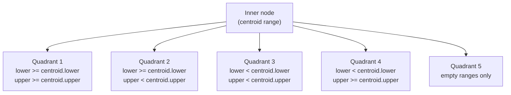

# Range and Multirange Types

A range type represents a contiguous set of values of some element type, called the *subtype*. Rather than storing individual values, a range captures the span from one endpoint to another, with each endpoint being either inclusive, exclusive, or absent (unbounded). This model maps naturally to many real-world domains: booking periods, salary bands, IP address blocks, numeric tolerances, and temporal validity.

PostgreSQL ships six built-in range types — `int4range`, `int8range`, `numrange`, `tsrange`, `tstzrange`, and `daterange`. It also allows users to define additional range types over any subtype that has a btree ordering. Multirange types, introduced in PostgreSQL 14, extend this further. A multirange represents an ordered set of non-overlapping, non-adjacent ranges as a single value, covering use cases like recurring schedules or the union of many disjoint intervals.

## Range Representation and Bounds

Each range has a lower bound and an upper bound, each of which is in one of three states:

- **Inclusive** — the endpoint value is part of the range. Written `[` or `]`.
- **Exclusive** — the endpoint value is not part of the range. Written `(` or `)`.
- **Unbounded (infinite)** — there is no endpoint in that direction. The range extends without limit. Written as an empty field inside the delimiting bracket, e.g. `(,5]`.

This gives the familiar notation `[lower,upper)` for the common half-open interval. Two special cases deserve attention:

- **Empty range**: a range containing no values at all, written as the literal `empty`. This is conceptually distinct from a range whose bound values happen to leave no room. For example, `(3,3)` has equal bounds, but neither is inclusive. For discrete types, the canonicalization function normalises such a range to the empty flag. For continuous types, though, the empty flag is only set when the parser or code explicitly constructs an empty range.
- **Infinite bounds**: an infinite lower bound means the range extends arbitrarily far downward. An infinite upper bound means it extends without limit upward. Infinite bounds are never inclusive — the concept does not apply when there is no bound value.

**PostgreSQL 17:** The `interval` type gains `+infinity` and `-infinity` values. PostgreSQL can store infinite intervals directly, and they participate in comparisons. This eliminates the need to use `NULL` as a sentinel for "no end" when working with interval-based range expressions.

The in-memory working representation (`RangeBound` in `rangetypes.h`) carries four fields: the bound value as a `Datum`, a boolean `infinite`, a boolean `inclusive`, and a boolean `lower` indicating whether this is the lower or upper bound. That last field matters when comparing bounds: a lower bound of value `X` with `inclusive = false` (meaning the range starts just above `X`) sorts differently from an upper bound of value `X` with `inclusive = false` (meaning the range ends just below `X`). The function `range_cmp_bounds()` in `rangetypes.c` handles all these cases uniformly.

## On-Disk Format

A range value is a standard varlena object. Its binary layout (documented in `rangetypes.c`) is:

```
4 bytes  : varlena header (total size via VARSIZE)
4 bytes  : range type OID (rangetypid)
0–2 subtype values, each aligned per the subtype's typalign
1 byte   : flags
```

The flags byte packs all bound metadata into a single byte using bitmasks defined in `rangetypes.h`:

| Bit | Constant | Meaning |
|-----|----------|---------|
| 0x01 | `RANGE_EMPTY` | Range is empty; no bound values are present |
| 0x02 | `RANGE_LB_INC` | Lower bound is inclusive |
| 0x04 | `RANGE_UB_INC` | Upper bound is inclusive |
| 0x08 | `RANGE_LB_INF` | Lower bound is −∞; no lower bound value is stored |
| 0x10 | `RANGE_UB_INF` | Upper bound is +∞; no upper bound value is stored |
| 0x80 | `RANGE_CONTAIN_EMPTY` | GiST internal: the subtree rooted here contains empty ranges |

PostgreSQL places the flags byte *after* the bound values deliberately. The varlena header and the OID together occupy exactly `sizeof(RangeType)` bytes — a naturally aligned boundary. Placing the first bound value immediately after the header avoids any padding, even for double-aligned types like `float8` or `timestamp`. A trailing flags byte needs no alignment padding because it sits at the very end of the varlena object.

When a bound is infinite or the range is empty, the corresponding bound value is simply absent from the binary layout. The macros `RANGE_HAS_LBOUND` and `RANGE_HAS_UBOUND` test the flags to decide whether to read each bound value during deserialisation.

Serialisation goes through `range_serialize()` and the higher-level `make_range()` in `rangetypes.c`. `range_serialize()` validates that the lower bound is not above the upper bound. It builds the flags byte, computes the total size including alignment padding, and allocates a zero-filled varlena. It then writes bound values in sequence using `datum_write()`. Deserialisation via `range_deserialize()` reads the flags byte from the last byte of the varlena (at `VARSIZE(range) - 1`). It then reads bound values from the start of the data area, using the subtype's alignment and length metadata from the type cache.

One important constraint: a range value cannot store out-of-line TOAST pointers, for the same reason an array or record cannot. `range_serialize()` detoasts any varlena-typed bound value before including it. It accepts compressed-in-line values, but the design prefers to store the full decompressed value and let TOAST compress the whole range object if needed.

## Subtype Canonicalization

Continuous subtypes like `numeric` or `timestamp` have infinitely many points between any two distinct values. For them, the choice of inclusive versus exclusive is meaningful: `(3.0,5.0]` and `[3.0,5.0)` are genuinely different ranges that cannot be collapsed further.

Discrete subtypes — `integer`, `bigint`, `date` — can always be normalised to a canonical form. PostgreSQL adopts the convention of **inclusive lower bound, exclusive upper bound** for all discrete ranges. The canonical functions `int4range_canonical`, `int8range_canonical`, and `daterange_canonical` (in `rangetypes.c`) implement this. For each non-infinite bound that deviates from the canonical form, the function increments the bound value by one and toggles inclusivity:

- An exclusive lower bound `(n` becomes the inclusive `[n+1` by adding one.
- An inclusive upper bound `n]` becomes the exclusive `(n+1)` by adding one and flipping.

For example, the integer range `(1,5]` becomes `[2,6)` after canonicalization. This means `(1,5]`, `[2,5]`, `[2,6)`, and `(1,6)` all canonicalize to the same value `[2,6)` and therefore compare as equal and hash identically — a requirement for correct operation of indexes, hash joins, and `GROUP BY`.

Canonicalization runs automatically on input, inside `make_range()`, which calls the type cache's `rng_canonical_finfo` function pointer if one is registered. The canonical function must be idempotent: calling it on an already-canonical range must return the range unchanged.

When you define a custom range type over a discrete subtype, you must supply your own canonical function:

```sql
CREATE TYPE myrange AS RANGE (
    subtype    = mytype,
    canonical  = my_canonical_func
);
```

Without a canonical function for a discrete subtype, range comparison still works mechanically. Logically identical ranges like `[1,3)` and `[1,2]`, though, will compare as unequal and hash to different values. This breaks equality-based operations.

## Built-in Range Types

| Range type | Element type | Canonical function | subtype_diff function |
|------------|--------------|--------------------|-----------------------|
| `int4range` | `integer` | `int4range_canonical` | `int4range_subdiff` |
| `int8range` | `bigint` | `int8range_canonical` | `int8range_subdiff` |
| `numrange` | `numeric` | — | `numrange_subdiff` |
| `tsrange` | `timestamp without time zone` | — | `tsrange_subdiff` |
| `tstzrange` | `timestamp with time zone` | — | `tstzrange_subdiff` |
| `daterange` | `date` | `daterange_canonical` | `daterange_subdiff` |

The subtype_diff functions return the numeric distance between two element values as a `float8`. The timestamp variants divide by `USECS_PER_SEC` to express the difference in seconds rather than microseconds. GiST uses these functions to estimate the width of a bounding range when computing split penalties. Without them, GiST treats all ranges as having equal width and cannot make intelligent split decisions.

## Operators and Functions

Range types expose a rich set of operators covering all useful interval arithmetic.

**Positional operators** (return boolean):
- `<<` — strictly left of: the entire left range ends before the right range begins
- `>>` — strictly right of: the entire left range begins after the right range ends
- `&<` — does not extend to the right of: the left range's upper bound does not exceed the right range's upper bound
- `&>` — does not extend to the left of: the left range's lower bound is no less than the right range's lower bound
- `-|-` — adjacent: the two ranges share exactly one boundary point and neither overlaps the other

The implementation of `-|-` in `range_adjacent_internal()` (`rangetypes.c`) tests whether the gap between the upper bound of one range and the lower bound of the other is empty. For discrete types, it does this by constructing a temporary range spanning that gap and checking if it canonicalizes to empty. For continuous types, no canonical function exists, so adjacency requires the bounds to be equal and have complementary inclusivity.

**Set-relationship operators**:
- `@>` — contains: the left operand contains every point of the right operand; the right operand can be either a range or a scalar element value
- `<@` — is contained by: the reverse of `@>`
- `&&` — overlaps: the two ranges share at least one point in common

**Arithmetic operators**:
- `+` (union) — requires the ranges to be adjacent or overlapping; raises `DATA_EXCEPTION` if the result would be non-contiguous. Use `range_merge()` instead when you want to bridge a gap.
- `*` (intersection) — returns the region common to both ranges, or empty if they do not overlap
- `-` (difference) — subtracts the second range from the first; raises an error if the result would be non-contiguous (e.g. subtracting a range from the interior of another, which would require two output ranges)

The difference operator's limitation reflects that a `range` value can represent only a single contiguous span. If you need to represent the result of a subtraction that splits a range into two pieces, the result belongs in a multirange.

**Scalar accessor functions**:
- `lower(r)`, `upper(r)` — returns the bound value, or NULL if the bound is infinite
- `isempty(r)` — true if the range contains no values
- `lower_inc(r)`, `upper_inc(r)` — bound inclusivity; false for infinite bounds
- `lower_inf(r)`, `upper_inf(r)` — true if the bound is infinite
- `range_merge(r1, r2)` — like `+` but does not require adjacency; fills any gap between the two ranges, returning the smallest range containing both inputs

## Multirange Types

A multirange is an ordered, non-overlapping, non-adjacent list of ranges of the same subtype. Rather than being a separate design, multiranges are the natural completion of the range type model: while a range covers the cases where a contiguous span is sufficient, a multirange handles any union of disjoint spans. The two types share operators and behave symmetrically: most operators defined between ranges also work between a range and a multirange or between two multiranges.

Multiranges are written with curly braces enclosing a comma-separated list of individual ranges: `{[1,3),[7,10)}`. An empty multirange is `{}`. `multirange_canonicalize()` (`multirangetypes.c`) enforces this invariant — sorted, non-overlapping, non-adjacent — automatically. It sorts the input ranges using the same `range_compare` function used for B-tree ordering, then merges any pair of ranges that overlap or are adjacent.

Each built-in range type has a corresponding multirange type:

| Multirange type | Element range type |
|-----------------|-------------------|
| `int4multirange` | `int4range` |
| `int8multirange` | `int8range` |
| `nummultirange` | `numrange` |
| `tsmultirange` | `tsrange` |
| `tstzmultirange` | `tstzrange` |
| `datemultirange` | `daterange` |

### On-Disk Format of Multiranges

The multirange on-disk format (detailed in `multirangetypes.c`) is designed to be both compact and efficiently random-accessible. A multirange begins with a 12-byte header (`MultirangeType`) containing the varlena size, the multirange type OID, and a 32-bit range count. Following the header are:

1. `(rangeCount - 1)` 32-bit *items* — one per range, starting from the second range
2. One 8-bit flags byte per range
3. The serialised bound values for all ranges, aligned per the subtype's `typalign`

The item array is a compact random-access structure. Most items store the *length* of the corresponding range's bound data, which is typically a small number. Every `MULTIRANGE_ITEM_OFFSET_STRIDE` items (every 4th), the item stores an absolute *offset* from the start of the bound values region, marked with the `MULTIRANGE_ITEM_OFF_BIT` high bit. This means:

- To reach range *i*, first find the nearest preceding offset item and read its absolute offset. Then advance through lengths until reaching range *i*.
- The worst case scans 3 length items. This gives O(1) access with a small constant.
- Keeping most items as lengths rather than offsets keeps the numbers small, which makes multirange values compress well via TOAST.

### Useful Multirange Operations

The range aggregation functions produce multirange results:

```sql
-- Build a multirange from individual ranges
SELECT int4multirange(int4range(1, 5), int4range(10, 20));
-- Result: {[1,5),[10,20)}

-- Aggregate many ranges into a multirange (merges overlaps automatically)
SELECT range_agg(during) FROM scheduled_events;

-- Aggregate intersection (common availability across all rows)
SELECT range_intersect_agg(available) FROM team_calendars;

-- Expand a multirange back into individual range rows
SELECT unnest('{[1,3),[7,10)}'::int4multirange);

-- Subtract a multirange from another: result is a multirange
SELECT '{[1,10)}'::int4multirange - '{[3,5)}'::int4multirange;
-- Result: {[1,3),[5,10)}
```

The `range_agg` aggregate is especially useful for normalising a set of possibly-overlapping intervals into a canonical non-overlapping representation. The `range_intersect_agg` aggregate computes the common overlap across a group, useful for finding time windows when all members of a team are simultaneously available.

Arithmetic on multiranges follows the same structure as range arithmetic. The subtraction operator `multirange - range` can produce a multirange with more components than the original if the range being subtracted falls in the interior of one of the multirange's members. This is the key advantage over operating on bare ranges: the result is always representable.

## Bound Comparison and Ordering

Comparing two range bounds sounds simple but has several edge cases that the infrastructure handles uniformly. The function `range_cmp_bounds()` in `rangetypes.c` takes two `RangeBound` structs and returns an integer in the usual three-way comparison style. Its logic addresses four distinct situations:

**Both bounds are infinite**: two negative infinities or two positive infinities are equal. A negative infinity is less than any finite value. A positive infinity is greater.

**Equal finite values, different inclusivity**: when the bound values are equal, the `lower` field of `RangeBound` determines how inclusivity affects ordering. For lower bounds, an inclusive lower bound `[X` represents a point set that starts exactly at `X`, while an exclusive lower bound `(X` represents a point set that starts just above `X`. Therefore `[X` is less than `(X` among lower bounds. For upper bounds the reasoning inverts: an inclusive upper bound `X]` includes `X`, while an exclusive upper bound `X)` does not. So `X]` is greater than `X)` among upper bounds.

This careful handling is what makes range containment and overlap detection correct at the boundaries. For example, `[1,3)` and `[3,5)` do not overlap — the first range ends just before 3, and the second starts exactly at 3. The test `range_cmp_bounds(upper_of_first, lower_of_second)` returns less-than zero. This confirms non-overlap.

**Bound comparison for operators**: most range operators decompose into a handful of bound comparisons. The overlap test `r1 && r2` is equivalent to `lower1 <= upper2 AND lower2 <= upper1`. Containment `r1 @> r2` requires `lower1 <= lower2 AND upper1 >= upper2`, with empty-range special cases. The `range_cmp_bound_values()` function performs the raw value comparison without considering the lower/upper distinction. Adjacency testing uses it internally when building temporary ranges.

Understanding the bound comparison model is also important for index operators. The GiST consistency function must correctly determine whether a bounding range on an internal page can possibly contain ranges that satisfy a query. It does so entirely through `range_cmp_bounds()` calls, so no special-casing of operators is needed.

## Ranges as a Schema Design Tool

Range types shift a class of constraint checking from application logic into the database engine. Some patterns that range types enable naturally:

**Temporal validity**: storing the period during which a row is valid as a `tstzrange` column makes it possible to query the state of the data at any point in time with `WHERE valid_range @> now()::timestamptz`. It also lets you enforce non-overlapping validity periods for the same entity with an exclusion constraint.

**Inventory availability**: a `daterange` column on a resource booking table, combined with an exclusion constraint, prevents double-booking without any application-level serialization. PostgreSQL checks the constraint transactionally as part of the INSERT or UPDATE.

**IP address ranges**: `int8range` (or a custom type over `inet`) can represent network prefixes. This enables prefix-overlap queries and route aggregation with standard range operators.

**Salary bands and grading**: numeric ranges for salary grades allow testing whether an individual's salary falls within band with `@>`, or checking for overlapping bands with `&&`.

A common schema evolution is to realise that a pair of columns — `valid_from` and `valid_to` — should be a single `daterange` column. The migration is straightforward but yields significant benefits: the column becomes indexable with GiST, range operators replace verbose `AND`-connected date comparisons, and exclusion constraints become expressible.

## Index Support

### GiST

The GiST operator class for range types (`rangetypes_gist.c`) uses a *bounding range* strategy. Each GiST internal-page entry stores a range that is the union (the smallest enclosing range) of all leaf ranges in its subtree. During a query with operators such as `&&`, `@>`, `<@`, `-|-`, `<<`, or `>>`, the tree traversal tests each bounding range against the query predicate. It skips subtrees whose bounding range cannot possibly contain any matching leaf range.

The GiST implementation partitions ranges into up to nine *classes* based on three binary properties: infinite lower bound, infinite upper bound, and the `RANGE_CONTAIN_EMPTY` flag (which marks internal entries whose subtree contains empty ranges). During page splits, the algorithm first separates ranges into different classes wherever possible, since ranges from different classes cannot contribute to each other's bounding range. Within a class, it falls back to a sorting-based split on either the lower or upper bound dimension, using the subtype_diff function to estimate split quality when available.

The `RANGE_CONTAIN_EMPTY` flag on internal pages is a special case. Empty ranges are invisible to most range operators (an empty range is neither before, after, overlapping, nor contained by any other range). GiST must track them separately, though, to avoid missing them during containment queries that explicitly ask `WHERE r @> 'empty'::int4range`.

GiST works well for mixed query workloads involving overlap, containment, and adjacency. It also naturally supports multirange queries: `rangetypes_gist.c` includes separate consistency functions for leaf-level and internal-node checks against both `RangeType` and `MultirangeType` query values, so a GiST index on a range column can answer queries that compare ranges against multirange literals.

One practical consideration: because GiST bounding ranges can only expand (never shrink) as the tree is built, a table with a highly skewed range distribution — many narrow ranges mixed with a few very wide ones — may produce poor bounding ranges at internal pages. In such cases, periodic `VACUUM` and `REINDEX` can help restore index quality.

### SP-GiST

The SP-GiST operator class (`rangetypes_spgist.c`) takes a different approach: it maps each range to a point in a two-dimensional space where the horizontal axis is the lower bound and the vertical axis is the upper bound. The index structure is a *quad tree*. Each inner node holds a centroid range. Every range in its subtree falls into one of four quadrants, determined by comparing its lower and upper bounds against the centroid's:



SP-GiST routes empty ranges to a special fifth quadrant. The picksplit function uses the median lower bound and median upper bound as the centroid's bounds. This produces balanced trees for uniformly distributed data.

Unlike GiST, SP-GiST does not accumulate bounding ranges at internal pages. Instead, SP-GiST evaluates query consistency by determining which quadrants of the tree can possibly contain matching ranges, given the query predicate. For example, a query `WHERE r @> 7` (range contains element 7) can prune the quadrant whose lower bounds are all above 7 or whose upper bounds are all below 7.

SP-GiST is more space-efficient and faster for non-overlapping or sparsely distributed range sets, and for point-in-range queries. GiST is more robust for heavy-overlap workloads and for mixed operator queries where the bounding-range pruning is effective.

### B-tree

Range types have a full B-tree operator class that supports equality (`=`, `<>`) and total ordering (`<`, `<=`, `>=`, `>`). The comparison function `range_cmp()` in `rangetypes.c` uses the following order:

1. Empty ranges sort before all non-empty ranges.
2. Non-empty ranges are ordered first by lower bound, then by upper bound.

Bound comparison itself is nuanced: an infinite lower bound sorts before any finite lower bound. An infinite upper bound sorts after any finite upper bound. For finite bounds at equal values, inclusive bounds sort before exclusive bounds for lower bounds (inclusive means the range starts at that value; exclusive means it starts just above). For upper bounds, the ordering is reversed.

B-tree indexes are useful for `GROUP BY`, `ORDER BY`, hash aggregation, and uniqueness checks over range columns. They do not support `&&`, `@>`, `<@`, or the other range-specific operators.

## Exclusion Constraints

The most compelling use case for range types in schemas is the *exclusion constraint*. An exclusion constraint enforces that no two rows in a table simultaneously satisfy a given combination of operators. The canonical example prevents double-booking:

```sql
CREATE TABLE room_reservations (
    room    text,
    during  tstzrange,
    EXCLUDE USING gist (room WITH =, during WITH &&)
);
```

A GiST index backs this constraint. When a new row is inserted or updated, PostgreSQL checks all existing rows to see whether any satisfies `existing.room = new.room AND existing.during && new.during`. If any does, PostgreSQL rejects the write. Because the check runs through the GiST index, it runs in O(log N) rather than scanning every row.

Exclusion constraints generalise unique constraints: a unique constraint is the special case where all operators are `=`. Any GiST-indexable operator can participate. Common patterns include:

- Non-overlapping ranges in a column: `during WITH &&`
- Non-overlapping ranges partitioned by another column: `(tenant_id WITH =, period WITH &&)`
- Spatial non-overlap using PostGIS: `(geom WITH &&)` on a geometry column
- Combining range overlap with circle exclusion in a single constraint

The implementation lives in the executor's constraint checking path. It calls the GiST `consistent` function to probe the index. This makes exclusion constraint overhead comparable to a single index scan.

A few non-obvious behaviours of exclusion constraints with ranges:

- **Empty ranges always pass**: because an empty range neither overlaps nor is adjacent to anything, inserting a row with an empty range column never conflicts with existing rows. Whether this is desirable depends on the application. A `CHECK (NOT isempty(during))` constraint can reject empty ranges if they are semantically invalid.
- **NULL values always pass**: the exclusion constraint treats a NULL range column as non-conflicting, following the general rule that NULL comparisons produce NULL rather than true. Add `NOT NULL` to the column if nulls should also be disallowed.
- **Concurrent inserts**: two concurrent transactions each attempting to insert a non-conflicting row can race. Exclusion constraints use predicate locking (via `index_beginscan` on the GiST index) to detect this case. If both rows would conflict with each other, one transaction blocks, or fails with a serialization error, depending on the isolation level.

**PostgreSQL 18:** Range and multirange columns can participate in `UNIQUE WITHOUT OVERLAPS` and temporal `PRIMARY KEY` constraints, which enforce non-overlapping ranges for the same key values. The syntax `PRIMARY KEY (id, valid_at WITHOUT OVERLAPS)` prevents any two rows with the same `id` from having overlapping `valid_at` ranges. This integrates directly with the uniqueness infrastructure (supporting `ON CONFLICT` handling). It is a significant addition for bi-temporal data modeling, where a GiST exclusion constraint was previously the only way to express this invariant.

**PostgreSQL 18:** Foreign keys can reference temporal primary keys using `PERIOD` syntax: `FOREIGN KEY (id, PERIOD valid_at) REFERENCES events (id, PERIOD valid_at)`. This enforces referential integrity across time ranges. It ensures that every period covered by a referencing row is also covered by a matching row in the referenced table.

## Creating Custom Range Types

Any base type with a btree operator class can be the subtype of a user-defined range type:

```sql
CREATE TYPE floatrange AS RANGE (
    subtype       = float8,
    subtype_diff  = float8mi
);
```

When creating a custom range type, the key parameters are:

- `subtype` — the element type; must have a btree operator class for ordering
- `subtype_opclass` — the btree operator class to use, if the subtype has more than one
- `collation` — for text-based subtypes with collation-sensitive ordering
- `canonical` — a function to normalise bounds for discrete subtypes
- `subtype_diff` — a function returning the numeric difference between two subtype values, used by GiST for split quality estimation

When `CREATE TYPE ... AS RANGE` completes, PostgreSQL automatically creates the corresponding multirange type. It registers all necessary operator classes for GiST, SP-GiST, and B-tree. It also populates all the range-related catalog entries that the type cache will later load.

A common mistake is forgetting `subtype_diff` for a numeric subtype. The range type will still work — all operators, indexes, and constraints function correctly. GiST index quality degrades on tables with many rows, though, because the split algorithm treats all ranges as having equal width and cannot make distance-based split decisions. Adding `subtype_diff` after the fact requires `ALTER TYPE` (which for range types is not directly supported) or dropping and recreating the type, so it is worth getting right at creation time.

A second common oversight is not defining a canonical function for a custom discrete subtype. If the subtype represents, say, working hours as an integer count of minutes, a range like `(60,120]` should canonicalize to `[61,121)`. Without the canonical function, values entered in different-but-equivalent forms will fail equality tests and produce duplicate entries in unique indexes.

For extension authors who need to access range internals from C code, `rangetypes.h` exports `range_serialize`, `range_deserialize`, `make_range`, and `range_get_typcache` as the supported public API surface. Extension code should use these functions rather than reading `RangeType` struct fields directly, since PostgreSQL considers the binary layout an implementation detail, despite documenting it for diagnostic purposes.

## Hashing and Hash Partitioning

Range types support hash-based operations including hash joins, hash aggregation, and hash partitioning. The hash function `hash_range()` (`rangetypes.c`) hashes the flags byte. It then independently hashes the lower and upper bound values, using the element type's hash function. Finally, it XORs the three results together, with a rotation between the lower and upper hash. The rotation `ROTATE_HIGH_AND_LOW_32BITS` prevents the case where a range's lower and upper happen to be identical from producing a trivially predictable hash.

Hash support for ranges requires the element type to have a hash function registered in `pg_catalog`. All built-in numeric and date/time types satisfy this requirement, but custom range types must be checked when defined. If the subtype lacks a hash function, the system cannot use range values of that type in hash joins or hash aggregation.

Hash partitioning on a range column is valid. It routes each range value to a partition based on its hash. This is usually not what users intend; they more commonly want partition pruning based on the range value. It does work correctly, though, and can be appropriate for distributing load across partitions without regard for range locality.

## Type Cache Integration

Range type operations require frequent access to subtype metadata: the element type's alignment, length, input/output functions, comparison function, and hash function. Fetching this from system catalogs on every range operation would be prohibitively expensive. The type cache (`typcache.c`) solves this by storing a `TypeCacheEntry` for each range type that caches all range-specific metadata under the `TYPECACHE_RANGE_INFO` flag.

The helper `range_get_typcache()` in `rangetypes.c` retrieves or populates this entry using the `fn_extra` slot of the calling `FunctionCallInfo`, so a given range function pays the cache lookup cost at most once per query invocation per function call site. The cached entry includes:

- `rngelemtype` — the type cache entry for the element (subtype)
- `rng_collation` — the collation OID for comparisons
- `rng_cmp_proc_finfo` — the subtype's comparison function
- `rng_canonical_finfo` — the canonical function (if any)
- `rng_subdiff_proc_finfo` — the subtype_diff function (if any)

Multirange I/O functions use an analogous `MultirangeIOData` struct cached in `fn_extra`, which holds the type cache entry for the multirange and the range type's I/O function. This indirection — multirange I/O delegates to the range I/O function for each member range — means the multirange I/O path relies purely on the range I/O path, without duplicating subtype handling.

## Statistics and the Planner

The query planner needs selectivity estimates for range predicates like `r && '[1,10)'` to choose between index scans and sequential scans. The file `rangetypes_selfuncs.c` implements selectivity functions for range operators. These functions use the column's MCV (most common values) list and histogram. `rangetypes_typanalyze.c`, a custom `ANALYZE` handler for range types, populates both.

The range type statistics collector builds a histogram of range lengths alongside the standard value histogram. This length histogram captures whether the column tends to contain short ranges (like single-day bookings) or wide ranges (like annual contracts), information that would be invisible in a plain value histogram. The selectivity estimator for `&&` uses both histograms: it estimates how many rows have ranges that overlap the query range by considering both the fraction of ranges whose lower bound falls within the query range and the distribution of range widths.

**PostgreSQL 17:** `pg_stats` gains new columns reporting length histograms and bound histograms for range columns. This makes the statistics that `rangetypes_typanalyze.c` already computed internally visible to operators and diagnostic queries. The planner uses these richer statistics to estimate range operator selectivity more accurately, particularly for `&&` and `@>` on columns with non-uniform range widths.

For multirange columns, the statistics infrastructure similarly builds histograms over the constituent ranges. Queries using `multirange_column && some_range` or `some_element <@ multirange_column` benefit from these statistics when the planner chooses between an index scan and a sequential scan.

**PostgreSQL 17:** `pg_stats` gains explicit columns for range statistics: `range_length_histogram` stores a histogram of range lengths. `range_bounds_histogram` stores a histogram of lower and upper bound values. ANALYZE computed these columns internally before PG 17, but did not expose them in the view. This made it difficult to inspect what ANALYZE had learned about a range column.

## Empty Range Subtleties

Empty ranges deserve extra attention because they interact with operators in counter-intuitive ways. An empty range:

- Is not before, after, adjacent to, overlapping, or contained within any other range (including other empty ranges)
- Returns false for `@>` with any element or range
- Is considered to be contained by every non-empty range for the `<@` operator
- Sorts before all non-empty ranges in B-tree order
- Is a valid member of a multirange (though it is discarded by `multirange_canonicalize()` and never stored)

The empty flag is separate from the case where a range has equal bounds with exclusive inclusivity on both sides. For continuous types, `(3.0,3.0)` stores two bound values equal to `3.0`. It is technically not flagged as empty by the storage, though it contains no points. `range_serialize()` in `rangetypes.c` handles this: if the lower and upper bound values are equal and the bounds are not both inclusive, it sets `RANGE_EMPTY` regardless of what the caller passed. This means the "degenerate but not flagged" case cannot reach disk.

For discrete types, canonicalization handles this situation at a higher level. When `int4range_canonical()` processes `[3,3)`, the bounds are already in the canonical form and their values are equal with the upper bound exclusive. `range_serialize()` detects this and sets `RANGE_EMPTY`. The canonical function for `(2,3)` first converts it to `[3,3)`, which then collapses to empty. The net effect is that PostgreSQL never stores an integer range that represents an empty set in non-empty form.

One implication for application code: `lower('empty'::int4range)` returns NULL, not an error. It is safe to call `lower()`, `upper()`, and the other accessor functions on any range value. They return NULL for infinite or absent bounds. Callers that need to distinguish absent-because-empty from absent-because-infinite should first check `isempty()` before calling `lower_inf()` or `upper_inf()`.

## Ranges in SQL Standard Context

PostgreSQL's range types are a PostgreSQL-specific extension. They are not part of the SQL standard. The SQL/Temporal standard (SQL:2011) defines period types for temporal tables, but those are expressed as pairs of timestamp columns with implicit containment semantics rather than as first-class range values. PostgreSQL's range type design deliberately generalises beyond temporal intervals: the same infrastructure handles integer ranges, numeric ranges, and user-defined types, with a consistent operator set and index strategy across all of them.

The multirange type is similarly PostgreSQL-specific. It completes the design by providing a value type for the result of operations that naturally produce disjoint unions — range subtraction, range aggregation, schedule complement — without forcing these results back into application arrays or temporary tables.

## Range Type Catalog Registration

When `CREATE TYPE ... AS RANGE` executes, PostgreSQL writes the range type's structural metadata into the `pg_range` system catalog (OID 3541, defined in `pg_range.h`). This is a separate catalog from `pg_type`, which stores only the generic type properties common to all types. `pg_range` holds the range-specific configuration that the type cache later loads via `TYPECACHE_RANGE_INFO`.

### The pg_range Catalog Table

Each row in `pg_range` has one-to-one correspondence with a range type OID. The columns are:

| Column | Description |
|--------|-------------|
| `rngtypid` | OID of the range type itself; primary key, references `pg_type` |
| `rngsubtype` | OID of the element (subtype), e.g. `int4` for `int4range`; references `pg_type` |
| `rngmultitypid` | OID of the automatically created multirange type; references `pg_type` |
| `rngcollation` | Collation OID for bound comparisons, or 0 for non-collatable subtypes; references `pg_collation` |
| `rngsubopc` | OID of the subtype's btree operator class used for bound ordering; references `pg_opclass` |
| `rngcanonical` | OID of the canonicalization function, or 0 if none; references `pg_proc` |
| `rngsubdiff` | OID of the subtype difference function, or 0 if none; references `pg_proc` |

Two unique indexes back the table: `pg_range_rngtypid_index` on `rngtypid` (the primary key) and `pg_range_rngmultitypid_index` on `rngmultitypid`. These allow efficient lookup in both directions — given a range type, find its multirange type, and given a multirange type, find its range type.

### RangeCreate and Dependency Tracking

`DefineRange()` calls `RangeCreate()` (`pg_range.c`) in the type-creation path, immediately after it inserts `pg_type` rows for both the range type and its multirange type. `RangeCreate()` opens `pg_range` under `RowExclusiveLock`. It populates all seven columns and inserts the tuple via `CatalogTupleInsert`.

The dependency machinery distinguishes two kinds of relationships that `RangeCreate` records:

- The range type holds `DEPENDENCY_NORMAL` on its subtype, operator class, collation (if any), canonical function (if any), and subtype_diff function (if any). Dropping any of these objects requires dropping or altering the range type first, because normal dependencies block cascade drops from the depended-on side.
- The multirange type holds `DEPENDENCY_INTERNAL` on the range type. An internal dependency means the range type owns the multirange type: dropping the range type automatically drops the multirange type without requiring `CASCADE`. The multirange type cannot be dropped independently.

This dependency structure means that `DROP TYPE myrange` cascades to `DROP TYPE mymultirange` automatically. PostgreSQL rejects `DROP TYPE mymultirange`, though, unless `myrange` is also dropped.

### The Canonical Function

The `rngcanonical` function is the mechanism by which discrete range types guarantee that two ranges representing the same set of values are always identical on disk. Without canonicalization, `[1,3)` and `[1,2]` would compare as unequal and hash to different values even though both contain exactly the integers 1 and 2.

The canonical function receives a range value and returns a range value in the normalized form. PostgreSQL adopts the convention of inclusive lower bound, exclusive upper bound (`[lower, upper)`), so for integer ranges:

- An exclusive lower bound `(n` becomes the inclusive `[n+1`.
- An inclusive upper bound `n]` becomes the exclusive `n+1)`.

For example, `int4range [1,3]` becomes `[1,4)`. The canonical function runs inside `make_range()` via the type cache's `rng_canonical_finfo` pointer, so it executes automatically on every range constructed by the input path or by operator results.

The canonical function must satisfy two requirements that `RangeCreate` cannot mechanically verify, but that the documentation and convention enforce:

1. **Idempotency**: calling the canonical function on an already-canonical range must return it unchanged.
2. **Signature**: the function must take one argument of the range type and return the same range type, both passed by value as `internal` in the actual implementation.

If the range type wraps a custom discrete subtype and no one supplies a canonical function, the type will still function, but it will break equality-based operations. Two logically identical values entered in different bound forms will compare as unequal, produce duplicate entries in unique indexes, and fail to match in hash joins or `GROUP BY`.

### The Subtype Difference Function

The `rngsubdiff` function returns the numeric distance between two subtype values as a `float8`. Its signature is `(subtype, subtype) → float8`, accepting two element values (lower and upper bounds) and returning their difference. For `int4range` the function is `int4range_subdiff`, which simply subtracts and casts to `float8`. For `tsrange`, the function divides the microsecond difference by `USECS_PER_SEC` to express the result in seconds.

Two subsystems consume `rngsubdiff`:

**Query planner selectivity estimation**: `rangetypes_selfuncs.c` uses the subtype_diff function to convert histogram bucket boundaries from subtype values into numeric widths. This enables the selectivity estimator for operators like `&&` and `@>` to weight histogram buckets proportionally to their width, rather than treating all buckets as equal.

**GiST page split decisions**: the GiST operator class in `rangetypes_gist.c` uses `rngsubdiff` when evaluating candidate split points. Without it, the split algorithm treats all ranges as having equal width and cannot prefer a split that more evenly divides the range-space covered by the page. With it, the algorithm can compare the penalty of routing a range into one subtree versus the other in terms of how much the bounding range would grow.

Omitting `rngsubdiff` is safe for correctness — all operators, indexes, and constraints continue to function. It degrades GiST index quality on large tables, though, and makes the planner's range-selectivity estimates less accurate for range operators.

### The Subtype Operator Class

`rngsubopc` records the btree operator class that defines ordering on the subtype. This is mandatory. Range bound comparisons call the operator class's comparison procedure, and there is no meaningful notion of a range type over a subtype with no ordering.

PostgreSQL uses the operator class in two ways. First, it supplies the comparison function that `range_cmp_bounds()` invokes when comparing two bound values. Second, it determines which collation applies during comparison when the subtype is collatable (collatable subtypes also record the collation in `rngcollation`). If the subtype has multiple btree operator classes — for example, a text subtype with both `text_ops` and `text_pattern_ops` — the `SUBTYPE_OPCLASS` parameter to `CREATE TYPE ... AS RANGE` selects which one to use. The choice affects how range inequality comparisons behave.

### Type Cache Invalidation

The type cache populates the entry for a range type from `pg_range` the first time a range operation requires it. If a `pg_range` row changes — which can happen when `ALTER TYPE` modifies canonical or subtype_diff function registrations — the type cache must discard the cached entry.

PostgreSQL handles this through the generic catalog cache invalidation mechanism. The type cache registers interest in `pg_type` invalidations. When a type's `pg_type` row is invalidated (which happens whenever the catalog is modified in a way that might affect the type), the type cache clears the cached metadata. It re-reads the metadata from the catalogs on the next access. This process clears range-specific metadata stored under `TYPECACHE_RANGE_INFO`. The next range operation then re-reads `pg_range` and reloads `rngcanonical`, `rngsubdiff`, and `rngsubopc`.

## See Also

- [[subsystems/types|Type System]] — how PostgreSQL's type OID system, `pg_type`, and the type cache work
- [[subsystems/catalog/core-catalogs|pg_type catalog]] — the catalog rows that back range and multirange type definitions
- [[subsystems/indexes/gist|GiST Indexes]] — the general GiST framework that range GiST builds on
- [[subsystems/indexes/spgist|SP-GiST Indexes]] — space-partitioned GiST and the quad-tree strategy for ranges
- [[subsystems/storage/toast|TOAST]] — how large range or multirange values are compressed and out-of-line stored

## Related Topics

- [[subsystems/types/json-type|JSONB]] — another complex type with custom on-disk storage, operator classes, and GiST/GIN index support
- [[subsystems/types/array-internals|Array Internals]] — PostgreSQL's other variable-length composite type with similar varlena layout and element iteration patterns
- [[subsystems/indexes/gist|GiST Indexes]] — the general GiST framework and penalty/picksplit algorithms that the range GiST operator class builds on
- [[subsystems/indexes/spgist|SP-GiST Indexes]] — the quad-tree strategy used by the range SP-GiST operator class and how quadrant pruning works
- [[subsystems/locking/predicate-locking|Predicate Locking]] — how exclusion constraints use predicate locks to detect concurrent insert conflicts
- [[subsystems/planner/selectivity-estimation|Selectivity Estimation]] — how the planner uses range length histograms and bound histograms to estimate operator selectivity
- [[subsystems/constraints|Constraints]] — the broader constraint system of which exclusion constraints are a part
