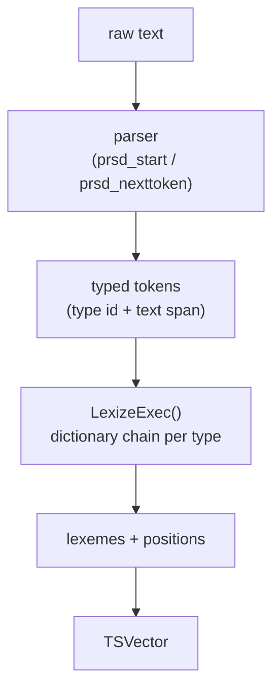

PostgreSQL's full-text search converts raw text into a compact, searchable representation through a two-stage pipeline: a parser that splits text into typed tokens, and a dictionary chain that normalises each token into one or more lexemes. The output of that pipeline — a `tsvector` — is a sorted, deduplicated list of lexemes with position information attached. PostgreSQL expresses queries as `tsquery` values that combine lexemes with Boolean and phrase operators. The `@@` match operator bridges the two, evaluating whether a `tsquery` is satisfied by a `tsvector`.

## The Two-Stage Pipeline

PostgreSQL deliberately splits text indexing into parsing and normalisation. The **parser** knows how to recognise linguistic units in raw text — words, numbers, URLs, email addresses — but it applies no language rules. The **dictionary chain** takes each typed token and either normalises it (stemming, case folding, synonym expansion) or discards it (stop words). This separation lets the parser be language-neutral while the dictionary chain is language-specific and swappable.

The orchestrating function is `parsetext()` (`ts_parse.c`). It looks up the text search configuration to find the parser and its associated dictionary mappings. It then calls the parser's `start`, `getlexeme`, and `end` entry points in a loop. This passes each token to `LexizeExec()`, which walks the configuration's per-type dictionary list until one dictionary accepts the token. `parsetext()` silently drops tokens whose type has no dictionary mapping — this is how stop-word elimination and punctuation suppression work.

`parsetext()` increments a position counter for each token that produces at least one lexeme. Dictionaries can also request additional position increments through the `TSL_ADDPOS` flag on `TSLexeme`, which phrase-distance search relies on to count gaps across dropped tokens correctly.

## The Default Parser

`pg_catalog.default` is the built-in parser implemented in `wparser_def.c`. It recognises 23 distinct token types, identified by integer IDs with string aliases:

| ID | Alias | Description |
|---|---|---|
| 1 | `asciiword` | Word composed of all ASCII letters |
| 2 | `word` | Word containing non-ASCII letters |
| 3 | `numword` | Word containing both letters and digits |
| 4 | `email` | Email address |
| 5 | `url` | Full URL |
| 6 | `host` | Hostname |
| 7 | `sfloat` | Scientific notation (e.g. `1.5e10`) |
| 8 | `version` | Version number (e.g. `8.3.1`) |
| 9 | `hword_numpart` | Hyphenated word part with digits |
| 10 | `hword_part` | Hyphenated word part, all letters |
| 11 | `hword_asciipart` | Hyphenated word part, all ASCII |
| 12 | `blank` | Whitespace and punctuation |
| 13 | `tag` | XML/HTML tag |
| 14 | `protocol` | Protocol head (e.g. `http://`) |
| 15 | `numhword` | Hyphenated word with digits |
| 16 | `asciihword` | Hyphenated word, all ASCII |
| 17 | `hword` | Hyphenated word |
| 18 | `url_path` | URL path component |
| 19 | `file` | File or path name |
| 20 | `float` | Decimal number |
| 21 | `int` | Signed integer |
| 22 | `uint` | Unsigned integer |
| 23 | `entity` | XML entity |

The parser uses a table-driven state machine (`TParser`, `wparser_def.c`) with around 70 named states and stack-based lookahead. When the parser sees `foo-bar`, it emits the whole compound as an `asciihword` token. It *also* re-parses the pieces as individual `asciiword` tokens. This is a deliberate design that lets both `foo` and `foo-bar` be searchable. The same lookahead logic identifies email addresses, URLs, and hostnames by tentatively parsing ahead and committing only when the pattern completes. The `p_ishost()` and `p_isURLPath()` helpers create temporary parser copies (`TParserCopyInit()`) to do this without consuming input in the primary parse.

For non-ASCII databases the parser converts the input string to a wide-character representation (`wchar_t` or `pg_wchar` depending on locale) so that character-class tests (`isalpha`, `isdigit`, etc.) work correctly across all PostgreSQL-supported encodings. The `IGNORE_LONGLEXEME` compile-time setting (`ts_parse.c`) governs this: the parser silently ignores words longer than 2047 bytes rather than erroring.

## TSVector Storage Layout

A `tsvector` datum (`TSVectorData`, `ts_type.h`) is a varlena value containing:

1. A count of unique lexemes.
2. A sorted array of `WordEntry` descriptors — one per lexeme, sorted by `memcmp` order on the lexeme string. Each descriptor encodes the lexeme's byte length (up to 2047 bytes) and its byte offset within the lexeme storage area.
3. Concatenated lexeme strings (not null-terminated).
4. For each lexeme that has position data: a 2-byte-aligned position count followed by an array of `WordEntryPos` values.

Each `WordEntryPos` packs a 2-bit weight label (A, B, C, or D, used for relevance ranking) and a 14-bit position counter into a `uint16`. Position values are one-based. Position zero is a sentinel meaning "no position". The maximum stored position is 16383 (`MAXENTRYPOS - 1`). The parser clamps positions beyond that. Each lexeme can carry at most 256 positions (`MAXNUMPOS`). The positions array for each lexeme must be stored in sorted order.

The `to_tsvector()` function and related conversion functions deduplicate lexemes before assembling the final datum: if two tokens normalise to the same lexeme, `to_tsvector()` merges their positions into one `WordEntry`.

## TSQuery Structure

A `tsquery` (`TSQueryData`, `ts_type.h`) stores a tree of `QueryItem` nodes. Each node is either a `QueryOperand` (a lexeme or prefix pattern) or a `QueryOperator` encoding one of four operators: `AND` (`OP_AND`), `OR` (`OP_OR`), `NOT` (`OP_NOT`), or phrase distance (`OP_PHRASE`). The `distance` field on a phrase operator encodes how many token positions may separate the two adjacent operands. The `<->` syntax is the default distance-1 case, while `<N>` sets an explicit gap.

The `QueryOperand` node stores a weight bitmask (which weights are allowed to match), a prefix flag (for prefix queries like `cat:*`), a CRC of the lexeme string for quick pre-screening, and an offset+length pointer into the operand string area that follows the item array. This layout makes a `tsquery` a single flat allocation: the varlena header, then the `QueryItem` array, then all operand strings concatenated.

## The @@ Match Operator

The `@@` operator evaluates a `tsquery` against a `tsvector` in two passes. A first pass uses the CRC fields in `QueryOperand` nodes to quickly screen for obviously absent lexemes before doing any string comparison. The recursive evaluator then walks the operator tree bottom-up: `AND` requires both children to match, `OR` requires either, `NOT` inverts. For phrase operators (`OP_PHRASE`) the evaluator must check not just that both operands are present in the vector but that at least one pair of matching positions satisfies the distance constraint. This is why positions matter: without them, phrase queries are impossible.

The match is case-insensitive in the sense that `to_tsvector()` and `to_tsquery()` both apply the same dictionary normalisation. So the `@@` operator compares already-normalised lexemes on both sides at match time.

## Query Construction: plainto_tsquery, to_tsquery, websearch_to_tsquery

Three SQL functions parse user input into `tsquery` values, with different tolerances for input format:

**`to_tsquery()`** expects a formal query expression using `&`, `|`, `!`, and `<->` operators with each operand already being a word suitable for dictionary processing. Invalid syntax raises an error. This is the right choice when a program constructs the query and needs guaranteed correctness.

**`plainto_tsquery()`** accepts free text and inserts `&` between all recognised words. It discards stop words silently. It produces no `OR` or `NOT` nodes. A call like `plainto_tsquery('english', 'the quick brown fox')` produces the equivalent of `quick & brown & fox`, with "the" dropped by the dictionary.

**`websearch_to_tsquery()`** understands a simplified web-search syntax: quoted phrases (converted to `<->` phrase sequences), a leading minus sign for `NOT`, and `OR` as a keyword. `websearch_to_tsquery()` silently ignores unrecognised syntax rather than erroring. This makes it safe to use with arbitrary user input from a search box.

All three functions run the same dictionary normalisation pass as `to_tsvector()`, so their output is directly comparable to vectors produced by indexing.

## Position Information and Phrase Search

Storing positions costs space. A `tsvector` without any positions is valid — `strip()` removes them deliberately — but phrase queries (`<->`) and relevance ranking by position (`ts_rank_cd()`) become unavailable. The `tsvector` serialisation uses a `haspos` bit in each `WordEntry` to indicate whether the position block is present.

The evaluator computes phrase distance by checking whether any position from the left operand's position list, plus the required distance, appears in the right operand's position list. For multi-word phrases, the evaluator performs this check recursively across the phrase chain. The `distance` field in `QueryOperator`, stored as `int16`, bounds the maximum distance between any two words in a phrase operator.

## ts_headline

`ts_headline()` highlights matching fragments within the original document text. It does not use the stored `tsvector`. Instead, it re-parses the document text with `hlparsetext()` (`ts_parse.c`). `hlparsetext()` applies the same parser and dictionary chain, then, for each produced lexeme, scans the `tsquery`'s `QueryOperand` nodes looking for matches. The result is a `HeadlineParsedText` structure whose `words[]` array holds every token from the document (including punctuation and whitespace that would be discarded during indexing) along with a pointer to any matching query operand and the token's position in the vector numbering scheme.

A separate `prsheadline` entry point on the parser (the default implementation is in `wparser_def.c`) then selects which tokens to include in output fragments. It marks query-matching tokens as `selected`, and fills in the start/stop delimiters and fragment separator strings. `generateHeadline()` (`ts_parse.c`) assembles the final text from those flags. This two-function design (core fills `words[]`, parser selects and marks) allows custom parsers to control headline layout while reusing the core's token matching.

The `MaxWords`, `MinWords`, `MaxFragments`, `StartSel`, `StopSel`, and `FragmentDelimiter` options control the output format by influencing how many tokens the `prsheadline` function includes around each matching term.

## Custom Parsers

A text search parser is a PostgreSQL extension object registered in `pg_ts_parser`. It must expose five SQL-callable C functions, called through function pointers cached in `TSParserCacheEntry`:

- **`prsstart(text, int4)`** — allocate and return an opaque parser state for the given text.
- **`prstoken(state, text*, int4*)`** — advance to the next token, returning its type ID and setting the output text pointer and length. Returns 0 at end-of-input.
- **`prsend(state)`** — free parser state.
- **`prslextype()`** — return a null-terminated `LexDescr` array mapping type IDs to aliases and descriptions. These appear in `ts_token_type()` output and in the configuration UI.
- **`prsheadline(HeadlineParsedText*, List*, TSQuery)`** — implement headline selection (optional; the parser's `headlineOid` must be valid for `ts_headline()` to work).

The type IDs a custom parser emits are its own namespace. `pg_ts_config_map` configures the mapping from type ID to dictionary chain, per text search configuration. So different configurations can use the same parser, while mapping the same token types to different dictionaries.

For inspecting how the default parser sees a piece of text, `ts_parse('default', text)` returns a set of (type ID, token) rows. `ts_token_type('default')` returns the full type ID table.

## Related Topics

- [[subsystems/types/text-search-dictionaries|text search dictionaries]] — how the dictionary chain normalises tokens into lexemes, covering stemming dictionaries, stop-word lists, synonym and thesaurus dictionaries, and the dictionary fallback chain
- [[subsystems/types/like-ilike|LIKE and ILIKE Pattern Matching]] — alternative substring and prefix text matching without linguistic normalisation
- [[subsystems/types/regex-matching|Regular Expression Matching]] — the Spencer regex engine backing `~`, `~*`, and `SIMILAR TO`
