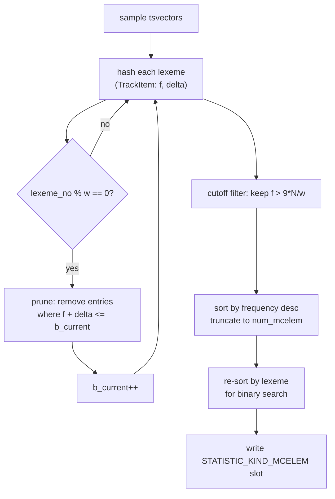

The full-text search subsystem hooks into PostgreSQL's statistics and query planning infrastructure at several points. A custom `ANALYZE` function collects per-column lexeme frequency data. A selectivity estimator uses that data to plan `@@` queries efficiently. A set of locale and utility layers support dictionary loading and character classification across the rest of the tsearch code. Additionally, Ispell dictionaries use a lightweight mini-regex dialect, called "regis", rather than the full regex engine for affix-condition matching.

## Statistics Collection: Most-Common Lexemes

Standard PostgreSQL statistics track the most common *values* of a column. For `tsvector` columns that approach is nearly useless — most documents are unique, so there are almost no repeated values. The custom analyze function registered by `ts_typanalyze` sidesteps this by collecting the most common *lexemes across all documents*. That is exactly what `@@` selectivity estimation needs.

`ts_typanalyze` installs `compute_tsvector_stats` as the column's `compute_stats` callback. It also sets `minrows` to `300 * attstattarget`. The multiplier reflects that meaningful lexeme frequency data requires a larger sample than scalar statistics do.

`compute_tsvector_stats` iterates over every sampled `tsvector`. For each one, it walks the tsvector's `WordEntry` array and hashes each lexeme into a tracking table using a non-null-terminated key. The core algorithm is **Lossy Counting** (Manku & Motwani, VLDB 2002). Each entry in the table carries a frequency count `f` and an error bound `delta`. The algorithm divides the input stream into buckets of width `w = (K + 10)/0.007`, where `K` is `attstattarget * 10` (the target MCELEM count). After every `w` lexemes, it prunes entries whose `f + delta <= b_current` (the current bucket number) — these are lexemes too rare to make the cut. `epsilon = 1/w` bounds the error in any retained frequency.

After the loop, the algorithm sorts entries surviving the cutoff `f > 9*N/w` first by frequency descending, to select the top `K`. It then re-sorts them by lexeme string (length first, then byte-for-byte) before storage. This secondary sort is deliberate: at query time the estimator needs to binary-search for individual lexemes. Sorting by value rather than frequency enables that.

The final `pg_statistic` slot of kind `STATISTIC_KIND_MCELEM` stores:

- `stavalues`: an array of `text` lexeme values, sorted by (length, bytes).
- `stanumbers`: `nmcelem + 2` float4 frequencies. Each `stanumbers[i]` is `f_i / nonnull_cnt` — the fraction of non-null rows containing that lexeme. The two extra entries at the end are the minimum and maximum frequencies in the kept set, stored for use by the estimator.

The divisor is `nonnull_cnt`, not the total lexeme count `N`, because what matters for `@@` is the fraction of *rows* where a lexeme appears, not its raw occurrence rate.

## Selectivity Estimation for @@

The `tsmatchsel` function is the restriction selectivity estimator for the `@@` operator. Given a `tsvector` column and a `tsquery` constant, it returns an estimated fraction of rows that match.

When `pg_statistic` has an MCELEM slot for the column, `mcelem_tsquery_selec` builds a lookup array of `(text*, float4)` pairs from the stored values and numbers. It then calls the recursive estimator `tsquery_opr_selec`. When no statistics exist, the same recursive function is called but with a NULL lookup. It then uses fixed defaults throughout.

The recursive estimator traverses the `tsquery` tree using independence assumptions:

| Node type | Selectivity formula |
|-----------|---------------------|
| AND, PHRASE | `sel(left) * sel(right)` |
| OR | `sel(left) + sel(right) - sel(left) * sel(right)` |
| NOT | `1 - sel(child)` |
| Exact lexeme in MCELEM | stored frequency for that lexeme |
| Exact lexeme not in MCELEM | `min(DEFAULT_TS_MATCH_SEL, minfreq / 2)` |
| Prefix lexeme (`:*` suffix in tsquery) | sum of matching MCELEM frequencies, extrapolated |
| No statistics available | `DEFAULT_TS_MATCH_SEL` (0.005) |

The default of 0.005 is small enough to make index scans attractive at typical table densities. For prefix queries with fewer than 100 MCELEM entries, the estimator falls back to `DEFAULT_TS_MATCH_SEL * 4` rather than attempt extrapolation from an inadequate sample.

Lexeme lookup within the MCELEM array uses `bsearch` with the same (length, bytes) ordering used at storage time. The key type `LexemeKey` holds a non-null-terminated pointer and a length, matching the storage format directly.

`tsmatchjoinsel` — the join selectivity estimator for `@@` — always returns `DEFAULT_TS_MATCH_SEL`. Join selectivity for text-search operators is hard to estimate without knowing the query constant. There is no common case worth optimizing here.

After computing selectivity, `tsmatchsel` scales the result by `(1 - stanullfrac)` to account for null rows. The MCELEM statistics do not cover null rows.

## ts_locale: Character Classification for Tsearch

Tsearch does not use PostgreSQL's main locale infrastructure (`pg_locale.c`) directly. Instead, `ts_locale.c` provides a thin wrapper layer with its own character-classification functions and file-reading utilities.

The reason for the separation is operational scope: tsearch needs character classification (is this byte alphabetic? numeric? whitespace?) during dictionary loading and token processing, at times and in [[subsystems/memory/contexts|memory contexts]] where the full backend locale infrastructure may not be appropriate to call. Tsearch also needs these wrappers during `initdb`, before a full database locale is established.

The `GENERATE_T_ISCLASS_DEF` macro generates a family of `t_is*` functions that expose character classification. Each class (alnum, alpha, digit, print, space) gets three variants:

- `t_is<class>_with_len(ptr, mblen)` — given a pointer and pre-computed byte length.
- `t_is<class>_cstr(ptr)` — given a NUL-terminated pointer.
- `t_is<class>_unbounded(ptr)` — given a pointer into a pre-validated encoded string.

For single-byte characters, or when `database_ctype_is_c` is true, these reduce to the standard C `is<class>()` call. For multi-byte encodings, the code widens the character to `wchar_t`, using a 3-element buffer to accommodate UTF-16 surrogate pairs on Windows. It then calls the wide-character `isw<class>()` variant. The current code sets the `mylocale` pointer to zero throughout — marked `/* TODO */` — so the functions always use the process's default locale rather than a per-object locale. This is a known limitation; the code does not yet propagate ICU-aware per-column locales into tsearch's character classification.

`lowerstr` and `lowerstr_with_len` perform locale-aware case folding for use by the simple and Ispell dictionaries. Under a non-C, multi-byte encoding, the function first converts the string to `wchar_t`, passes each code point through `towlower`, and converts the result back. Under a C locale or single-byte encoding, the function uses the plain `tolower` byte loop instead.

The file-reading utilities `tsearch_readline_begin`, `tsearch_readline`, and `tsearch_readline_end` provide a line-by-line reader with automatic UTF-8 validation and conversion to the database encoding. They install an error context callback so that any error during reading reports the filename and line number. Dictionary init functions use this rather than plain `fread` so that encoding problems in `.dict`, `.affix`, and `.syn` files produce informative error messages.

## ts_utils.c: Shared Helpers

`ts_utils.c` provides two utilities used across the tsearch subsystem.

`get_tsearch_config_filename` maps a basename to an absolute path under `$sharedir/tsearch_data/`. `get_tsearch_config_filename` validates the basename against an allowlist of `[a-z0-9_]` characters before any path construction, preventing directory traversal attacks via configuration option values.

`readstoplist` loads a stop-word file into a sorted `StopList` structure. It reads each line through `tsearch_readline` (encoding-safe), trims trailing whitespace, and optionally transforms the line through a caller-supplied `wordop` function (typically `lowerstr`). `readstoplist` then sorts the resulting array with `pg_qsort_strcmp` so that `searchstoplist` can use `bsearch`. Stop-word lookup is thus O(log n) per token.

## Regis: The Mini-Regex Dialect for Ispell Affixes

Ispell and Hunspell `.affix` files attach conditions to affix rules: a suffix rule might apply only when the word ends in certain characters. Affix files express these conditions as simple patterns. Rather than invoking PostgreSQL's full Spencer NFA regex engine for each such test during morphological analysis (which would be expensive and would require a database context), the tsearch code uses a dedicated micro-engine called **regis** ("regular index strings").

A regis pattern is a sequence of position tests, where each position is either:

- A literal alphabetic character (`t_isalpha_cstr` returns true), meaning the character at that position must be that letter.
- A character class `[abc]` meaning the character must be one of the listed letters.
- A negated character class `[^abc]` meaning the character must not be one of the listed letters.

That is the complete syntax. There are no quantifiers, no anchors (the match is implicitly anchored by the `issuffix` flag described below), no alternation at the top level, no `.` wildcard, and no groups. `RS_isRegis` validates that a string falls within this subset before `RS_compile` runs.

`RS_compile` converts the pattern string into a linked list of `RegisNode` structs. Each node has type `RSF_ONEOF` (positive class) or `RSF_NONEOF` (negated class). It stores the characters of the class as a multibyte string. `RS_compile` stores literal characters as single-character `RSF_ONEOF` nodes. The `issuffix` flag on the compiled `Regis` struct controls whether the match is anchored at the start or at the end of the test string.

`RS_execute` walks the node list against the input string. If `issuffix` is set, the comparison starts `nchar` positions before the string's end rather than at position zero. `mb_strchr` checks character membership with a byte-by-byte scan through the stored class data, using `pg_mblen_cstr` to step correctly through multi-byte characters.

This design is fast: there is no NFA construction, no backtracking, and no memory allocation at match time. The compiled form is also compact — a typical affix condition like `[^aeiou]` compiles to a single node with five bytes of class data. The limitation is that regis patterns cannot express variable-length matches or true regular expressions. Affix file authors who need more complex conditions must use the full regex syntax instead; the affix loader then hands that syntax to the standard regex engine.

## See Also

- [[subsystems/types/text-search-parser|text search parser]] — how raw text is tokenized before statistics and matching apply
- [[subsystems/types/text-search-dictionaries|text search dictionaries]] — Ispell dictionary loading and affix processing that consumes the regis engine and tsearch locale layer

## Related Topics

- [[subsystems/planner/statistics|Planner Statistics]] — the general pg_statistic infrastructure that ts_typanalyze writes MCELEM data into
- [[subsystems/planner/selectivity-estimation|Selectivity Estimation]] — how tsmatchsel fits into the broader planner selectivity framework
- [[subsystems/planner/cost-model|Cost Model]] — how selectivity estimates from tsmatchsel feed into scan and join cost decisions
- [[code-paths/analyze|ANALYZE]] — the ANALYZE code path that invokes the ts_typanalyze callback to collect lexeme statistics
- [[subsystems/indexes/gin|GIN]] — the Generalized Inverted Index, the primary index structure for tsvector columns that benefits from MCELEM-based selectivity estimates
- [[subsystems/types/text-search-parser|Text Search Parser]] — tokenization that produces the lexemes whose frequencies are tracked by the statistics collector
