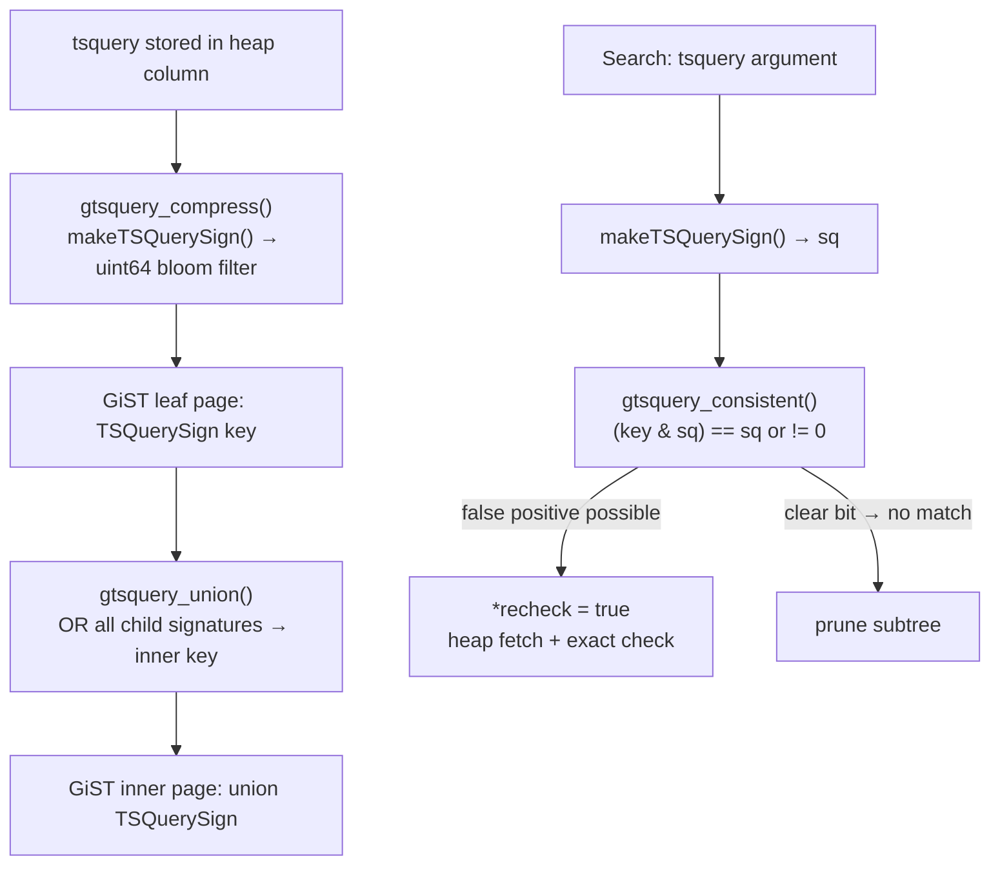

The [[subsystems/full-text-search|full-text search]] system in PostgreSQL operates on two types — `tsvector` and `tsquery` — that represent documents and queries in a form ready for matching and indexing. This page covers three distinct implementation areas: the tree structure used to represent and manipulate `tsquery` expressions in memory, the string parser that reads the textual `tsvector` format, and the GiST operator class that enables a GiST index over a `tsquery` column using a compact bit-signature.

## The tsquery Expression Tree

PostgreSQL stores a `tsquery` on disk as a flat array of `QueryItem` nodes in prefix (Polish) order, followed by a packed block of lexeme strings (`TSQueryData`, `ts_type.h`). Each `QueryItem` is a union of two structs: a `QueryOperand` for leaf nodes holding a lexeme, and a `QueryOperator` for internal nodes encoding AND (`OP_AND`), OR (`OP_OR`), NOT (`OP_NOT`), or phrase distance (`OP_PHRASE`). In the operator struct, the right child is always at `item + 1` and the left child at `item + item->left`, so tree traversal requires only integer arithmetic with no pointers.

Each `QueryOperand` stores a `valcrc` — a CRC-32 of the lexeme string — alongside the lexeme's offset and length into the string block, a weight bitmask for restricting which weight labels may match, and a `prefix` flag for prefix queries like `cat:*`. The CRC enables fast pre-screening: before comparing lexeme strings, the evaluator checks whether the CRC matches, short-circuiting the more expensive string comparison for obviously absent lexemes.

### The QTNode Working Form

Code that constructs or transforms a `tsquery` at runtime operates on a pointer-based tree of `QTNode` structs (`ts_utils.h`) rather than the flat serialized array. Each `QTNode` holds a pointer back to the underlying `QueryItem`, an array of child pointers, and a `sign` field — a 32-bit bloom filter accumulating the CRC values of all leaf lexemes in the subtree. The sign propagates upward from leaves to operators. It serves as a fast inequality pre-filter: if two subtrees have disjoint signs, they cannot be equal without deeper comparison.

`QT2QTN()` converts the flat prefix-order array into this pointer tree; `QTN2QT()` serialises it back. Operators such as `tsquery_phrase()` and `tsquery_and()` use this round-trip to compose new queries from existing ones. `QTNTernary()` flattens nested AND/OR chains into n-ary nodes for easier manipulation; `QTNBinary()` collapses them back to the binary form required for serialization. `QTNSort()` puts children into a deterministic order so that structural equality tests via `QTNEq()` are reliable (`tsquery_util.c`).

## Query Cleanup and Normalization

After parsing a `tsquery`, PostgreSQL can apply two separate simplification passes, both implemented in `tsquery_cleanup.c`. Their purpose is to produce the leanest possible tree that still expresses the original intent. A leaner query means fewer index key lookups during a GIN scan and faster evaluation of the `@@` operator at recheck time.

### Removing NOT Subtrees

`clean_NOT()` removes all NOT nodes and their subtrees entirely. The result is a query containing only the positive terms. This transformation is lossy: the returned query matches a strict superset of the original. It is nonetheless the form needed when driving a GIN or GiST index. An index can confirm that a document *contains* a lexeme, but it cannot confirm that a document *lacks* one. The index scan identifies candidates. PostgreSQL always performs the full `@@` evaluation as a heap recheck to handle NOT constraints correctly.

The implementation converts the flat `QueryItem` array into a `NODE`-based tree using `maketree()`, then recursively walks it with `clean_NOT_intree()`. `clean_NOT_intree()` prunes NOT nodes outright. For AND and PHRASE nodes, if one child degenerates to nothing, the surviving child replaces the operator; if both sides collapse, the operator itself disappears. OR nodes are stricter: if either child disappears, `clean_NOT_intree()` removes the entire OR subtree, because an OR with a missing branch is not safely approximable. `plaintree()` then serializes the cleaned tree back to a flat array.

### Removing Stop Words

`cleanup_tsquery_stopwords()` handles a different problem: when query terms pass through the dictionary chain, the dictionary chain may recognize some as stop words. Those terms then produce no lexeme. PostgreSQL represents those terms as `QI_VALSTOP` nodes in the intermediate tree. The function `clean_stopword_intree()` removes them recursively. It also adjusts the distance fields of any surrounding phrase operators.

Phrase operator adjustments are necessary because a stop word contributes to the positional distance between its neighbors. It does so even though it is absent from the indexed vector. For example, if `a` is a stop word and the original query is `b <-> a <-> c`, the cleaned query must be `b <2> c` — the distance of 2 accounts for the gap where `a` sat. The cleanup function propagates `ladd` and `radd` adjustments upward through the tree so parent phrase operators can absorb the correct offset (`tsquery_cleanup.c`).

When a query degenerates entirely to stop words, `cleanup_tsquery_stopwords()` returns an empty `TSQuery` with `size = 0`. It optionally emits a `NOTICE`. The empty query is legal but matches nothing.

## tsvector String Parsing

The canonical textual form of a `tsvector` looks like `'cat':3A 'dog':1,2 'run':5,6,9`. `tsvector_parser.c` implements the parser that reads this format. The parser is shared between tsvector input and tsquery input: the same `TSVectorParseState` state machine handles both, with behavior flags distinguishing the two contexts.

### State Machine Design

`init_tsvector_parser()` allocates a `TSVectorParseStateData` that tracks the current scan position in the input string, a growable word buffer, and three boolean flags: `oprisdelim` (treat `! | & ( )` as word terminators, needed for tsquery parsing), `is_tsquery` (controls error message wording), and `is_web` (adjusts tokenization rules for `websearch_to_tsquery()`).

The core function `gettoken_tsvector()` advances through the input character by character, maintaining an integer `statecode` that encodes the current parsing state. The states are:

| State | Meaning |
|---|---|
| `WAITWORD` | Between tokens; skip whitespace, look for start of next lexeme |
| `WAITENDWORD` | Inside an unquoted word; accumulate until space, colon, or end |
| `WAITENDCMPLX` | Inside a single-quoted word; accumulate until closing quote |
| `WAITCHARCMPLX` | Just saw a closing quote; decide if it is doubled (escape) or real |
| `WAITNEXTCHAR` | Just saw a backslash escape; consume the next character literally |
| `WAITPOSINFO` | Word is done; check for a `:` that would introduce position data |
| `INPOSINFO` | Parsing a position number |
| `WAITPOSDELIM` | After a position number; look for comma (more positions), weight letter, or end |

Each call to `gettoken_tsvector()` returns one lexeme and, if present, its associated array of `WordEntryPos` values. The caller allocates no per-token buffer; the function writes the lexeme into the `TSVectorParseState`'s internal `word` buffer, which the `RESIZEPRSBUF` macro reallocates as needed. The function collects position data into a separately palloc'd `WordEntryPos` array that the caller takes ownership of via the `pos_ptr` output parameter.

`gettoken_tsvector()` parses weight letters (A, B, C, D) in `WAITPOSDELIM` and packs them into the high 2 bits of each `WordEntryPos` using `WEP_SETWEIGHT()`. `LIMITPOS()` clamps position values to at most `MAXENTRYPOS - 1` (16383). A position of zero is invalid and causes a syntax error, because zero is the sentinel meaning "no position data" at the `WordEntryPos` level (`ts_type.h`).

### Dual Use for tsvector and tsquery

The same `gettoken_tsvector()` loop also drives tsquery parsing, with `oprisdelim = true` so that operator characters terminate a word immediately. When `oprisdelim` is set, encountering `!`, `|`, `&`, `(`, or `)` mid-word is a syntax error rather than a word continuation. The tsquery parser wraps this in its own higher-level loop (`tsquery.c`). After `gettoken_tsvector()` returns each lexeme, the loop assembles the operator tree using a shunting-yard algorithm.

This dual-use design means that the lexeme-level quoting and escape rules are consistent between tsvector and tsquery. A lexeme that requires quoting (because it contains special characters) uses the same single-quote and backslash escaping in both contexts.

## GiST Index Support for tsquery

PostgreSQL provides a GiST operator class for the `tsquery` type (`tsquery_gist.c`). This is distinct from the GiST operator class for `tsvector` described at [[subsystems/indexes/tsgistidx|tsvector GiST index]]. Where the tsvector GiST index stores one key per indexed *document* to support `@@` queries over a tsvector column, the tsquery GiST index stores one key per indexed *query*. It supports containment queries like "which stored queries are satisfied by this tsvector?" or "which stored queries contain this other query as a subexpression?".

### The TSQuerySign Signature

The key format for the tsquery GiST opclass is `TSQuerySign`, a `uint64` used as a 64-bit bloom filter (`ts_utils.h`). Building a signature from a `tsquery` is straightforward. `makeTSQuerySign()` (`tsquery_op.c`) iterates the `QueryItem` array. For each `QI_VAL` leaf node, it maps the leaf's `valcrc` to a bit position using `valcrc % TSQS_SIGLEN` (where `TSQS_SIGLEN` is 64), then sets that bit. Operator nodes contribute nothing; only lexeme CRCs matter.

The resulting `uint64` is a lossy summary: it records which lexemes *might* be present but cannot record their Boolean relationships. Two queries with identical lexeme sets but different operators (e.g. `a & b` and `a | b`) produce the same signature. The GiST consistent function always sets `*recheck = true` before returning. This ensures that the system evaluates every candidate the index retrieves against the full query.

### Compress and Union

`gtsquery_compress()` runs at leaf-insertion time. It calls `makeTSQuerySign()` on the raw `tsquery` value and stores the resulting `uint64` as the leaf key. Non-leaf entries already hold signatures; compress is a no-op for them.

`gtsquery_union()` builds the inner-page key for a subtree by OR-ing together all the `TSQuerySign` values of the child entries. This means an inner-page key has every bit set that is set in any child's signature. Consider a query lexeme CRC that maps to a bit clear in the inner-page key. That CRC is guaranteed absent from all queries in the subtree, so the GiST search can prune the subtree without examining it further.

### Consistent: Containment Queries

The GiST opclass supports two strategies, both using bitwise signature comparison:

- **`RTContainsStrategyNumber`** (`@>`): asks whether the stored tsquery *contains* the query argument — that is, every lexeme CRC present in the argument's signature must be present in the stored key. For a leaf entry, `gtsquery_consistent()` checks `(key & sq) == sq`. For an inner page, it checks `(key & sq) != 0` instead. This looser condition lets the search descend into any subtree that shares at least one bit with the query. It is correctly conservative for a lossy filter.

- **`RTContainedByStrategyNumber`** (`<@`): asks whether the stored query is *contained by* the argument. The leaf check is `(key & sq) == key`; the inner-page check again falls back to `(key & sq) != 0`.

Both strategies are inherently approximate. A false positive occurs whenever a CRC collision sets the same bit for two different lexemes. The heap recheck resolves all false positives.

### Penalty and Picksplit

`gtsquery_penalty()` guides insertion into the GiST tree by measuring the cost of adding a new query's signature into an existing subtree. It counts the Hamming distance between the two `uint64` values — the number of bits in `a XOR b`. Adding an entry to a subtree whose union signature already has the new entry's bit set costs 0; each new bit that would be turned on costs 1. Inserting where the penalty is lowest minimises the false-positive rate of inner-page signatures.

When a page fills, `gtsquery_picksplit()` divides its entries into two groups, using the same seed-selection strategy seen in the tsvector GiST opclass. It scans all pairs of signatures and finds the pair with the maximum Hamming distance to use as seeds for the two groups. It then assigns each remaining entry to whichever seed is closer to it in Hamming distance. Entries with equal distance to both seeds go to the smaller group to balance page fullness.

## Related Topics

- [[subsystems/full-text-search|full-text search]] — tsvector and tsquery structure, GIN indexing, the @@ operator, ranking, and ts_headline
- [[subsystems/types/text-search-parser|text search parser]] — the pipeline that converts raw text into lexemes, and how the default parser tokenises input
- [[subsystems/types/text-search-dictionaries|text search dictionaries]] — how dictionary chains normalise tokens and eliminate stop words before lexemes are stored
- [[subsystems/indexes/tsgistidx|tsvector GiST index]] — the GiST opclass for tsvector columns, which uses a variable-length bit-signature to index documents rather than queries
- [[subsystems/types/snowball-stemmers|Snowball stemmers]] — the algorithmic stemming library used by Snowball dictionary entries to normalise lexemes
