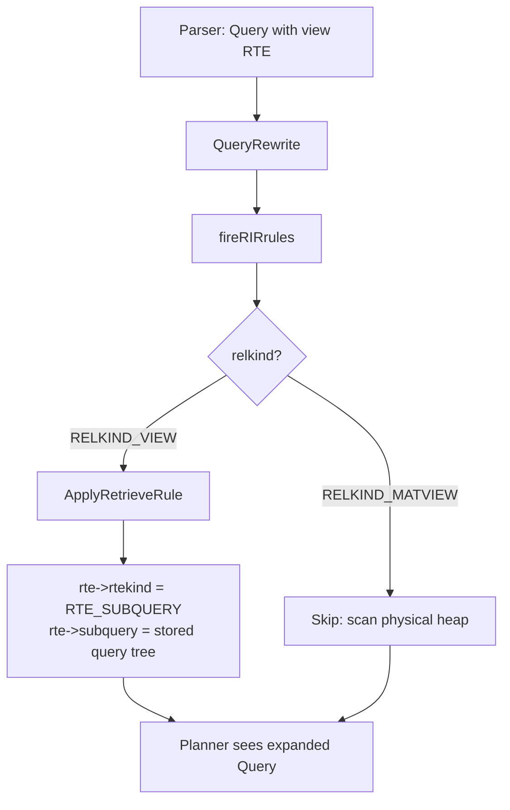
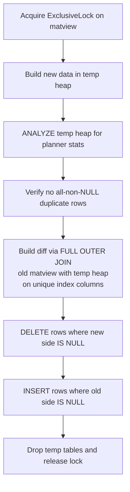

# Views and Materialized Views

Views and materialized views both let a client treat a stored query as though it were a table, but they differ fundamentally in when that query runs and where its results live. A regular view holds no data at all. It stores only a query definition. Every time a client references the view, the server substitutes that definition inline before planning. A materialized view runs its defining query once and writes the result to a real heap on disk. It serves all subsequent reads from that physical copy until an operator explicitly refreshes it. This choice — query at read time versus query at write time — drives almost every other design decision in both subsystems.

## Regular Views as Rewrite Rules

PostgreSQL implements regular views entirely through the rule system. There is no dedicated view execution engine. A view is syntactic sugar over an unconditional `ON SELECT DO INSTEAD` rule stored in `pg_rewrite`.

When `CREATE VIEW` executes (view.c), `parse_analyze_fixedparams()` parses the defining SELECT, producing a `Query` node. `CREATE VIEW` validates that node — no data-modifying CTEs, no `SELECT INTO` — and passes it to `DefineVirtualRelation()`, which creates a zero-storage relation in `pg_class` with `relkind = RELKIND_VIEW` and `relfilenode = 0`. `DefineVirtualRelation()` derives the column list of that relation from the non-junk target entries of the SELECT. Once the shell relation exists, `StoreViewQuery()` calls `DefineViewRules()`. `DefineViewRules()` registers the parsed query as a rule named `_RETURN` (the `ViewSelectRuleName` constant) by inserting a row into `pg_rewrite` via `InsertRule()` in rewriteDefine.c. The rule's event type is `CMD_SELECT` and its `is_instead` flag is true.

At this point the view is complete: a row in `pg_class` describing its column types, and a row in `pg_rewrite` holding its query tree. There are no data files.

`CREATE OR REPLACE VIEW` replaces the stored rule in `pg_rewrite` but imposes strict constraints enforced by `checkViewTupleDesc()`. `CREATE OR REPLACE VIEW` may append new columns to the end of the column list, but it cannot drop, reorder, rename, or change the types or collations of existing columns. The reason is that other views, rules, and compiled `Var` nodes in stored procedures reference view columns by attribute number and type OID. Permitting structural changes would silently corrupt those dependents without any way to detect or repair them at ALTER time.

Views reject `UNLOGGED` persistence because they have no storage to log. If the defining SELECT references a temporary table and the view was not declared temporary, PostgreSQL silently promotes it to a temporary view.

## How View Expansion Works

When a query references a view, the query rewriter — not the parser and not the planner — expands it. This happens as a two-pass process driven by `QueryRewrite()` in rewriteHandler.c. The first pass handles non-SELECT rules: INSERT/UPDATE/DELETE rewriting and row-level security policies. The second pass, executed by `fireRIRrules()`, handles RIR rules — a PostQUEL term for "Retrieve-Instead-Retrieve". This describes an `ON SELECT DO INSTEAD SELECT` rule that every view carries.

`fireRIRrules()` walks every `RangeTblEntry` in the query's range table. When it encounters an entry with `relkind = RELKIND_VIEW`, it calls `ApplyRetrieveRule()`. That function performs the substitution: it changes `rte->rtekind` from `RTE_RELATION` to `RTE_SUBQUERY` and sets `rte->subquery` to a deep copy of the stored query tree. The view's range table entry becomes an inline subquery. The planner receives a single, fully expanded `Query` tree and has no knowledge that a view was ever involved — views are invisible to the planner.



Because a view may itself reference other views, `ApplyRetrieveRule()` calls `fireRIRrules()` recursively on the stored query before substituting it. To prevent infinite loops from self-referential or mutually recursive views, `fireRIRrules()` maintains an `activeRIRs` list of relation OIDs currently being expanded; finding an OID already on that list raises an error. This mechanism bounds the expansion depth, rather than any explicit nesting limit.

`fireRIRrules()` explicitly skips materialized view RTEs. The check short-circuits expansion and lets the planner scan the physical heap directly. This is why the planner can build index scans, bitmap scans, and parallel scans over a materialized view exactly as it would over a regular table.

One important consequence of this architecture is that `EXPLAIN` on a query referencing a view shows the expanded subquery, not the view name. The rewriter has already substituted the view's body by the time EXPLAIN processes the plan tree.

## Updatable Views

For views that meet certain structural conditions — a single base relation with no joins, no `DISTINCT`, no `GROUP BY`/`HAVING`, no set operations, no `LIMIT`/`OFFSET`, and no aggregate, window, or set-returning functions in the target list — the rewriter can automatically translate DML (INSERT, UPDATE, DELETE) against the view into equivalent DML against the underlying base table. No triggers or explicit rules are required. `rewriteTargetView()` generates the translation on the fly at rewrite time, provided each view row maps unambiguously and reversibly to exactly one base-relation row. The rewriter checks per-column updatability separately. This lets a view mix computed expressions with updatable columns, as long as writes only target the latter.

See [[subsystems/rewriter/updatable-views|Updatable Views]] for the full list of auto-updatability conditions, per-column updatability rules, and how the rewrite is carried out.

## WITH CHECK OPTION

`WITH CHECK OPTION` guarantees that rows written through an updatable view still satisfy the view's WHERE clause after the write completes. Without it, such rows can silently become invisible through the view immediately after being inserted or updated — a common source of confusion. When a view restricts access to a subset of rows, this invisibility is also a potential security hole. `WITH LOCAL CHECK OPTION` enforces only the declaring view's own predicate; `WITH CASCADED CHECK OPTION` (the default) enforces the predicates of every view in the updatable chain above it as well.

See the updatable views page for how the check is implemented as `WithCheckOption` nodes and how CASCADED propagation works.

## INSTEAD OF Triggers

When a view does not qualify for automatic updatability — joins, aggregates, set operations, or other disqualifying features — `INSTEAD OF` triggers provide a path to DML support. These triggers fire in place of the actual table modification, giving application code full control over what happens when a client writes through the view.

Before attempting automatic rewriting, `RewriteQuery()` calls `view_has_instead_trigger()`, which inspects the view's `TriggerDesc` for the relevant event flag (`trig_insert_instead_row`, `trig_update_instead_row`, or `trig_delete_instead_row`). When such a trigger exists for the DML command in question, the rewriter skips the call to `rewriteTargetView()` entirely and leaves the view's range table entry as the DML target. The executor then fires the trigger function instead of attempting a heap modification.

The trigger receives the proposed new row as `NEW` and, for UPDATE and DELETE, the original view row as `OLD`. For UPDATE and DELETE, the rewriter adds a resjunk whole-row `Var` referencing the view RTE so the trigger receives the original row. The trigger body is then responsible for translating that into whatever underlying storage operations are appropriate — a join-based view might update two tables, a remote view might issue network calls, a computed view might record audit entries.

`INSTEAD OF` triggers compose naturally with RETURNING clauses and ON CONFLICT. They also keep the view's query definition entirely independent of its write semantics. You can redefine a view without touching its trigger functions. You can update the trigger functions independently of the view definition. This separation of read and write semantics is the principal design advantage of the mechanism over explicit rewrite rules for non-trivial cases.

## Security-Barrier Views

The `security_barrier` view option (`CREATE VIEW ... WITH (security_barrier = true)`) addresses a subtle information-leakage risk that arises from the planner's freedom to push predicates through view subquery boundaries as an optimization.

The threat is concrete. Consider a view defined to restrict rows to those owned by the current user:

```sql
CREATE VIEW my_accounts AS
  SELECT * FROM accounts WHERE owner = current_user;
```

Without a security barrier, a query like `SELECT * FROM my_accounts WHERE risky_fn(secret_col) = true` might cause the planner to evaluate `risky_fn()` on every row in `accounts` before the `owner` filter runs. A user-defined function that raises an error or has observable side effects for certain input values can probe the hidden rows through this channel.

When `security_barrier = true`, `ApplyRetrieveRule()` sets `rte->security_barrier = true` on the substituted subquery RTE. The planner treats this flag as a hard optimization boundary: it must not push any function or operator not marked `LEAKPROOF` below the barrier. Only the view's own WHERE clause — which the view owner controls — executes against the raw rows. The planner evaluates outer predicates only after the view filter has already restricted the visible row set.

The performance implication is real. Any index-friendly predicate in the outer query that could ordinarily be pushed through the view boundary stays outside it instead, because the planner cannot verify that user-supplied functions are `LEAKPROOF`. What would otherwise be an index scan over a narrow range becomes a full-view scan followed by a filter. Marking functions `LEAKPROOF` restores pushdown for those specific functions, but only a superuser can set that flag.

Security-barrier views predate native row-level security, which was added later. Native `CREATE POLICY` is generally the better choice for table-level access control, because policies are bound to the table itself and cannot be bypassed by creating a replacement view with different options. Security-barrier views remain useful when view-level access control is architecturally cleaner than table-level policies, or when the view must also be writable.

## Materialized Views

A materialized view physically stores the result of its defining SELECT as an ordinary heap relation with `relkind = RELKIND_MATVIEW`. It occupies real data files, has its own OID, and supports indexes, VACUUM, ANALYZE, and CLUSTER just like a regular table.

Like a regular view, a materialized view has an `ON SELECT DO INSTEAD` rule in `pg_rewrite` holding the defining query. But `fireRIRrules()` explicitly skips RIR expansion for materialized view RTEs, directing the planner to scan the physical heap instead. The planner therefore never sees the defining query during a normal read; it sees a physical heap relation with statistics, storage parameters, and optional indexes.

The `pg_class.relispopulated` flag tracks whether the view currently holds valid data. `SetMatViewPopulatedState()` in matview.c updates this column with a catalog write and issues a shared-invalidation message so every backend rebuilds its relcache entry immediately. A freshly created but never-refreshed materialized view has `relispopulated = false`; any attempt to query it raises an error. `REFRESH MATERIALIZED VIEW WITH NO DATA` resets this flag and discards all rows without re-executing the defining query, returning the view to the unpopulated state.

PostgreSQL has no incremental or automatic maintenance for materialized views. There are no triggers on base tables that propagate changes. The server has no mechanism to detect when stored data has become stale. This is a deliberate design choice: tracking per-row dependencies would require either expensive per-row accounting or coarse table-level dirty flags. Either approach would still require re-execution of the full defining query at some point. The current model — refresh explicitly when freshness matters — keeps the implementation simple and gives operators full control over the staleness/cost tradeoff.

## Standard Refresh

`REFRESH MATERIALIZED VIEW` (without `CONCURRENTLY`) takes `AccessExclusiveLock` on the materialized view, blocking all concurrent access — reads and writes — for the duration of the refresh. This is the same lock strength used by TRUNCATE. The implementation, `ExecRefreshMatView()` in matview.c, runs the refresh under the matview owner's userid within a `SECURITY_RESTRICTED_OPERATION` context, preventing privilege escalation through user-defined functions embedded in the defining query.

The refresh proceeds in four stages:

1. `make_new_heap()` creates a transient heap, matching the matview's column structure, tablespace, and persistence mode. This heap is private and locked until the swap.
2. Data population (`refresh_matview_datafill()`): the stored query runs through the normal rewrite → plan → execute pipeline. `refresh_matview_datafill()` routes results to a `DR_transientrel` destination receiver, which calls `table_tuple_insert()` with `TABLE_INSERT_FROZEN | TABLE_INSERT_SKIP_FSM` flags for efficient bulk loading. The `FROZEN` flag means inserted tuples are immediately visible to all transactions, bypassing the normal MVCC visibility window. This is safe because the transient heap is private until the swap completes.
3. Heap swap (`refresh_by_heap_swap()`): `finish_heap_swap()` exchanges the physical storage file of the transient heap with that of the materialized view. The swap preserves the matview's OID, so all grants, foreign-key dependencies, and catalog references remain intact.
4. An internal `REINDEX` rebuilds indexes after the swap. Building indexes after bulk load is substantially more efficient than maintaining them incrementally during insert.

PostgreSQL then drops the old heap. From outside, concurrent transactions see either the complete old data or the complete new data; there is no intermediate state in which some rows are new and others old.

## Concurrent Refresh

`REFRESH MATERIALIZED VIEW CONCURRENTLY` serves SELECT queries from the existing materialized view data while computing a new version. It then applies only the changed rows. It holds `ExclusiveLock` rather than `AccessExclusiveLock` — strong enough to exclude concurrent writers, but allowing concurrent readers.

The cost of this availability guarantee is substantial additional work. The concurrent refresh path builds a new copy of the data in a temporary heap. It then computes the symmetric difference between old and new data using a join, and applies that difference as separate DELETE and INSERT operations against the live materialized view. This approach requires at least one qualifying unique index. `is_usable_unique_index()` (matview.c) enforces that the index be: unique, valid, non-deferrable (immediate), non-partial (no WHERE clause), a B-tree, and defined over plain user columns rather than expressions or system columns. The B-tree requirement is not arbitrary — the diff algorithm needs equality operators from the index's operator classes to construct the join condition that identifies matching rows between old and new versions.



The match-merge algorithm in `refresh_by_match_merge()` runs through SPI (the server programming interface). It begins by ANALYZing the new temporary data to give the planner accurate statistics for the upcoming join. It then executes a FULL OUTER JOIN between the live matview and the new temp heap, using the equality operators from every qualifying unique index as the join condition. The join result feeds a diff table recording, for each pair: the old row's physical TID when that row exists in the current data, and the new row as a composite value when it exists in the new data.

A safety check precedes the join: if the new dataset contains two rows where every column is non-NULL and both rows are identical, the concurrent refresh fails with an error. The join cannot reliably match such rows — it would produce ambiguous results and potentially apply incorrect changes. The diff join handles rows with at least one NULL column correctly, because UNIQUE indexes treat NULLs as distinct. This matches the semantics the diff join relies on.

Once the diff table is populated, deletes must execute before inserts. This ordering prevents transient unique constraint violations that would occur if a row was modified (logically a delete followed by an insert of the new value) and the insert ran before the delete.

Concurrent readers see the original data throughout the diff computation phase and the updated data once the DELETE and INSERT operations commit. MVCC provides this isolation naturally: the matview is a real heap, so the standard snapshot machinery applies without any special handling.

The tradeoff between concurrent and standard refresh is throughput versus availability. Concurrent refresh does substantially more work. It runs the defining query, builds and analyzes a temporary heap, computes a join-based diff, and applies the diff as separate DML. Standard refresh is faster and simpler but blocks all readers during the swap. For matviews with no natural unique key, concurrent refresh is not an option regardless of preference.

## Indexes on Materialized Views

A materialized view supports all index types that a regular table supports — B-tree, hash, GiST, GIN, BRIN, and so on. Indexes serve two distinct purposes. `CONCURRENTLY` refreshes require at least one qualifying unique B-tree index. Indexes also accelerate queries against the matview just as they would against a table.

Index creation on a matview follows the same path as table index creation. The planner sees the matview as a heap relation and will use its indexes for index scans, index-only scans, and bitmap index scans without any special handling. Because standard refresh rebuilds all indexes after the heap swap (via REINDEX), wide indexes on a matview add to refresh time roughly proportionally to the size of the index.

## pg_dump Behaviour

`pg_dump` dumps the schema of a materialized view — the `CREATE MATERIALIZED VIEW` statement and associated index definitions — but does not include the row data by default. Instead, the dump includes a `REFRESH MATERIALIZED VIEW` command at the end of the script. This means restoring the dump re-executes the defining query against whatever data the base tables contain at restore time, rather than replaying the snapshot that existed when the dump was taken.

This behaviour differs from tables, whose row data is serialized into the dump. The rationale is that materialized view data is derivable from the base tables; including it would increase dump size and complexity without providing any information that cannot be reproduced by a refresh. If the base tables are also being restored from the same dump, the refreshed data will be identical to what was dumped anyway.

## Views vs Materialized Views: Choosing

A regular view adds zero storage overhead, requires no maintenance, and always returns data that is consistent with the current state of the base tables. Every query re-executes the defining SELECT in full. This is appropriate for query simplification, column or row filtering for security, and abstraction over complex joins. It is also appropriate when the underlying data changes frequently enough that stale results are unacceptable, or when the view is queried infrequently enough that re-execution cost is negligible.

A materialized view pays a storage cost and requires explicit refresh, but serves queries from a pre-computed, indexable result set. It is well-suited for:

- Expensive aggregations or multi-table joins where the defining query costs seconds or more.
- Dashboards or reporting queries that are executed far more frequently than the underlying data changes.
- Situations where query latency must be predictable and bounded, even at the cost of some staleness.
- Offloading heavy computation from OLTP query time to background maintenance windows.

The absence of automatic refresh is not a missing feature waiting to be added; it reflects the absence of efficient per-row dependency tracking in PostgreSQL's architecture. The database cannot cheaply determine which rows of a materialized view depend on which rows of the base tables without either expensive per-row bookkeeping or coarse table-level dirty flags. Without that, any change to a base table would require a full refresh of every dependent matview or deferred-but-eventually-full refresh. The current model — refresh explicitly when freshness matters — gives operators complete control and keeps the implementation tractable.

## Key Files

- `src/backend/commands/view.c` — `CREATE VIEW` execution, column descriptor validation, rule storage delegation
- `src/backend/commands/matview.c` — `REFRESH MATERIALIZED VIEW`, transient heap management, concurrent diff algorithm (`refresh_by_match_merge`, `refresh_by_heap_swap`)
- `src/backend/rewrite/rewriteHandler.c` — query rewriting entry point (`QueryRewrite`), view expansion (`fireRIRrules`, `ApplyRetrieveRule`), updatable view logic (`view_query_is_auto_updatable`, `rewriteTargetView`), security barrier enforcement, CHECK OPTION propagation
- `src/backend/rewrite/rewriteDefine.c` — rule storage in `pg_rewrite` via `InsertRule` and `DefineQueryRewrite`
- `src/backend/parser/analyze.c` — parse analysis called during `CREATE VIEW` to produce the initial `Query` node from the defining SELECT

## Related Topics

- [[subsystems/rewriter/overview|Rule System]] — views are implemented entirely as ON SELECT DO INSTEAD rules in pg_rewrite; this page covers the full rule machinery views depend on.
- [[subsystems/rewriter/updatable-views|Updatable Views]] — deeper treatment of the automatic DML rewriting logic and the structural conditions that determine per-column and per-view updatability.
- [[subsystems/rewriter/rules-vs-triggers|Rules vs Triggers]] — compares the rewrite-rule approach used by regular views with trigger-based approaches, including INSTEAD OF triggers used for non-updatable views.
- [[subsystems/row-level-security|Row-Level Security]] — the preferred modern alternative to security-barrier views for table-level access control, implemented as policies directly on the base relation.
- [[code-paths/refresh-materialized-view|REFRESH MATERIALIZED VIEW]] — traces the full execution path of both standard and concurrent refresh, including the heap-swap and match-merge algorithms.
- [[subsystems/catalog/pg-class|pg_class]] — the catalog relation whose relkind, relfilenode, and relispopulated columns drive view and materialized view behavior at the storage and visibility layers.
- [[subsystems/planner/overview|Planner]] — receives the already-expanded query tree from the rewriter; enforces security barrier optimization boundaries
- [[subsystems/executor/overview|Executor]] — executes the plan; fires INSTEAD OF triggers in place of heap modifications for non-updatable views
- [[subsystems/storage/heap|Heap Storage]] — underlying storage layer for materialized view heaps and transient heaps during refresh
- [[code-paths/insert|Insert Code Path]] — path taken by rows written through updatable views or INSTEAD OF trigger handlers
- [[architecture/overview|Architecture Overview]] — overall query lifecycle within which view rewriting sits
