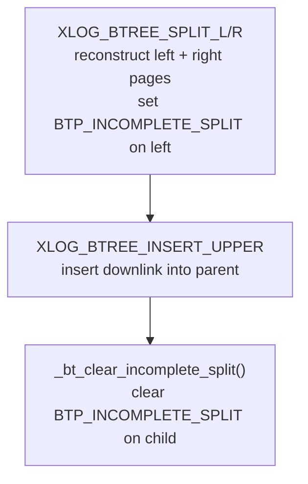
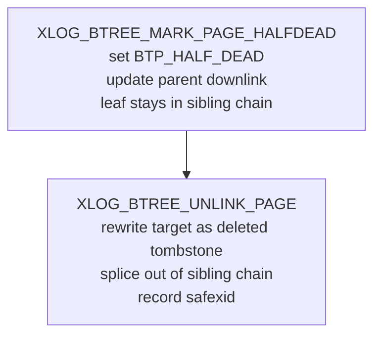

The B-tree access method logs every structural modification as a typed WAL record. `nbtxlog.c` contains the redo routines that replay those records during crash recovery and on [[subsystems/wal/recovery|standby replicas]]. Unlike heap redo, which mostly applies delta patches to existing pages, B-tree redo frequently reconstructs pages from scratch — a design that keeps the WAL records compact and makes replay deterministic. The dispatch point is `btree_redo()`, which switches on the record type and calls a dedicated handler for each case.

## Record Types

`nbtxlog.h` declares fifteen record types that make up B-tree WAL. They divide into four functional families:

| Record type | Trigger |
|---|---|
| `XLOG_BTREE_INSERT_LEAF` | Tuple inserted into a leaf page without a split |
| `XLOG_BTREE_INSERT_UPPER` | Downlink inserted into an internal page (completing a split) |
| `XLOG_BTREE_INSERT_META` | Same as INSERT_UPPER but also updates the metapage fast-root pointer |
| `XLOG_BTREE_INSERT_POST` | Leaf insert that splits an existing posting list tuple |
| `XLOG_BTREE_SPLIT_L` | Page split; new item landed on the left (original) page |
| `XLOG_BTREE_SPLIT_R` | Page split; new item landed on the right (new) page |
| `XLOG_BTREE_DEDUP` | Leaf page deduplication pass (merges equal keys into posting lists) |
| `XLOG_BTREE_VACUUM` | [[subsystems/background/autovacuum|Autovacuum]] deletes dead index tuples from a leaf page |
| `XLOG_BTREE_DELETE` | Ad-hoc deletion of LP_DEAD-flagged tuples triggered during insert |
| `XLOG_BTREE_MARK_PAGE_HALFDEAD` | First phase of page deletion: marks a leaf half-dead |
| `XLOG_BTREE_UNLINK_PAGE` | Second phase of page deletion: removes a half-dead page from the sibling chain |
| `XLOG_BTREE_UNLINK_PAGE_META` | Same, and updates the metapage fast-root pointer |
| `XLOG_BTREE_NEWROOT` | A new root page is installed after a root split |
| `XLOG_BTREE_REUSE_PAGE` | A previously deleted page is about to be recycled from the [[subsystems/storage/fsm|FSM]] |
| `XLOG_BTREE_META_CLEANUP` | Standalone metapage update recording cleanup statistics |

The INSERT variants share a single `xl_btree_insert` struct (containing just an offset number) and a single redo function `btree_xlog_insert()`. The `isleaf`, `ismeta`, and `posting` boolean parameters distinguish behaviour at the call site inside `btree_redo()`.

## Full-Page Images and Incremental Redo

After each [[subsystems/wal/checkpoint|checkpoint]], the first modification to a page includes a full-page image (FPI) in the WAL record. When the redo routine calls `XLogReadBufferForRedo()` and the system determines that the buffer needs redo but an FPI is available, the system restores the FPI without invoking the field-level redo logic. This means the individual redo routines only run when no FPI is present. That is the common steady-state case between checkpoints.

The right sibling created during a split always uses `XLogInitBufferForRedo()` (an unconditional initialise-and-return) rather than `XLogReadBufferForRedo()`, because the right page is brand new and has no pre-existing content to restore. The left (original) page uses the conditional form and applies incremental updates only when needed.

## Page Split Protocol

A page split is the most structurally complex B-tree operation. The WAL design reflects that complexity. The primary emits two separate WAL records for every split:

1. **The split record** (`XLOG_BTREE_SPLIT_L` or `XLOG_BTREE_SPLIT_R`): describes both halves of the split and the update to the former right sibling's left-link.
2. **The downlink insert record** (`XLOG_BTREE_INSERT_UPPER` or `XLOG_BTREE_INSERT_META`): records the insertion of the new separator key and downlink into the parent page.

The ordering is critical. Until the downlink is inserted, the right page is reachable via the sibling chain but has no parent pointer. The split record sets the left page's `btpo_flags` to `BTP_INCOMPLETE_SPLIT` to mark this transient state. Any backend that encounters a page with `BTP_INCOMPLETE_SPLIT` set during a normal index descent knows it must finish the split before proceeding.

During redo of the split record, `btree_xlog_split()` reconstructs the right page entirely from scratch using `_bt_restore_page()`, which re-inserts all items from the WAL record payload in original item-number order. `btree_xlog_split()` rebuilds the left page from a temporary copy of the original page, trimming items that moved to the right side and inserting the new high key. Redo sets the left page's `BTP_INCOMPLETE_SPLIT` flag, just as the primary did.

When the subsequent downlink-insert record is replayed, `btree_xlog_insert()` calls `_bt_clear_incomplete_split()` on the child page (block 1 in the record) to clear `BTP_INCOMPLETE_SPLIT`. This mirrors how the two operations appear atomic to concurrent readers on the primary, where the child and parent locks are coupled. On replay there are no concurrent index updates, so cross-level lock coupling is unnecessary.

If the split itself is of an internal page, there may have been a cascading split at the child level. The split redo routine handles this by calling `_bt_clear_incomplete_split()` on block 3 (the child's left sibling), mirroring the same pattern one level down.

### Right-Page Reconstruction Without FPIs

The WAL record for the right page carries all of its tuples explicitly rather than relying on FPI logic. The comment in `nbtxlog.h` explains the reasoning: without this explicit payload, XLogInsert would almost always treat the right page as new and store its full image anyway. Carrying the tuples explicitly is therefore no larger, and it makes replay logic cleaner. The redo routine handles the left page in the normal incremental fashion.

## Two-Phase Page Deletion

Deleting a B-tree leaf page requires two WAL records because two separate safety properties must be established in order.

**Phase 1 — Mark half-dead** (`XLOG_BTREE_MARK_PAGE_HALFDEAD`): Phase 1 empties the target leaf and sets its `btpo_flags` to `BTP_HALF_DEAD | BTP_LEAF`. It updates its former parent's downlink to point past it to the right sibling. The half-dead page still occupies its position in the doubly-linked sibling chain and retains a dummy high-key item that encodes a `topparent` block number — the highest ancestor in the subtree being deleted. This is essential for safety: a concurrent reader that has already pinned the half-dead page can still traverse right to find valid data. Setting the page half-dead without removing it from the chain ensures readers are never stranded.

**Phase 2 — Unlink** (`XLOG_BTREE_UNLINK_PAGE` / `XLOG_BTREE_UNLINK_PAGE_META`): Once it is safe (no reader can be holding a reference to the half-dead page), Phase 2 removes the page from the sibling chain. It updates the left sibling's `btpo_next` and the right sibling's `btpo_prev` to bypass the deleted page, and rewrites the target page as a deleted tombstone with a `safexid` value. The `safexid` records the XID beyond which VACUUM can physically recycle the page.

When the deletion target is not a leaf but an internal page, `btree_xlog_unlink_page()` may also update a half-dead leaf page (block 3) to refresh its `topparent` link, pointing to the next remaining ancestor in the subtree still awaiting deletion.

Redo uses the `XLOG_BTREE_UNLINK_PAGE_META` variant when the deleted page was also the fast-root recorded in the metapage. This requires `_bt_restore_meta()` to update the fast-root pointer.

## Vacuum and Ad-hoc Delete

Both `XLOG_BTREE_VACUUM` and `XLOG_BTREE_DELETE` remove dead index tuples from a single leaf page, but they serve different callers and have slightly different conflict semantics.

Autovacuum's index scan emits `XLOG_BTREE_VACUUM`. During replay, `btree_xlog_vacuum()` acquires a cleanup lock (`XLogReadBufferForRedoExtended(..., true, ...)`) on the target page, matching the cleanup lock that `btvacuumpage()` acquires during normal execution. The comment in the code notes that it is not necessary to take a cleanup lock on every page during recovery. Only pages with items to kill require it. VACUUM can rely on earlier conflict points generated when the corresponding heap tuples were pruned, so `xl_btree_vacuum` carries no `snapshotConflictHorizon` field.

`btinsert()` emits `XLOG_BTREE_DELETE` when it removes LP_DEAD-flagged tuples as a side effect of an insert. Because this deletion happens outside a full VACUUM cycle, `xl_btree_delete` includes a `snapshotConflictHorizon` (a `TransactionId`) and an `isCatalogRel` flag. On a Hot Standby replica, `btree_xlog_delete()` calls `ResolveRecoveryConflictWithSnapshot()` before applying the page changes, potentially cancelling standby queries that are keeping a snapshot older than the conflict horizon.

Both record types also support "updates" of posting list tuples (via `xl_btree_update` metadata), used when only some TIDs within a posting list are being removed rather than the entire tuple.

## Page Reuse and Hot Standby Conflicts

`XLOG_BTREE_REUSE_PAGE` is a special-purpose record with no page content to replay. `_bt_split()` emits it at the moment it pulls a deleted page from the free space map and recycles it for an entirely new page. The record carries the `snapshotConflictHorizon` from the original deleted-page tombstone.

On a replica, `btree_xlog_reuse_page()` calls `ResolveRecoveryConflictWithSnapshotFullXid()` using this horizon. The intent is to cancel any Hot Standby query whose snapshot predates the XID at which the page was deleted. Such a query might still hold a logical reference to the page's former identity. The `GlobalVisCheckRemovableFullXid()` test used on the primary to decide whether a page is recyclable mirrors the `PGPROC->xmin > limitXmin` test used on the standby, so a single XID value achieves the same exclusion on both sides.

## Metapage Maintenance

The B-tree metapage (block 0 of the index) tracks the current root, fast-root, and cleanup statistics. Any record that changes the root pointer — `XLOG_BTREE_NEWROOT`, `XLOG_BTREE_INSERT_META`, `XLOG_BTREE_UNLINK_PAGE_META`, and `XLOG_BTREE_META_CLEANUP` — also replays a metapage update via `_bt_restore_meta()`. The helper reconstructs the entire metapage from an `xl_btree_metadata` struct embedded in the WAL record, then sets `pd_lower` past the end of the metadata so that xlog.c page compression does not truncate it.

The `XLOG_BTREE_META_CLEANUP` record is a standalone metapage update emitted at the end of a VACUUM pass to record the updated `last_cleanup_num_delpages` count. It carries no other payload.

## Memory Management During Replay

`btree_xlog_startup()` creates a dedicated [[subsystems/memory/contexts|memory context]] (`opCtx`) for B-tree recovery. `btree_redo()` switches into it before each record and resets it immediately after, ensuring that per-record allocations (posting list copies, deduplication state) do not accumulate across the recovery stream. `btree_xlog_cleanup()` deletes the context when recovery finishes.

## WAL Consistency Masking

The WAL consistency checker calls `btree_mask()` to zero out fields that legitimately differ between primary and standby without being errors. It masks the LSN, checksum, hint bits, unused space, `BTP_HAS_GARBAGE`, `BTP_SPLIT_END`, and `btpo_cycleid`. On leaf pages it also masks LP_FLAGS because `_bt_killitems()` and `_bt_check_unique()` can modify line pointer flags without logging them, making those flags inherently unlogged [[subsystems/transactions/hint-bits|hint bits]].

## Related Topics

- [[subsystems/indexes/btree]]
- [[subsystems/wal/overview]]
- [[subsystems/wal/recovery]]
- [[subsystems/wal/wal-records]]
- [[subsystems/background/autovacuum]]
