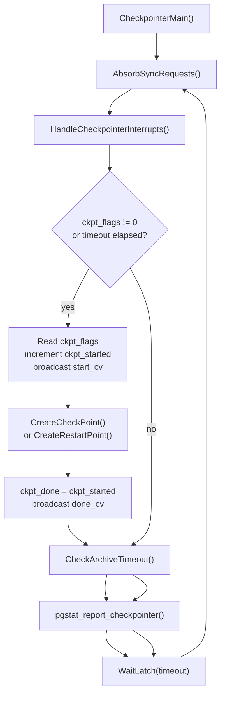
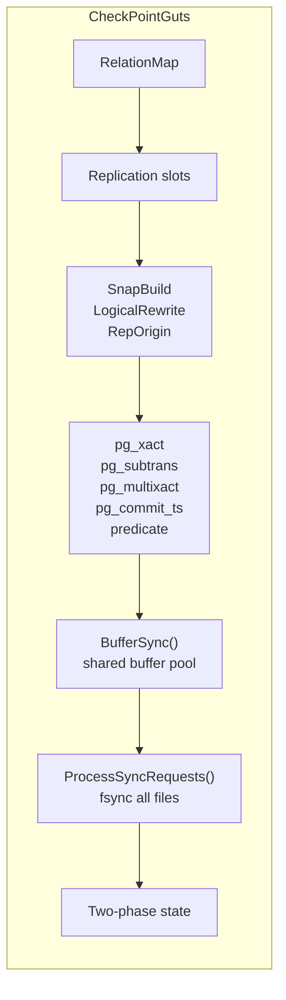
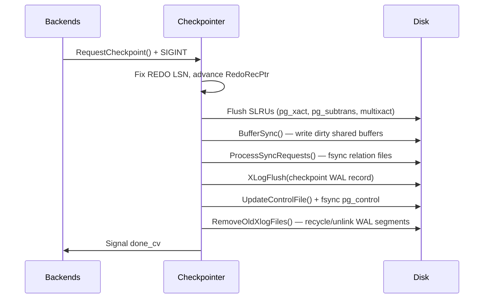
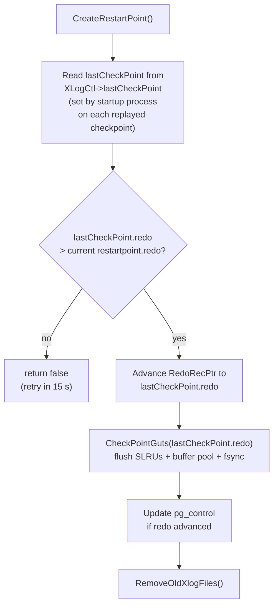

# Checkpoint Code Path

A checkpoint is a point in the WAL stream at which PostgreSQL guarantees two things. Every dirty shared buffer that existed before the checkpoint's REDO LSN has been written and fsynced to the data files. A WAL record naming that LSN has itself been flushed. Crash recovery therefore needs only to replay WAL from the REDO LSN forward. Everything before it is already reflected in the data files. Without periodic checkpoints, recovery time grows without bound as WAL accumulates and the data files drift further from their on-disk representation. After a successful checkpoint, WAL segments older than the new REDO LSN can be recycled or removed.

## The CheckPoint record

Every checkpoint writes a `CheckPoint` struct (`src/include/catalog/pg_control.h`) as the body of a WAL record. PostgreSQL stores a verbatim copy of the most recent `CheckPoint` in `pg_control` (`ControlFileData.checkPointCopy`), so crash recovery can read it without scanning WAL. `CreateRestartPoint()` also uses the struct on standbys.

| Field | Type | Purpose |
|---|---|---|
| `redo` | `XLogRecPtr` | LSN from which WAL replay must begin on crash recovery — fixed before any buffer is written |
| `ThisTimeLineID` | `TimeLineID` | Timeline in effect when the checkpoint was taken |
| `PrevTimeLineID` | `TimeLineID` | Previous timeline when a new one begins; otherwise equals `ThisTimeLineID` |
| `fullPageWrites` | `bool` | Whether FPW was enabled at checkpoint start — recovery uses this to interpret subsequent WAL |
| `nextXid` | `FullTransactionId` | Ensures no XID active at checkpoint time is reused after a restart |
| `nextOid` | `Oid` | OID generator state |
| `nextMulti` / `nextMultiOffset` | `MultiXactId` / offset | MultiXact generator state, protecting `pg_multixact` |
| `oldestXid` | `TransactionId` | Global `datfrozenxid` floor — drives `pg_xact` truncation decisions |
| `oldestXidDB` | `Oid` | Database holding `oldestXid` |
| `oldestMulti` / `oldestMultiDB` | `MultiXactId` / `Oid` | Global `datminmxid` floor |
| `time` | `pg_time_t` | Wall-clock timestamp of the checkpoint |
| `oldestActiveXid` | `TransactionId` | Oldest running XID at online-checkpoint start; `InvalidTransactionId` on shutdown; hot standby uses it to build its initial snapshot |

Two WAL record types exist: `XLOG_CHECKPOINT_SHUTDOWN` (decimal 0x00) for shutdown checkpoints and `XLOG_CHECKPOINT_ONLINE` (0x10) for all others. Both carry an identical `CheckPoint` struct.

PostgreSQL updates `pg_control` (`global/pg_control`) after each checkpoint. It stores the location of the WAL record (`ControlFileData.checkPoint`) plus the inline copy of the struct. PostgreSQL writes `pg_control` as a single `write(2)` that fits within `PG_CONTROL_MAX_SAFE_SIZE` (512 bytes). Because of this, the update is atomic on any storage device that guarantees sector-level atomicity.

### DBState in pg_control

Recovery uses the `state` field of `ControlFileData` to decide how much WAL to replay.

| State | Meaning |
|---|---|
| `DB_IN_PRODUCTION` | Normal running state |
| `DB_SHUTDOWNING` | Set at the start of a shutdown checkpoint |
| `DB_SHUTDOWNED` | Clean shutdown — startup skips crash recovery |
| `DB_SHUTDOWNED_IN_RECOVERY` | Clean standby shutdown |
| `DB_IN_CRASH_RECOVERY` | Startup process is replaying WAL after a crash |
| `DB_IN_ARCHIVE_RECOVERY` | Standby or PITR recovery in progress |

## Triggers

Four events cause a checkpoint:

1. **Time-based (`checkpoint_timeout`)**: the checkpointer's main loop tracks `last_checkpoint_time` and fires when `elapsed_secs >= CheckPointTimeout`. The checkpointer OR's the flag `CHECKPOINT_CAUSE_TIME` into the request. Default: 300 s.
2. **WAL-volume-based (`max_wal_size`)**: when a backend opens a new WAL segment and the number of segments since the last checkpoint exceeds a threshold derived from `max_wal_size`, it calls `RequestCheckpoint(CHECKPOINT_CAUSE_XLOG)`. With defaults (`max_wal_size = 1 GB`, 16 MB segments) the threshold is around 64 segments. If `elapsed_secs < CheckPointWarning` (default 30 s) when this fires, the server logs a "checkpoints are occurring too frequently" hint.
3. **Explicit `CHECKPOINT` command**: backends that execute the SQL `CHECKPOINT` command call `RequestCheckpoint(CHECKPOINT_FORCE | CHECKPOINT_WAIT)`.
4. **Shutdown**: `ShutdownXLOG()` calls `CreateCheckPoint(CHECKPOINT_IS_SHUTDOWN | CHECKPOINT_IMMEDIATE)` after all other processes have exited.

## Checkpoint request flags

Callers compose a bitmask from these flags (`src/include/access/xlog.h`):

| Flag | Value | Meaning |
|---|---|---|
| `CHECKPOINT_IS_SHUTDOWN` | `0x0001` | Shutdown checkpoint — update `state` to `DB_SHUTDOWNED` |
| `CHECKPOINT_END_OF_RECOVERY` | `0x0002` | End-of-recovery checkpoint — treated like shutdown but recovery continues |
| `CHECKPOINT_IMMEDIATE` | `0x0004` | Disable `checkpoint_completion_target` throttling |
| `CHECKPOINT_FORCE` | `0x0008` | Force even if no WAL activity since last checkpoint |
| `CHECKPOINT_FLUSH_ALL` | `0x0010` | Include unlogged relation buffers |
| `CHECKPOINT_WAIT` | `0x0020` | Caller blocks until the checkpoint completes |
| `CHECKPOINT_REQUESTED` | `0x0040` | Set by `RequestCheckpoint()` to distinguish explicit requests |
| `CHECKPOINT_CAUSE_XLOG` | `0x0080` | Triggered by WAL segment consumption |
| `CHECKPOINT_CAUSE_TIME` | `0x0100` | Triggered by `checkpoint_timeout` expiry |

PostgreSQL coalesces multiple simultaneous callers: `RequestCheckpoint()` OR's the flags into `CheckpointerShmemStruct.ckpt_flags` under the spinlock, so the next checkpoint run honours all pending requests in one pass.

## The checkpointer process and its shared memory

The checkpointer is a dedicated auxiliary process launched by the postmaster. It owns `CheckpointerShmemStruct` in shared memory (`src/backend/postmaster/checkpointer.c`):

| Field | Purpose |
|---|---|
| `checkpointer_pid` | PID of the checkpointer, or 0 if not running |
| `ckpt_lck` | Spinlock protecting all `ckpt_*` fields |
| `ckpt_started` | Generation counter, incremented when a checkpoint begins |
| `ckpt_done` | Set to `ckpt_started` when the checkpoint finishes |
| `ckpt_failed` | Incremented when a checkpoint fails |
| `ckpt_flags` | OR'd flags from all pending requests |
| `start_cv` / `done_cv` | Condition variables backends sleep on when `CHECKPOINT_WAIT` is set |
| `num_backend_writes` | Count of buffer writes performed by user backends (used in `pg_stat_bgwriter`) |
| `num_backend_fsync` | Subset of writes that required the backend to do its own fsync |
| `num_requests` / `max_requests` | Occupancy of the fsync request queue |
| `requests[]` | Flexible array of `CheckpointerRequest` structs — file tags and request types forwarded by backends |

### Main loop structure

`CheckpointerMain()` runs in an infinite loop. On each iteration:

1. Fsync request draining (`AbsorbSyncRequests()`): drains any fsync requests that backends or the bgwriter posted to `requests[]`.
2. Interrupt handling (`HandleCheckpointerInterrupts()`): processes SIGHUP (config reload), SIGUSR2 (shutdown — calls `ShutdownXLOG()` then exits), and process-signal barriers.
3. The loop checks whether `ckpt_flags` is nonzero (an explicit request is pending) or `elapsed_secs >= checkpoint_timeout` (time-based trigger). If either is true, it runs the checkpoint.
4. Archive timeout handling (`CheckArchiveTimeout()`): handles `archive_timeout`-driven WAL segment switches, then reports statistics.
5. Latch wait (`WaitLatch()`): sleeps until the next deadline or until signalled.

The checkpointer receives `SIGINT` (mapped to `ReqCheckpointHandler`) when a backend calls `RequestCheckpoint()`. The handler simply calls `SetLatch()` to break out of `WaitLatch()`.



### Backend wait protocol

`RequestCheckpoint(CHECKPOINT_WAIT)` uses a careful counter-based protocol to avoid races:

1. Record current `ckpt_failed` and `ckpt_started`, OR in flags, release spinlock.
2. Send `SIGINT` to the checkpointer.
3. Sleep on `start_cv` until `ckpt_started` advances — the checkpoint began with the caller's flags visible.
4. Sleep on `done_cv` until `ckpt_done >= new_started` (modular comparison) — the checkpoint finished.
5. If `ckpt_failed` changed, raise an error; otherwise return.

## Creating a checkpoint

`CreateCheckPoint()` (`src/backend/access/transam/xlog.c`, line 6482) is the core routine. It operates in four phases.

### Phase 0 — skip idle systems

Before entering the critical section, `SyncPreCheckpoint()` lets storage managers do pre-checkpoint housekeeping. Then, if the instance has had no WAL activity since the last checkpoint (`last_important_lsn == ControlFile->checkPoint`) and no `CHECKPOINT_IS_SHUTDOWN`, `CHECKPOINT_END_OF_RECOVERY`, or `CHECKPOINT_FORCE` flag is set, the function returns immediately with a DEBUG1 message.

### Phase 1 — fix the REDO LSN

The REDO LSN is the boundary between "already on disk" and "must be replayed". `CreateCheckPoint()` captures it inside a critical section while holding all WAL insert locks exclusively:

```c
WALInsertLockAcquireExclusive();
curInsert = XLogBytePosToRecPtr(Insert->CurrBytePos);
checkPoint.redo = curInsert;  /* next byte that will be written */
RedoRecPtr = XLogCtl->Insert.RedoRecPtr = checkPoint.redo;
WALInsertLockRelease();
```

Advancing `RedoRecPtr` while holding insert locks ensures that any WAL insertion after this point will see the new value. Such an insertion will also embed a full-page image for any page whose LSN is older than `checkPoint.redo`. Backends currently in mid-insertion will finish their record with the old `RedoRecPtr`. They may write an unnecessary FPI, which is safe. But no future insertion can miss the new redo boundary.

The critical section then ends so that the following I/O does not hold it.

### Phase 2 — flush dirty state

`CheckPointGuts(checkPoint.redo, flags)` (`xlog.c`, line 7082) performs all durable I/O. Its call sequence is:

1. Relation-map flush (`CheckPointRelationMap()`): flushes the relation-map file that maps system-catalog OIDs to relfilenodes.
2. Replication slot persistence (`CheckPointReplicationSlots()`): persists replication slot state.
3. Logical decoding snapshot flush (`CheckPointSnapBuild()`): flushes serialized logical decoding snapshots.
4. Logical rewrite heap flush (`CheckPointLogicalRewriteHeap()`): flushes logical rewrite heap files.
5. Replication origin persistence (`CheckPointReplicationOrigin()`): persists replication origin progress.
6. **SLRUs** (`CheckPointCLOG()`, `CheckPointCommitTs()`, `CheckPointSUBTRANS()`, `CheckPointMultiXact()`): flush `pg_xact`, `pg_commit_ts`, `pg_subtrans`, and `pg_multixact` SLRU buffers.
7. Predicate-lock SLRU flush (`CheckPointPredicate()`): flushes predicate-lock SLRU (SERIALIZABLE isolation tracking).
8. Shared buffer pool write (`CheckPointBuffers(flags)` → `BufferSync(flags)`): writes all dirty shared buffers (see below).
9. Relation file fsync (`ProcessSyncRequests()`): fsyncs every relation file that received writes (see below).
10. Two-phase commit flush (`CheckPointTwoPhase(checkPointRedo)`): flushes two-phase commit state for in-progress prepared transactions.

Flushing SLRUs before the buffer pool ensures consistency: a data page on disk whose transaction's `pg_xact` ([[subsystems/storage/clog|CLOG]]) entry has not been flushed would be uninterpretable during recovery.



### Phase 3 — write and flush the WAL record

After `CheckPointGuts()` returns, the function waits for any transactions that set `delayChkptFlags` (commit critical sections) to finish, then:

```c
XLogBeginInsert();
XLogRegisterData((char *) &checkPoint, sizeof(checkPoint));
recptr = XLogInsert(RM_XLOG_ID, shutdown ? XLOG_CHECKPOINT_SHUTDOWN : XLOG_CHECKPOINT_ONLINE);
XLogFlush(recptr);
```

`XLogFlush()` is the moment the checkpoint becomes durable. Nothing before `checkPoint.redo` in the WAL stream can be replayed without this record being safely on disk.

### Phase 4 — update pg_control and recycle WAL

```c
LWLockAcquire(ControlFileLock, LW_EXCLUSIVE);
ControlFile->checkPoint = ProcLastRecPtr;  /* LSN of checkpoint record */
ControlFile->checkPointCopy = checkPoint;   /* inline copy of struct */
UpdateControlFile();
LWLockRelease(ControlFileLock);
```

`UpdateControlFile()` writes `ControlFileData` (padded to `PG_CONTROL_FILE_SIZE` = 8192 bytes) and calls `fsync()`. The data path then calls `RemoveOldXlogFiles()` to recycle segments older than the new `RedoRecPtr`, adjusted by `wal_keep_size`, replication slot requirements (`KeepLogSeg()`), and `pg_wal` segment recycling logic.



## Dirty buffer flush

`CheckPointBuffers()` calls `BufferSync()` (`src/backend/storage/buffer/bufmgr.c`), which consists of two passes.

**Pass 1 — identify dirty buffers.** The function scans all `NBuffers` `BufferDesc` entries. For each buffer whose state has both `BM_DIRTY` and `BM_PERMANENT` set (the scan excludes unlogged relations unless `CHECKPOINT_FLUSH_ALL` is set), it records the buffer's physical address in `CkptBufferIds[]` and atomically sets `BM_CHECKPOINT_NEEDED` in the buffer's state word. Setting this flag while doing the scan — not at write time — means buffers dirtied after this point will not have the flag and will not be written by this checkpoint. If a backend or the bgwriter writes a buffer during the checkpoint, it clears `BM_CHECKPOINT_NEEDED` on that buffer, so `BufferSync()` will skip it.

`BufferSync()` then sorts the collected buffer IDs by `(tablespace OID, relNumber, forkNum, blockNum)` to convert random writes into near-sequential I/O.

**Pass 2 — write dirty buffers.** `BufferSync()` uses a min-heap over per-tablespace progress to interleave writes across tablespaces rather than draining them one at a time. For each selected buffer, `BufferSync()` calls `SyncOneBuffer()`. `SyncOneBuffer()` conditionally pins the buffer, acquires a shared content lock, calls `smgrwrite()` to write the page to the OS page cache, and releases. `BufferSync()` defers the fsync itself to `ProcessSyncRequests()`. After each write, `BufferSync()` calls `CheckpointWriteDelay()` to enforce the I/O throttle.

**Writeback batching.** `checkpoint_flush_after` (GUC, default 256 pages = 2 MB) controls how often the checkpointer issues `sync_file_range(SYNC_FILE_RANGE_WRITE)` to push writeback to disk incrementally, bounding the OS dirty-page footprint and reducing the latency of the final fsync in `ProcessSyncRequests()`.

## I/O throttling

A checkpoint that writes at full speed creates an I/O spike that degrades query latency. `checkpoint_completion_target` (default 0.9) is a fraction of `checkpoint_timeout`; the checkpointer aims to finish the flush phase within `target × timeout` seconds of the checkpoint's start.

`BufferSync()` calls `CheckpointWriteDelay(flags, progress)` after every buffer write. It compares `progress` (a fraction of buffers written) against two independent schedules, both scaled by `checkpoint_completion_target`:

- **Time schedule**: `elapsed_time / checkpoint_timeout`. If progress exceeds this, the checkpointer is ahead of time and sleeps for 100 ms via `WaitLatch()`.
- **WAL schedule**: `(recptr - ckpt_start_recptr) / (wal_segment_size × CheckPointSegments)`. If progress exceeds the fraction of `max_wal_size` consumed since the checkpoint started, it is ahead on WAL as well.

If the checkpointer is behind on either schedule, it writes without delay. `CHECKPOINT_IMMEDIATE` bypasses the function entirely.

Every `WRITES_PER_ABSORB` (1000) writes, the function also calls `AbsorbSyncRequests()` to drain the fsync queue even when not sleeping, preventing queue overflow.

## The fsync phase

After `BufferSync()` returns, `ProcessSyncRequests()` (in `src/backend/storage/sync/sync.c`) iterates the in-memory pending-fsync table populated by `AbsorbSyncRequests()` and calls `smgrsync()` for each relation file that had pages written during the checkpoint. `smgrsync()` calls `FileSync()` which calls `pg_fsync()` (wrapping `fsync(2)` or `fdatasync(2)`). This two-phase design — write first, fsync later — lets the kernel scheduler optimise write ordering while still guaranteeing durability before the checkpoint record is written.

Backends that write buffers outside a checkpoint (forced page evictions) call `ForwardSyncRequest()` to add an entry to `CheckpointerShmem->requests[]` rather than fsyncing themselves. If the queue is full, `CompactCheckpointerRequestQueue()` deduplicates it; if it is still full, the backend falls back to performing its own fsync (counted in `num_backend_fsync`).

## WAL segment recycling

After `UpdateControlFile()`, `CreateCheckPoint()` computes the lowest segment number still needed:

```c
XLByteToSeg(RedoRecPtr, _logSegNo, wal_segment_size);
KeepLogSeg(recptr, slotsMinReqLSN, &_logSegNo);
_logSegNo--;
RemoveOldXlogFiles(_logSegNo, RedoRecPtr, recptr, EndOfWAL);
```

`KeepLogSeg()` raises `_logSegNo` to account for:
- `wal_keep_size` — keeps a minimum amount of WAL for streaming replication consumers.
- Replication slot minimum LSNs — no segment required by any slot is removed.

`RemoveOldXlogFiles()` walks `pg_wal/`, and for each segment below the threshold, either renames it to a higher-numbered name (recycling) or unlinks it. The estimated distance to the next checkpoint (`XLOGfileslop()`) bounds the number of segments to recycle, so the directory does not accumulate more pre-allocated files than needed.

A standby cannot remove segments until its own restartpoint advances past them; its WAL receiver may still be streaming data from an earlier position.

## Restartpoints on standbys

A standby does not write WAL, so `CreateCheckPoint()` cannot run. Instead, the checkpointer calls `CreateRestartPoint()` (`xlog.c`, line 7163) when the checkpointer loop's checkpoint condition triggers during recovery.

The key differences from `CreateCheckPoint()`:

1. **No new REDO LSN is computed.** The restartpoint adopts the `redo` field from the most recently replayed checkpoint record, read from `XLogCtl->lastCheckPoint` (set by the startup process when it processes each checkpoint WAL record via `RecoveryRestartPoint()`). If no new checkpoint record has been replayed since the last restartpoint, `CreateRestartPoint()` returns `false` and the checkpointer retries after 15 seconds.
2. **RedoRecPtr is advanced to `lastCheckPoint.redo`.** This allows PostgreSQL to recycle WAL segments before that LSN.
3. **Full flush via `CheckPointGuts(lastCheckPoint.redo)`**: flushes SLRUs and shared buffers exactly as on a primary.
4. **pg_control is updated only if `ControlFile->checkPointCopy.redo < lastCheckPoint.redo`** — the condition guards against a race where the standby promotes before the restartpoint completes.
5. **WAL removal uses `endptr = max(receivePtr, replayPtr)`** — PostgreSQL retains segments until the replay head confirms they will not be needed again.

A restartpoint cannot make recovery start from a point further ahead than the primary has already checkpointed. This constraint holds naturally, because the restartpoint's REDO LSN comes from a checkpoint record that the primary wrote.



## Observable metrics

### pg_stat_bgwriter (PG 15 and earlier)

In PostgreSQL 15 and earlier, `pg_stat_bgwriter` reports checkpoint statistics. In PostgreSQL 16+, PostgreSQL split off most fields into `pg_stat_checkpointer`. The `PgStat_CheckpointerStats` struct (`src/include/pgstat.h`) holds:

| Field | Meaning |
|---|---|
| `timed_checkpoints` | Checkpoints triggered by `checkpoint_timeout` |
| `requested_checkpoints` | Checkpoints triggered by explicit requests or WAL pressure |
| `checkpoint_write_time` | Milliseconds spent in the write phase (start of `BufferSync()` to end) |
| `checkpoint_sync_time` | Milliseconds spent in `ProcessSyncRequests()` |
| `buf_written_checkpoints` | Shared buffers written by the checkpointer |
| `buf_written_backend` | Buffers written by backend evictions (`num_backend_writes`) |
| `buf_fsync_backend` | Backend-eviction writes that also required the backend to fsync (`num_backend_fsync`) |

PostgreSQL accumulates these in `PendingCheckpointerStats` (a per-process global). `pgstat_report_checkpointer()` flushes them to the cumulative stats system at the end of each checkpoint and at the end of each main-loop iteration.

**PostgreSQL 17:** PostgreSQL added `pg_stat_checkpointer` as a dedicated view for checkpointer statistics (the view existed in PG 16 with a different column set; PG 17 further refined it). It removed the `buffers_backend` and `buffers_backend_fsync` columns from `pg_stat_bgwriter` and moved them to `pg_stat_io`.

**PostgreSQL 18:** `pg_stat_checkpointer` gains `num_done` (count of checkpoints that actually completed, as opposed to just being requested) and `slru_written` (SLRU pages written during checkpoints).

### log_checkpoints output

When `log_checkpoints = on` (default since PG 16), the server logs a completion line such as:

```
LOG:  checkpoint complete: wrote 1423 buffers (8.7%); 0 WAL file(s) added, 3 removed, 5 recycled;
      write=4.201 s, sync=0.083 s, total=4.312 s; sync files=47, longest=0.021 s, average=0.001 s;
      distance=49216 kB, estimate=51068 kB
```

`distance` is the WAL generated since the previous checkpoint's REDO LSN. `estimate` is a smoothed value used to project the next WAL-pressure threshold.

## Full-page writes interaction

Advancing `RedoRecPtr` at checkpoint start has a second effect: any page that was last modified before the new `RedoRecPtr` and is subsequently modified again will have a full-page image embedded in the WAL record (`XLogRecordAssemble()` compares `page_lsn` against `RedoRecPtr`). This prevents torn-page corruption during crash recovery. The cost is larger WAL volume after each checkpoint. This cost diminishes as pages accumulate new modifications and their LSN moves past the REDO LSN. `CreateCheckPoint()` records the `fullPageWrites` state at checkpoint time in `checkPoint.fullPageWrites`, so recovery can correctly interpret the following WAL stream.

## See also

- [[code-paths/checkpoint|CHECKPOINT (SQL Command)]] — what the `CHECKPOINT` command does from a DBA's perspective and when to run it manually
- [[subsystems/wal/overview]] — WAL record format, insert path, and segment management
- [[subsystems/storage/buffer-manager]] — buffer pool, pinning, BM_DIRTY and BM_CHECKPOINT_NEEDED flag lifecycle
- [[subsystems/background/bgwriter]] — bgwriter's role in proactive dirty-page flushing between checkpoints
- [[subsystems/wal/recovery]] — how the startup process reads pg_control and replays WAL from the checkpoint REDO LSN
