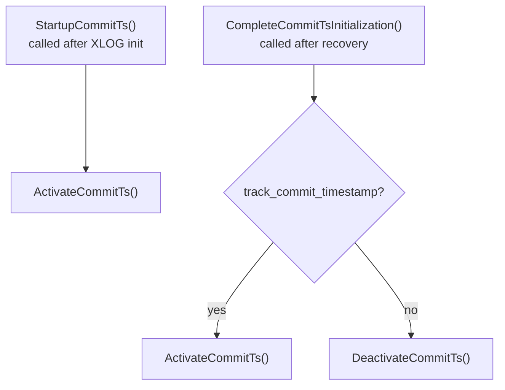

The commit timestamp subsystem records the wall-clock time at which each transaction committed, and optionally the replication origin that produced the commit. PostgreSQL stores this data separately from [[subsystems/storage/clog|CLOG]] (which records only committed/aborted status). The data is available only when `track_commit_timestamp = on`. Its primary uses are logical replication conflict resolution and application-level auditing via the SQL functions `pg_xact_commit_timestamp()` and `pg_last_committed_xact()`.

## Storage Layout

Commit timestamp data lives in `pg_commit_ts/`, a directory of SLRU segment files managed by the same infrastructure as `pg_xact`. Each transaction occupies a fixed-size `CommitTimestampEntry` record containing a `TimestampTz` (8 bytes) and a `RepOriginId` (2 bytes) — 10 bytes per XID (commit_ts.c). Because this is slightly more than twice the 1-byte-per-XID layout of CLOG, PostgreSQL scales up the number of shared buffers accordingly: `CommitTsShmemBuffers()` uses `min(256, max(4, NBuffers/256))`, twice the CLOG ceiling.

A transaction's XID maps to a page and slot by straightforward division: `TransactionIdToCTsPage(xid)` and `TransactionIdToCTsEntry(xid)` compute these by dividing the XID by `COMMIT_TS_XACTS_PER_PAGE` (which equals `BLCKSZ / 10`). Because XIDs are 32-bit values that wrap at `0xFFFFFFFF`, page and segment numbers wrap correspondingly; `CommitTsPagePrecedes()` handles the modular comparison analogously to its CLOG counterpart.

## Writing Commit Timestamps

When a transaction commits, `xact.c` calls `TransactionTreeSetCommitTsData()` with the top-level XID, the list of subtransaction XIDs, the commit timestamp, and the `RepOriginId`. PostgreSQL must store sub-XIDs individually rather than derive them from the subtransaction SLRU, because the subtransaction SLRU is not crash-safe across restarts (commit_ts.c, line 128).

The function walks the XID list and groups entries by SLRU page, so it locks and modifies each page exactly once. For each group it calls `SetXidCommitTsInPage()`. `SetXidCommitTsInPage()` acquires `CommitTsSLRULock` exclusively, reads the page via `SimpleLruReadPage()`, writes every entry in the group via `TransactionIdSetCommitTs()`, and marks the page dirty before releasing the lock.

After flushing all SLRU pages, `TransactionTreeSetCommitTsData()` acquires `CommitTsLock` exclusively to update two things in `CommitTimestampShared`:

- `xidLastCommit` / `dataLastCommit` — a single-entry cache of the most recent commit. Reads for this XID are served directly from shared memory without touching SLRU.
- `ShmemVariableCache->newestCommitTsXid` — the upper bound of the valid XID range, advanced if the new commit extends it.

`xact.c`, not commit_ts.c itself, writes WAL for this data as part of the `XLOG_XACT_COMMIT` record. Recovery replays commit timestamps from those records. The only WAL records that commit_ts.c emits independently are `COMMIT_TS_ZEROPAGE` (when a new SLRU page is initialised) and `COMMIT_TS_TRUNCATE` (when old segments are removed). See [[subsystems/wal/overview|WAL overview]] for how resource managers own their record types.

## Reading Commit Timestamps

`TransactionIdGetCommitTsData()` serves read requests. Before consulting SLRU, it checks three conditions under a shared `CommitTsLock`:

1. The module is active; if not, it raises an error with a hint to enable `track_commit_timestamp`.
2. The XID matches the `xidLastCommit` cache; if so, `TransactionIdGetCommitTsData()` returns the timestamp and origin directly from shared memory.
3. The XID falls within `[oldestCommitTsXid, newestCommitTsXid]`; if outside that range, the function returns false and a zero timestamp rather than reading potentially uninitialised data.

For XIDs in range but not cached, `SimpleLruReadPage_ReadOnly()` fetches the page under `CommitTsSLRULock` (shared). `TransactionIdGetCommitTsData()` then copies out the 10-byte entry. `GetLatestCommitTsData()` is a simpler variant that returns only the cached last-commit data.

PostgreSQL exposes these functions to SQL as:

| Function | Returns |
|---|---|
| `pg_xact_commit_timestamp(xid)` | `timestamptz` or NULL |
| `pg_xact_commit_timestamp_origin(xid)` | `(timestamptz, oid)` composite or NULL |
| `pg_last_committed_xact()` | `(xid, timestamptz, oid)` composite |

## Activation and Deactivation

Unlike other SLRU modules that are always active, CommitTs has an explicit on/off state tracked by `commitTsShared->commitTsActive`. This indirection exists because the GUC is `PGC_POSTMASTER` — it cannot change at runtime. Yet a standby must be able to activate the module mid-recovery. It does so the first time it replays an `XLOG_PARAMETER_CHANGE` record that signals the primary has enabled it.

`ActivateCommitTs()` sets `commitTsActive = true` and, if `oldestCommitTsXid` is `InvalidTransactionId` (meaning the module was never active or was just re-enabled), initialises both bounds to `nextXid`. It also creates the current SLRU segment file if it does not exist — necessary when the server had been running with the feature disabled and skipped normal segment creation. `DeactivateCommitTs()` does the reverse. It resets the shared cache, sets both XID bounds to invalid, and deletes all existing segment files via `SlruScanDirCbDeleteAll`. Deleting all files on deactivation prevents a gap in the file sequence if the feature is later re-enabled.

The path through startup is:

During replay, `XLOG_PARAMETER_CHANGE` records trigger `CommitTsParameterChange()`, which calls `ActivateCommitTs()` or `DeactivateCommitTs()` accordingly. A standby that has `track_commit_timestamp = off` locally will still activate the module if the primary has it enabled. This lets it replay future commit-ts WAL records correctly.

## Lifecycle Operations

**Extension**: `GetNewTransactionId()` calls `ExtendCommitTs()` while holding `XidGenLock`. It initialises a new SLRU page (and emits a `COMMIT_TS_ZEROPAGE` WAL record) only when the given XID is the first entry on a new page, keeping overhead minimal in the common case.

**Checkpointing**: `CheckPointCommitTs()` calls `SimpleLruWriteAll()` to flush dirty CommitTs pages to disk. CommitTs needs no additional logic; the checkpoint mechanism handles sync requests generically.

**Truncation**: Vacuum and the checkpoint call `TruncateCommitTs()` with the `oldestXact` value. It computes the cutoff page with `TransactionIdToCTsPage(oldestXact)` and writes a `COMMIT_TS_TRUNCATE` WAL record that includes both the cutoff page and the oldest XID. It then calls `SimpleLruTruncate()`. On replay, `commit_ts_redo()` advances `oldestCommitTsXid` before truncating so the valid-range bounds stay consistent.

## Replication Origin Integration

The `RepOriginId` field stored alongside each timestamp enables logical replication to record which origin node produced a given transaction. When a logical replication worker applies a remote transaction, it sets the origin ID in the commit record; downstream consumers can then retrieve it via `pg_xact_commit_timestamp_origin()`. A value of `0` (`InvalidRepOriginId`) means the transaction originated locally. This pairing of timestamp and origin in a single 10-byte record is intentional: conflict resolution typically needs both pieces of information together.

## Related Topics

- [[subsystems/wal/overview|WAL overview]] — how commit records are written and replayed; resource manager dispatch
- [[subsystems/transactions/transaction-lifecycle|transaction lifecycle]] — where `TransactionTreeSetCommitTsData()` is called in the commit sequence
- [[subsystems/storage/clog|CLOG]] — the sibling SLRU that records committed/aborted status without timestamps
