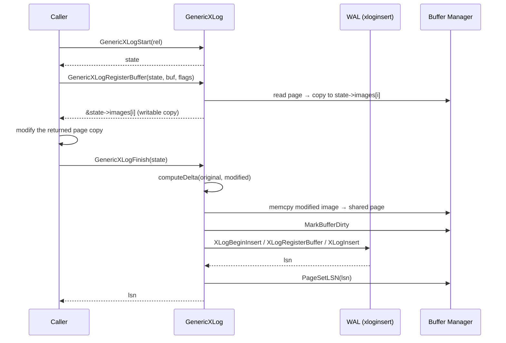

# Generic WAL API

The generic WAL API lets index access method extensions write [[subsystems/wal/overview|WAL]]-logged page modifications without implementing a custom resource manager. Every access method that modifies heap or index pages must ensure those changes are crash-safe. Extension authors, however, lack a slot in the table of built-in resource managers. The custom resource manager API (available since PG 15) covers extensions that need compact, semantically-rich records. For extensions that simply need any correct recovery mechanism, the generic WAL API provides that without a custom resource manager. The caller modifies a private copy of each page. At commit time, the API diffs the original against the modified copy to produce a compact byte-range delta. It stores that delta in a standard WAL record under `RM_GENERIC_ID`. The tradeoff is record size. A custom resource manager knows exactly what changed and can encode it minimally. Generic WAL, by contrast, captures only byte-level differences between page images. That approach is correct, but it can produce records larger than a semantic encoding would.

## Delta format

A generic WAL record stores page changes as a sequence of *fragments*. Each fragment covers a contiguous run of bytes that differ between the original and modified page images, encoded as:

- `offset` (`OffsetNumber`) — start position within the page
- `length` (`OffsetNumber`) — byte count of the changed run
- `data` — the new bytes (length bytes)

Unchanged byte ranges are omitted entirely, so a small edit to a large page produces a small delta. The fragment header itself costs `2 × sizeof(OffsetNumber)` = 4 bytes. When two consecutive changed regions are separated by a gap of 4 bytes or fewer (`MATCH_THRESHOLD`), the encoder merges them into a single larger fragment. This saves space compared to encoding two separate headers. When the gap exceeds that threshold, the encoder keeps the fragments distinct.

Delta computation treats the lower and upper halves of a page separately, bounded by `pd_lower` and `pd_upper`. The delta never includes the free space between them, the "hole." On replay, recovery explicitly zeroes that region, so the recovered page is byte-identical to what `GenericXLogFinish` produced. The worst-case delta size is one full page plus two fragment headers (`BLCKSZ + 8` bytes), reached only when both the lower and upper regions are entirely different.

## Full-page images

When a buffer's page has not yet been written to disk since the last checkpoint, the [[subsystems/wal/overview|WAL]] layer must include a full-page image to protect against torn writes. Generic WAL handles this the same way built-in resource managers do. The caller can pass `GENERIC_XLOG_FULL_IMAGE` as a flag to `GenericXLogRegisterBuffer`. Alternatively, the standard `REGBUF_STANDARD` path inside `GenericXLogFinish` triggers an FPI automatically when the page's LSN predates the checkpoint redo point. In the full-image case, `GenericXLogFinish` skips `computeDelta` entirely. It calls `XLogRegisterBuffer` with `REGBUF_FORCE_IMAGE | REGBUF_STANDARD`. The WAL record then carries the complete page rather than a delta.

## The four-function API

The API follows the same begin/register/finish/abort pattern as the low-level `xloginsert.c` API. It hides all the diffing, registration, and critical-section management behind four calls.

**`GenericXLogStart(relation)`** allocates an I/O-aligned `GenericXLogState`. It also checks `RelationNeedsWAL` to determine whether the relation is logged. For unlogged relations, the state machine still runs: it applies changes to buffers inside a critical section. However, it writes no WAL record, and `GenericXLogFinish` returns `InvalidXLogRecPtr` instead.

**`GenericXLogRegisterBuffer(state, buffer, flags)`** claims one of the state's slots. The state holds at most `MAX_GENERIC_XLOG_PAGES` (4) slots. The function copies the current page image into the slot's private `PGIOAlignedBlock` and returns a pointer to that copy. The caller modifies the returned page pointer freely. The original page in the [[subsystems/storage/buffer-manager|shared buffer manager]] stays untouched until `GenericXLogFinish` runs. Registering the same buffer twice returns the existing slot's image without re-copying.

**`GenericXLogFinish(state)`** is where the work happens:

1. For each registered buffer without a full-image flag, `computeDelta` diffs the unmodified shared page against the modified private image. It stores the result in the slot's `delta[]` array.
2. `GenericXLogFinish` copies the modified image back to the shared page. It zeroes the pd_lower–pd_upper hole in the process.
3. `GenericXLogFinish` calls `MarkBufferDirty` on each buffer.
4. `GenericXLogFinish` registers each buffer via `XLogRegisterBuffer`. For delta pages, `XLogRegisterBufData` attaches the delta bytes.
5. `XLogInsert(RM_GENERIC_ID, 0)` assembles and inserts the record, returning its LSN.
6. `PageSetLSN` stamps every modified buffer with that LSN.

Steps 1–6 run inside a critical section that opens before `GenericXLogFinish` touches the first buffer. This ensures atomicity between the in-memory page state and the WAL record.

**`GenericXLogAbort(state)`** discards the state without touching any buffer. It exists for error paths where the caller must clean up after a failed modification attempt.

## Recovery

`generic_redo` is the sole `rm_redo` callback for `RM_GENERIC_ID`. It iterates over every block reference in the WAL record. For each one, it calls `XLogReadBufferForRedo`. When the buffer needs redo (`BLK_NEEDS_REDO`), it calls `applyPageRedo`. `applyPageRedo` walks the serialized fragment stream. For each `(offset, length, data)` run, it copies the bytes into the page via `memcpy`. After `generic_redo` applies all fragments, it zeroes the pd_lower–pd_upper hole to match the state that `GenericXLogFinish` produced. It then calls `PageSetLSN` and marks the buffer dirty. `XLogReadBufferForRedo` handles full-page images entirely, before `generic_redo` even runs. `generic_redo` never sees those cases as `BLK_NEEDS_REDO`.

## Limits and appropriate use

The hard limit is `MAX_GENERIC_XLOG_PAGES` buffers per record, defined as `XLR_NORMAL_MAX_BLOCK_ID` (4). An extension that modifies more pages in a single logical operation must either split the work across multiple records or implement a custom resource manager.

Generic WAL is the right choice for extension-defined index access methods that need correct crash recovery with minimal code. Core PostgreSQL code does not use it: built-in access methods use typed records that are smaller, more informative to `pg_waldump`, and easier to reason about during recovery. Extensions that have high WAL volume or require semantic replay logic — such as custom undo or multi-page structural changes — should consider the custom resource manager API instead.

## See also

- [[subsystems/wal/overview|WAL]] — WAL architecture, LSNs, and resource manager dispatch
- [[subsystems/wal/wal-records|WAL record format]] — XLogRecord structure, FPIs, and built-in resource managers
- [[subsystems/storage/buffer-manager|shared buffer manager]] — how buffers are pinned and dirtied
