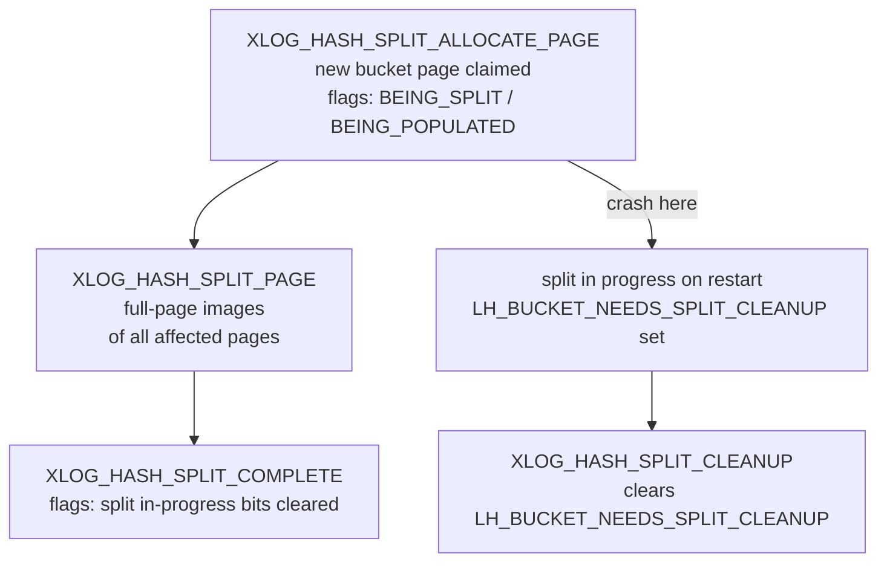

Hash index WAL recovery implements redo logic for a set of record types unique to hash indexes, driven by the hash access method's bucket-doubling split model and its explicit overflow-page lifecycle. B-tree and GIN can describe most mutations as page-level changes, but hash indexes cannot. Hash indexes require WAL records that track structural state instead — bucket flags, overflow chain links, and bitmap allocation. These details are not derivable from page content alone after a crash.

## WAL Record Types

Hash indexes define thirteen record types dispatched by `hash_redo()` (hash_xlog.c). They fall into four functional groups.

### Index creation

`CREATE INDEX` emits `XLOG_HASH_INIT_META_PAGE` and `XLOG_HASH_INIT_BITMAP_PAGE`. The meta-page record carries `xl_hash_init_meta_page` with the hash function OID (`procid`), fill factor (`ffactor`), and initial tuple count. The bitmap-page record carries `xl_hash_init_bitmap_page`. It also updates the metapage's bitmap map array (`hashm_mapp`). Both handlers call `FlushOneBuffer()` when the target is on the init fork, ensuring the on-disk copy is always coherent without relying on a full-page image in the WAL record.

### Tuple lifecycle

`XLOG_HASH_INSERT` (struct `xl_hash_insert`) records an index entry addition that did not trigger a split. Redo replays `PageAddItem()` onto the data page at the logged offset number. It then increments `hashm_ntuples` on the metapage. `XLOG_HASH_DELETE` (`xl_hash_delete`) deletes index tuples from a bucket or overflow page. Both deletion records also acquire a cleanup lock on the primary bucket page during redo — even when the deletion targets an overflow page — to prevent a concurrent scan from missing items or seeing duplicates mid-replay.

`XLOG_HASH_VACUUM_ONE_PAGE` handles LP_DEAD tuple removal driven by HOT pruning on the heap. Its WAL record (`xl_hash_vacuum_one_page`) carries a `snapshotConflictHorizon` transaction ID used to resolve recovery conflicts with hot-standby queries before the page is modified. It decrements `hashm_ntuples` on the metapage. It also clears the `LH_PAGE_HAS_DEAD_TUPLES` flag. `hash_mask()` also masks out the `LH_PAGE_HAS_DEAD_TUPLES` flag, so consistency checks don't see false mismatches. The flag can be set without emitting WAL (see `_hash_kill_items()`).

`XLOG_HASH_UPDATE_META_PAGE` (`xl_hash_update_meta_page`) is a standalone metapage-only record that corrects `hashm_ntuples` after a vacuum sweep. The system issues it when no other record in the vacuum pass already covered the metapage.

### The bucket-split protocol

Hash indexes grow by doubling the bucket count. When the load factor (`hashm_ntuples / hashm_ffactor`) exceeds `hashm_maxbucket`, the hash access method splits the bucket and redistributes its entries. Roughly half of the entries stay in the original bucket. The other half migrate to a new "buddy" bucket, whose number is `old_bucket | (1 << hashm_ovflpoint)`. The hash access method logs this redistribution as a three-record sequence.

**Phase 1 — `XLOG_HASH_SPLIT_ALLOCATE_PAGE`** claims the new bucket page and atomically marks the split in progress. The record (`xl_hash_split_allocate_page`) carries:

- `new_bucket` — the new bucket number
- `old_bucket_flag` and `new_bucket_flag` — opaque flags set on both bucket pages (including `LH_BUCKET_BEING_SPLIT` / `LH_BUCKET_BEING_POPULATED`)
- `flags` — a bitmask indicating whether the metapage masks (`hashm_lowmask`, `hashm_highmask`) and split-point overflow counters need updating

The redo handler acquires cleanup locks on both the old and new bucket pages to match normal-operation semantics, even though no concurrent inserts can occur during recovery.

**Phase 2 — `XLOG_HASH_SPLIT_PAGE`** records the actual redistribution of tuples. The hash access method logs each page modified during the move as a full-page image. Redo simply restores those images. The page content is entirely determined by the image, so the handler asserts that redo returns `BLK_RESTORED`. Otherwise, it panics.

**Phase 3 — `XLOG_HASH_SPLIT_COMPLETE`** marks the split finished by updating the bucket flags (`xl_hash_split_complete`). After redo, both the old and new bucket pages carry their final `hasho_flag` values, dropping the in-progress bits.

A crash between phase 1 and phase 3 leaves a split in progress. On the next access to the bucket, the code detects `LH_BUCKET_NEEDS_SPLIT_CLEANUP` and cleans up. It logs `XLOG_HASH_SPLIT_CLEANUP` when the cleanup finishes. The `hash_xlog_split_cleanup()` redo handler clears only that flag bit. It replays no tuple movement, because the page images from phase 2 are self-contained.

### Overflow page management

When a bucket exhausts its primary page, hash indexes chain overflow pages through `hasho_prevblkno` / `hasho_nextblkno` fields in `HashPageOpaque`. A separate layer of bitmap pages tracks which overflow pages are free. The metapage's `hashm_mapp[]` array holds the block numbers of all bitmap pages. `hashm_firstfree` is a hint to the first free slot.

**`XLOG_HASH_ADD_OVFL_PAGE`** (`xl_hash_add_ovfl_page`) allocates a new overflow page and links it onto the chain. The record references up to five buffers: the new overflow page (block 0), its left neighbor (block 1), the existing bitmap page (block 2, optional), a newly allocated bitmap page (block 3, optional), and the metapage (block 4). Redo initialises the overflow page with `_hash_initbuf()`. It sets `hasho_prevblkno` to the left neighbor and updates the neighbor's `hasho_nextblkno` forward link. It marks the allocation bit in the bitmap with `SETBIT()`. It also updates `hashm_firstfree` and the spares counters in the metapage. If the existing bitmap page had no free slots, block 3 carries a new bitmap page. Redo also appends that new page to `hashm_mapp[]`.

**`XLOG_HASH_SQUEEZE_PAGE`** (`xl_hash_squeeze_page`) is the inverse. It moves any remaining tuples from an overflow page into an earlier page in the same chain. Then it frees the now-empty overflow page. The record references up to seven buffers:

| Block ref | Purpose |
|-----------|---------|
| 0 | primary bucket page (cleanup lock only) |
| 1 | write target (receives moved tuples) |
| 2 | freed overflow page (reset to `LH_UNUSED_PAGE`) |
| 3 | page before the freed page (next-link update) |
| 4 | page after the freed page (prev-link update, optional) |
| 5 | bitmap page (clears the bit with `CLRBIT()`) |
| 6 | metapage (`hashm_firstfree` update, optional) |

The `is_prim_bucket_same_wrt` and `is_prev_bucket_same_wrt` flags in the record header tell redo whether blocks 0 and 3 are the same physical buffer as block 1, allowing the handler to avoid acquiring a lock twice.

**`XLOG_HASH_MOVE_PAGE_CONTENTS`** (`xl_hash_move_page_contents`) is a lighter variant used during squeeze. It applies when squeeze needs to move the freed page's tuples without yet freeing the overflow page in the same record. It updates two pages: the write target (block 1) and the source page that loses the tuples (block 2). It holds a cleanup lock on the primary bucket page (block 0) throughout.

## Cleanup-Lock Invariant During Redo

Several redo handlers acquire cleanup locks on the primary bucket page even when the page itself needs no modification. This mirrors the convention used in normal operation: a cleanup lock on the primary page serialises all structural changes within a bucket, preventing scans from straddling partially applied mutations. The comment in `hash_xlog_delete()` makes this explicit: without the lock, a concurrent scan could miss records or return duplicates. Recovery is single-threaded, so this cannot actually happen. Taking the lock keeps the replay path structurally identical to the primary path, which makes the code easier to reason about.

## [[subsystems/transactions/hint-bits|Hint Bits]] and the Mask Function

`hash_mask()` suppresses three sources of benign divergence when comparing WAL-applied pages against in-memory pages:

1. The LSN and checksum fields (masked universally).
2. Line-pointer flags on bucket and overflow pages — `hashgettuple()` and `_hash_kill_items()` can modify `LP_FLAGS` without emitting WAL.
3. The `LH_PAGE_HAS_DEAD_TUPLES` flag in `hasho_flag` — set without WAL by `_hash_kill_items()`.

`hash_mask()` masks the entire content of unused pages, because `LH_UNUSED_PAGE` pages carry no meaningful structure.

## Pre-PG10 WAL Gap

Before PostgreSQL 10, hash indexes had no WAL logging. Standbys could not receive them through streaming replication, and crash recovery could not restore them. On restart, PostgreSQL rebuilt the entire index from the heap instead. As a result, PostgreSQL considers any hash index created in a pre-PG10 cluster invalid after an upgrade. An administrator must drop and rebuild it. Since PG10, hash indexes are fully WAL-safe. Streaming replicas can use them without restriction.

## Related Topics

- [[subsystems/indexes/hash]] — hash index structure, bucket arithmetic, and the split/shrink lifecycle
- [[subsystems/wal/overview]] — WAL architecture, LSN ordering, and the general redo framework
- [[subsystems/wal/wal-records]] — how WAL records are structured and decoded
- [[subsystems/wal/recovery]] — crash recovery and the redo pass
