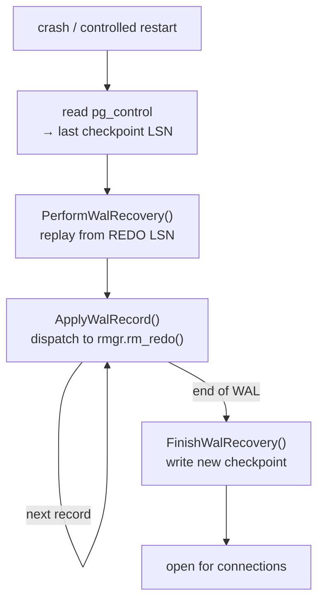
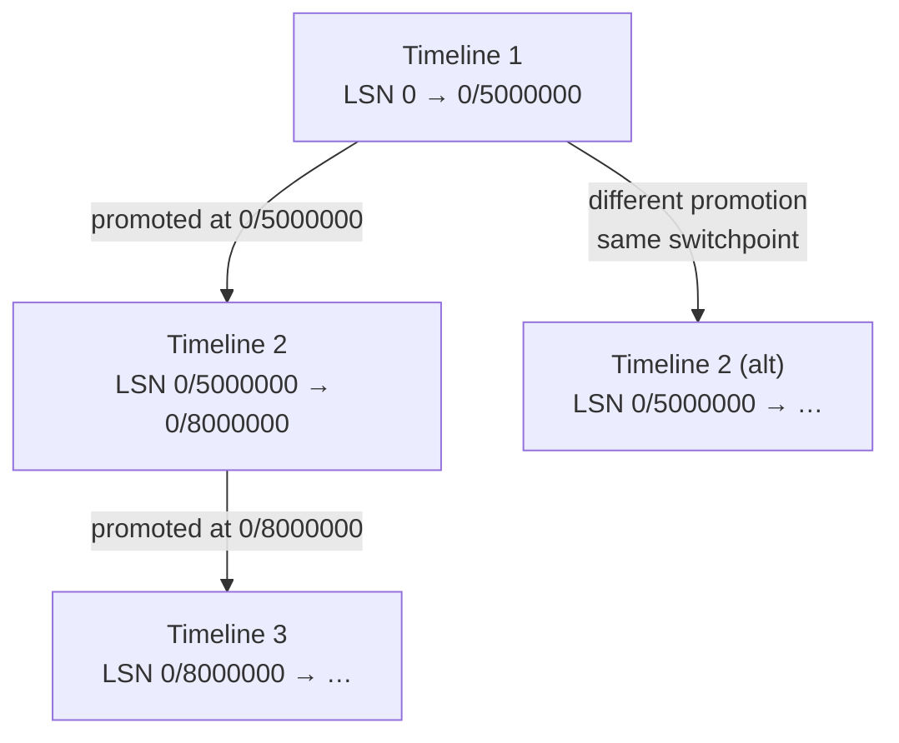

# WAL Overview

Write-ahead logging (WAL) is PostgreSQL's mechanism for durability and crash recovery. The rule is simple: before a change to a data page becomes durable on disk, PostgreSQL must write and flush a record describing that change to the WAL log first. On crash, PostgreSQL replays the WAL log from the last checkpoint forward to bring the database back to a consistent state.

WAL also underpins streaming replication (standbys replay the same record stream) and logical decoding (logical replication decodes heap change records into SQL-level events).

## WAL records

Each change to the database generates one or more WAL records. A record consists of a fixed header followed by optional block images and arbitrary data:

### XLogRecord header

`XLogRecord` (`src/include/access/xlogrecord.h`, line 41):

| Field | Purpose |
|---|---|
| `xl_tot_len` | Total byte length of this record |
| `xl_xid` | Transaction ID that generated this record |
| `xl_prev` | LSN of the previous WAL record (forms a backward chain) |
| `xl_rmid` | Resource manager ID — identifies which subsystem owns this record |
| `xl_info` | Flags; high 4 bits are resource-manager-specific (e.g. `XLOG_HEAP_INSERT`) |
| `xl_crc` | CRC-32c checksum over the record |

After the header come `XLogRecordBlockHeader` structs (one per modified page, each optionally containing a full-page image) and a main data section.

### Resource managers

Each WAL record belongs to a *resource manager* — the subsystem responsible for both writing that class of record during normal operation and replaying it during recovery. The `xl_rmid` field routes every record to the correct handler. Built-in resource managers include:

| ID | Name | Handles |
|---|---|---|
| 0 | XLOG | Checkpoint, timeline switch, full-page write control |
| 1 | Transaction | Commit, abort, subtransaction |
| 3 | [[subsystems/storage/clog|CLOG]] | Commit log extension |
| 10 | Heap | INSERT, UPDATE, DELETE, HOT prune |
| 11 | Heap2 | VACUUM, FREEZE, VISIBLE |
| 12 | Btree | Page split, page deletion, newroot |

During recovery, `ApplyWalRecord()` dispatches each record to `RmgrTable[xl_rmid].rm_redo()`.

## WAL segments and LSNs

PostgreSQL writes WAL to a series of segment files in `pg_wal/`. Each segment is a fixed size (default 16 MB, configurable at `initdb` time as a power of 2 from 1 MB to 1 GB). Segment filenames encode the timeline, log number, and segment number as 24 hex digits.

An **LSN** (Log Sequence Number, type `XLogRecPtr`) is a byte offset into the WAL stream. LSNs increase monotonically within a timeline. PostgreSQL uses them everywhere it needs to track "how far along the WAL" something is: buffer page LSNs, replication positions, checkpoint REDO points, and recovery targets.

Each WAL page starts with an `XLogPageHeaderData` containing the page's address and a magic number for validation. The first page of each segment has a longer header (`XLogLongPageHeaderData`) that includes the system identifier and segment/block sizes for consistency checking.

## Assembling and inserting a WAL record

Writing a WAL record is a cooperative act between the subsystem making a change and the WAL machinery that serializes those changes into the log stream. A subsystem first declares what it is about to log — the main payload and any buffer pages it is modifying. It then hands control to the WAL layer to pack and place the record. This separation keeps the per-subsystem code simple while letting the WAL layer handle concurrency and buffering uniformly.

The API in `xloginsert.c` reflects this in three phases. A backend opens a record with `XLogBeginInsert()`. It registers its content — main payload via `XLogRegisterData()` and modified buffers (optionally with full-page images) via `XLogRegisterBuffer()`. It then calls `XLogInsert(rmid, info)` to finalize. `XLogInsert()` packs everything into an `XLogRecord` and places it in the WAL buffer. It returns the LSN of the new record, so the caller can tie that LSN to the buffer page it modified.

The WAL layer reserves space in the WAL buffer ring atomically, so multiple backends can insert concurrently. Each backend holds an insertion lock only for the brief moment it is copying its record bytes into the reserved region (`XLogInsertRecord()`, `xlog.c`). This keeps contention minimal.

## Full-page writes

After a checkpoint, PostgreSQL logs the first modification to any page as a *full-page write* (FPW): the WAL record includes the entire 8 KB page image. This protects against torn writes. If a crash interrupts a partial page write to disk, recovery can restore the page from the FPW rather than applying a delta to a corrupt image. Subsequent WAL records for the same page within the same checkpoint interval log only the delta.

The `full_page_writes` GUC controls FPWs (default on). PostgreSQL also emits them unconditionally during the initial segment of a checkpoint.

## Making WAL durable

A commit is not durable until PostgreSQL has flushed the WAL containing the commit record to disk. Flushing waits for any in-progress insertions up to the target LSN to finish. It then writes buffered WAL pages through to the segment file and fsyncs completed segments (`XLogFlush()` and `XLogWrite()`, `xlog.c`).

Multiple backends committing at the same time share a single flush. The first backend to acquire the write lock flushes on behalf of everyone waiting behind it. The optional `commit_delay` GUC adds a brief sleep before acquiring the lock to widen this batching window and amortise fsync cost across more commits.

The WAL writer process independently flushes WAL buffers at regular intervals (`wal_writer_delay`), reducing the latency burden on committing backends.

## Checkpoints

A checkpoint marks a point in the WAL stream from which crash recovery can safely begin. Its purpose is to bound recovery time. Once a checkpoint completes, all WAL before its REDO LSN is no longer needed for recovery, and PostgreSQL can recycle or archive it.

The REDO LSN is the position of the oldest WAL record that could modify a page not yet written to disk at checkpoint time. Before recording the checkpoint, PostgreSQL flushes all dirty shared buffers incrementally while the database continues running — the "fuzzy checkpoint" design. This means the checkpoint does not require a full database quiesce. The checkpoint WAL record carries `nextXid`, `oldestXid`, `nextOid`, and the REDO LSN. PostgreSQL then updates `pg_control` (a small binary file in `$PGDATA`) to point to the new checkpoint. `pg_control` is the first file read during crash recovery (`CreateCheckPoint()`, `xlog.c`).

The checkpointer process (`postmaster/checkpointer.c`) triggers checkpoints on a schedule (`checkpoint_timeout`) or when the amount of WAL written since the last checkpoint exceeds `max_wal_size`. Backends can also request a checkpoint explicitly (e.g. `CHECKPOINT` command).

## Crash recovery

On startup after a crash, PostgreSQL reads `pg_control` to locate the last good checkpoint. It then replays every WAL record from that checkpoint's REDO LSN forward. PostgreSQL dispatches each record to the resource manager that originally generated it. That resource manager re-applies the change to the relevant data page. Full-page writes guarantee that the first post-checkpoint image of each page is always intact. As a result, PostgreSQL can safely apply later delta records, regardless of the page's state when the crash occurred.

Replay continues until either no more records remain (crash recovery) or recovery reaches a target (point-in-time recovery). When replay is complete, PostgreSQL writes a new checkpoint and opens the database for connections. The entry point is `StartupXLOG()` (`xlog.c`), which delegates the record-by-record replay loop to `PerformWalRecovery()` and `FinishWalRecovery()` (`xlogrecovery.c`).



## Timelines

LSNs are byte offsets into the WAL stream. However, the same LSN can refer to different data if the WAL history has diverged. This happens, for example, when a standby is promoted and begins accepting writes from a point different from where the primary would have continued. PostgreSQL uses **timeline IDs** to distinguish these diverging histories. Every WAL segment filename embeds the timeline as its first eight hex digits, so `000000010000000100000001` and `000000020000000100000001` are different segments at the same logical position on timelines 1 and 2 respectively.

A fresh cluster starts on timeline 1. The timeline ID increments whenever archive recovery ends in a promotion. At the conclusion of `FinishWalRecovery()`, `StartupXLOG()` calls `findNewestTimeLine()` to discover the highest timeline already in use. It then assigns `newTLI = newestTLI + 1` (`xlog.c`). This ensures each recovered lineage gets a unique identity. The tool `pg_resetwal` also resets to a new timeline as a side effect of resetting WAL state, for similar reasons.

The WAL page header (`XLogPageHeaderData`, `src/include/access/xlog_internal.h`) carries the timeline ID of the first record on that page in its `xlp_tli` field. During replay, PostgreSQL checks every page read against the expected timeline. A mismatch means the server has read the wrong branch of history.

### History files

When a new timeline begins, PostgreSQL writes a **timeline history file** named `NNNNNNNN.history` (eight hex digits, zero-padded) into `pg_wal/`. The file is a tab-separated text record of the ancestry chain. Each line has the form:

```
parentTLI    switchpointLSN    reason
```

Here, `parentTLI` is the timeline this one branched from. `switchpointLSN` is the WAL position where the branch occurred. `reason` is a human-readable explanation (typically `"no recovery target specified"` for a simple promotion). A history file for timeline N contains one line for every timeline in its ancestry back to timeline 1. Timeline 1 has no history file, because it is the root. `writeTimeLineHistory()` (`timeline.c`) creates the new history file by copying the parent's history file verbatim and appending the new entry. PostgreSQL then archives the file immediately if WAL archiving is active.

This accumulated ancestry means a single history file for timeline 5 encodes the complete chain of promotions. From it, you can reconstruct exactly how much WAL each of timelines 1, 2, 3, and 4 wrote before its promotion.

### PITR and timeline following

Point-in-time recovery uses history files to route WAL fetches correctly. An operator can direct recovery to restore to a specific timestamp or LSN. Recovery must then find the WAL segments that contain that point on the appropriate branch. The function `readTimeLineHistory()` (`timeline.c`) builds the complete ancestry list for the target timeline by parsing the history file (fetching it from the archive if necessary via `RestoreArchivedFile()`). It returns a list of `TimeLineHistoryEntry` structs, each recording the LSN range that a given timeline covers. Timeline 1 has no history file. `readTimeLineHistory()` handles this by returning a synthetic single-entry list rather than treating the missing file as an error.

During recovery, PostgreSQL tries each timeline in the history chain from newest to oldest when fetching WAL segments. The recovery machinery knows, from the history list, which timeline was active at each LSN. So it requests the correct segment for the era it is replaying. A PITR target expressed as a specific timeline ID (`recovery_target_timeline = N`) causes recovery to stop following WAL as soon as it reaches the point where timeline N branched to its successor. This lets an operator replay history up to, but not past, a known divergence point.



The diagram illustrates why the same LSN can appear on multiple timelines: `0/5000000` is valid on timeline 1, timeline 2, and timeline 2B, but each refers to a different WAL record. History files make the distinction unambiguous.

## Streaming replication

Streaming replication delivers WAL to standbys in near-real time using the same LSN-addressed segment files that crash recovery reads. A standby connects to the primary. The primary spawns a **walsender** process (`src/backend/replication/walsender.c`) to handle the connection. The walsender enters a tight loop that calls `XLogSendPhysical()`. `XLogSendPhysical()` determines how far it can safely send by calling `GetFlushRecPtr()` (`xlog.c`). `GetFlushRecPtr()` reads the shared `LogwrtResult.Flush` pointer — the LSN up to which WAL has been confirmed written and fsynced to disk. The walsender never reads from the in-memory WAL buffer. It only reads from segment files that have already been fully flushed. This is what makes the primary's WAL flush latency the hard lower bound on replication lag: a standby cannot receive a record until the primary has flushed it.

The walsender tracks the timeline it is currently streaming in `sendTimeLine`. When the primary is live, this is always `InsertTimeLineID`. A **cascading standby** (itself a walsender) may be streaming a timeline that has since become historic. This can happen, for example, if the intermediate standby was itself promoted. In that case, the walsender sets `sendTimeLineIsHistoric`. Streaming halts at `sendTimeLineValidUpto`, the LSN where that timeline ended. The downstream standby then issues a new `START_REPLICATION` request on the successor timeline, guided by the history file the primary sends along with the timeline switch notification.

## WAL levels

The `wal_level` GUC controls how much information PostgreSQL logs:

| Level | What it adds |
|---|---|
| `minimal` | Enough for crash recovery; skips logging for operations that can be re-run (bulk COPY to new tables, CREATE TABLE AS) |
| `replica` | Full logging; supports WAL archiving and streaming replication |
| `logical` | Adds enough information for logical decoding (column values for UPDATE/DELETE) |

## See also

- [[subsystems/transactions/mvcc]] — how commit records in WAL interact with the commit log
- [[subsystems/storage/buffer-manager]] — how buffer LSNs interact with WAL flushing
- [[architecture/overview]] — WAL in the broader architecture
