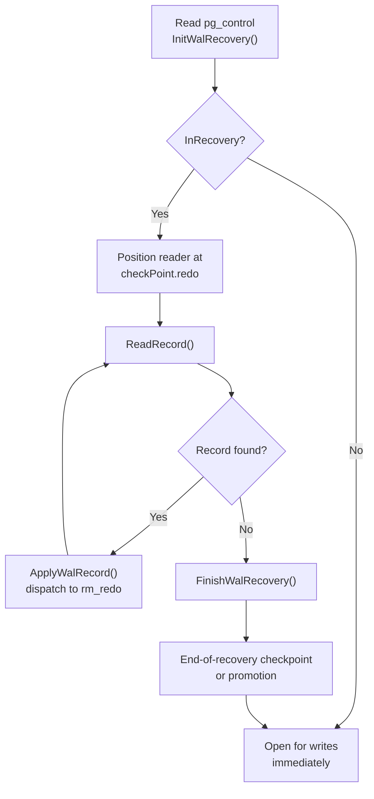

# Crash Recovery and Startup

PostgreSQL's crash recovery mechanism replays WAL records written since the last checkpoint to bring data files back to a consistent state after an unclean shutdown. Unlike systems that use undo logs, PostgreSQL performs REDO-only recovery. Every WAL record describes a forward change. Recovery means applying those changes again. Uncommitted work does not need an undo pass, because MVCC makes uncommitted rows invisible to new transactions. Uncommitted rows simply stay in the heap until the next vacuum clears them. This design keeps recovery fast and bounded in time by the distance to the last checkpoint.

## Reading pg_control and Deciding What to Do

PostgreSQL checks `pg_control` before it reads any WAL. `pg_control` is a small fixed-format file at `$PGDATA/global/pg_control`, updated at every checkpoint and shutdown. The `ControlFileData` struct captured there records the cluster's `state` field (a `DBState` enum), the location of the most recent checkpoint record, and an embedded copy of the `CheckPoint` struct from that record.

The `DBState` enum drives the startup decision:

| Value | Meaning |
|---|---|
| `DB_SHUTDOWNED` | Clean shutdown; no recovery needed |
| `DB_SHUTDOWNED_IN_RECOVERY` | Shutdown while a standby was replaying |
| `DB_SHUTDOWNING` | Shutdown was interrupted mid-way |
| `DB_IN_CRASH_RECOVERY` | A previous crash recovery was itself interrupted |
| `DB_IN_ARCHIVE_RECOVERY` | Was performing archive/PITR recovery when interrupted |
| `DB_IN_PRODUCTION` | Was running normally when interrupted (crash) |

`StartupXLOG()` (`xlog.c`) reads `pg_control` and logs one of the above states. It then calls `InitWalRecovery()` to decide whether recovery is actually required. If the state is `DB_SHUTDOWNED` and no signal files are present, the system can open for writes immediately without replaying anything. Any other state sets `InRecovery = true` and triggers the replay path.

When the state is not one of the clean-shutdown variants (`DB_SHUTDOWNED` or `DB_SHUTDOWNED_IN_RECOVERY`), `StartupXLOG()` first calls `RemoveTempXlogFiles()` and `SyncDataDirectory()` to flush any stale writes that pre-dated the crash. This guards against a specific hazard: unflushed OS write-back buffers could make earlier data disappear even after recovery completes if a second failure occurs.

## The Checkpoint REDO Location

Every checkpoint record contains a `redo` field — the LSN at which WAL replay must begin to reach a consistent state. The checkpointer writes the checkpoint record itself slightly *after* that point, because it lets in-progress write activity complete before snapshotting. Recovery therefore rewinds to `checkPoint.redo` and replays forward from there, not from the checkpoint record's own LSN.

`InitWalRecovery()` (`xlogrecovery.c`) reads the checkpoint record identified by `ControlFile->checkPoint`. It extracts the embedded `CheckPoint` struct and sets `RedoStartLSN` to `checkPoint.redo`. If a `backup_label` file is present — indicating a base backup restore — it supplies its own checkpoint location and REDO LSN instead, overriding `pg_control` entirely. This matters because the backup process can archive `pg_control` before additional checkpoints run. Following that stale copy would start replay too late.

```
CheckPoint fields relevant to recovery:
  redo             XLogRecPtr  — start of replay (may be before the checkpoint record)
  ThisTimeLineID   TimeLineID  — timeline this checkpoint belongs to
  nextXid          FullTransactionId — next XID to assign after recovery
  fullPageWrites   bool        — whether FPWs were enabled at checkpoint time
  oldestActiveXid  TransactionId — oldest running XID (hot standby only)
```

## The Recovery Loop

Once `InitWalRecovery()` has determined the starting REDO LSN and set `InRecovery`, `PerformWalRecovery()` drives the main replay loop. It positions the WAL reader at `RedoStartLSN`. It reads records one at a time, dispatching each to its resource manager via `GetRmgr(record->xl_rmid).rm_redo(xlogreader)` inside `ApplyWalRecord()`.

Every resource manager — heap, btree, sequence, transaction, and so on — registers a `rm_redo` function that knows how to re-apply its record types. The XLOG resource manager handles infrastructure records like checkpoint and full-page-write changes. Heap handles tuple insertions and updates. Btree handles page splits and deletions. Recovery is thus a straightforward fan-out: read a record, look up the resource manager, call its redo function.

The loop continues until `ReadRecord()` returns `NULL` (no more WAL), or until recovery reaches a target (see below). After the loop, `FinishWalRecovery()` determines the exact end-of-log LSN and returns control to `StartupXLOG()`.



## Full-Page Images and Torn Pages

WAL records for a data page normally contain only the changed bytes, not the whole page. This is efficient during normal operation. But it creates a problem at recovery time: if the server crashed mid-write, the page on disk might be partially updated (a "torn page"). Applying a delta record to a corrupted page will then silently produce nonsense.

PostgreSQL's defence is the full-page image (FPI). The first time PostgreSQL modifies a page after a checkpoint, the WAL record contains an image of the entire page before the change, not just the delta. The checkpoint boundary guarantees that a checkpoint cleanly flushes all pages. Any page that recovery then dirties will have an FPI covering it. When the redo function encounters a record that carries an FPI, it first restores the page from that image and then applies the change. This ensures the base is known-good before recovery layers on any delta.

The `fullPageWrites` flag in the checkpoint record tracks whether FPI logging was enabled when the checkpoint ran. If it was, the recovery code can rely on FPIs being present for the first modification after each checkpoint. The `wal_log_hints` GUC and page checksum mode can also trigger FPIs for hint-bit changes that would otherwise not appear in WAL at all.

## Reaching Consistency and Opening for Reads

In a plain crash recovery, the system reaches consistency only when it has replayed all WAL. There is no earlier point at which the system is self-consistent without the remaining log. In archive recovery (PITR or standby), a `minRecoveryPoint` stored in `pg_control` marks the LSN past which the database is consistent. The recovery loop calls `CheckRecoveryConsistency()` after each applied record, to test whether it has passed `minRecoveryPoint`.

For hot standby (see below), consistency requires not just reaching `minRecoveryPoint` but also having a valid `running-xacts` snapshot from which the standby can construct its own MVCC horizon. Once both conditions hold, `CheckRecoveryConsistency()` signals the postmaster via `PMSIGNAL_BEGIN_HOT_STANDBY`. The postmaster then allows read-only client connections.

## End of Recovery

When recovery finishes, `StartupXLOG()` writes an end-of-recovery record and may promote the database to a new timeline. For archive recovery and standby promotion, `StartupXLOG()` always assigns a new timeline ID (via `findNewestTimeLine() + 1`). This prevents new WAL from silently overwriting segments on the old timeline that may still be in an archive. `StartupXLOG()` removes the `recovery.signal` or `standby.signal` file as part of the switch, so a subsequent restart does not re-enter recovery.

`StartupXLOG()` then writes a checkpoint with the `CHECKPOINT_END_OF_RECOVERY` flag. This checkpoint advances `pg_control`'s `state` to `DB_IN_PRODUCTION` and establishes a new baseline from which future crash recovery would start. Unlogged relations are not written to WAL. `StartupXLOG()` resets them from their INIT forks at this point, since their contents during recovery are undefined.

Finally, `StartupXLOG()` sets `InRecovery` to false, and `SharedRecoveryState` transitions to `RECOVERY_STATE_DONE`. This makes `RecoveryInProgress()` return false. Normal WAL insertion and backend startup proceed from there.

## Point-in-Time Recovery

PITR lets an operator stop recovery at a specific moment rather than replaying all the way to the end of the archive. An operator expresses the target as one of:

| GUC | `recoveryTarget` enum value | Stops at |
|---|---|---|
| `recovery_target_time` | `RECOVERY_TARGET_TIME` | First commit at or after the given timestamp |
| `recovery_target_lsn` | `RECOVERY_TARGET_LSN` | First record at or past the given LSN |
| `recovery_target_name` | `RECOVERY_TARGET_NAME` | A named restore point created with `pg_create_restore_point()` |
| `recovery_target_xid` | `RECOVERY_TARGET_XID` | Commit of the specified transaction |
| `recovery_target = 'immediate'` | `RECOVERY_TARGET_IMMEDIATE` | The earliest point of consistency |

The recovery loop calls `recoveryStopsBefore()` before and `recoveryStopsAfter()` after each record, to test whether it has reached the target. The `recovery_target_inclusive` setting controls whether recovery applies or excludes the matching transaction itself.

When recovery reaches a target, the `recovery_target_action` setting determines what happens:

- `pause` — replay halts and waits; an operator can inspect the state or request promotion via `pg_promote()`
- `promote` — the server immediately opens for writes on a new timeline
- `shutdown` — the postmaster exits, allowing the operator to restart with a different target

PostgreSQL fetches WAL from archives using the `restore_command` shell command. The startup process tries `pg_wal` first, then falls back to the archive. If neither has a needed segment and the server is in standby mode, it waits for WAL to arrive via streaming replication.

## Hot Standby

A hot standby serves read-only queries while simultaneously replaying WAL from a primary. The startup process replays in the foreground while query backends run in read-only mode in the background, sharing the same shared buffers and MVCC infrastructure.

The standby cannot construct an MVCC snapshot until it knows what transactions were active on the primary at the start of its recovery. The primary periodically writes a `XLOG_RUNNING_XACTS` record listing all active XIDs. The standby's recovery loop watches for this record and passes it to `ProcArrayApplyRecoveryInfo()`. `ProcArrayApplyRecoveryInfo()` populates the `KnownAssignedXids` array. Once that array is valid and recovery has passed `minRecoveryPoint`, the standby raises the `PMSIGNAL_BEGIN_HOT_STANDBY` signal. The postmaster then begins accepting connections.

### Conflict Resolution

Recovery sometimes needs to apply changes that conflict with queries running on the standby. The two principal conflict types are:

**Snapshot conflicts.** Vacuum on the primary removes dead tuple versions. Recovery may need to replay that vacuum while a standby query still holds a snapshot that can see those rows. The conflict arises when the query's `xmin` is older than the vacuum's `snapshotConflictHorizon`. `ResolveRecoveryConflictWithSnapshot()` in `standby.c` waits up to `max_standby_streaming_delay` (or `max_standby_archive_delay`) milliseconds and then cancels the conflicting queries if the delay expires.

**Lock conflicts.** The primary's WAL stream records exclusive locks on relations (via `xl_standby_lock` records). When replay needs an access exclusive lock on a relation, it checks whether any standby backend holds a conflicting lock and resolves the conflict in the same way.

The conflict wait is not symmetric. The startup process always wins eventually. Recovery always cancels the query. This keeps the standby from falling arbitrarily far behind the primary because of a long-running read query. `hot_standby_feedback` is a mitigation. When enabled, the standby periodically reports its oldest `xmin` back to the primary. This prevents the primary's vacuum from removing rows the standby still needs, at the cost of potentially delaying vacuum on the primary.

The `XLogRecoveryCtlData` shared memory struct tracks the state visible to other processes:

```
XLogRecoveryCtlData fields:
  SharedHotStandbyActive   bool        — postmaster may accept read-only connections
  SharedPromoteIsTriggered bool        — a promotion has been requested
  recoveryWakeupLatch      Latch       — wakes the startup process for new WAL or promotion
  lastReplayedEndRecPtr    XLogRecPtr  — end LSN of the last successfully replayed record
  recoveryPauseState       RecoveryPauseState — whether replay is paused at a recovery target
```

## Signal Files and Mode Selection

PostgreSQL 12 replaced `recovery.conf` with two signal files in `$PGDATA`:

- `standby.signal` — enter standby mode (continuous replay, waiting for promotion)
- `recovery.signal` — enter archive recovery (replay to a target, then promote)

`readRecoverySignalFile()` in `xlogrecovery.c` checks for these at startup. `standby.signal` takes precedence over `recovery.signal` if both are present. Archive-recovery parameters (`restore_command`, `recovery_target_*`, `primary_conninfo`, etc.) are now GUCs set in `postgresql.conf` or `postgresql.auto.conf`.

## Related Topics

- [[subsystems/wal/checkpoint|Checkpoint]] — checkpoints establish the REDO start LSN that bounds how far back recovery must replay, making them the primary determinant of recovery time.
- [[subsystems/replication/pitr|Point-in-Time Recovery]] — covers the operator-facing workflow of archive restoration, `restore_command`, and timeline branching that the recovery engine executes.
- [[subsystems/replication/hot-standby|Hot Standby]] — describes the standby query infrastructure — `KnownAssignedXids`, conflict resolution, and `hot_standby_feedback` — built on top of the recovery loop.
- [[subsystems/replication/streaming|Streaming Replication]] — explains how WAL is delivered to a standby in real time, feeding the same `PerformWalRecovery()` loop described here.
- [[subsystems/transactions/mvcc|MVCC]] — explains why PostgreSQL can use REDO-only recovery without an undo pass: uncommitted rows remain invisible to new transactions via snapshot isolation.
- [[subsystems/wal/xlog-reader|XLog Reader]] — documents the low-level record-reading API (`ReadRecord()`) that the recovery loop calls to fetch and decode each WAL record.
- [[subsystems/storage/heapam-wal-replay|Heap WAL Replay]] — details how the heap resource manager's `rm_redo` function restores tuple changes and handles full-page images during recovery.
- [[subsystems/wal/overview|WAL Overview]] — WAL structure, segments, and LSNs that recovery replays.
- [[subsystems/storage/buffer-manager|Buffer Manager]] — shared buffers that recovery writes into as it replays each record.
- [[subsystems/locking/overview|Locking Overview]] — the heavyweight lock manager, including the lock conflicts resolved between recovery and standby queries.
