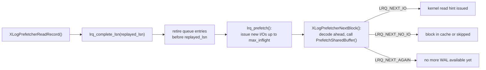

During [[subsystems/wal/recovery|crash recovery and standby replay]], PostgreSQL replays WAL records sequentially. For each record, the redo function reads the affected data pages from disk. If those pages are not already in shared buffers, the resulting I/O stalls block the entire recovery loop. WAL prefetching addresses this by decoding WAL records ahead of the current replay position. It asynchronously issues kernel read hints for referenced data pages before recovery needs them. This overlaps future I/O with present redo work.

## The Lookahead Architecture

The prefetcher (`xlogprefetcher.c`) is a thin wrapper around an `XLogReaderState` that intercepts the standard `XLogReadRecord()` call pattern. Callers use `XLogPrefetcherReadRecord()` instead of `XLogReadRecord()` directly. The interface is otherwise identical. Internally, the prefetcher maintains a decoded record queue inside the `XLogReaderState` that reaches further into the WAL stream than the currently replaying record.

`maintenance_io_concurrency` governs the depth of lookahead. The prefetcher uses that value as its target number of simultaneously in-flight I/Os (`max_inflight`). It looks ahead up to `max_inflight × 4` block references at a time (`XLOGPREFETCHER_DISTANCE_MULTIPLIER`, `xlogprefetcher.c`). With `maintenance_io_concurrency = 10`, for example, the prefetcher can queue up to 40 block references in the lookahead window.

The prefetcher activates when `recovery_prefetch` is set to `on` or `try` (the default) and `maintenance_io_concurrency > 0`. On platforms without `posix_fadvise()`, the GUC check rejects `recovery_prefetch = on`. `try` silently degrades to a no-op instead (`check_recovery_prefetch()`, `xlogprefetcher.c`).

## The LSN Read Queue

The `LsnReadQueue` structure (`xlogprefetcher.c`) manages concurrency control for in-flight I/Os. It is a circular ring buffer of `(lsn, io)` pairs. Each entry records the LSN of the WAL record that generated a prefetch request and whether an actual I/O was initiated or the block was already cached. The queue tracks three counts: `inflight` (kernel reads issued but not yet considered complete), `completed` (entries that required no I/O), and a slot count to bound the total lookahead distance.

The accounting is conservative: the prefetcher considers an I/O finished only once recovery has replayed its associated WAL record. When `XLogPrefetcherReadRecord()` advances past a record at LSN _L_, it calls `lrq_complete_lsn(lsn = L)`. This retires all queue entries with LSN < L, decrementing `inflight` accordingly. This retirement frees capacity in the ring buffer and triggers another round of prefetching via `lrq_prefetch()`.

## Block Selection and Skip Conditions

`XLogPrefetcherNextBlock()` is the callback that drives the prefetching engine. It advances through decoded records and their block references, making a prefetch decision for each. Several conditions cause the prefetcher to skip a block rather than prefetch it:

- **Full-page image (FPW) present.** The redo function will restore the entire page from the embedded image rather than reading from disk (`skip_fpw`).
- **Block will be zero-initialized.** Records with `BKPBLOCK_WILL_INIT` create a fresh page in memory. The on-disk content is irrelevant (`skip_init`).
- **Block filtered due to structural WAL.** See the filter system below (`skip_new`).
- **Repeat access within the recent window.** A four-entry sliding window (`XLOGPREFETCHER_SEQ_WINDOW_SIZE`) tracks the last four `(rlocator, blockno)` pairs prefetched. The prefetcher suppresses repeated references to the same block within that window, to avoid redundant syscalls (`skip_rep`).
- **Non-main fork.** The prefetcher prefetches only the main relation fork. It skips [[subsystems/storage/fsm|FSM]], VM, and init forks.

When none of these exclusions apply, the prefetcher calls `PrefetchSharedBuffer()`. If the block is already in the buffer pool, the prefetcher stores the buffer's ID directly in the decoded record's `block->prefetch_buffer` field, so that `XLogReadBufferForRedo()` can skip a second buffer table lookup (`hit`). If the block is absent and the prefetcher initiates an I/O, it records the entry as `LRQ_NEXT_IO` (`prefetch`).

## The Filter System

The prefetcher must not issue I/Os for blocks that do not yet exist on disk at the current replay position. Because the prefetcher looks ahead into the future, it may encounter references to relation files or block ranges that do not yet exist on disk. Issuing reads for non-existent files wastes system calls and can poison the smgr cache.

A hash table keyed on `RelFileLocator`, and a doubly-linked queue ordered by `filter_until_replayed` LSN, together manage filters (`XLogPrefetcherFilter`, `xlogprefetcher.c`). A filter entry suppresses prefetches for `rlocator.blockno >= filter_from_block` until replay passes that LSN. Three WAL record types install filters:

| WAL record | Filter installed |
|---|---|
| `XLOG_SMGR_CREATE` | Entire relation suppressed until creation is replayed |
| `XLOG_SMGR_TRUNCATE` | Blocks at and above the truncation point suppressed |
| `XLOG_DBASE_CREATE_FILE_COPY` | Entire database suppressed (file-copy strategy creates no per-relation WAL) |

If `smgrexists()` or `smgrnblocks()` shows that a block does not yet exist, the prefetcher installs a filter dynamically, to avoid repeated negative lookups for the same relation.

`XLogPrefetcherCompleteFilters()` cleans up filters. PostgreSQL calls it at the start of each `XLogPrefetcherReadRecord()` cycle. It removes entries whose `filter_until_replayed` LSN is strictly less than the current replay position from both the queue and the hash table.

## Timeline-Switch Safety

Prefetching reads ahead in the WAL, which normally spans a single timeline. But WAL records such as `XLOG_CHECKPOINT_SHUTDOWN` or `XLOG_END_OF_RECOVERY` may change the active timeline ID. Allowing the prefetcher to read pages on what might be the wrong timeline could cause subtle corruption. To avoid this, the prefetcher watches for these records. When it encounters one, it sets `no_readahead_until` to that record's LSN. It then suppresses all further lookahead until replay has passed that point (`XLogPrefetcherNextBlock()`, `xlogprefetcher.c`).

## Configuration and Dynamic Reconfiguration

Changes to `recovery_prefetch` or `maintenance_io_concurrency` take effect without restarting recovery. Each time `XLogPrefetcherReadRecord()` detects that `XLogPrefetchReconfigureCount` has changed (incremented by `XLogPrefetchReconfigure()` when a relevant GUC assignment fires), it frees and reallocates the `LsnReadQueue` with the new parameters. This means the prefetcher adapts immediately if an operator adjusts `maintenance_io_concurrency` at runtime via `ALTER SYSTEM` or a `SET` command during recovery.

If prefetching is disabled entirely, the lookahead machinery still keeps the WAL decoder pipeline active. `XLogPrefetcherNextBlock()` still calls `XLogReadAhead()` to pre-decode records, but it never calls `PrefetchSharedBuffer()`.

## Observability

`pg_stat_recovery_prefetch` exposes prefetch activity, backed by an `XLogPrefetchStats` struct in shared memory (`xlogprefetcher.c`). All cumulative counters use `pg_atomic_uint64` so the startup process can write them without locking.

| Column | Meaning |
|---|---|
| `prefetch` | Block I/Os initiated by the prefetcher |
| `hit` | Blocks found already in the buffer pool |
| `skip_init` | Blocks skipped because they will be zero-initialized |
| `skip_new` | Blocks skipped by the filter system (relation/block not yet created) |
| `skip_fpw` | Blocks skipped because a full-page image was present |
| `skip_rep` | Blocks skipped because they were recently prefetched |
| `wal_distance` | Bytes ahead in the decoded queue relative to the replay position |
| `block_distance` | Total block references ahead (in-flight + completed) |
| `io_depth` | Current number of in-flight I/Os |

`XLogPrefetcherComputeStats()` updates the instantaneous metrics (`wal_distance`, `block_distance`, `io_depth`) every `BLCKSZ` bytes of WAL replayed rather than on every record, to avoid excessive overhead.

A healthy prefetcher will show `io_depth` close to `maintenance_io_concurrency` and a low ratio of `skip_new` to `prefetch`. A high `hit` rate is expected and desirable — it means the buffer pool already had the data, either from a previous prefetch or from the standby's query activity. A high `skip_new` rate can indicate frequent relation creation/truncation workloads where the filter system frequently fires.

## Related Topics

- [[subsystems/wal/recovery|Crash Recovery and Startup]] — the recovery loop that XLogPrefetcher wraps
- [[subsystems/wal/overview|WAL Overview]] — WAL structure, LSNs, and resource managers
- [[subsystems/storage/buffer-manager|buffer manager]] — `PrefetchSharedBuffer()` and shared buffer pool
