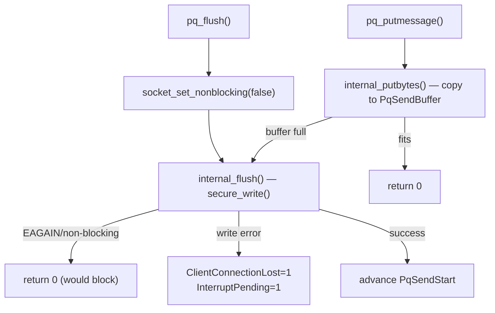

The frontend/backend communication layer (`pqcomm.c`) is the lowest stratum of PostgreSQL's network stack. It owns the OS socket and manages two fixed-size ring buffers for sending and receiving. It also enforces an invariant: it always writes messages atomically. This prevents a half-sent message from clogging the channel if the backend aborts mid-query. Everything above this layer (message framing, query dispatch, result encoding) depends on it staying simple and reliable.

## Socket lifecycle

The postmaster creates listening sockets via `StreamServerPort()`, which handles both TCP and Unix-domain endpoints. For TCP, it calls `getaddrinfo` to resolve host/port and iterates over the returned addresses so a server configured to listen on `::` and `0.0.0.0` opens both IPv4 and IPv6 sockets in a single call. The postmaster appends each successfully bound and listened socket to the `ListenSocket[]` array. `StreamServerPort()` sets the listen backlog to `MaxConnections * 2` to absorb brief connection bursts without dropping accepts.

Unix-domain sockets carry an extra setup burden. Before binding, `Lock_AF_UNIX()` creates a lock file via `CreateSocketLockFile` to act as an interlock, then unlinks any stale socket file that a crashed postmaster might have left behind. After binding, `Setup_AF_UNIX()` applies the `unix_socket_permissions` and `unix_socket_group` GUCs to the socket inode. The postmaster must apply permissions before the socket enters the listen state. Otherwise, unwanted connections could get in during that window. Abstract sockets (path starts with `@`) skip file-system locking and permission steps entirely because they have no inode.

To prevent aggressive `/tmp`-cleaning daemons from removing the socket file, `TouchSocketFiles()` calls `utime()` on each recorded path, updating its modification time. The postmaster calls this periodically from its main loop.

When the postmaster accepts a new connection, `StreamConnection()` calls `accept()` and then configures the resulting socket. For TCP connections it sets `TCP_NODELAY` (disabling Nagle's algorithm to reduce latency for small messages), `SO_KEEPALIVE`, and applies the current values of `tcp_keepalives_idle`, `tcp_keepalives_interval`, `tcp_keepalives_count`, and `tcp_user_timeout`. Assign-hooks (`assign_tcp_keepalives_idle` etc.) wire these GUCs to the corresponding `pq_setkeepalives*` functions. Each hook calls its function immediately when the GUC changes. This lets a running session adjust its keepalive parameters dynamically. The show-hooks for these GUCs read back the actual kernel values via `getsockopt` rather than trusting the GUC cache, so `SHOW tcp_keepalives_idle` always reflects what the OS actually has set.

After the postmaster forks a backend, it calls `StreamClose()` on its copy of the accepted socket — just `closesocket()`. The backend now owns the file descriptor, so the postmaster should not send anything to the client.

## Non-blocking socket with latch-based blocking

Once a backend starts (`pq_init()`), it immediately flips the client socket to non-blocking mode with `pg_set_noblock()`. All subsequent I/O goes through a thin latch-based wait layer. This is the central design decision of `pqcomm.c`. The socket is always non-blocking at the OS level. The backend simulates blocking by waiting on `FeBeWaitSet` when a read or write would block.

`FeBeWaitSet` is a `WaitEventSet` created at `pq_init()` time with three events:
1. The client socket, initially registered for `WL_SOCKET_WRITEABLE`.
2. `MyLatch` (`WL_LATCH_SET`) — allows signal handlers and other backends to wake this backend.
3. Postmaster death (`WL_POSTMASTER_DEATH`) — so an orphaned backend can detect when the postmaster has exited.

The benefit is safe interruptibility. When reading from a client, `pq_recvbuf()` temporarily sets the socket to blocking mode (`socket_set_nonblocking(false)`) and calls `secure_read()` in a loop. If a write would fill the kernel buffer, `internal_flush()` does not spin. When the socket is in non-blocking mode, it returns 0 (would block) and lets the caller retry via `socket_flush_if_writable()`. The non-blocking flip also ensures that a blocking `recv()` call does not swallow SIGINT (query cancel) delivered between retries.

The backend sets the socket to `FD_CLOEXEC` at init so child processes spawned by PL functions cannot accidentally inherit it.

## Receive path and message boundaries

The receive side holds an 8 KB fixed buffer (`PqRecvBuffer`, `PQ_RECV_BUFFER_SIZE`). `pq_recvbuf()` compacts the buffer by `memmove`-ing unread bytes to the front before calling `secure_read()`, keeping the invariant that valid data starts at index 0. Higher-level consumers — `pq_getbyte()`, `pq_getbytes()`, `pq_peekbyte()` — simply copy from this buffer and refill it when needed.

A `PqCommReadingMsg` boolean acts as a single-reader lock. Callers must bracket every read sequence with `pq_startmsgread()` / `pq_endmsgread()`. `pq_startmsgread()` asserts that no other read is in progress; if it detects `PqCommReadingMsg` already set, it terminates the connection with `ERRCODE_PROTOCOL_VIOLATION`. This prevents recursive or interleaved reads that could desynchronize the byte stream. `pq_is_reading_msg()` lets the outer command loop check whether an error interrupt occurred mid-message, enabling early detection of protocol loss.

`pq_getmessage()` is the canonical entry point used by the query dispatch layer. It reads the 4-byte big-endian length field (using `pg_ntoh32`), validates that the length is at least 4 and at most `maxlen`, allocates a `StringInfo` buffer, and reads the body. If memory allocation fails for an oversized message, `pq_getmessage()` calls `pq_discardbytes()` inside a `PG_CATCH` block to drain the remaining bytes and restore stream synchronization before re-throwing the error. This draining step is essential: without it, the backend would misinterpret the next message's first bytes as a continuation of the failed allocation attempt.

`pq_getbyte_if_available()` is a non-blocking variant used by code that wants to poll for available input without blocking. It temporarily sets the socket non-blocking and returns 0 (no data) rather than waiting.

## Send path and the atomic message guarantee

The send buffer (`PqSendBuffer`) is 8 KB by default (`PQ_SEND_BUFFER_SIZE`) and lives in `TopMemoryContext` — it survives transaction aborts. `pqcomm.c` accesses the buffer via three indices: `PqSendStart` (next byte to write to the socket), `PqSendPointer` (next byte to fill), and `PqSendBufferSize` (current allocation).

`socket_putmessage()` assembles a complete message — type byte, 4-byte big-endian length (`len + 4`), then payload — into the buffer via `internal_putbytes()`. It sets the `PqCommBusy` flag for the duration. If `PqCommBusy` is already true, a call to `socket_putmessage()` silently drops the message rather than inserting it mid-stream. The one documented trigger for this is `quickdie()` (the SIGQUIT handler). It tries to send an error message while the backend is already in the middle of sending something. Discarding the warning is the safe choice.

`socket_putmessage_noblock()` differs in one way: before writing, it ensures the buffer is large enough to hold the complete message in one shot, growing it with `repalloc()` if necessary. This guarantees the write never blocks. That matters in contexts, such as error reporting from signal handlers, where blocking is forbidden. After the resize, it calls `pq_putmessage()` and asserts the return value is 0.

`internal_flush()` writes buffered bytes to the socket via `secure_write()`. On a successful write it advances `PqSendStart`. If the write fails with `EAGAIN`/`EWOULDBLOCK` and the socket is in non-blocking mode, it returns 0 (partial send is acceptable). If it fails with a real error, it sets `ClientConnectionLost = 1` and `InterruptPending = 1`, drops the buffered data, and returns EOF. The next `CHECK_FOR_INTERRUPTS` then terminates the query, preventing the backend from accumulating unsent data indefinitely for a client that has disconnected. `internal_flush()` suppresses duplicate send-error log messages by caching the last `errno` reported.

## PQcommMethods and the abstraction boundary

Callers do not invoke the public send/flush API directly. Instead, `pqcomm.c` defines a `PQcommMethods` vtable (declared in `src/include/libpq/libpq.h`) and exposes a global pointer `PqCommMethods` that points to `PqCommSocketMethods`:

| Slot | Function |
|------|----------|
| `comm_reset` | `socket_comm_reset` — clears `PqCommBusy` on error recovery |
| `flush` | `socket_flush` — blocking flush |
| `flush_if_writable` | `socket_flush_if_writable` — non-blocking flush attempt |
| `is_send_pending` | `socket_is_send_pending` — true if unsent bytes remain |
| `putmessage` | `socket_putmessage` — buffer a complete message |
| `putmessage_noblock` | `socket_putmessage_noblock` — buffer without blocking |

Macros like `pq_putmessage` and `pq_flush` in `libpq.h` dispatch through `PqCommMethods`. This lets callers replace the communication backend — for example, with a no-op implementation for single-user mode or a test harness. The socket implementation registered at `pq_init()` is the only one used in normal server operation.

## TCP keepalive and user timeout

PostgreSQL surfaces four kernel-level TCP knobs as GUCs, with per-connection overrides tracked in the `Port` struct:

| GUC | Socket option | Meaning |
|-----|--------------|---------|
| `tcp_keepalives_idle` | `TCP_KEEPIDLE` / `TCP_KEEPALIVE` | Seconds of inactivity before probes start |
| `tcp_keepalives_interval` | `TCP_KEEPINTVL` | Seconds between probes |
| `tcp_keepalives_count` | `TCP_KEEPCNT` | Number of unacknowledged probes before giving up |
| `tcp_user_timeout` | `TCP_USER_TIMEOUT` | Milliseconds kernel waits for unacknowledged data before aborting |

Each GUC's show-hook queries the actual kernel value (`getsockopt`) rather than the GUC copy, because some platforms cannot retrieve the default. The GUC assign-hook records a failure via `ereport(LOG)` rather than rejecting the SET. As a result, the stored GUC value might differ from the kernel value. The show-hooks always tell the truth. All these options are silently no-ops on Unix-domain connections (`laddr.addr.ss_family == AF_UNIX`).

## Connection liveness check

`pq_check_connection()` polls `FeBeWaitSet` with a zero timeout, probing for `WL_SOCKET_CLOSED`. If the socket reports closed, the function returns false. If a latch fires, it resets the latch and polls again to avoid missing other events. Callers (typically long-running operations like VACUUM or `COPY`) use this to detect a disconnected client early and abort cleanly rather than running to completion for nobody.

## Related Topics

- [[subsystems/wire-protocol|Frontend/Backend Wire Protocol (v3.0)]] — message framing, startup sequence, and all message types built on top of this layer
- [[architecture/client-connection|Client Connection Architecture]] — postmaster fork model, `pq_init()` placement in the backend lifecycle, and connection pooling
