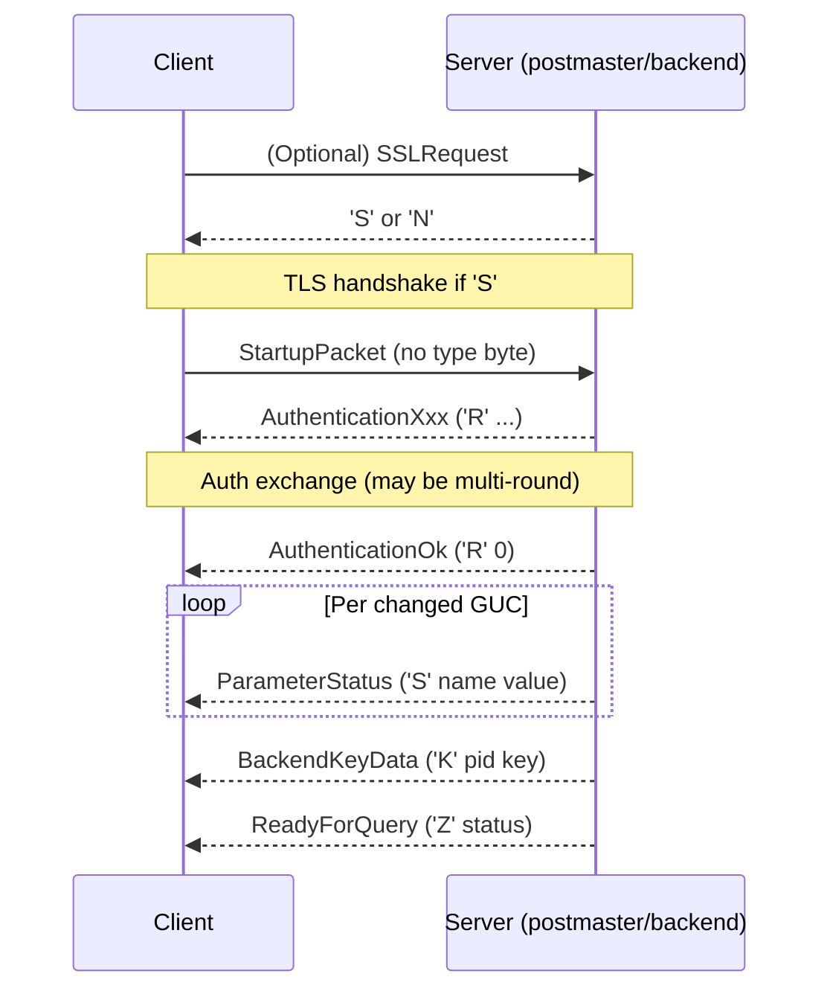
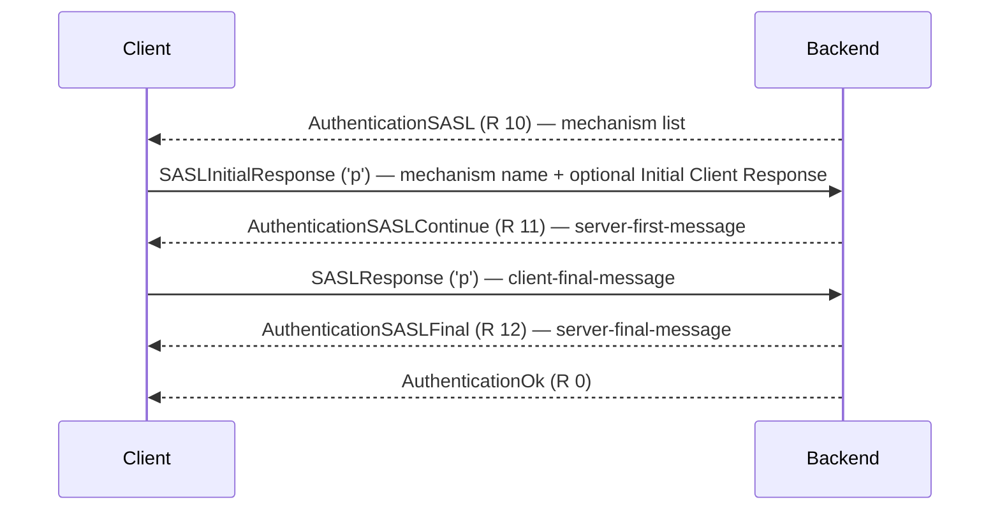
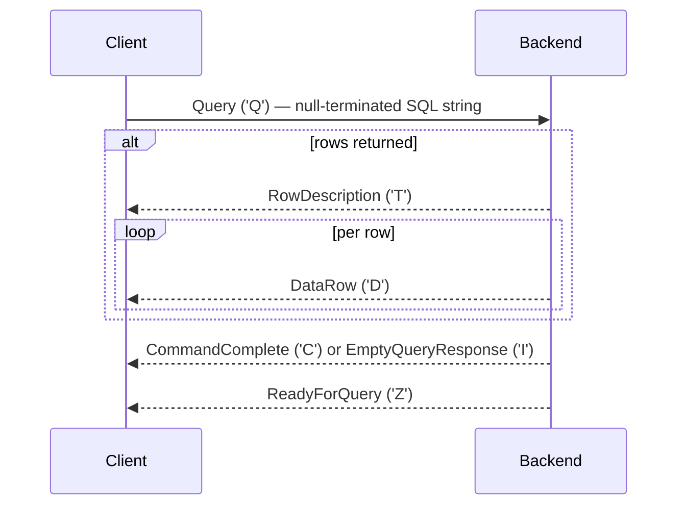
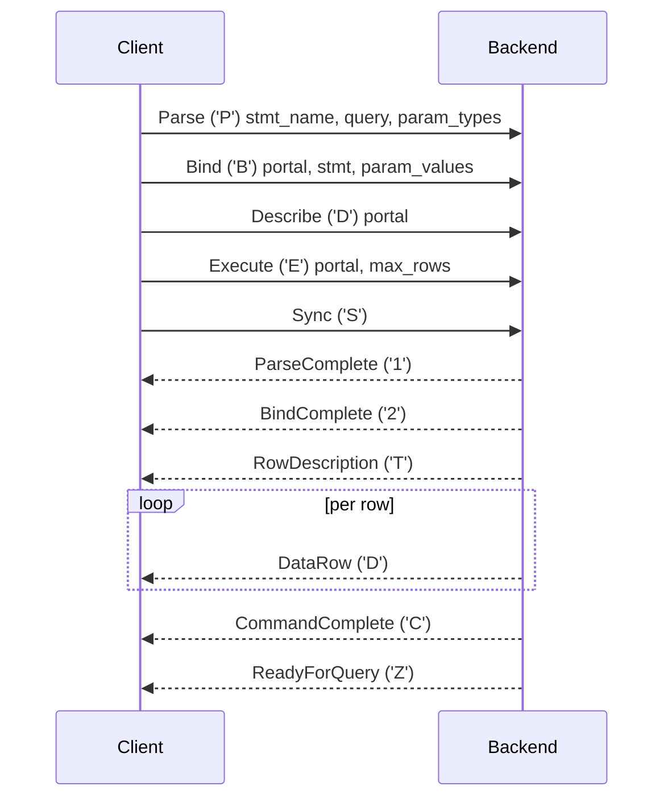
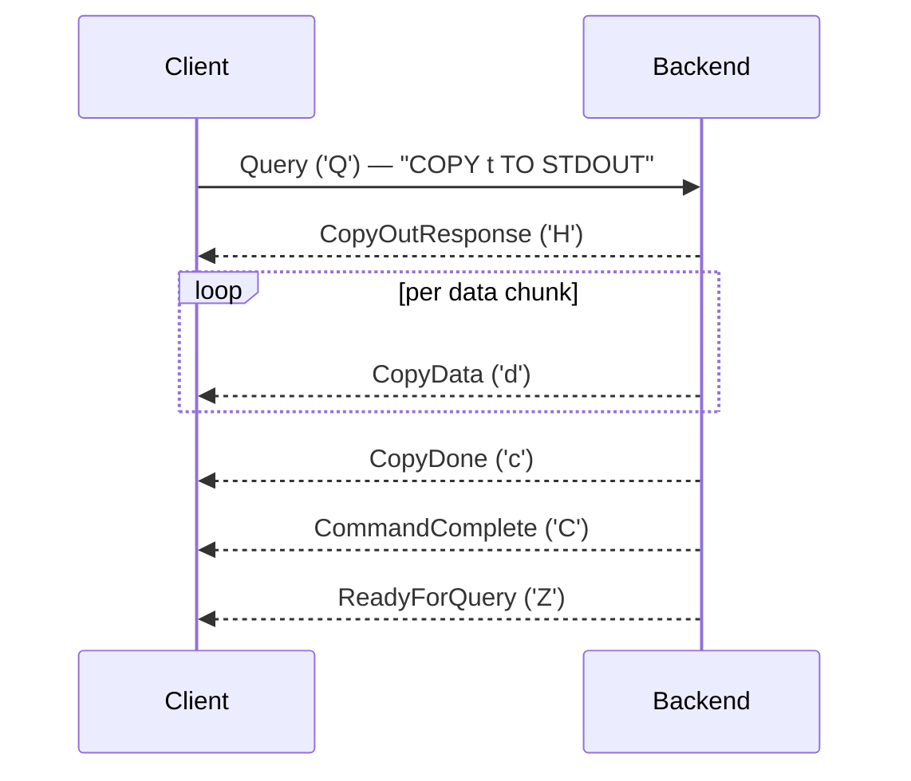

# Frontend/Backend Wire Protocol (v3.0)

PostgreSQL's wire protocol is a byte-stream, message-oriented protocol that governs all communication between a client (frontend) and a server backend process. Protocol version 3.0 — the only version PostgreSQL 16 speaks (`PG_PROTOCOL_EARLIEST == PG_PROTOCOL_LATEST == PG_PROTOCOL(3,0)`, `src/include/libpq/pqcomm.h:90-91`) — has been stable since PostgreSQL 7.4. The source files listed above document every message type, field layout, and sequencing rule described here.

---

## Message Framing

All post-startup messages share a uniform three-part frame:

```
 1 byte   4 bytes (big-endian)   N bytes
┌────────┬──────────────────────┬────────────────────┐
│  type  │  length (incl. self) │  payload           │
└────────┴──────────────────────┴────────────────────┘
```

- **Type tag** — a single ASCII byte identifying the message kind.
- **Length** — a 4-byte big-endian `int32` whose value *includes* the 4 bytes of the length field itself, but *excludes* the type byte.  Minimum legal value is 4 (empty payload).  `fe-protocol3.c:89` validates `msgLength < 4` as a protocol error.
- **Payload** — zero or more bytes whose structure is message-specific.

The backend builds outgoing messages via `pq_beginmessage(buf, msgtype)` / various `pq_sendXXX` / `pq_endmessage(buf)`.  `pq_beginmessage` stashes the type character in `buf->cursor` rather than in the buffer body; `pq_endmessage` prepends the type byte and the 4-byte big-endian length before writing to the socket (`src/backend/libpq/pqformat.c:88-98`).

Integers on the wire are always in **network byte order** (big-endian). The inline helpers `pq_writeint16/32/64` enforce this via `pg_hton16/32/64` (`src/include/libpq/pqformat.h:60-96`).

The frontend parser in `pqParseInput3` reads each message as: 1 byte type tag + 4-byte `msgLength`, validates `msgLength >= 4`, waits until it has buffered the full body, then dispatches on `id` (`src/interfaces/libpq/fe-protocol3.c:63-127`).  `VALID_LONG_MESSAGE_TYPE` (`fe-protocol3.c:38-40`) whitelists messages whose payload can legitimately exceed ~30 KB: `T`, `D`, `d`, `V`, `E`, `N`, `A`.

---

## Connection Startup

### 2.1 Startup Packet

The startup packet is the *only* message without a type tag:

```
 4 bytes (big-endian)   4 bytes (big-endian)   variable
┌──────────────────────┬──────────────────────┬────────────────────────────────┐
│  total length        │  protocol version    │  key=value pairs + \0\0 terminator │
└──────────────────────┴──────────────────────┴────────────────────────────────┘
```

- **Protocol version** for 3.0: `PG_PROTOCOL(3,0) = (3 << 16) | 0 = 196608 = 0x00030000`.
- **Key-value pairs**: each key and value is a null-terminated C string.  Common keys: `user`, `database`, `application_name`, `client_encoding`, `options`, `replication`.  The list is terminated by a single extra `\0` byte (double null at the end).
- **Maximum size**: `MAX_STARTUP_PACKET_LENGTH = 10000` bytes (`pqcomm.h:114`), enforced in the postmaster to prevent denial-of-service.

`build_startup_packet()` assembles the packet in two passes: first to measure, then to fill (`src/interfaces/libpq/fe-protocol3.c:2271-2335`).

### 2.2 BackendKeyData ('K')

After successful authentication the backend sends a `BackendKeyData` message so the client can later send cancellation requests:

```
'K' | int32 length | int32 backend_pid | int32 cancel_key
```

Assembled at `src/backend/tcop/postgres.c:4330-4333` using `MyProcPid` and `MyCancelKey`.

### 2.3 Startup Sequence Overview



---

## Authentication Messages

All authentication messages share message type `'R'` and begin with a 4-byte `int32` subtype code.  `src/include/libpq/pqcomm.h:119-132` defines these constants.

| Subtype | Constant | Meaning | Extra payload |
|---------|----------|---------|---------------|
| 0 | `AUTH_REQ_OK` | Authentication succeeded | none |
| 3 | `AUTH_REQ_PASSWORD` | Cleartext password requested | none |
| 5 | `AUTH_REQ_MD5` | MD5 password; send `md5(md5(password+username)+salt)` | 4-byte salt |
| 7 | `AUTH_REQ_GSS` | GSSAPI (no wrap) | none |
| 8 | `AUTH_REQ_GSS_CONT` | Continue GSSAPI exchange | opaque data |
| 9 | `AUTH_REQ_SSPI` | SSPI negotiate | none |
| 10 | `AUTH_REQ_SASL` | Begin SASL; payload is null-separated list of mechanism names + final `\0` | mechanism list |
| 11 | `AUTH_REQ_SASL_CONT` | Continue SASL exchange | SASL server message |
| 12 | `AUTH_REQ_SASL_FIN` | Final SASL message | SASL server final message |

`sendAuthRequest()` in `src/backend/libpq/auth.c:670-681` assembles these: it calls `pq_beginmessage(&buf, 'R')`, `pq_sendint32(&buf, areq)`, optionally appends `extradata`, then `pq_endmessage`.  It flushes immediately for all subtypes except `AUTH_REQ_OK` and `AUTH_REQ_SASL_FIN`.

### 3.1 SCRAM/SASL Exchange

The full SCRAM-SHA-256 exchange is driven by `CheckSASLAuth()` in `src/backend/libpq/auth-sasl.c`:



Client responses always use message type `'p'` (password message).  The `initial` flag in `CheckSASLAuth` distinguishes `SASLInitialResponse` (contains selected mechanism name + `int32` payload length + payload) from `SASLResponse` (raw payload only).

---

## Simple Query Protocol

The simplest execution path: one round-trip per SQL string.

### 4.1 Message Flow



If an error occurs, the backend sends `ErrorResponse ('E')` followed (still) by `ReadyForQuery ('Z')`. This way, the client can always recover.

Backend dispatch at `src/backend/tcop/postgres.c:4709-4731`: reads the query string with `pq_getmsgstring`, calls `exec_simple_query`.

### 4.2 RowDescription ('T')

Describes the columns of the result set.  Sent once before the first `DataRow`.

```
'T' | int32 len | int16 num_fields
per field:
  cstring name | int32 table_oid | int16 column_attr_num
  | int32 type_oid | int16 type_len | int32 atttypmod | int16 format_code
```

`format_code`: 0 = text, 1 = binary.  Parsed by `getRowDescriptions()` at `fe-protocol3.c:483`.

| Wire field | C field | Notes |
|-----------|---------|-------|
| `cstring` | `attDescs[i].name` | null-terminated, server-encoded |
| `int32` | `attDescs[i].tableid` | 0 if not a table column |
| `int16` | `attDescs[i].columnid` | 0 if not a table column |
| `int32` | `attDescs[i].typid` | pg_type OID |
| `int16` | `attDescs[i].typlen` | negative for variable-length types |
| `int32` | `atttypmod` | type-specific modifier (-1 if none) |
| `int16` | `attDescs[i].format` | 0=text, 1=binary |

### 4.3 DataRow ('D')

One message per result row.

```
'D' | int32 len | int16 num_fields
per field:
  int32 field_len   (or -1 for NULL)
  | byte[field_len] value
```

### 4.4 CommandComplete ('C')

```
'C' | int32 len | cstring tag
```

`tag` is a command tag string such as `SELECT 42`, `INSERT 0 1`, `UPDATE 3`.  The integer suffix is the row count.

### 4.5 ReadyForQuery ('Z')

```
'Z' | int32 len (5) | int8 status
```

`status` is one of three values returned by `TransactionBlockStatusCode()` (`src/backend/access/transam/xact.c:4858-4886`):

| Byte | Meaning |
|------|---------|
| `'I'` | Idle — not in a transaction |
| `'T'` | In a transaction block |
| `'E'` | In a failed transaction block |

`ReadyForQuery` always calls `pq_flush()` afterward (`src/backend/tcop/dest.c:266`), making it the natural pipeline-flush point.

### 4.6 ErrorResponse / NoticeResponse ('E' / 'N')

```
'E' | int32 len
  ( int8 field_code | cstring value )...
  int8 '\0'   (terminator)
```

Field codes are defined in `src/include/postgres_ext.h:54-71`:

| Code | Constant | Meaning |
|------|----------|---------|
| `'S'` | `PG_DIAG_SEVERITY` | Localised severity: `ERROR`, `FATAL`, `PANIC`, `WARNING`, `NOTICE`, `DEBUG`, `INFO`, `LOG` |
| `'V'` | `PG_DIAG_SEVERITY_NONLOCALIZED` | Non-localised severity (always English) |
| `'C'` | `PG_DIAG_SQLSTATE` | 5-character SQLSTATE code |
| `'M'` | `PG_DIAG_MESSAGE_PRIMARY` | Primary human-readable message |
| `'D'` | `PG_DIAG_MESSAGE_DETAIL` | Optional detail |
| `'H'` | `PG_DIAG_MESSAGE_HINT` | Optional hint |
| `'P'` | `PG_DIAG_STATEMENT_POSITION` | Decimal cursor position in original query (1-based character) |
| `'p'` | `PG_DIAG_INTERNAL_POSITION` | Cursor position in internally generated query |
| `'q'` | `PG_DIAG_INTERNAL_QUERY` | Text of internally generated query |
| `'W'` | `PG_DIAG_CONTEXT` | Error context (e.g., call stack) |
| `'s'` | `PG_DIAG_SCHEMA_NAME` | Schema name |
| `'t'` | `PG_DIAG_TABLE_NAME` | Table name |
| `'c'` | `PG_DIAG_COLUMN_NAME` | Column name |
| `'d'` | `PG_DIAG_DATATYPE_NAME` | Data type name |
| `'n'` | `PG_DIAG_CONSTRAINT_NAME` | Constraint name |
| `'F'` | `PG_DIAG_SOURCE_FILE` | Source file name |
| `'L'` | `PG_DIAG_SOURCE_LINE` | Source line number |
| `'R'` | `PG_DIAG_SOURCE_FUNCTION` | Source function name |

Fields may appear in any order.  A `\0` byte (field code = 0) terminates the list.  `NoticeResponse` has exactly the same layout but uses type `'N'` and does not indicate a failure.

---

## Extended Query Protocol

Extended query separates parsing, binding, and execution into distinct steps, enabling prepared statement reuse and server-side parameter binding.

### 5.1 Parse ('P') → ParseComplete ('1')

**Frontend → Backend**
```
'P' | int32 len | cstring stmt_name | cstring query | int16 num_params
  int32 param_type_oid...
```

`stmt_name` = `""` for the unnamed prepared statement.  `param_type_oid` = 0 means "infer from query".  Backend dispatch at `postgres.c:4733-4761`.

**Backend → Frontend**
```
'1' | int32 len (4)   (no payload)
```

Sent via `pq_putemptymessage('1')` at `postgres.c:1596`.

### 5.2 Bind ('B') → BindComplete ('2')

**Frontend → Backend**
```
'B' | int32 len
  cstring portal_name | cstring stmt_name
  int16 num_param_formats
    int16 format_code...          (0=text, 1=binary; one per param or one for all)
  int16 num_param_values
    ( int32 value_len | byte[value_len] value )...   (-1 for NULL)
  int16 num_result_formats
    int16 format_code...
```

`exec_bind_message()` processes this.

**Backend → Frontend**
```
'2' | int32 len (4)
```

Sent via `pq_putemptymessage('2')` at `postgres.c:2066`.

### 5.3 Describe ('D') → ParameterDescription ('t') / RowDescription ('T') / NoData ('n')

**Frontend → Backend**
```
'D' | int32 len | int8 object_type | cstring name
```

`object_type`: `'S'` = prepared statement, `'P'` = portal.

For a **statement** describe (`'S'`): backend returns `ParameterDescription` followed by `RowDescription` (or `NoData` if no rows).
For a **portal** describe (`'P'`): backend returns `RowDescription` (or `NoData`).

**ParameterDescription ('t')**
```
't' | int32 len | int16 num_params | int32 param_type_oid...
```

**NoData ('n')**
```
'n' | int32 len (4)
```

### 5.4 Execute ('E') → DataRow ('D') × N → CommandComplete ('C') | PortalSuspended ('s')

**Frontend → Backend**
```
'E' | int32 len | cstring portal_name | int32 max_rows
```

`max_rows = 0` means return all rows.  If `max_rows > 0` and the portal is not exhausted, the backend sends `PortalSuspended` instead of `CommandComplete`.

**PortalSuspended ('s')**
```
's' | int32 len (4)
```

Sent via `pq_putemptymessage('s')` at `postgres.c:2321`.  The client must send another `Execute` to continue, or `Close` to discard the portal.

### 5.5 Sync ('S') / Flush ('H')

```
'S' | int32 len (4)    (Sync)
'H' | int32 len (4)    (Flush)
```

**Sync** ends a pipeline of extended-query messages and triggers `ReadyForQuery` from the backend.  It also clears `ignore_till_sync` so that error recovery can proceed (`postgres.c:4919`).

**Flush** asks the backend to flush its output buffer without sending `ReadyForQuery` — useful when pipelining multiple requests without needing to wait for `ReadyForQuery` between each.

### 5.6 Close ('C') → CloseComplete ('3')

**Frontend → Backend**
```
'C' | int32 len | int8 object_type | cstring name
```

`object_type`: `'S'` = prepared statement, `'P'` = portal.

**CloseComplete ('3')**
```
'3' | int32 len (4)
```

Sent via `pq_putemptymessage('3')` at `postgres.c:4873`.

### 5.7 Extended Query Flow



The client can pipeline messages: it can send P/B/D/E/S in a single write before waiting for any response.  The backend processes them strictly in order.

---

## COPY Protocol

COPY uses a sub-protocol triggered when the query processor encounters a `COPY` statement.

### 6.1 CopyOutResponse ('H') — backend → client

```
'H' | int32 len | int8 overall_format | int16 num_cols
  int16 col_format_code...
```

`overall_format`: 0 = text/CSV, 1 = binary.  Assembled by `SendCopyBegin()` in `src/backend/commands/copyto.c:140-153`.

### 6.2 CopyInResponse ('G') — backend → client

```
'G' | int32 len | int8 overall_format | int16 num_cols
  int16 col_format_code...
```

Assembled with `pq_beginmessage(&buf, 'G')` in `src/backend/commands/copyfromparse.c:177-182`.

### 6.3 CopyBothResponse ('W') — backend → client

Used for walsender replication streams where both directions are active simultaneously (`fe-protocol3.c:399-404`).

### 6.4 CopyData ('d')

```
'd' | int32 len | byte[len-4] data
```

Raw data rows in either direction.  Backend sends via `pq_putmessage('d', fe_msgbuf->data, fe_msgbuf->len)` (`copyto.c:250`).

### 6.5 CopyDone ('c') / CopyFail ('f')

```
'c' | int32 len (4)            (CopyDone)
'f' | int32 len | cstring msg  (CopyFail — client only, reports error reason)
```

`SendCopyEnd()` sends `pq_putemptymessage('c')` (`copyto.c:162`).

### 6.6 COPY-Out Flow



---

## Cancellation

Cancellation uses a **separate TCP connection** to the postmaster (not the backend), carrying a special fixed-size packet that resembles a startup packet but uses a magic code instead of a protocol version:

```c
/* src/include/libpq/pqcomm.h:147-153 */
typedef struct CancelRequestPacket {
    MsgType  cancelRequestCode;  /* CANCEL_REQUEST_CODE = PG_PROTOCOL(1234,5678) */
    uint32   backendPID;         /* PID of backend to cancel */
    uint32   cancelAuthCode;     /* secret key (from BackendKeyData 'K') */
} CancelRequestPacket;
```

Wire layout: 4-byte total length (`= 16`) + 4-byte `CANCEL_REQUEST_CODE` + 4-byte PID + 4-byte secret key.  The postmaster matches `backendPID` and `cancelAuthCode` against running backends (`postmaster.c:2463`) and sends `SIGINT` to the matching backend.  The postmaster then closes the connection without any response to the client.

There is no type tag byte.  PostgreSQL sets `CANCEL_REQUEST_CODE = PG_PROTOCOL(1234,5678) = 0x04D21678` outside the range of any valid protocol version number.

---

## Asynchronous Notifications

When a `NOTIFY` fires, the backend can send a `NotificationResponse` at any time (between complete query responses, never mid-message):

```
'A' | int32 len | int32 backend_pid | cstring channel | cstring payload
```

Assembled by `NotifyMyFrontEnd()` in `src/backend/commands/async.c:2414-2418`:

```c
pq_beginmessage(&buf, 'A');
pq_sendint32(&buf, srcPid);
pq_sendstring(&buf, channel);
pq_sendstring(&buf, payload);
pq_endmessage(&buf);
```

`payload` is the optional payload string from `NOTIFY channel, 'payload'`; it is an empty string for bare `NOTIFY channel`.  The client side unconditionally processes `'A'` messages in any connection state (`fe-protocol3.c:145-148`).

---

## ParameterStatus ('S')

The backend sends `ParameterStatus` messages to report the current value of named session parameters:

```
'S' | int32 len | cstring name | cstring value
```

Sent in two situations:
1. **During startup** — after `AuthenticationOk`, before `ReadyForQuery`, one message per relevant GUC (e.g., `server_version`, `client_encoding`, `DateStyle`, `TimeZone`, `integer_datetimes`).
2. **On SET** — whenever a tracked GUC value changes.

Assembled at `src/backend/utils/misc/guc.c:2598-2601`:

```c
pq_beginmessage(&msgbuf, 'S');
pq_sendstring(&msgbuf, record->name);
pq_sendstring(&msgbuf, val);
pq_endmessage(&msgbuf);
```

The client side processes `'S'` both in IDLE and BUSY states and calls `pqSaveParameterStatus()` to cache the value (`fe-protocol3.c:1462-1477`).

---

## SSL / TLS Negotiation

Before sending the startup packet, a client may request TLS by sending a special startup-packet-shaped message with `NEGOTIATE_SSL_CODE` as the protocol version:

```
int32 length (= 8) | int32 NEGOTIATE_SSL_CODE (= PG_PROTOCOL(1234,5679) = 0x04D2162F)
```

The server responds with a single unframed byte:

| Byte | Meaning |
|------|---------|
| `'S'` | SSL supported; TLS handshake follows |
| `'N'` | SSL not supported; send startup packet directly |

The postmaster handles this at `src/backend/postmaster/postmaster.c:2046-2093`.  The postmaster refuses SSL on Unix-domain sockets (`laddr.addr.ss_family == AF_UNIX`) or when not compiled with `USE_SSL`.  After `'S'`, `secure_open_server()` performs the TLS handshake; any pre-handshake buffered data triggers a protocol-violation fatal error to prevent MITM injection.

`NEGOTIATE_GSS_CODE = PG_PROTOCOL(1234,5680)` follows the same pattern for GSSAPI encryption.

---

## Message Type Reference

### Backend → Frontend

| Type | Name | Description |
|------|------|-------------|
| `'R'` | Authentication | Auth challenge/result |
| `'K'` | BackendKeyData | PID and cancel key |
| `'S'` | ParameterStatus | GUC name/value pair |
| `'Z'` | ReadyForQuery | Backend idle; includes transaction status byte |
| `'T'` | RowDescription | Column metadata |
| `'D'` | DataRow | One result row |
| `'C'` | CommandComplete | Command tag (e.g., `SELECT 1`) |
| `'I'` | EmptyQueryResponse | Empty string was sent |
| `'E'` | ErrorResponse | Error with field codes |
| `'N'` | NoticeResponse | Non-fatal notice |
| `'A'` | NotificationResponse | Async NOTIFY |
| `'1'` | ParseComplete | Parse succeeded |
| `'2'` | BindComplete | Bind succeeded |
| `'3'` | CloseComplete | Close succeeded |
| `'t'` | ParameterDescription | Prepared statement param types |
| `'n'` | NoData | Statement/portal returns no rows |
| `'s'` | PortalSuspended | Max-row limit hit |
| `'G'` | CopyInResponse | Ready for COPY IN data |
| `'H'` | CopyOutResponse | Beginning COPY OUT data |
| `'W'` | CopyBothResponse | Bidirectional COPY (replication) |
| `'d'` | CopyData | COPY data chunk |
| `'c'` | CopyDone | COPY completed |
| `'V'` | FunctionCallResponse | Result of fastpath function call |

### Frontend → Backend

| Type | Name | Description |
|------|------|-------------|
| `'Q'` | Query | Simple query |
| `'P'` | Parse | Extended query: parse |
| `'B'` | Bind | Extended query: bind |
| `'D'` | Describe | Extended query: describe statement or portal |
| `'E'` | Execute | Extended query: execute portal |
| `'C'` | Close | Extended query: close statement or portal |
| `'H'` | Flush | Flush output buffer |
| `'S'` | Sync | End pipeline, request ReadyForQuery |
| `'X'` | Terminate | Close connection |
| `'F'` | FunctionCall | Fastpath function call |
| `'p'` | PasswordMessage / SASLResponse | Auth response payload |
| `'d'` | CopyData | COPY data chunk |
| `'c'` | CopyDone | COPY complete |
| `'f'` | CopyFail | COPY aborted by client |

---

## Error Recovery and ignore_till_sync

When the backend encounters an error during extended query processing, it sets `ignore_till_sync = true`.  It then skips all further extended-query messages until `Sync ('S')` arrives (`src/backend/tcop/postgres.c:4704`).  This lets clients pipeline multiple messages without checking for errors in between — they only need to send a `Sync` and wait for `ReadyForQuery`.

The backend sets the `doing_extended_query_message` flag on `B`, `P`, `C`, `D`, `E`, `H` and clears it on `Q`, `F`, `X`, `S`; the flag controls whether an error triggers `ignore_till_sync` (`postgres.c:407-445`).

---

## See also

- [[architecture/client-connection]]
- [[code-paths/simple-select]]
- [[code-paths/extended-query]]
- [[subsystems/transactions/transaction-lifecycle]]
- [[subsystems/replication/streaming]]
