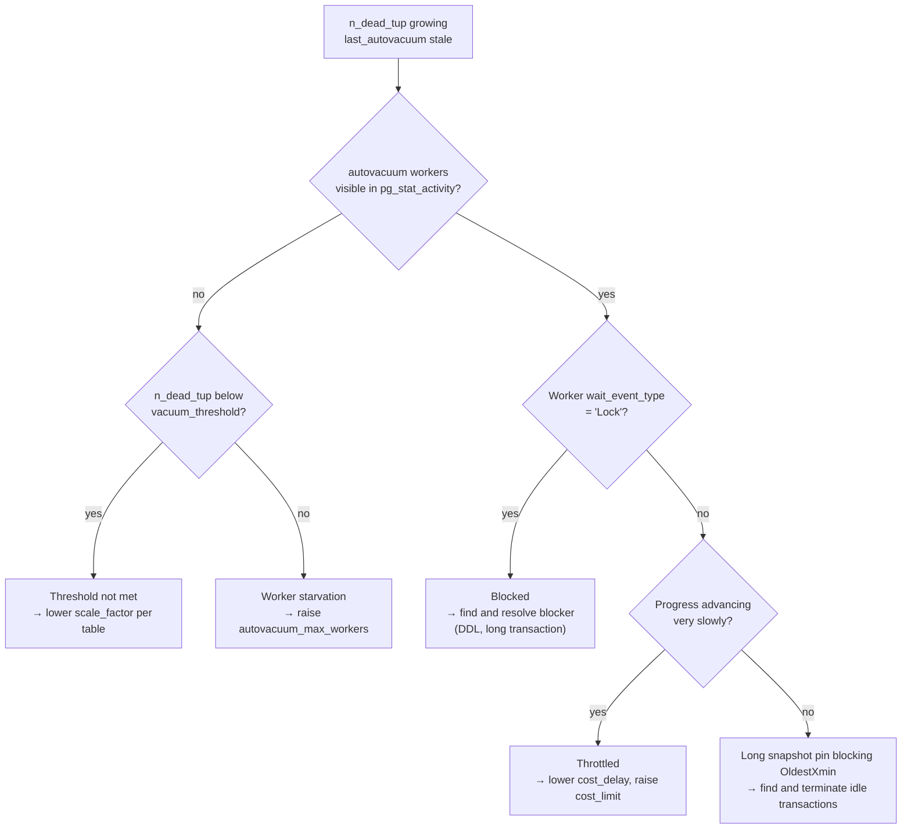

# Autovacuum Not Keeping Up

Dead tuples accumulating faster than autovacuum can reclaim them causes four distinct downstream problems: table and index bloat, worsening query plans from stale statistics, snapshot pinning that blocks freeze progress, and eventually XID wraparound risk. Autovacuum can fall behind for four distinct reasons: thresholds too high to trigger, cost throttling too aggressive, blocked by a conflicting lock, or simply not enough workers for the number of tables that need attention. Each reason requires a different intervention. Diagnosing which failure mode is active before tuning prevents applying the wrong fix.

## Detecting the Symptom

Dead tuple accumulation visible in `pg_stat_user_tables` is the primary signal:

```sql
SELECT schemaname, relname,
       n_live_tup,
       n_dead_tup,
       round(100.0 * n_dead_tup / nullif(n_live_tup + n_dead_tup, 0), 1)
                                           AS dead_pct,
       last_autovacuum,
       last_autoanalyze,
       pg_size_pretty(pg_total_relation_size(relid)) AS total_size
FROM pg_stat_user_tables
WHERE n_dead_tup > 1000
ORDER BY n_dead_tup DESC
LIMIT 20;
```

Tables where `dead_pct` exceeds 10% or where `last_autovacuum` is absent or several hours old on an active table need investigation. For context on what bloat is accumulating, see [[troubleshooting/bloat]].

## Failure Mode 1: Thresholds Not Met

Autovacuum only starts a vacuum run on a table when the estimated number of dead tuples exceeds:

```
autovacuum_vacuum_threshold + autovacuum_vacuum_scale_factor × n_live_tup
```

With the defaults (`threshold = 50`, `scale_factor = 0.20`), a 10-million-row table requires two million dead tuples before autovacuum even begins. On high-churn tables this means bloat can grow substantially before the trigger fires.

Confirm this is the issue by comparing the dead tuple count against the computed threshold:

```sql
SELECT c.relname,
       s.n_dead_tup,
       s.n_live_tup,
       current_setting('autovacuum_vacuum_threshold')::int
           + round(current_setting('autovacuum_vacuum_scale_factor')::numeric
                   * s.n_live_tup)        AS vacuum_threshold,
       s.last_autovacuum
FROM pg_class c
JOIN pg_stat_user_tables s ON s.relid = c.oid
WHERE c.relkind = 'r'
ORDER BY s.n_dead_tup DESC
LIMIT 20;
```

On tables where `n_dead_tup` is well below `vacuum_threshold` despite high dead-tuple counts, autovacuum never triggers at all. The fix is per-table overrides that fire much earlier for high-write tables — see [[subsystems/background/vacuum-tuning|Vacuum Tuning]] for the full `ALTER TABLE ... SET (...)` reference and recommended production values.

The same arithmetic applies to analyze:

```
autovacuum_analyze_threshold + autovacuum_analyze_scale_factor × n_live_tup
```

Stale statistics produce bad query plans even when vacuum is working. Setting `autovacuum_analyze_scale_factor = 0.01` ensures the planner gets fresh statistics after modest write activity.

## Failure Mode 2: Cost Throttling

PostgreSQL deliberately throttles autovacuum's I/O to avoid disrupting foreground queries. After every `autovacuum_vacuum_cost_limit` cost units of I/O (default 200), the worker sleeps for `autovacuum_vacuum_cost_delay` milliseconds (default 2ms). On a large table with many dirty pages, this means autovacuum crawls — it may take hours to complete a single pass on a table with millions of dead tuples.

Identify a throttled worker by watching its progress:

```sql
-- Run this a few seconds apart and compare the heap_blks_scanned values
SELECT pid, relid::regclass, phase,
       heap_blks_scanned, heap_blks_total,
       round(100.0 * heap_blks_scanned / nullif(heap_blks_total, 0), 1) AS pct_done
FROM pg_stat_progress_vacuum
WHERE pid IN (
    SELECT pid FROM pg_stat_activity
    WHERE application_name LIKE 'autovacuum%'
);
```

A worker that advances by a small fraction between samples and whose elapsed time grows rapidly is throttled. Per-table `autovacuum_vacuum_cost_delay` and `autovacuum_vacuum_cost_limit` overrides bypass the global throttle for specific high-priority tables — see [[subsystems/background/vacuum-tuning|Vacuum Tuning]] for the GUC reference and recommended values. Setting the delay to `0` disables throttling entirely for that table. Doing so removes autovacuum's protection against saturating I/O. Use it only where bloat is already causing serious operational impact.

When `autovacuum_vacuum_cost_balance` (PG 12+) is on, PostgreSQL shares the `autovacuum_vacuum_cost_limit` across all workers. If three workers are running simultaneously, each gets one-third of the limit. Raising the global limit or per-table limit increases the share available to each worker.

## Failure Mode 3: Autovacuum Blocked by Locks

Autovacuum acquires a `ShareUpdateExclusiveLock` before beginning a vacuum run. This lock conflicts with `AccessExclusiveLock` (DDL operations) and `ShareRowExclusiveLock`. If a DDL operation is waiting for readers to finish, autovacuum may queue behind it and stall. Conversely, a running autovacuum can block DDL from starting (autovacuum will cancel itself after `deadlock_timeout` to yield, but only if it does not believe it is running an anti-wraparound vacuum).

Find blocked autovacuum workers:

```sql
SELECT a.pid, a.application_name,
       a.wait_event_type, a.wait_event,
       now() - a.query_start AS blocked_for,
       a.query
FROM pg_stat_activity a
WHERE a.application_name LIKE 'autovacuum%'
  AND a.wait_event_type IS NOT NULL
ORDER BY blocked_for DESC;
```

A worker with `wait_event_type = 'Lock'` is blocked on a heavyweight lock. Find the blocker with `pg_blocking_pids(pid)`:

```sql
SELECT blocking.pid, blocking.query, blocking.state,
       now() - blocking.query_start AS blocker_age
FROM pg_stat_activity blocking
WHERE blocking.pid = ANY(
    SELECT unnest(pg_blocking_pids(autovac.pid))
    FROM pg_stat_activity autovac
    WHERE autovac.application_name LIKE 'autovacuum%'
);
```

Long-running transactions also block vacuum's ability to advance the OldestXmin horizon, even without holding an explicit lock. VACUUM cannot remove dead tuples newer than the oldest active transaction's `backend_xmin`. Find snapshot-pinning sessions:

```sql
SELECT pid, usename, state,
       now() - xact_start        AS txn_age,
       backend_xmin,
       left(query, 80)           AS current_query
FROM pg_stat_activity
WHERE backend_xmin IS NOT NULL
ORDER BY txn_age DESC NULLS LAST
LIMIT 10;
```

Sessions with an old `backend_xmin` and a large `txn_age` prevent autovacuum from cleaning any tuples written after their snapshot began. This holds regardless of whether autovacuum is running.

## Failure Mode 4: Worker Starvation

`autovacuum_max_workers` (default 3) limits how many autovacuum processes run simultaneously. On an instance with many tables all needing attention — common after large batch operations or in multi-tenant schemas with hundreds of tables — the three workers may be continuously occupied. Tables waiting their turn then accumulate dead tuples in the meantime.

Check whether all workers are busy:

```sql
SELECT pid, application_name, query
FROM pg_stat_activity
WHERE application_name LIKE 'autovacuum%';
```

If the output always shows exactly `autovacuum_max_workers` rows, workers are running at capacity. Raising `autovacuum_max_workers` in `postgresql.conf` lets autovacuum vacuum more tables concurrently. Each additional worker consumes one slot from `max_connections` and up to `autovacuum_work_mem` (default: `maintenance_work_mem`) of memory; these costs are modest compared with the benefit of keeping dead tuple counts bounded.

```
# postgresql.conf
autovacuum_max_workers = 6
```

This change requires a restart.

## Diagnosing Which Failure Mode Applies



## Emergency: Manual VACUUM

When autovacuum cannot keep up and dead tuples are causing operational impact — index bloat, plan degradation, or approaching XID age limits — run VACUUM manually on the worst-affected tables. Manual VACUUM runs without autovacuum's cost throttling:

```sql
VACUUM (VERBOSE, ANALYZE) schema.tablename;
```

`VERBOSE` prints progress lines showing how many dead tuples VACUUM removed, which indexes it cleaned, and how much the freeze horizon advanced. Use `VACUUM FREEZE` when a table's XID age is high:

```sql
VACUUM (FREEZE, VERBOSE) schema.tablename;
```

Manual VACUUM and autovacuum can run simultaneously on different tables. They do not conflict; each acquires its own `ShareUpdateExclusiveLock` on the table it is working on.

## Prevention

PostgreSQL calibrates autovacuum's default configuration for modest-sized tables. High-write production tables always need per-table overrides applied proactively rather than reactively — see [[subsystems/background/vacuum-tuning|Vacuum Tuning]] for a recommended baseline `ALTER TABLE ... SET (...)` for tables receiving more than tens of thousands of writes per hour.

Monitor `n_dead_tup / (n_live_tup + n_dead_tup)` in your alerting system. Alert at 10%, page at 30%. An alert that fires frequently on the same table is a signal to adjust its per-table thresholds rather than tune global parameters.

## See Also

- [[subsystems/background/autovacuum|Autovacuum]] — the autovacuum launcher and worker architecture, scheduling algorithm, and cost-accounting mechanics
- [[subsystems/background/vacuum-tuning|Vacuum Tuning]] — the full reference for autovacuum and vacuum GUCs and their interactions
- [[troubleshooting/bloat|Table and Index Bloat]] — measuring and remediating the accumulated result of autovacuum falling behind
- [[troubleshooting/xid-exhaustion|XID Exhaustion]] — the eventual consequence of autovacuum failing to advance relfrozenxid
- [[subsystems/transactions/xid-wraparound|XID Wraparound]] — how freeze limits work and why autovacuum is essential to wraparound prevention
- [[subsystems/storage/visibility-map|Visibility Map]] — how the all-frozen bit allows autovacuum to skip clean pages and how its absence forces full aggressive scans

## Related Topics

- [[code-paths/vacuum|Vacuum Code Path]] — step-by-step walkthrough of what VACUUM actually does when it runs, including dead-tuple removal and freeze logic
- [[subsystems/transactions/snapshot|Snapshots]] — how backend_xmin is established and why a long-lived snapshot prevents vacuum from advancing OldestXmin
- [[subsystems/storage/fsm|Free Space Map]] — how reclaimed space is recorded so that INSERT can reuse pages without extending the relation
- [[subsystems/transactions/hint-bits|Hint Bits]] — the lightweight tuple visibility marks that vacuum sets to avoid re-checking transaction status on future scans
- [[subsystems/observability/wait-events|Wait Events]] — reference for the wait_event and wait_event_type columns used when diagnosing blocked autovacuum workers
- [[subsystems/locking/overview|Locking Overview]] — the lock hierarchy that autovacuum participates in and why DDL can stall or be stalled by vacuum workers
