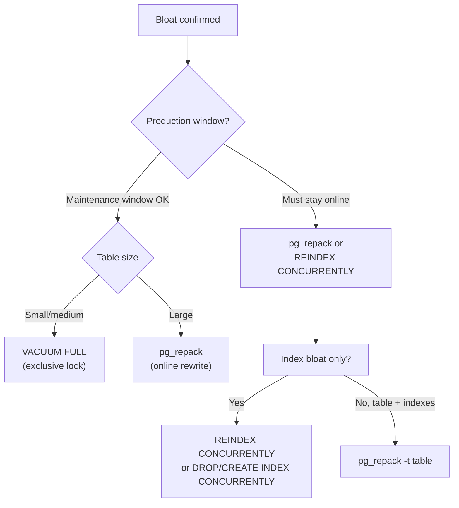

# Diagnosing and Remediating Bloat

Bloat is the gap between the space a relation occupies on disk and the space its live data actually requires. For the mechanics of why bloat exists — MVCC dead tuples, index dead entries, the FSM's role — see [[subsystems/storage/table-and-index-bloat]]. This page is a workflow: how to recognize bloat, measure it precisely, identify the cause, and choose the right remedy.

## Recognizing Bloat

Three signals indicate likely bloat before you run any measurement query.

**Table size far exceeds live row count.** A table with two million live rows and a 20 GB physical size has almost certainly accumulated dead tuples or never reclaimed space after a bulk delete. The ratio of `pg_relation_size` to `n_live_tup` is the first number to check.

**Slow sequential scans despite apparently small result sets.** Bloat forces sequential scans to read every physical page, including mostly-empty pages. A `EXPLAIN (ANALYZE, BUFFERS)` output that shows a large `Buffers: shared hit` or `read` count relative to the expected row count is a symptom.

**[[subsystems/background/autovacuum|Autovacuum]] running frequently but dead tuple counts still accumulating.** If `last_autovacuum` timestamps in `pg_stat_user_tables` are recent but `n_dead_tup` remains high, autovacuum is either throttled, blocked, or simply unable to keep up with the write rate.

Start with a broad scan across all user tables:

```sql
SELECT
    schemaname,
    relname,
    n_live_tup,
    n_dead_tup,
    round(100.0 * n_dead_tup / nullif(n_live_tup + n_dead_tup, 0), 1) AS dead_pct,
    pg_size_pretty(pg_relation_size(relid))                             AS heap_size,
    last_vacuum,
    last_autovacuum,
    last_analyze
FROM pg_stat_user_tables
ORDER BY n_dead_tup DESC
LIMIT 20;
```

Tables where `dead_pct` exceeds 10% or `last_autovacuum` is more than a few hours ago on an active table warrant further investigation.

## Measuring Table Bloat

### The pgstattuple approach

`pgstattuple` gives an exact answer by scanning every page. It counts dead tuples, their byte size, and free space. This is authoritative but can be slow on large tables.

```sql
CREATE EXTENSION IF NOT EXISTS pgstattuple;

SELECT
    table_len,
    tuple_count,
    dead_tuple_count,
    dead_tuple_percent,
    free_space,
    free_percent
FROM pgstattuple('public.orders');
```

`dead_tuple_percent + free_percent` is the effective bloat: space the file occupies that contains no live data. A combined value above 20% is generally worth addressing.

For large tables, `pgstattuple_approx` is faster: it skips pages that the visibility map has marked all-visible. Those pages contain no dead tuples by definition. The trade-off is that it does not count free space in all-visible pages.

```sql
SELECT * FROM pgstattuple_approx('public.orders');
```

### The pg_class estimation

When `pgstattuple` is unavailable or the table is too large to scan quickly, an estimate based on `pg_class` and `pg_stats` gives a ballpark bloat percentage without any table scan:

```sql
SELECT
    c.relname,
    c.relpages                                                          AS actual_pages,
    ceil(c.reltuples * (s.avg_width + 24) / 8192.0)                    AS estimated_pages,
    round(
        100.0 * (c.relpages - ceil(c.reltuples * (s.avg_width + 24) / 8192.0))
        / nullif(c.relpages, 0),
    1)                                                                  AS bloat_pct,
    pg_size_pretty(pg_relation_size(c.oid))                            AS total_size
FROM pg_class c
JOIN (
    SELECT tablename, sum(avg_width) AS avg_width
    FROM pg_stats
    WHERE schemaname = 'public'
    GROUP BY tablename
) s ON s.tablename = c.relname
WHERE c.relkind = 'r'
  AND c.relnamespace = 'public'::regnamespace
ORDER BY bloat_pct DESC NULLS LAST;
```

The formula assumes average tuple width from `pg_stats` plus the 24-byte `HeapTupleHeaderData` overhead and computes how many 8 KB pages the live tuples should occupy. The difference between that estimate and `relpages` is the estimated bloat. This is a rough heuristic — it overstates bloat for tables with many NULLs or variable-width columns — but it is fast and requires no extensions.

## Measuring Index Bloat

Index bloat accumulates independently of table bloat. B-tree indexes record one entry per live heap tuple at insert time; if rows are deleted without prompt vacuuming, the index retains dead entries that point to dead heap tuples.

`pg_stat_user_indexes` gives a first hint. A high `idx_scan` count relative to `idx_tup_read` suggests PostgreSQL is walking the index efficiently. A low ratio on a frequently queried index can indicate inefficiency from bloat or bad query plans.

For B-tree specifics, `pgstatindex` from the `pgstattuple` extension gives leaf-level density directly:

```sql
SELECT
    indexname,
    pg_size_pretty(pg_relation_size(indexrelid))  AS index_size,
    (pgstatindex(indexrelname)).avg_leaf_density   AS leaf_density,
    (pgstatindex(indexrelname)).leaf_fragmentation AS fragmentation
FROM pg_stat_user_indexes
WHERE schemaname = 'public'
ORDER BY leaf_density ASC;
```

`avg_leaf_density` is the average percentage of each leaf page occupied by live entries. A healthy OLTP index shows 70–85%. Values below 50% indicate significant wasted space; below 30% means roughly two-thirds of every index page is empty, doubling I/O for every index scan.

`leaf_fragmentation` measures what fraction of leaf pages are not physically adjacent to their logical predecessor. High fragmentation forces random I/O on range scans even when the index is otherwise compact.

## Root Causes

Understanding why bloat accumulated determines which fix is appropriate and how to prevent recurrence.

**Long-running transactions** are the most common root cause. VACUUM can only remove dead tuples that are older than the oldest transaction's snapshot — this horizon is called `OldestXmin`. A single long-running transaction, even an idle one holding a snapshot, pins this horizon and prevents vacuum from removing any dead tuples across the entire instance. Identify these with:

```sql
SELECT pid, usename, state, backend_xmin,
       now() - xact_start AS txn_age,
       left(query, 80)    AS query
FROM pg_stat_activity
WHERE backend_xmin IS NOT NULL
ORDER BY txn_age DESC NULLS LAST;
```

Any session with a `txn_age` exceeding a few minutes on a write-heavy system is a bloat risk.

**Autovacuum not keeping up** occurs on high-churn tables where dead tuples accumulate faster than the autovacuum worker can reclaim them. The default `autovacuum_vacuum_scale_factor = 0.2` means vacuum triggers only when 20% of a table's rows are dead. On a 50-million-row table, that is 10 million dead rows before vacuum even starts. High `autovacuum_vacuum_cost_delay` (default 2ms) also throttles vacuum aggressively. Tables with many writes need per-table overrides — see [[subsystems/background/vacuum-tuning]].

**HOT updates impossible** cause accelerated index bloat. When every column in a row has an index, or when rows are too wide to fit new versions on the same page, no HOT updates can occur. Every update writes a new index entry in every index. The result is index growth proportional to update volume, not just insert volume. Wide rows with many indexes on frequently-updated columns are particularly prone to this pattern.

**Wraparound-prevention vacuum** can create a bloat spike on large, seldom-written tables. When a table's `relfrozenxid` age approaches `autovacuum_freeze_max_age` (default 200 million transactions), aggressive vacuum must scan every non-frozen page to freeze old XIDs. This is unavoidable, but it temporarily increases I/O and can mask underlying bloat. Confirm with:

```sql
SELECT relname,
       age(relfrozenxid)               AS xid_age,
       pg_size_pretty(pg_total_relation_size(oid)) AS total_size
FROM pg_class
WHERE relkind = 'r'
ORDER BY xid_age DESC
LIMIT 10;
```

## Remediation Options



### VACUUM (online, reclaims to FSM)

```sql
VACUUM orders;
VACUUM VERBOSE orders;   -- shows pages scanned, dead tuples removed
```

Regular VACUUM marks dead tuple slots as reusable and records the freed space in the Free Space Map so future inserts can land there. It does not shrink the physical file — the space remains allocated but available. VACUUM is safe to run during normal operation; it holds no lock that blocks reads or writes. It is the right tool when the goal is to eliminate dead tuple overhead without reclaiming OS-level disk space. Autovacuum does this continuously in the background; manual VACUUM makes sense after a large bulk delete or when autovacuum is lagging.

### VACUUM FULL (exclusive lock, rewrites heap, shrinks file)

```sql
VACUUM FULL orders;
```

`VACUUM FULL` rewrites the entire relation into a new file, compacts it to the minimum possible size, then drops the old file. It also rebuilds all indexes. The downside is an `AccessExclusiveLock` held for the full duration — every read and write to the table blocks. On a large table this can mean minutes or hours of downtime. Reserve it for scheduled maintenance windows and small tables only.

### pg_repack (online, no exclusive lock)

[pg_repack](https://github.com/reorg/pg_repack) achieves what `VACUUM FULL` does — a physical rewrite with minimal footprint — without blocking concurrent reads or writes. It works by:

1. Creating a shadow copy of the table and its indexes.
2. Capturing ongoing changes via triggers applied to the shadow table.
3. Swapping the relfilenode OIDs, requiring only a brief exclusive lock at the final swap (typically milliseconds).

```bash
pg_repack -d mydb -t orders
pg_repack -d mydb --index orders_customer_id_idx  # index only
```

`pg_repack` is the standard production remedy for table bloat on large tables that cannot tolerate downtime. It requires roughly 2× the table's disk space during the rewrite.

### REINDEX CONCURRENTLY (index bloat)

```sql
REINDEX INDEX CONCURRENTLY orders_customer_id_idx;
REINDEX TABLE CONCURRENTLY orders;   -- rebuilds all indexes on the table
```

`REINDEX CONCURRENTLY` (PostgreSQL 12+) builds a new index alongside the old one, swaps them in `pg_index`, and drops the old one — without blocking DML. It requires roughly 2× the index's disk space during the rebuild and runs somewhat slower than a blocking `REINDEX`. Use it after a bulk delete or when `pgstatindex` shows `avg_leaf_density` below 50%.

### Choosing the right tool

| Situation | Tool |
|---|---|
| Routine dead tuple removal, no file shrink needed | `VACUUM` |
| Dead tuple removal after autovacuum lag | Manual `VACUUM` |
| Small table, maintenance window available | `VACUUM FULL` |
| Large table, must stay online | `pg_repack` |
| Index-only bloat, must stay online | `REINDEX CONCURRENTLY` |
| Index-only bloat, maintenance window | `REINDEX` |

## Prevention

Remediation is reactive. The durable fix is preventing bloat from accumulating.

**Autovacuum tuning** is the highest-leverage intervention. For large, frequently-written tables, the default `autovacuum_vacuum_scale_factor = 0.2` fires too late. Per-table overrides let vacuum trigger much earlier:

```sql
ALTER TABLE orders SET (
    autovacuum_vacuum_scale_factor  = 0.01,   -- trigger at 1% dead rows
    autovacuum_vacuum_cost_delay    = 1,       -- reduce I/O throttle
    autovacuum_vacuum_cost_limit    = 400      -- allow more work per cycle
);
```

See [[subsystems/background/vacuum-tuning]] for the full set of knobs and their interactions.

**Fillfactor for HOT-friendly tables** reserves space on each heap page for in-place row updates. When an update does not touch any indexed column and the new version fits on the same page, PostgreSQL creates a heap-only tuple (HOT) — it writes no new index entry. A lower fillfactor makes same-page updates more likely:

```sql
ALTER TABLE orders SET (fillfactor = 70);
VACUUM orders;   -- applies the new fillfactor to existing pages during the next rewrite
```

After setting a lower fillfactor, PostgreSQL only reserves the space on new pages or after `VACUUM FULL` / `CLUSTER` rewrites existing pages. See [[subsystems/storage/fillfactor]] for when this trade-off makes sense.

**Avoid indexing every column.** Each additional index on a table increases the chance that an UPDATE must write new index entries (falling out of the HOT path). Review indexes periodically with `pg_stat_user_indexes` — indexes with zero `idx_scan` over a representative time window are dead weight that also accelerates bloat.

**Monitor and address long-running transactions promptly.** Set `idle_in_transaction_session_timeout` to terminate sessions that open a transaction and then go idle. A value of five to fifteen minutes is reasonable for most OLTP systems and prevents the snapshot-pinning problem from compounding across hours.

```sql
ALTER SYSTEM SET idle_in_transaction_session_timeout = '10min';
SELECT pg_reload_conf();
```

## Related Topics

- [[subsystems/storage/table-and-index-bloat|Table and Index Bloat]] — the mechanics behind dead tuples and why bloat accumulates under MVCC
- [[subsystems/background/autovacuum|Autovacuum]] — the background worker responsible for reclaiming dead tuple space and keeping bloat in check
- [[subsystems/background/vacuum-tuning|Vacuum Tuning]] — per-table and instance-level autovacuum configuration knobs that govern bloat prevention
- [[subsystems/storage/fsm|Free Space Map]] — how VACUUM records reclaimed pages so future inserts can reuse them without growing the file
- [[subsystems/storage/hot|Heap-Only Tuples (HOT)]] — the mechanism that avoids new index entries on updates, directly reducing index bloat
- [[subsystems/transactions/mvcc|MVCC]] — the concurrency model that produces dead tuples as a side effect of non-destructive updates and deletes
- [[troubleshooting/xid-exhaustion|XID Exhaustion]] — wraparound-prevention vacuuming that forces aggressive scans and can interact with bloat on old tables
- [[subsystems/storage/visibility-map|Visibility Map]] — how the all-visible bit lets VACUUM skip clean pages and enables `pgstattuple_approx`
- [[subsystems/storage/fillfactor|Fillfactor]] — fillfactor trade-offs for write-heavy tables
