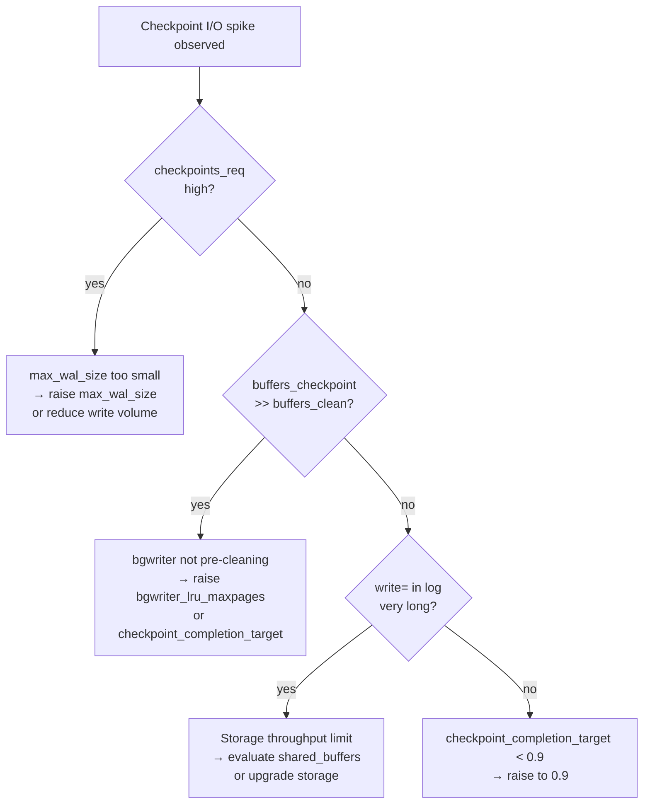

# Diagnosing Checkpoint I/O Spikes

Checkpoint I/O spikes are periodic bursts of high write throughput that correlate with PostgreSQL checkpoint completion. When the checkpointer must flush a large fraction of `shared_buffers` to disk in a short window, the resulting write surge competes with query I/O and can cause query latency to spike for several seconds. The root cause is not the checkpoint itself but how the system distributes the dirty-page write load. If the bgwriter has not spread the work across the inter-checkpoint interval, the checkpointer must write everything at the end. Understanding the interplay between the checkpointer, the bgwriter, and the spread mechanism is the starting point for diagnosis.

## How Checkpoint I/O Is Supposed to Work

PostgreSQL has two processes responsible for writing dirty pages. The **bgwriter** (`BgWriterMain`, bgwriter.c) runs continuously between checkpoints, scanning the buffer pool and proactively flushing recently-dirtied pages that are not likely to be modified again soon. The **checkpointer** (`CheckpointerMain`, checkpointer.c) runs at checkpoint time and must flush every remaining dirty page in `shared_buffers`.

The checkpoint spread mechanism (`CheckpointWriteDelay`, checkpointer.c) limits how fast the checkpointer issues writes by comparing how much wall-clock time has elapsed against `checkpoint_completion_target × checkpoint_timeout`. If the checkpointer is writing faster than that fraction of time permits, it sleeps to let the bgwriter catch up and to avoid bursting too much I/O at once. When `checkpoint_completion_target = 0.9` and `checkpoint_timeout = 5min`, the checkpointer targets completing its writes over 270 seconds — spreading the flush across most of the inter-checkpoint interval rather than at the end.

If the dirty-page count at checkpoint start is large and `checkpoint_completion_target` is low, or if the inter-checkpoint interval is short, the spread mechanism cannot keep pace. The checkpointer must then write aggressively.

## Recognizing a Checkpoint I/O Spike

Three signals identify checkpoint-induced spikes.

**Checkpoint log messages** appear at `log_checkpoints = on` (recommended for production):

```
LOG:  checkpoint starting: time
LOG:  checkpoint complete: wrote 8192 buffers (50%); 0 WAL file(s) added,
      0 removed, 3 recycled; write=25.432 s, sync=0.001 s, total=25.433 s;
      sync files=34, longest=0.001 s, average=0.000 s;
      distance=49152 kB, estimate=49152 kB
```

Key fields in the completion message:

| Field | Meaning |
|---|---|
| `wrote N buffers (P%)` | Buffers the checkpointer wrote; `P%` is of `shared_buffers`. High percentages mean the bgwriter did not pre-clean many pages. |
| `write=N s` | Time spent flushing pages. Long write times indicate I/O contention or saturation. |
| `sync=N s` | Time spent in `fsync()` after writing. Non-trivial sync times indicate the OS was holding dirty data. |
| `distance=N kB` | WAL distance since the prior checkpoint — drives the adaptive `checkpoint_timeout` calculation. |

A `(wrote 80%)` or higher means the bgwriter is not pre-cleaning effectively. The checkpointer is then doing most of the work at checkpoint time.

**`pg_stat_bgwriter`** accumulates lifetime counters:

```sql
SELECT buffers_clean,
       buffers_checkpoint,
       buffers_backend,
       checkpoints_req,
       checkpoints_timed,
       round(checkpoint_write_time / 1000.0, 1)  AS checkpoint_write_s,
       round(checkpoint_sync_time  / 1000.0, 1)  AS checkpoint_sync_s,
       now() - stats_reset                        AS stats_age
FROM pg_stat_bgwriter;
```

`buffers_checkpoint / (buffers_clean + buffers_checkpoint)` is the fraction of writes done by the checkpointer versus the bgwriter. In a well-tuned system the bgwriter handles 30–60% of writes. If the checkpointer handles more than 80%, the bgwriter is not proactively cleaning pages. The entire write load then hits at checkpoint time.

`checkpoints_req` counts checkpoints triggered by WAL filling (`max_wal_size` reached) rather than by the timer. A high `checkpoints_req` count means the system is generating WAL faster than the checkpoint interval allows — a sign that `max_wal_size` is too small or write volume has grown beyond the configured capacity.

**Wait events** during a spike show `IO` wait events including `DataFileWrite` and `DataFileSync` in `pg_stat_activity` for backends that are trying to read pages the checkpointer or bgwriter is currently flushing.

## Root Causes

**`checkpoint_completion_target` too low.** The default before PostgreSQL 14 was 0.5, meaning checkpoints targeted completion in half the checkpoint interval — often causing a noticeable mid-checkpoint burst. Since PostgreSQL 14 the default is 0.9. If a cluster was configured before this change and not updated, or if someone explicitly set a lower value, the checkpointer is concentrating writes at the end rather than spreading them.

**`max_wal_size` too small for the write rate.** When WAL generation outpaces `max_wal_size`, PostgreSQL triggers a requested checkpoint. This happens before the timer fires. These forced checkpoints arrive regardless of the spread mechanism's timing. Back-to-back forced checkpoints produce continuous I/O pressure with no recovery window.

**`shared_buffers` larger than I/O throughput can absorb.** A very large `shared_buffers` paired with a slow storage backend means the volume of dirty data to write is large relative to disk throughput when a checkpoint fires. Even with a high `checkpoint_completion_target`, the write I/O still saturates the storage.

**Full-page writes amplification.** After each checkpoint, the first write to any buffer page generates a full-page image in WAL (controlled by `full_page_writes`, which is on by default). On a write-heavy workload, full-page writes in the WAL can substantially amplify the amount of data written both to WAL and, via WAL archiving, to the archive. This does not directly cause checkpoint spikes but increases the WAL volume that drives `checkpoints_req` events.

## Tuning



**`checkpoint_completion_target`** is the single highest-leverage parameter. Raise it to 0.9 if it is not already there:

```
# postgresql.conf
checkpoint_completion_target = 0.9
```

This change takes effect on reload (`pg_reload_conf()`) and immediately changes how the spread algorithm paces subsequent checkpoints.

**`max_wal_size`** bounds how much WAL can accumulate between checkpoints. Raising it lets checkpoints happen further apart in time (when the write rate is the driver rather than the timer), giving the bgwriter more time to pre-clean pages:

```
# postgresql.conf
max_wal_size = 4GB   # default is 1GB; raise on high-write systems
checkpoint_timeout = 10min
```

Raising `max_wal_size` increases the amount of WAL that recovery must replay after a crash. On NVMe storage with fast recovery, a large `max_wal_size` is rarely a concern; on slower storage or in high-availability setups with tight recovery-time objectives, keep it bounded.

**Bgwriter tuning** controls how aggressively the bgwriter pre-cleans pages. The defaults (`bgwriter_lru_maxpages = 100`, `bgwriter_delay = 200ms`) are conservative. On high-write workloads:

```
# postgresql.conf
bgwriter_lru_maxpages  = 200
bgwriter_delay         = 50ms
bgwriter_lru_multiplier = 4.0
```

`bgwriter_lru_maxpages` is the maximum buffers the bgwriter cleans per round; `bgwriter_lru_multiplier` scales how aggressively it responds to recent write patterns. Raising these allows the bgwriter to absorb more of the dirty-page workload before checkpoint time.

**Monitoring after tuning.** After adjusting parameters, watch the checkpoint log messages for a few hours. `wrote N buffers` should trend downward (the checkpointer is writing fewer pages because the bgwriter pre-cleaned them). `write=N s` should also shorten. `checkpoints_req` dropping to near zero confirms that WAL sizing is now adequate.

## Full-Page Writes and WAL Volume

Every buffer page written for the first time after a checkpoint generates a full-page image (FPI) in WAL, even if only one row changed. On a write-heavy workload with frequent checkpoints, FPIs can represent 40–70% of WAL volume. More frequent checkpoints paradoxically increase total WAL written because more pages trigger FPIs after each new checkpoint.

Raising `checkpoint_timeout` or `max_wal_size` to reduce checkpoint frequency lowers total FPI overhead at the cost of a longer crash recovery time. This trade-off is almost always worth making on systems where recovery time is not the primary constraint.

`wal_compression` (PostgreSQL 9.5+) compresses FPIs inline in WAL, reducing both WAL disk usage and archive size without changing the checkpoint frequency. It adds a small CPU cost at write time but is typically worthwhile on systems where FPI volume is large:

```
# postgresql.conf
wal_compression = on   # or 'lz4'/'zstd' in PG 15+
```

## See Also

- [[subsystems/wal/checkpoint|Checkpoint]] — the full checkpoint mechanism including how dirty pages are identified, ordered, and written
- [[subsystems/storage/buffer-manager|Buffer Manager]] — how shared_buffers tracks dirty pages and how the bgwriter interacts with the buffer pool
- [[subsystems/wal/overview|WAL Overview]] — full-page writes, WAL volume, and the relationship between checkpoint frequency and recovery time
- [[subsystems/observability/pg-stat-io|pg_stat_io]] — per-context I/O statistics (PostgreSQL 16+) that can attribute write volume to checkpoints vs. backends vs. bgwriter
- [[troubleshooting/slow-queries|Slow Queries]] — I/O wait events during checkpoint spikes that show up as elevated query latency

## Related Topics

- [[subsystems/background/bgwriter|Bgwriter]] — the background writer process that pre-cleans dirty pages before checkpoint time, directly controlling how much the checkpointer must write
- [[subsystems/background/autovacuum|Autovacuum]] — generates dirty pages and WAL that contribute to checkpoint pressure on write-heavy workloads
- [[subsystems/observability/wait-events|Wait Events]] — `DataFileWrite` and `DataFileSync` wait events that surface I/O contention caused by checkpoint flushes
- [[subsystems/observability/pg-stat-io|pg_stat_io]] — per-context I/O counters (PostgreSQL 16+) that attribute write volume to checkpoints, bgwriter, and backends separately
- [[subsystems/storage/shared-memory|Shared Memory]] — how `shared_buffers` is structured and why its size determines the volume of dirty data a checkpoint must flush
- [[subsystems/storage/buffer-manager|Buffer Manager]] — dirty-page tracking in the buffer pool and the mechanism by which both bgwriter and checkpointer select pages to write
