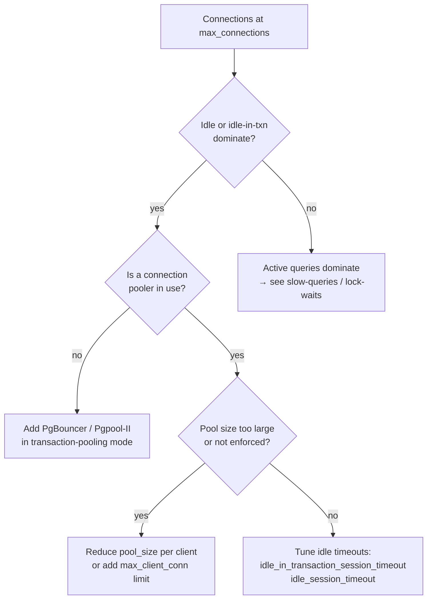

# Diagnosing Connection Exhaustion

When PostgreSQL's connection count reaches `max_connections`, the postmaster immediately rejects every new connection attempt with `SQLSTATE 53300: too many clients already`. The postmaster checks `CountChildren()` against `MaxBackends` in `BackendStartup()` (postmaster.c) before forking. It creates no new backend and runs no authentication; the rejection is instant. Because the cluster shares this limit across every database, a spike in one application can lock out all others, including administrative sessions. Understanding which of the allocated slots are genuinely productive versus idle or stuck is the key to both immediate recovery and permanent prevention.

## Reading the Connection State

`pg_stat_activity` shows every current backend's state and how long it has been in that state. Start with a breakdown:

```sql
SELECT state,
       count(*)                          AS connections,
       max(now() - state_change)         AS max_age,
       max(now() - query_start)          AS max_query_age
FROM pg_stat_activity
WHERE pid <> pg_backend_pid()
GROUP BY state
ORDER BY connections DESC;
```

The `state` column reveals the workload composition:

| State | Meaning |
|---|---|
| `active` | Backend is executing a query right now |
| `idle` | Backend is connected but not in a transaction; waiting for the next client command |
| `idle in transaction` | Backend opened a transaction and sent nothing since the last statement |
| `idle in transaction (aborted)` | As above, but the transaction has already failed |
| `fastpath function call` | Executing a libpq fast-path function |

A healthy cluster has a modest number of `active` backends and a small number of `idle` backends. Large counts of `idle in transaction` or aged `idle` connections indicate the problem is retention — connections not being returned to a pool or the application not committing promptly.

To find available headroom:

```sql
SELECT current_setting('max_connections')::int     AS max_connections,
       current_setting('superuser_reserved_connections')::int
                                                   AS reserved_superuser,
       count(*)                                    AS in_use,
       current_setting('max_connections')::int
           - current_setting('superuser_reserved_connections')::int
           - count(*)                              AS slots_available_to_users
FROM pg_stat_activity
WHERE pid <> pg_backend_pid();
```

`superuser_reserved_connections` (default 3) reserves slots that only superusers can fill. When non-superuser slots run out, regular user connections fail. Administrative connections still succeed. This is why connecting as a superuser for emergency diagnosis still works, even when the postmaster is rejecting applications.

## Common Root Causes

**Idle-in-transaction connections.** An application opens a transaction, executes a statement, and then pauses — waiting on application logic, network I/O, or user input — before committing. The backend holds all acquired locks and its snapshot for the entire duration. In high-concurrency applications this pattern turns connection slots into locks on database resources rather than execution capacity. Find them:

```sql
SELECT pid, usename, application_name,
       now() - state_change          AS idle_duration,
       left(query, 80)               AS last_query
FROM pg_stat_activity
WHERE state IN ('idle in transaction', 'idle in transaction (aborted)')
ORDER BY idle_duration DESC;
```

**Persistent idle connections without a pool.** Applications that open a connection per request and never close it, or connection pools that are too large relative to `max_connections`, leave connections open even when no work is pending. A pool of 50 connections per application node with 10 nodes instantly consumes 500 slots. Finding the distribution by application and user:

```sql
SELECT usename, application_name, state,
       count(*) AS connections
FROM pg_stat_activity
WHERE pid <> pg_backend_pid()
GROUP BY usename, application_name, state
ORDER BY connections DESC;
```

**Long-running queries.** Queries stuck waiting on I/O, a slow plan, or a lock show up as `active` backends. They are legitimate work but may indicate a different underlying problem (see [[troubleshooting/slow-queries]] and [[troubleshooting/lock-waits]]).

**Connection leaks.** Application code that opens connections without a `try/finally` or connection-manager pattern can leak connections that persist until the backend times out or the application server restarts. These show up as `idle` connections with old `backend_start` times and no recent activity.

## Emergency Response

When the cluster is at capacity and the postmaster is rejecting legitimate work, the immediate goal is to free slots without causing more disruption than necessary.

**Terminate idle-in-transaction sessions** — the safest targets, since they are not doing active work:

```sql
SELECT pg_terminate_backend(pid)
FROM pg_stat_activity
WHERE state IN ('idle in transaction', 'idle in transaction (aborted)')
  AND state_change < now() - interval '5 minutes'
  AND pid <> pg_backend_pid();
```

Adjust the age threshold based on expected transaction duration for the application. Terminating these backends rolls back their open transactions cleanly.

**Terminate long-idle connections** that are not in a transaction:

```sql
SELECT pg_terminate_backend(pid)
FROM pg_stat_activity
WHERE state = 'idle'
  AND state_change < now() - interval '30 minutes'
  AND pid <> pg_backend_pid();
```

These are safe to terminate since they hold no transaction state.

**If the cluster is entirely locked out** and even superuser connections are failing, the `superuser_reserved_connections` slots must still have room. If they are exhausted, you must connect from the PostgreSQL server host using a Unix socket (which bypasses the connection limit check for superusers on many builds) or restart with a temporarily higher `max_connections` via `postgresql.conf` and `pg_ctl reload` (note: changes to `max_connections` require a restart, not just a reload).

## Systemic Fixes



**Connection pooling.** The most durable fix for connection exhaustion is introducing a connection pool such as PgBouncer in transaction-pooling mode. A pool multiplexes many client connections over a smaller number of server connections, converting the client-visible connection count from a resource-per-connection to a resource-per-active-query model. This allows applications with thousands of open client connections to use tens of server connections instead.

**Idle session timeouts.** Two GUCs terminate connections that have been idle for too long without pooling infrastructure:

```sql
-- Terminate sessions idle in a transaction
ALTER SYSTEM SET idle_in_transaction_session_timeout = '5min';
-- Terminate fully idle sessions (PostgreSQL 14+)
ALTER SYSTEM SET idle_session_timeout = '30min';
SELECT pg_reload_conf();
```

`idle_in_transaction_session_timeout` is particularly important — it bounds the damage from applications that open transactions and then hang. `idle_session_timeout` reclaims slots from application connections that stopped sending commands without closing cleanly.

**Raising `max_connections`.** Increasing `max_connections` can buy time but is not a substitute for the above approaches. Each backend consumes roughly 5–10 MB of private memory plus a `PGPROC` slot in the shared process array. Raising from 200 to 500 connections increases memory pressure by 1.5–3 GB across all backends. The lock table's `max_locks_per_transaction × max_connections` allocation grows correspondingly. Above a few hundred connections, connection pooling consistently outperforms raising `max_connections` on both memory and CPU grounds.

**Statement timeout as a backstop.** Setting a `statement_timeout` for application roles prevents individual long-running queries from holding connections open indefinitely while they are stuck:

```sql
ALTER ROLE app_user SET statement_timeout = '30s';
```

This does not help with idle-in-transaction sessions but does bound the lifetime of runaway queries that monopolise connection slots.

## Prevention

Monitor the connection usage ratio in your alerting system. Alert when connections exceed 80% of `max_connections - superuser_reserved_connections`:

```sql
SELECT round(100.0 * count(*) /
    (current_setting('max_connections')::int
     - current_setting('superuser_reserved_connections')::int), 1) AS pct_used
FROM pg_stat_activity
WHERE pid <> pg_backend_pid();
```

Add `idle_in_transaction_session_timeout` to every database or at the system level — its default is zero (disabled), which allows transactions to remain open indefinitely. A value of one to five minutes is appropriate for most OLTP workloads. Review the application's connection lifecycle: the application should hold connections only during active work and return them to the pool or close them immediately after each unit of work completes.

## See Also

- [[architecture/connection-pooling-impact|Connection Pooling Impact]] — how pooling changes the relationship between client connections and backend processes
- [[architecture/process-architecture|Process Architecture]] — how the postmaster forks backends and enforces `max_connections`
- [[subsystems/locking/overview|Lock Manager]] — how idle-in-transaction connections hold locks and block other work
- [[troubleshooting/lock-waits|Lock Waits]] — diagnosing the downstream effect of long-held connections on other queries
- [[troubleshooting/bloat|Bloat]] — idle-in-transaction sessions pin the oldest snapshot and prevent VACUUM from removing dead tuples

## Related Topics

- [[subsystems/observability/pg-stat-activity|pg_stat_activity]] — the primary view for inspecting connection states, idle durations, and current queries
- [[architecture/process-architecture|Process Architecture]] — how the postmaster forks one backend per connection and enforces MaxBackends
- [[subsystems/transactions/snapshot|Snapshots]] — why idle-in-transaction sessions hold a snapshot open and block tuple removal
- [[subsystems/locking/overview|Lock Manager]] — how connections in the idle-in-transaction state retain all acquired locks
- [[subsystems/observability/wait-events|Wait Events]] — identifying what active backends are blocked on when connections are saturated
- [[subsystems/transactions/isolation-levels|Isolation Levels]] — transaction semantics that determine when snapshots and locks are acquired and released
