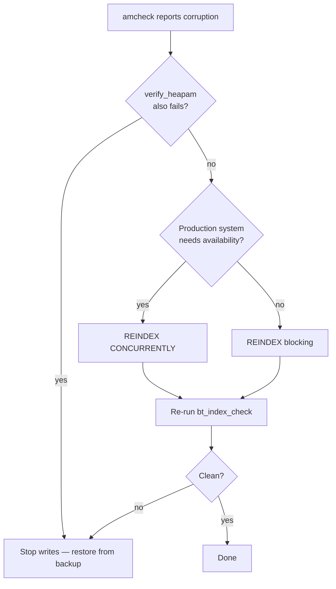

Index corruption is one of the more serious failure modes in PostgreSQL: a corrupted index can produce silently wrong query results, cause crashes mid-query, or block [[subsystems/background/autovacuum|autovacuum]] from completing. Unlike a missing index, the planner may still choose a structurally invalid one, and the query may return subtly incorrect data for months before anyone notices. Detecting corruption early and recovering cleanly requires knowing which tools to reach for and in what order.

## How Corruption Manifests

Corruption rarely announces itself with a clean error. The symptoms depend on which part of the index is damaged:

- **Query errors** — `ERROR: invalid page in block N of relation base/...` or `ERROR: index N is not a btree` when PostgreSQL reads a page whose header fails a sanity check.
- **Wrong results** — a corrupted internal page can cause a scan to follow a wrong child pointer, silently skipping rows or returning rows from the wrong range. This is the most dangerous case because PostgreSQL raises no error.
- **`indisvalid = false`** — a `REINDEX CONCURRENTLY` that was interrupted or an index created with `CREATE INDEX CONCURRENTLY` that failed leaves behind an invalid index entry visible in `pg_index`.
- **amcheck failures** — corruption violates structural invariants that PostgreSQL normally trusts implicitly: a page's high key is less than a key on the page, a downlink does not match the child's low fence key, or the heap has tuples that no index entry points to.

The earlier you catch corruption, the more options you have. Once queries start producing wrong results, data may have already propagated to application caches or downstream systems.

## amcheck: Structural Verification

The `amcheck` extension (part of the standard distribution, found in `contrib/amcheck`) provides functions that walk index and heap structures and assert invariants that must hold for the data to be correct. Load it once per database:

```sql
CREATE EXTENSION IF NOT EXISTS amcheck;
```

### bt_index_check — Fast Per-Page Verification

`bt_index_check` acquires an `AccessShareLock` — the same lock a normal read takes — and walks every leaf page, verifying that keys on each page are in sorted order and that each page respects its high key. With `heapallindexed => true` it also samples the heap to confirm that every index entry points to a live heap tuple, catching the case where a leaf entry references a deleted or non-existent TID. This is the right check to run routinely: it is online, non-blocking, and fast enough to schedule as a recurring job.

```sql
-- Fast per-index check
SELECT bt_index_check('my_index');

-- With heap cross-check (catches missing index entries)
SELECT bt_index_check('my_index', heapallindexed => true);
```

Internally, `bt_index_check` calls `bt_index_check_internal` in `verify_nbtree.c` with `parentcheck = false`, meaning it verifies leaf-level ordering without attempting to follow parent-child relationships across pages.

### bt_index_parent_check — Full Structural Verification

`bt_index_parent_check` acquires a stronger `ShareLock` and additionally verifies the parent-child relationship across every level of the [[subsystems/indexes/btree|B-tree]]: it checks that every downlink in an internal page matches the low fence key of its child, and that the sibling chain is consistent. With `rootdescend => true` it also searches for each leaf key by descending from the root, confirming that the tree's routing structure would find every key it contains. This is the thorough check to run when you suspect corruption or after a crash — it catches structural damage that `bt_index_check` cannot see, but it blocks concurrent writers for the duration.

```sql
-- Full structural check (requires ShareLock — blocks writes)
SELECT bt_index_parent_check('my_index', heapallindexed => true);

-- With root descent cross-check (O(N log N) but most thorough)
SELECT bt_index_parent_check('my_index', heapallindexed => true, rootdescend => true);
```

### verify_heapam — Heap-Level Integrity

`verify_heapam` checks the heap relation directly rather than any index. It validates tuple headers, checks that `xmin`/`xmax` values are consistent with [[subsystems/transactions/mvcc|MVCC]] visibility rules, and verifies that `ctid` chains for updated rows form valid sequences. Use it when `bt_index_check(heapallindexed => true)` reports problems but it is unclear whether the index or the heap is the source of truth.

```sql
SELECT blkno, offnum, attnum, msg
FROM verify_heapam('my_table');
```

Unlike the btree check functions, `verify_heapam` returns a set of rows rather than raising an error — one row per problem found. An empty result set means the heap passed all checks.

## Diagnosing the Scope

Before attempting recovery, determine which indexes the corruption affects.

**Find invalid indexes** — these are indexes where a create or rebuild operation never finished successfully:

```sql
SELECT n.nspname AS schema, t.relname AS table, c.relname AS index
FROM pg_index i
JOIN pg_class c ON c.oid = i.indexrelid
JOIN pg_class t ON t.oid = i.indrelid
JOIN pg_namespace n ON n.oid = c.relnamespace
WHERE NOT i.indisvalid;
```

**Run amcheck across all btree indexes** — this block iterates every valid btree index and calls `bt_index_check` on each:

```sql
DO $$
DECLARE
  r RECORD;
BEGIN
  FOR r IN
    SELECT n.nspname, c.relname AS idxname
    FROM pg_index i
    JOIN pg_class c ON c.oid = i.indexrelid
    JOIN pg_class t ON t.oid = i.indrelid
    JOIN pg_namespace n ON n.oid = c.relnamespace
    JOIN pg_am a ON a.oid = c.relam
    WHERE a.amname = 'btree'
      AND i.indisvalid
      AND c.relpersistence = 'p'
  LOOP
    RAISE NOTICE 'Checking %.%', r.nspname, r.idxname;
    PERFORM bt_index_check(
      format('%I.%I', r.nspname, r.idxname)::regclass
    );
  END LOOP;
END;
$$;
```

Replace `bt_index_check` with `bt_index_parent_check` during a maintenance window for the full structural check.

## Recovery Options



### REINDEX CONCURRENTLY — Preferred

`REINDEX CONCURRENTLY` rebuilds the index in the background without holding an exclusive lock on the table. It builds a new index alongside the old one, waits for all transactions that could see the old index to finish, then swaps them. Writers can continue throughout. The cost is roughly 2–3x the I/O of a regular reindex because it requires two full heap scans.

```sql
REINDEX INDEX CONCURRENTLY my_index;
REINDEX TABLE CONCURRENTLY my_table;   -- all indexes on the table
REINDEX DATABASE CONCURRENTLY mydb;    -- all indexes in the database
```

Internally, `ReindexRelationConcurrently` in `src/backend/commands/indexcmds.c` follows the same multi-phase protocol as `CREATE INDEX CONCURRENTLY`: it creates a new invalid index, builds it while holding only `ShareUpdateExclusiveLock`, and promotes it only after all prior snapshots have drained.

### REINDEX — Blocking but Faster

`REINDEX` acquires an `AccessExclusiveLock`, drops and rebuilds the index in a single pass, and releases the lock when done. It is faster than the concurrent form but blocks all reads and writes for the duration. Use it during a scheduled maintenance window, or for smaller indexes where the lock duration is acceptable.

```sql
REINDEX INDEX my_index;
REINDEX TABLE my_table;
REINDEX DATABASE mydb;   -- must run outside a transaction block
```

After any reindex, run `bt_index_check` again to confirm the rebuilt index passes verification.

## zero_damaged_pages: When Corruption Blocks Progress

```sql
-- Set only for the duration of the specific operation
SET zero_damaged_pages = on;
VACUUM my_table;
RESET zero_damaged_pages;
```

`zero_damaged_pages` changes what happens when PostgreSQL reads a page whose header fails the checksum or sanity check. Instead of raising an error, PostgreSQL zeroes out that page and continues. This can unblock a [[code-paths/vacuum|VACUUM]] or query that is stuck on a damaged data page and would otherwise make no progress.

The data loss is real and irreversible: any rows that lived on the zeroed page are permanently gone. Use this only when:

1. The corrupted page is in the heap (not just the index — reindex handles index-only corruption without data loss).
2. You have identified what data lived on that page from a backup or replica, or you have determined the loss is acceptable.
3. The goal is to unblock other operations, not to recover the data on that page.

Never set `zero_damaged_pages = on` in `postgresql.conf`. Set it only in a session, for the specific operation that needs it, then reset it immediately.

## When to Stop and Restore from Backup

Index corruption is sometimes a symptom of a deeper problem. Stop attempting in-place repair and restore from backup when:

- `verify_heapam` reports errors on the heap itself — you can rebuild a corrupted index, but you cannot recover corrupted heap data this way.
- Page checksum failures span multiple pages or multiple relations — this indicates hardware-level storage errors. Any page on the same disk may then be unreliable.
- amcheck failures recur after a successful reindex — this points to memory corruption, a filesystem bug, or a failing storage controller rather than a one-time event.
- You needed `zero_damaged_pages` to access the table, and rows are already lost.

In these cases, continued operation is actively risky. Promote a physical replica if one is available (it may have received valid data via [[subsystems/wal/overview|WAL]] before the corruption occurred), or restore the latest backup and replay [[subsystems/wal/archiving|WAL archives]] to minimize data loss.

## Prevention

**Enable data checksums** — when you initialize PostgreSQL with `initdb --data-checksums`, every page write includes a checksum. Any subsequent read that returns different bytes immediately raises an error rather than silently serving corrupted data. This is the single most effective corruption-detection mechanism available. On an existing cluster, `pg_checksums --enable` can activate them offline.

**Monitor storage reliability** — index corruption almost always originates in the storage layer: failing drives, flaky RAID controllers, or filesystem bugs. Monitor SMART data, controller logs, and filesystem error counters. Checksum failures that cluster on specific blocks or devices point to hardware that needs replacement.

**Test backup restore paths regularly** — knowing that corruption exists is only useful if you have a clean backup to restore from. Regularly restore and verify backups in a separate environment. An untested backup is not a backup.

**Schedule routine amcheck jobs** — run `bt_index_check` on all btree indexes weekly or nightly. This turns silent corruption into a detectable alert before it causes wrong query results or user-visible errors.

## Related Topics

- [[subsystems/indexes/btree|B-tree Index Internals]] — the structural invariants that amcheck verifies
- [[subsystems/indexes/index-am|Index Access Method]] — how PostgreSQL interfaces with index implementations
- [[code-paths/vacuum|VACUUM]] — blocked by heap corruption; interacts with index cleanup
- [[subsystems/background/autovacuum|Autovacuum]] — can trigger index scans that expose corruption
- [[subsystems/wal/archiving|WAL Archiving]] — required for point-in-time recovery after severe corruption
- [[subsystems/storage/buffer-manager|Buffer Manager]] — manages page reads where checksum failures surface
- [[troubleshooting/bloat|Bloat]] — dead tuple accumulation that autovacuum failures can cause
- [[troubleshooting/autovacuum-not-keeping-up|Autovacuum Not Keeping Up]] — a related symptom when corruption blocks vacuum
