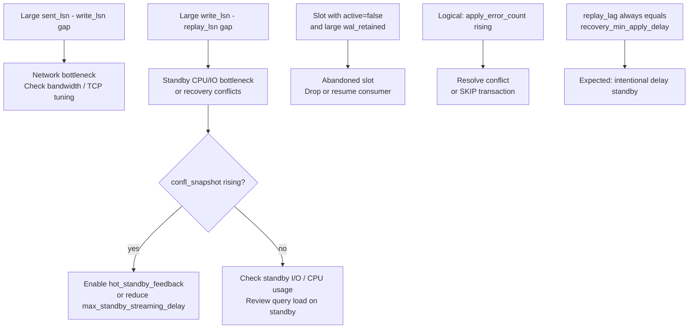

# Troubleshooting Replication Lag

Replication lag is not a single thing. WAL must travel through several stages: written by the primary, sent over the network, received and flushed on the standby, and replayed into data pages. A bottleneck at any stage produces a different symptom and a different fix. The starting point for any investigation is determining which stage is lagging and by how much.

## Measuring lag from the primary

`pg_stat_replication` on the primary exposes one row per connected standby. Four LSN columns and three time-based lag columns together locate a bottleneck in the pipeline:

```sql
SELECT
    application_name,
    state,
    sync_state,
    pg_size_pretty(pg_current_wal_lsn() - sent_lsn)   AS unsent,
    pg_size_pretty(pg_current_wal_lsn() - write_lsn)  AS unwritten,
    pg_size_pretty(pg_current_wal_lsn() - flush_lsn)  AS unflushed,
    pg_size_pretty(pg_current_wal_lsn() - replay_lsn) AS unreplayed,
    write_lag,
    flush_lag,
    replay_lag
FROM pg_stat_replication
ORDER BY pg_current_wal_lsn() - replay_lsn DESC NULLS LAST;
```

The columns cover distinct pipeline stages:

| Stage | Byte column | Time column | Meaning |
|---|---|---|---|
| Network send | `sent_lsn` | — | WAL transmitted to the standby but not yet acknowledged |
| OS write | `write_lsn` | `write_lag` | Standby has written to its kernel buffer; not yet durable |
| Disk flush | `flush_lsn` | `flush_lag` | Standby has fsync'd to disk; durable but not yet applied |
| Replay | `replay_lsn` | `replay_lag` | Standby startup process has applied changes; visible to queries |

The time-based columns (`write_lag`, `flush_lag`, `replay_lag`) measure elapsed time from when the primary flushed the WAL to when the standby acknowledged each stage. The walsender's `LagTracker` ring buffer (`walsender.c`) computes them: each primary flush records a `(lsn, timestamp)` sample; when a standby reply arrives, `LagTrackerRead()` finds the matching sample and subtracts timestamps. NULL in these columns means the standby has not yet sent a reply for that LSN, or the primary and standby clocks are out of sync (a negative elapsed time is suppressed).

If `pg_current_wal_lsn() - sent_lsn` is large but `sent_lsn - write_lsn` is small, the primary is not sending fast enough — check if the walsender process is CPU-bound. If `sent_lsn - write_lsn` is large, the bottleneck is network bandwidth. If `write_lsn - replay_lsn` is large but `write_lsn - flush_lsn` is small, the standby is receiving WAL but the startup process is falling behind on replay — a CPU or I/O issue on the standby.

## Measuring lag from the standby

On the standby itself, two functions complement the primary-side view:

```sql
-- How far behind the last applied transaction was committed on the primary
SELECT now() - pg_last_xact_replay_timestamp() AS replay_lag;

-- How far the standby has received vs replayed
SELECT
    pg_last_wal_receive_lsn() AS received,
    pg_last_wal_replay_lsn()  AS replayed,
    pg_last_wal_receive_lsn() - pg_last_wal_replay_lsn() AS apply_backlog_bytes;
```

`pg_last_xact_replay_timestamp()` returns the commit timestamp embedded in the most recently replayed commit WAL record (`xlogfuncs.c`, `GetLatestXTime()`). The difference `now() - pg_last_xact_replay_timestamp()` is the lag a read query experiences: changes committed on the primary more recently than this interval are invisible on the standby. This metric is intuitive for alerting, but it can spike briefly even when replication is healthy. The standby updates the timestamp only when it replays a commit record.

`pg_last_wal_receive_lsn()` advances when the walreceiver flushes received WAL to disk (`WalRcv->flushedUpto`). `pg_last_wal_replay_lsn()` advances when the startup process applies a record. The gap between them is apply backlog: WAL that has arrived but not yet been replayed.

## Root causes of replay lag

### Recovery conflicts from standby queries

Hot standby allows read-only queries to run concurrently with WAL replay. When the startup process must apply a WAL record that conflicts with a running query — typically a heap cleanup that would invalidate a query's snapshot — replay pauses. Replay resumes when the query completes or is cancelled. `max_standby_streaming_delay` (default 30 s) bounds the maximum pause. When the deadline passes, PostgreSQL cancels the conflicting query and replay resumes.

Frequent cancellations and associated lag spikes appear in `pg_stat_database_conflicts.confl_snapshot` on the standby. The standard mitigation is `hot_standby_feedback = on`: the walreceiver periodically sends the standby's oldest active `xmin` back to the primary. This prevents vacuum from removing row versions that standby queries might still need. The trade-off is that long-running standby queries can delay dead-tuple cleanup on the primary, causing table bloat.

For workloads where the primary does heavy vacuuming and the standby runs long queries, the combination of `hot_standby_feedback = on` with a physical replication slot (which persists the `xmin` across walreceiver reconnects) is more robust than either alone. See [[subsystems/replication/hot-standby]] for the full conflict resolution machinery.

### CPU and I/O bottleneck on the standby

The startup process applies WAL records sequentially. If the standby's disk is slower than the primary's write rate, or the standby CPU is saturated by WAL replay alongside concurrent queries, `write_lsn` will stay close to `sent_lsn`. Meanwhile, `replay_lsn` falls further behind. The grow-then-shrink pattern of `write_lsn - replay_lsn` during off-peak hours confirms this: the standby catches up when load drops.

Mitigations are operational: reduce standby query load, ensure the standby uses equivalent or faster storage than the primary, or direct analytical traffic to a read replica that does not need to stay tightly synchronized.

### Large transactions

A standby cannot begin applying a transaction until it has received the commit WAL record. For a large transaction, the primary writes change records continuously throughout execution. But the standby's startup process cannot replay any of them until the commit record arrives. When it does, the standby applies the entire transaction's WAL at once. This produces a sudden spike in `replay_lsn` advancement, along with a transient lag spike that resolves quickly.

This is expected behavior, not a malfunction. It becomes a problem only when large transactions are frequent enough that the standby never fully catches up between spikes. Monitoring `pg_current_wal_lsn() - replay_lsn` over time reveals this pattern: erratic large spikes rather than steady growth.

### Vacuum conflicts and the standby's own cleanup

VACUUM on the standby — which runs to clean standby-specific dead tuples and maintain the [[subsystems/storage/visibility-map|visibility map]] — can also generate recovery conflicts. The standby's [[subsystems/background/autovacuum|autovacuum]] operates concurrently with WAL replay; if it pins a buffer that the startup process needs for a cleanup record, replay blocks. This appears as `confl_bufferpin` in `pg_stat_database_conflicts`. Reducing autovacuum aggressiveness on the standby or relying on `hot_standby_feedback` to prevent the conflict from arising on the primary are the practical options.

## Replication slot lag and WAL accumulation

A physical or logical replication slot pins WAL at its `restart_lsn`, preventing segment recycling even when the consumer is disconnected. An abandoned slot accumulates WAL indefinitely. This can exhaust disk space and halt the server.

Detect this with:

```sql
SELECT
    slot_name,
    slot_type,
    active,
    pg_size_pretty(pg_current_wal_lsn() - restart_lsn) AS wal_retained,
    wal_status,
    pg_size_pretty(safe_wal_size)                       AS safe_before_invalidation,
    confirmed_flush_lsn                                 -- logical slots only
FROM pg_replication_slots
WHERE restart_lsn IS NOT NULL
ORDER BY pg_current_wal_lsn() - restart_lsn DESC NULLS LAST;
```

For a logical slot, `confirmed_flush_lsn` tracks how far the subscriber has durably acknowledged receipt. `restart_lsn` may be further back, because the decoder still needs older WAL for catalog reconstruction. The gap between them is the minimum WAL the primary must retain for this slot regardless of `confirmed_flush_lsn`.

`wal_status` summarizes risk:

| wal_status | Meaning |
|---|---|
| `reserved` | Within `wal_keep_size`; normal |
| `extended` | Retaining more WAL than `wal_keep_size` due to this slot |
| `unreserved` | Exceeds `max_slot_wal_keep_size`; will be invalidated at next checkpoint |
| `lost` | Already invalidated; `restart_lsn` is null; slot must be dropped |

An inactive slot with `wal_status = extended` and a shrinking `safe_wal_size` needs immediate attention. The correct response to an abandoned slot depends on whether the consumer can resume. If the consumer is permanently gone, drop the slot with `SELECT pg_drop_replication_slot('name')`. If it must resume, the consumer needs a fresh base backup before it can reconnect. This is because the WAL it needs may already be partially or fully gone. `max_slot_wal_keep_size` limits maximum WAL accumulation. But if a slot falls too far behind, PostgreSQL invalidates it automatically. See [[subsystems/replication/slots]] for slot lifecycle details.

## Logical replication lag

Logical replication introduces its own lag profile. `pg_stat_subscription` on the subscriber shows one row per apply worker:

```sql
SELECT
    subname,
    received_lsn,
    last_msg_send_time,
    last_msg_receipt_time,
    latest_end_lsn,
    latest_end_time,
    now() - last_msg_receipt_time AS silence
FROM pg_stat_subscription
JOIN pg_subscription USING (subid);
```

The gap `latest_end_lsn - received_lsn` (or `pg_current_wal_lsn() - received_lsn` checked on the publisher against the slot) is the raw byte lag. The more diagnostic metric is `now() - latest_end_time`: how long ago the publisher's WAL end LSN was last updated. If this grows while the worker is alive, the subscriber is falling behind in processing.

Common causes of logical replication lag:

**Large transactions.** Unlike physical replication, the logical apply worker replays changes row by row from the decoded change stream. A large transaction that inserted millions of rows on the publisher will arrive as millions of individual row apply operations on the subscriber. The subscriber cannot begin applying until the publisher's logical decoder has decoded and sent the complete transaction (unless the subscription enables streaming mode, which allows partial application before commit). This produces the same spike pattern as physical replication. It is typically worse, though, because row-by-row application is much slower than WAL replay.

**Apply conflicts.** A unique-constraint violation, a missing row on delete, or a row that already exists on insert causes the apply worker to error out. The worker will restart and retry, backing off with an increasing delay. Conflicts appear in `pg_stat_subscription_stats.apply_error_count`. Resolving them requires either fixing the data divergence or using `ALTER SUBSCRIPTION ... SKIP` to skip the offending transaction (PG 15+).

**Worker crashes.** An apply worker that crashes repeatedly will appear to make no progress even though `received_lsn` may advance sporadically. Check the PostgreSQL log on the subscriber for `logical replication worker` error messages. A crashed leader worker stops all table sync workers for the subscription.

## Network as a bottleneck

Network bandwidth becomes a bottleneck when `sent_lsn` is close to the primary's current WAL position but `write_lsn` lags significantly behind `sent_lsn`. This means the primary is sending WAL faster than the standby can receive it, or TCP is limiting throughput due to congestion, buffer tuning, or a physically slow link.

Check this with:

```sql
-- Primary: bytes in flight (sent but not yet written on standby)
SELECT
    application_name,
    pg_size_pretty(sent_lsn - write_lsn) AS in_flight_bytes
FROM pg_stat_replication
WHERE sent_lsn > write_lsn;
```

Persistent and growing `in_flight_bytes` alongside a short `write_lag` confirms network saturation. Tuning TCP buffer sizes (`net.core.rmem_max`, `net.core.wmem_max`) or reducing replication traffic by batching large operations can help. On WAL-heavy workloads, `wal_compression = on` reduces the bytes shipped at the cost of CPU on the primary.

## Mitigation options

**`hot_standby_feedback = on`** prevents the most common class of standby query cancellations by informing the primary of the standby's active `xmin`. Combine it with a physical slot to persist the `xmin` across reconnections. Avoid it on standbys with long-running analytical queries against large tables, as it can cause significant bloat on the primary.

**`max_standby_streaming_delay`** controls how long the startup process waits for a conflicting query before cancelling it. The default is 30 s. Setting it to `-1` waits indefinitely, which can allow the standby to fall arbitrarily far behind. Setting it to `0` cancels conflicting queries immediately. Tune based on the acceptable trade-off between query reliability and replication currency.

**`recovery_min_apply_delay`** intentionally holds the standby behind the primary by a fixed interval, measured from the commit timestamp embedded in each WAL commit record (`xlogrecovery.c`, `recoveryApplyDelay()`). This is useful as a delayed standby for protection against accidental data loss: if someone drops data on the primary, there is a window to promote the standby before the standby replays the DROP. It has no effect on `write_lsn` or `flush_lsn` — the standby still receives and flushes WAL promptly. Only `replay_lsn` stays behind, by design. This means a standby with `recovery_min_apply_delay` set will always show a large `replay_lag` equal to the configured delay, which is expected and not a sign of a problem.



## Related Topics

- [[subsystems/replication/logical]] — logical replication architecture and the decoding pipeline that produces the change stream consumed by subscribers
- [[subsystems/replication/logical-conflicts]] — types of apply conflicts that stall logical replication workers and how to resolve them
- [[subsystems/background/autovacuum]] — autovacuum on the standby competes with WAL replay for buffer pins, contributing to confl_bufferpin conflicts
- [[subsystems/wal/checkpoint]] — checkpoint frequency and WAL segment recycling interact with slot `restart_lsn` retention and disk usage
- [[subsystems/storage/visibility-map]] — the visibility map on the standby must be maintained by vacuum, which can conflict with concurrent replay
- [[subsystems/replication/parallel-apply]] — parallel apply workers for logical replication reduce per-row apply overhead that drives logical lag on large transactions
- [[troubleshooting/bloat]] — hot_standby_feedback and long-lived standby queries can cause primary-side table bloat by delaying dead-tuple cleanup
- [[subsystems/replication/streaming|Streaming Replication]] — walsender/walreceiver architecture, LagTracker, and LSN pipeline stages
- [[subsystems/replication/slots|Replication Slots]] — slot persistence, WAL pinning, and invalidation
- [[subsystems/replication/hot-standby|Hot Standby and Recovery Conflicts]] — recovery conflict types and resolution
- [[subsystems/replication/synchronous-replication|Synchronous Replication]] — how synchronous commit uses lag columns to gate commits
- [[subsystems/observability/pg-stat-replication|pg_stat_replication]] — full reference for `pg_stat_replication` and `pg_stat_wal_receiver` columns
