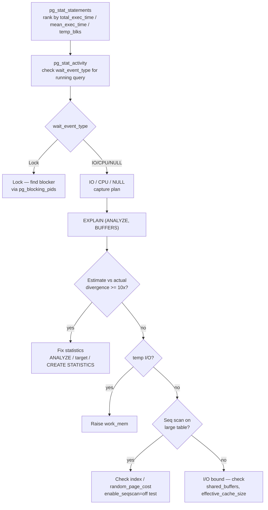

# Diagnosing Slow Queries

A slow query investigation has a predictable structure: first find which queries are slow, then capture their execution plans, then trace the plan back to a root cause. Skipping steps — jumping to `work_mem` tuning or adding indexes without reading the plan — wastes time and often fixes the wrong thing. This page walks through each phase with the queries and signals to look for.

## Finding slow queries

### Historical workload: pg_stat_statements

[[subsystems/observability/pg-stat-statements]] accumulates statistics per normalized query shape. It is the right starting point for any investigation that is not happening live.

Three rankings cover different failure modes.

**Total execution time** reveals the true load drivers — queries that consume the most resources even if each call is fast:

```sql
SELECT queryid, calls,
       round(total_exec_time::numeric, 2)  AS total_ms,
       round(mean_exec_time::numeric, 2)   AS mean_ms,
       round((total_exec_time / sum(total_exec_time) OVER ()) * 100, 1) AS pct_load,
       left(query, 100) AS query_snippet
FROM pg_stat_statements
ORDER BY total_exec_time DESC LIMIT 20;
```

**Mean execution time** finds latency outliers — slow per call regardless of frequency.

**Temp I/O** surfaces spilling sorts and hash joins. Any `temp_blks_written > 0` is a signal worth following:

```sql
SELECT queryid, calls, temp_blks_written,
       round(mean_exec_time::numeric, 2) AS mean_ms,
       left(query, 100) AS query_snippet
FROM pg_stat_statements
WHERE temp_blks_written > 0
ORDER BY temp_blks_written DESC LIMIT 20;
```

High `stddev_exec_time / mean_exec_time` above 1.0 indicates a query that sometimes hits `shared_buffers` and sometimes triggers I/O — the working set is larger than the cache.

### Currently running queries: pg_stat_activity

For a query that is slow right now, [[subsystems/observability/pg-stat-activity]] shows what each backend is doing and why it is waiting.

```sql
SELECT pid,
       now() - query_start   AS running_time,
       wait_event_type,
       wait_event,
       left(query, 120)      AS query_snippet
FROM pg_stat_activity
WHERE state = 'active'
  AND query_start < now() - interval '5 seconds'
ORDER BY running_time DESC;
```

The `wait_event_type` column distinguishes root causes without reading a plan: `IO` means disk reads (cold data or missing index); `Lock` means another session holds a lock (find the holder with `pg_blocking_pids(pid)` before investigating the query plan); `LWLock` means internal contention (WAL insert, buffer eviction — usually not a plan problem); NULL means the backend is running on CPU.

### Capturing plans in production: auto_explain

[[subsystems/observability/auto-explain]] logs `EXPLAIN (ANALYZE)` output for queries that exceed a threshold, without requiring manual reproduction. Load it cluster-wide:

```ini
shared_preload_libraries = 'pg_stat_statements, auto_explain'
auto_explain.log_min_duration = 2000
auto_explain.log_analyze = on
auto_explain.log_buffers = on
auto_explain.log_format = 'json'
```

With `log_format = 'json'`, the output includes a `"Query Identifier"` matching `pg_stat_statements.queryid`, linking a specific bad plan to its aggregate statistics. If `log_analyze` overhead is a concern, `log_timing = off` retains row counts and buffer stats without per-node clock calls.

## Reading EXPLAIN ANALYZE output

Once you have a slow query, run it in a test session:

```sql
EXPLAIN (ANALYZE, BUFFERS, FORMAT TEXT) <query>;
```

The full reference for interpreting plan output is in [[subsystems/planner/reading-explain]]. The key signals for a troubleshooting workflow are:

### Estimated vs actual rows: the primary diagnostic

At every plan node, compare the planner's `rows=N` estimate against `actual rows=M`. A divergence of 10× or more — especially on a scan or join input — is almost always the root cause of a bad plan choice.

```
Seq Scan on orders  (cost=0..12400 rows=10 width=32)
                    (actual time=0.1..85.2 rows=94300 loops=1)
```

The planner thought 10 rows; 94,300 arrived. The planner made every downstream decision — join method, join order, memory sizing — with wrong inputs. The fix is almost always in statistics; see [Stale statistics] below.

### Actual time and loops

`actual time` is per loop. For inner nodes of a nested loop, multiply by `loops` to get total time:

```
Index Scan using idx_items_order on line_items
    (actual time=0.040..0.085 loops=94300)
```

Total time: `0.085 × 94300 ≈ 8015 ms`, not 0.085 ms. Always compute `actual_time × loops` for inner nodes before concluding a node is cheap.

### Buffer counters

`Buffers: shared hit=N read=M` shows cache efficiency. High `shared read` means the data is not in `shared_buffers`. `temp read=N written=N` means the node spilled to disk — a sort or hash join ran out of `work_mem`.

```
Hash  (actual time=2341..2341 rows=500000 loops=1)
  Buckets: 65536  Batches: 8  Memory Usage: 4096kB
  Buffers: shared hit=1204 read=3892, temp read=12840 written=12840
```

`Batches: 8` plus the temp I/O confirm the hash join spilled. `work_mem` is the lever.

### Sort method

A sort node reports the method it used:

- `Sort Method: quicksort` — fit in memory.
- `Sort Method: external merge  Disk: 82432kB` — did not fit; spilled.
- `Sort Method: incremental sort` — partially ordered input; faster than full sort.

`external merge` means `work_mem` was too low for the input volume.

## Common bad-plan patterns and fixes

### Sequential scan on a large table

A seq scan on a large table is a visible signal, but the cause determines the fix. There are three distinct cases.

**No usable index exists.** The scan is the only option. Create an index on the filter column.

**An index exists but cannot be used.** A function wraps the column (`WHERE lower(email) = ...`), there is a type mismatch between the column and the literal, or an implicit cast applies per-row. See [[subsystems/planner/anti-patterns]] for these patterns. Setting `enable_seqscan = off` and re-running `EXPLAIN` will show whether any compatible index exists.

**An index exists and could be used, but the planner chose the scan.** The filter may not be selective enough to justify random I/O at the configured `random_page_cost`. This is often correct, but wrong when `random_page_cost` is 4.0 (spinning-disk default) on SSD storage (use 1.1–1.5), or when statistics are stale. Distinguish a planner preference from an incompatibility by running `EXPLAIN` with `enable_seqscan = off`: if the index plan is faster, recalibrate `random_page_cost` or run `ANALYZE`.

### Nested loop with large outer side

A nested loop is efficient when the outer side is small or the inner side has an indexed join column. When the planner underestimates outer cardinality and chooses a nested loop despite a large outer side, the inner node executes once per outer row. An inner node showing `actual time=0.08ms loops=94300` costs `0.08 × 94300 ≈ 7544ms` total — not 0.08 ms. Fix the cardinality estimate (stale stats, or extended statistics for correlated filters) so the planner chooses a hash join.

To confirm the plan is wrong rather than the statistics being bad, temporarily force a different strategy:

```sql
SET enable_nestloop = off;
EXPLAIN (ANALYZE, BUFFERS) <query>;
```

If the hash join plan is significantly faster, the nested loop was a mistake driven by bad estimates. Fix the estimates; do not leave `enable_nestloop = off` in production.

### Hash join spill

`Batches > 1` in a Hash node means the join spilled to disk. Raise `work_mem` for that query or role. Because `work_mem` applies per sort or hash operation per query, raising it globally multiplies memory use on busy systems. Target a specific role, or use a session-level `SET` in the slow query's transaction.

```sql
SET work_mem = '256MB';
EXPLAIN (ANALYZE, BUFFERS) <query>;
-- Or persistently:
ALTER ROLE reporting SET work_mem = '128MB';
```

After raising `work_mem`, `Batches` should drop to 1 and temp I/O should disappear from the plan.

### Poor join order on multi-table queries

When a query joins four or more tables and intermediate cardinality estimates are wrong, the planner may build the join tree in an order that produces a large intermediate result early. The symptom is a join high in the plan tree with a massive actual-rows divergence.

Check whether the estimates on each base table scan are accurate first. If they are and the join order is still wrong, the problem may be correlated filter columns (see below) or `join_collapse_limit` set too low. As a diagnostic step, `SET join_collapse_limit = 1` forces the literal join order written in the query. If that order is faster, rewrite the query to express the better join order explicitly, or fix the statistics so the planner discovers it on its own.

## Stale statistics

Statistics staleness is the most common root cause of bad plans. See [[subsystems/planner/stale-statistics-and-bad-plans]] for the full mechanism. In a troubleshooting context, confirm staleness before chasing other causes:

```sql
SELECT relname,
       n_live_tup,
       n_mod_since_analyze,
       last_analyze,
       last_autoanalyze,
       round(100.0 * n_mod_since_analyze / nullif(n_live_tup, 0), 1) AS pct_modified
FROM pg_stat_user_tables
WHERE relname IN ('orders', 'line_items')  -- tables in the slow query
ORDER BY pct_modified DESC NULLS LAST;
```

`pct_modified` above 10% is the [[subsystems/background/autovacuum|autovacuum]] trigger threshold. A table at 40% modified has severely stale statistics. Run `ANALYZE tablename` immediately and re-run the query to confirm estimates improved.

**Autovacuum not keeping up.** For high-write tables, autovacuum's 20% scale factor triggers too late. Reduce it per-table and run `ANALYZE` manually after batch loads rather than waiting for autovacuum.

**Statistics target too low.** For high-cardinality columns used in range predicates or join conditions, the default 100-bucket histogram gives the planner coarse estimates. Raise the target on specific columns:

```sql
ALTER TABLE orders ALTER COLUMN customer_id SET STATISTICS 500;
ANALYZE orders;
```

**Correlated columns.** When two filter columns are statistically dependent, the planner multiplies their independent selectivities, underestimating combined selectivity. Extended statistics fix this:

```sql
CREATE STATISTICS orders_cust_status (dependencies)
    ON customer_id, status FROM orders;
ANALYZE orders;
```

## Index issues

**Missing index.** It shows up as a seq scan with high `Rows Removed by Filter`. Confirm by looking at the filter predicate on the scan node and checking `\d tablename` for indexes.

**Index exists but is ignored by the planner.** After verifying the index is structurally compatible (no function wrapping, no type mismatch), check `pg_stats` for the column:

```sql
SELECT correlation FROM pg_stats
WHERE tablename = 'orders' AND attname = 'created_at';
```

`correlation` near 0 means the column is stored in random physical order. An index scan becomes expensive because each row fetch is a random I/O. The planner may correctly prefer a seq scan. If the storage is SSD, lowering `random_page_cost` to 1.1–1.5 rebalances this calculation.

**Index bloat.** After heavy updates or deletes, a B-tree index accumulates dead pages that inflate its apparent cost. `VACUUM` reclaims dead pages; `REINDEX CONCURRENTLY` rebuilds the index from scratch when bloat is severe.

## I/O-bound queries

High `shared read` in the buffer counters with modest CPU time means the query is I/O-bound. Check cache hit rate for the query's `queryid`:

```sql
SELECT shared_blks_hit, shared_blks_read,
       round(shared_blks_hit * 100.0 /
             nullif(shared_blks_hit + shared_blks_read, 0), 1) AS hit_pct
FROM pg_stat_statements
WHERE queryid = <queryid>;
```

A hit rate below 90% for a frequently-run query means the working set is not staying in cache. `effective_cache_size` does not allocate memory — it tells the planner how much OS page cache is available. If set too low (e.g., 4 GB on a 64 GB system), the planner overestimates index scan cost and may prefer seq scans. Set it to 50–75% of total RAM.

## Plan cache issues

PostgreSQL caches plans for prepared statements, choosing between a custom plan (generated per-execution with actual bind values) and a generic plan (generated once for all values). After five executions, if the generic plan's cost is close to the average custom plan cost, PostgreSQL locks in the generic plan. For skewed distributions (`WHERE status = $1` where `'active'` matches 90% of rows but `'cancelled'` matches 0.1%), the generic plan uses average statistics and can be badly wrong for specific parameter values.

Inspect how often each plan type is used:

```sql
SELECT name, statement, generic_plans, custom_plans
FROM pg_prepared_statements;
```

Force custom plans in a session to test whether the generic plan is the problem:

```sql
SET plan_cache_mode = 'force_custom_plan';
-- re-execute the prepared statement
```

If the custom-plan execution is significantly faster, the generic plan is wrong for at least one common parameter value. Set `plan_cache_mode = 'force_custom_plan'` for the affected role, or restructure the query to reduce parameter sensitivity.

## Investigation flow



Fix statistics before tuning memory parameters — bad estimates cause excessive memory use as well as bad plan choices. Confirm each fix with `EXPLAIN (ANALYZE, BUFFERS)` before and after.

## Related Topics

- [[subsystems/planner/cost-model|Planner Cost Model]] — explains `random_page_cost`, `seq_page_cost`, and `effective_cache_size` settings that drive the plan choices diagnosed here.
- [[subsystems/locking/lock-contention-and-slow-queries|Lock Contention and Slow Queries]] — covers the `Lock` wait-event branch of the investigation flow in depth, including finding blockers and long-held locks.
- [[subsystems/executor/work-mem-and-spill|work_mem and Spill]] — details how `work_mem` is consumed by sorts and hash joins and when spill to disk occurs.
- [[subsystems/indexes/index-only-scans|Index-Only Scans]] — describes a key optimization that can eliminate heap fetches entirely once visibility-map coverage is sufficient.
- [[subsystems/planner/extended-statistics|Extended Statistics]] — explains `CREATE STATISTICS` for correlated columns, the fix for the most common cardinality-underestimate pattern.
- [[subsystems/planner/generic-plans|Generic vs Custom Plans]] — covers plan cache behaviour for prepared statements and `plan_cache_mode`, directly relevant to the plan-cache section above.
- [[subsystems/background/autovacuum|Autovacuum]] — explains how autovacuum triggers `ANALYZE` and `VACUUM`, and how to tune it for high-write tables to keep statistics fresh.
- [[subsystems/planner/reading-explain|Reading EXPLAIN Output]] — how to interpret `EXPLAIN` and `EXPLAIN ANALYZE` plan trees, the starting point for any slow-query investigation.
- [[subsystems/planner/stale-statistics-and-bad-plans|Stale Statistics and Bad Plans]] — explains how the planner relies on `pg_statistic` for selectivity estimates and how staleness produces the bad-plan patterns described above.
- [[subsystems/planner/anti-patterns|SQL Anti-Patterns for Performance]] — a catalogue of recurring query shapes that defeat the planner, with mechanistic explanations and fixes.
- [[subsystems/observability/pg-stat-statements|pg_stat_statements]] — the primary tool for identifying which normalized query shapes consume the most resources on a live system.
- [[subsystems/observability/auto-explain|auto_explain]] — captures `EXPLAIN` output automatically for queries exceeding a duration threshold, avoiding the need to reproduce slow queries manually.
- [[subsystems/observability/pg-stat-activity|pg_stat_activity]] — the real-time view of what every backend is doing, used to catch a slow query while it is still running.
