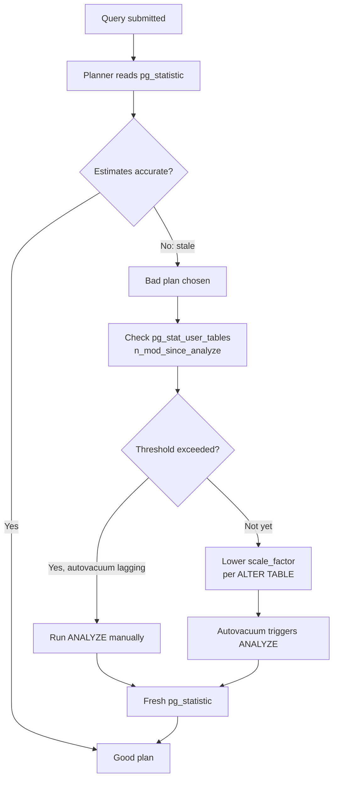

The PostgreSQL query planner does not look at table data directly — it relies on statistical summaries stored in `pg_statistic` and updated by [[code-paths/analyze|ANALYZE]]. When those summaries fall out of date, the planner's row count estimates diverge from reality. The resulting plans can be dramatically wrong: the wrong table driven first in a join, an index scan skipped in favour of a sequential scan, or a nested loop chosen over a hash join on a set with millions of rows. Diagnosing and fixing stale statistics is one of the highest-leverage performance interventions available.

## What the planner reads from statistics

For each analyzed column, `pg_statistic` stores several kinds of summary that feed the [[subsystems/planner/statistics|statistics]] subsystem:

- **Row count estimate** (`reltuples` in `pg_class`): the total number of live rows at the time of the last ANALYZE. Used as the base for all selectivity calculations.
- **MCV lists** (most common values): the N most frequent values and their frequencies. Enables exact selectivity for equality predicates on skewed columns.
- **Histograms**: bucket boundaries covering the value range. Used for range predicates on columns without dominant MCV values.
- **n_distinct**: the estimated number of distinct values. Negative values are a fraction of `reltuples` (e.g. `-0.5` means half the rows are distinct). Drives GROUP BY and join cardinality estimates.
- **Correlation**: how well the physical storage order tracks the sort order of the column. A value near 1.0 or -1.0 makes index scans cheap; near 0 they become expensive due to random I/O.

`do_analyze_rel` in `analyze.c` computes all of these. It calls `acquire_sample_rows` to draw a random sample, then `compute_stats` (dispatched per data type) to produce the summaries. `update_attstats` writes those summaries back to `pg_statistic`.

## Symptoms in EXPLAIN output

The clearest signal of stale statistics is a large discrepancy between `rows=` (the planner estimate) and `actual rows=` (what the executor produced), visible in `EXPLAIN (ANALYZE, BUFFERS)` output. See [[code-paths/explain|EXPLAIN]] for how to read the format.

Common bad-plan patterns caused by stale statistics:

- **Estimate far too low**: the planner thinks a table has 1 000 rows but it has 10 million. It picks a nested loop because it expects a small inner set. The nested loop executes millions of times.
- **Estimate far too high**: the planner overestimates rows after a bulk delete. It chooses a hash join or parallel plan when a simple index lookup would dominate.
- **Wrong join order**: PostgreSQL's planner drives joins from the smallest estimated set. If `reltuples` is stale on the smaller table, it picks the wrong driving side and scans the larger table repeatedly.
- **Sequential scan instead of index scan**: if `reltuples` is severely underestimated, the cost model believes even a full scan is cheap. A correct row count makes the random-I/O penalty of the index scan look worthwhile.

## Identifying staleness

`pg_stat_user_tables` exposes the key counters:

```sql
SELECT
    schemaname,
    relname,
    n_live_tup,
    n_dead_tup,
    n_mod_since_analyze,
    last_analyze,
    last_autoanalyze
FROM pg_stat_user_tables
WHERE n_mod_since_analyze > 0
ORDER BY n_mod_since_analyze DESC;
```

The critical column is `n_mod_since_analyze`: rows inserted, updated, or deleted since the last ANALYZE ran. Compare it against `reltuples` from `pg_class`:

```sql
SELECT
    c.relname,
    c.reltuples,
    s.n_mod_since_analyze,
    round(100.0 * s.n_mod_since_analyze / nullif(c.reltuples, 0), 1) AS pct_modified
FROM pg_stat_user_tables s
JOIN pg_class c ON c.oid = s.relid
ORDER BY pct_modified DESC NULLS LAST;
```

A table with `pct_modified` above 20 % almost certainly has stale statistics if [[subsystems/background/autovacuum|autovacuum]] has not yet caught up.

## Autovacuum's analyze threshold and its lag

Autovacuum triggers an ANALYZE pass when:

```
n_mod_since_analyze > autovacuum_analyze_threshold
                     + autovacuum_analyze_scale_factor × reltuples
```

With the defaults (`autovacuum_analyze_threshold = 50`, `autovacuum_analyze_scale_factor = 0.2`), a table with 5 million rows requires 1 000 050 modifications before autovacuum considers it stale enough to analyze. For tables with high write rates or stringent plan-quality requirements, this is far too coarse. See [[troubleshooting/autovacuum-not-keeping-up|autovacuum not keeping up]] for broader autovacuum lag patterns.

The lag compounds if autovacuum workers are busy on other tables. During that window, the planner runs on outdated summaries.

## Manual remediation

Running ANALYZE manually is immediate and low-cost — it takes a `ShareUpdateExclusiveLock`, which does not block reads or writes:

```sql
-- Refresh all columns on one table
ANALYZE tablename;

-- Targeted refresh of specific columns only
ANALYZE tablename (col1, col2);

-- Combined dead-tuple cleanup plus stats refresh
VACUUM ANALYZE tablename;
```

For large tables, targeted column ANALYZE is faster when only a few columns drive the bad plan. Check `EXPLAIN (ANALYZE)` to identify which columns have the bad estimates before running a full table ANALYZE.

## Per-table autovacuum tuning

The most durable fix for frequently-written tables is to lower the per-table analyze threshold:

```sql
-- Trigger analyze after 1 % modification instead of 20 %
ALTER TABLE t SET (autovacuum_analyze_scale_factor = 0.01);

-- For very small tables where scale_factor alone is too coarse
ALTER TABLE t SET (
    autovacuum_analyze_scale_factor = 0.01,
    autovacuum_analyze_threshold = 10
);
```

PostgreSQL stores this setting in `pg_class.reloptions`. It overrides the cluster-wide GUC for that table only, and it takes effect on the next autovacuum scheduling cycle without a server restart.

## Resetting tracking counters without touching statistics

`pg_stat_reset_single_table_counters(relid)` resets `n_mod_since_analyze`, `n_live_tup`, `n_dead_tup`, and related counters in the stats collector to zero — without altering any data in `pg_statistic` and without updating `last_analyze`.

```sql
SELECT pg_stat_reset_single_table_counters('mytable'::regclass);
```

This is useful in narrow operational cases. For example, after a large but inconsequential bulk load, you know the statistics are still representative. You just want autovacuum to stop treating the table as urgently dirty. It does not improve plan quality by itself. Because `last_analyze` is unchanged, any monitoring that checks that timestamp will still see the original value.

## Extended statistics for correlated columns

ANALYZE computes per-column statistics independently. When two columns are correlated — for example, `city` and `state` always appear together, or `order_status` and `payment_status` are functionally related — the planner multiplies their individual selectivities, producing an estimate far too low.

`CREATE STATISTICS` builds multi-column summaries that capture the joint distribution:

```sql
-- MCV-based multi-column statistics
CREATE STATISTICS city_state_stats (mcv) ON city, state FROM addresses;

-- Functional dependency detection (one column determines the other)
CREATE STATISTICS order_status_dep (dependencies) ON order_status, payment_status FROM orders;

-- n_distinct for combined group cardinality
CREATE STATISTICS order_ndistinct (ndistinct) ON region, product_category FROM sales;

ANALYZE addresses;  -- statistics must be collected after CREATE STATISTICS
```

See [[subsystems/planner/extended-statistics|extended statistics]] for how the planner selects and applies these summaries. PostgreSQL stores extended statistics in `pg_statistic_ext` (definition) and `pg_statistic_ext_data` (computed values); `extended_stats.c` populates them during ANALYZE.

## Adjusting statistics target

The `default_statistics_target` GUC (default 100) controls how many MCV entries and histogram buckets ANALYZE collects. For high-cardinality columns where 100 buckets do not capture the distribution precisely enough, raise it per column:

```sql
ALTER TABLE orders ALTER COLUMN customer_id SET STATISTICS 500;
ANALYZE orders (customer_id);
```

Higher targets increase ANALYZE time and `pg_statistic` storage but produce more accurate selectivity estimates for columns with non-uniform distributions. The [[subsystems/planner/selectivity-estimation|selectivity estimation]] code uses these buckets directly to interpolate range predicate frequencies.



## Related Topics

- [[subsystems/planner/stale-statistics-and-bad-plans|Stale Statistics and Bad Plans]] — the conceptual explanation of why estimates go stale and how the resulting errors propagate through the cost model, complementing the diagnostic and remediation workflow on this page.
- [[subsystems/planner/statistics|Planner statistics]] — how `pg_statistic` is structured and queried by the planner
- [[subsystems/planner/selectivity-estimation|Selectivity estimation]] — how histogram and MCV entries convert to row fractions
- [[subsystems/planner/extended-statistics|Extended statistics]] — multi-column and functional-dependency statistics
- [[subsystems/planner/cost-model|Cost model]] — how row estimates feed into plan cost calculations
- [[code-paths/analyze|ANALYZE code path]] — the full execution path from command to `pg_statistic` write
- [[subsystems/background/autovacuum|Autovacuum]] — how the background worker decides when to analyze
- [[troubleshooting/autovacuum-not-keeping-up|Autovacuum not keeping up]] — when autovacuum falls behind and how to recover
- [[troubleshooting/slow-queries|Slow queries]] — broader query performance diagnosis
- [[code-paths/explain|EXPLAIN]] — reading plan nodes and row estimate discrepancies
