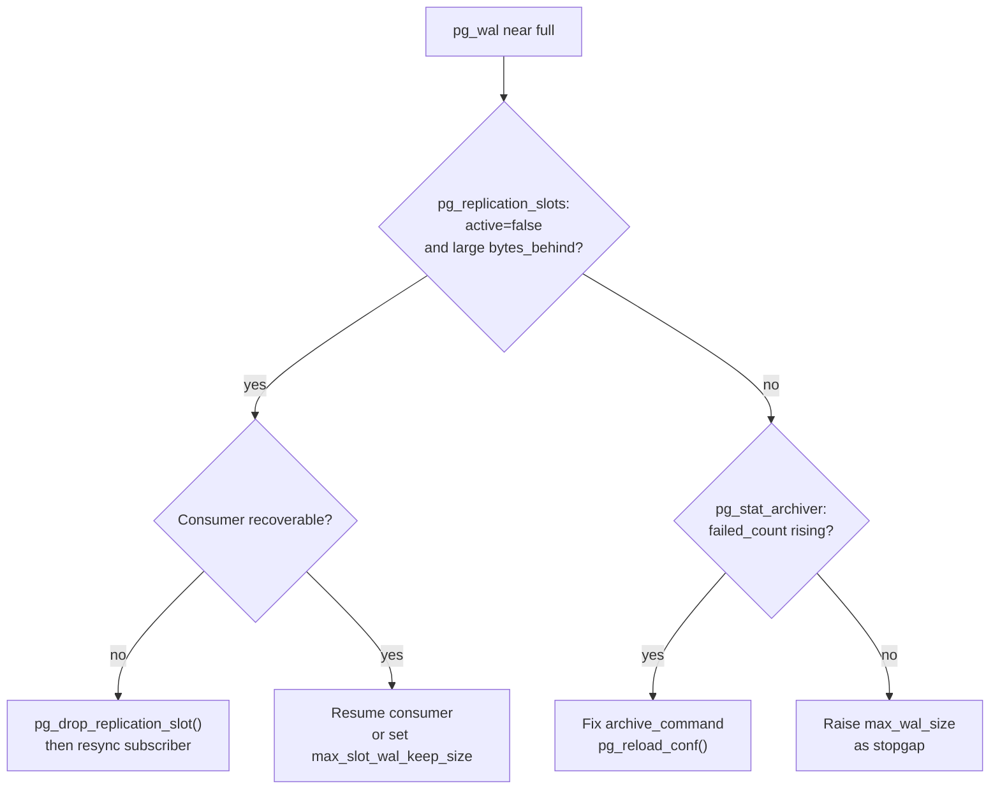

`pg_wal` grows when PostgreSQL cannot recycle old WAL segments. Recycling is safe only once every consumer of WAL — the checkpoint, all replication slots, and the archiver — has confirmed it no longer needs a segment. When any one of those consumers falls behind or fails silently, WAL accumulates without bound. A full `pg_wal` directory will crash a running cluster because PostgreSQL cannot write new transactions without disk space for WAL. Catching the growth early and knowing which consumer is the culprit determines whether recovery is fast or disruptive.

## Three Causes of WAL Growth

**Checkpoint cycle too slow.** PostgreSQL writes at most `max_wal_size` of WAL between checkpoints before forcing an early checkpoint. If the write workload produces WAL faster than `max_wal_size` allows before recycling, the directory grows. The default `max_wal_size` is 1 GB (hardcoded in `xlog.c` as `max_wal_size_mb = 1024`). Raising it defers checkpoints and reduces I/O spikes. But it also widens the WAL window that must be retained at all times. `min_wal_size` (default 80 MB) sets a floor: PostgreSQL always recycles segments below this threshold rather than removing them, keeping a pool of pre-allocated files ready.

**Replication slot retaining WAL past its `restart_lsn`.** Each [[subsystems/replication/slots|replication slot]] records a `restart_lsn` — the oldest WAL position the slot's consumer still needs. PostgreSQL will never recycle any segment that precedes `restart_lsn`. In `slot.c`, `ReplicationSlotRelease` and the segment-recycling scan both read `s->data.restart_lsn` and take the minimum across all active slots as the hard lower bound for WAL removal. If a slot's subscriber disconnects or stops consuming, `restart_lsn` freezes at that point in time. WAL then piles up indefinitely.

**Archiver falling behind with a failing `archive_command`.** When [[subsystems/wal/archiving|WAL archiving]] is enabled, PostgreSQL will not recycle a segment right away. It waits until `pgarch_ArchiverCopyFile` (or a custom archive library) confirms the segment has been durably archived. If `archive_command` fails — a full remote filesystem, a broken network mount, a misconfigured command — the archiver retries but does not block writes. The segment stays in `pg_wal`. The directory grows while write activity continues.

## Diagnosis Workflow

Run these queries in order to isolate the cause before taking action.

**Step 1 — Check replication slots.**

```sql
SELECT slot_name,
       slot_type,
       active,
       wal_status,
       restart_lsn,
       pg_current_wal_lsn() - restart_lsn AS bytes_behind,
       conflicting
FROM pg_replication_slots
ORDER BY restart_lsn NULLS LAST;
```

A slot with `active = false` and a large `bytes_behind` value is almost certainly the cause. The `wal_status` column reports `reserved`, `extended`, `unreserved`, or `lost` — anything other than `reserved` means the slot is already under pressure or has been invalidated.

**Step 2 — Check the archiver.**

```sql
SELECT archived_count,
       last_archived_wal,
       last_archived_time,
       failed_count,
       last_failed_wal,
       last_failed_time,
       last_failed_msg,
       stats_reset
FROM pg_stat_archiver;
```

A non-zero `failed_count` that is still climbing, combined with a `last_failed_time` close to now, confirms the archiver is continuously failing. `last_failed_msg` usually contains enough detail to diagnose the root cause (permission error, command not found, remote filesystem full).

**Step 3 — Inspect the directory.**

```sql
SELECT count(*),
       min(modification) AS oldest_file,
       pg_size_pretty(sum(size)) AS total_size
FROM pg_ls_waldir();
```

Cross-reference the oldest file's modification time with the timestamps from the slot and archiver queries. Also record the current write head:

```sql
SELECT pg_walfile_name(pg_current_wal_lsn());
```

If the oldest file in `pg_ls_waldir()` matches a WAL segment name far behind the current write head, the gap equals the retention being forced by the lagging consumer.

## Emergency Resolution

Resolve in this order. Stop as soon as `pg_ls_waldir()` begins shrinking.

**1. Drop the idle or lagging slot.**

If the slot has no active subscriber and losing it is acceptable, drop it immediately:

```sql
SELECT pg_drop_replication_slot('slot_name');
```

For [[subsystems/replication/logical|logical replication]] slots tied to a subscription, dropping the slot on the publisher side and then recreating the subscription (with a full table resync) is the recovery path. Do not drop a physical slot for a [[subsystems/replication/streaming|streaming replication]] standby that is currently catching up — it may still need the WAL it retained.

**2. Fix the archive command and reload.**

Correct the `archive_command` in `postgresql.conf`, then:

```sql
SELECT pg_reload_conf();
```

PostgreSQL picks up the new `archive_command` without a restart. The archiver will begin retrying immediately. Monitor `pg_stat_archiver.failed_count` to confirm failures stop.

**3. Increase `max_wal_size` as a stopgap.**

If neither slots nor archiving are the cause — or as a temporary measure while you fix slots and archiving — raise `max_wal_size` in `postgresql.conf` and reload. This does not remove existing files. It signals that the checkpoint cycle can produce more WAL before forcing a checkpoint. Once you resolve the underlying cause, more segments become eligible for recycling.

## max_slot_wal_keep_size

Introduced in PostgreSQL 13, `max_slot_wal_keep_size` sets a per-slot ceiling on how much WAL a slot may retain. When a slot's `restart_lsn` falls more than `max_slot_wal_keep_size` bytes behind the current WAL position, `InvalidateObsoleteReplicationSlots` marks the slot as invalid (the `conflicting` column becomes `true` and `wal_status` becomes `lost`). PostgreSQL then recycles the WAL segments that slot was holding.

The tradeoff is hard: once a slot is invalidated, its subscriber — a logical replication subscriber or a standby — cannot resume from where it stopped. It must either resync from scratch or be re-created. Set `max_slot_wal_keep_size` to a value your disk can absorb but large enough that a brief subscriber outage does not trigger invalidation:

```ini
# In postgresql.conf; requires only pg_reload_conf()
max_slot_wal_keep_size = 10GB
```

A value of `-1` (the default) disables the limit entirely. This is the traditional behavior — the source of unbounded `pg_wal` growth when slots go stale.

## wal_keep_size and Slot Retention Are Independent

`wal_keep_size` tells PostgreSQL to retain at least that many bytes of WAL unconditionally, regardless of slot state or archiving. It provides a floor for streaming standbys that are not using replication slots. It does not interact with `restart_lsn`: a slot's `restart_lsn` is the authoritative lower bound for segment recycling. It will always override `wal_keep_size` downward if the slot needs more WAL than `wal_keep_size` specifies. The two settings compose independently — the effective WAL floor is `max(wal_keep_size, oldest restart_lsn across all slots)`.

## Consequences of Slot Invalidation

When `max_slot_wal_keep_size` invalidates a slot, the subscriber immediately encounters errors on its next attempt to stream. For a [[subsystems/replication/logical|logical replication]] subscriber:

- `pg_replication_slots.conflicting` becomes `true`
- The subscription enters an error state; `pg_stat_subscription` will show the worker stopped
- Any in-flight logical replication apply workers exit with a "requested WAL segment has already been removed" error
- Full table synchronization is required: drop the subscription, drop the publisher-side slot, recreate the subscription with `COPY DATA`

For a physical standby using an invalidated slot, the standby halts its recovery with a fatal error. It then requires either a new base backup or a `pg_rewind` from a point that still shares WAL history with the primary.



## Prevention

Set `max_slot_wal_keep_size` on every server that uses replication slots. Drop unused slots promptly — they are easy to recreate and dangerous to forget. Alert on these two signals before disk space becomes critical:

```sql
-- Slots approaching or past their WAL limit
SELECT slot_name, wal_status, pg_size_pretty(pg_current_wal_lsn() - restart_lsn) AS lag
FROM pg_replication_slots
WHERE wal_status <> 'reserved';

-- Archiver falling behind
SELECT failed_count, last_failed_time, last_failed_msg
FROM pg_stat_archiver
WHERE failed_count > 0;
```

Monitor `pg_replication_slots.wal_status` — any value other than `reserved` warrants immediate investigation. A steady climb in `pg_stat_archiver.failed_count` between polls means segments are accumulating faster than the archiver can drain them.

## Related Topics

- [[subsystems/wal/overview|WAL Overview]]
- [[subsystems/wal/checkpoint|Checkpoint]]
- [[subsystems/wal/archiving|WAL Archiving]]
- [[subsystems/replication/slots|Replication Slots]]
- [[subsystems/replication/logical|Logical Replication]]
- [[subsystems/replication/streaming|Streaming Replication]]
- [[troubleshooting/replication-lag|Replication Lag]]
- [[subsystems/observability/pg-stat-activity|pg_stat_activity]]
