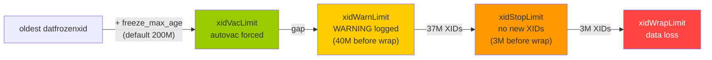

# XID Exhaustion Incident Playbook

PostgreSQL's 32-bit transaction ID (XID) counter holds roughly 4 billion values. But because ordering is modular, the usable safety window is only half that: about 2 billion transactions. When the gap between the oldest unfrozen XID in the cluster and the current XID counter exceeds 2^31, those old rows appear to belong to a "future" transaction. They become invisible to every snapshot — permanent data loss. The system has a layered defence that warns, then throttles, then shuts down writes to prevent reaching that point. This page is the response guide for when that defence is failing.

See [[subsystems/transactions/xid-wraparound]] for the underlying freeze mechanism and [[subsystems/background/autovacuum]] for normal autovacuum behaviour.

## Detection

### Log messages PostgreSQL emits

PostgreSQL emits warnings at escalating thresholds, all computed from `oldest_datfrozenxid` in `SetTransactionIdLimit()` (`varsup.c`).

**Autovacuum urgency signal (no log by default):** When `nextXid` crosses `xidVacLimit = oldest_datfrozenxid + autovacuum_freeze_max_age`, the server signals the autovacuum launcher to start a cycle immediately. This happens silently unless you have `log_autovacuum_min_duration` set and the triggered vacuum is logged.

**WARNING — 40 million XIDs from wraparound:**

```
WARNING:  database "mydb" must be vacuumed within 40000000 transactions
HINT:  To avoid a database shutdown, execute a database-wide VACUUM in that database.
       You might also need to commit or roll back old prepared transactions,
       or drop stale replication slots.
```

This fires when `nextXid` crosses `xidWarnLimit = xidWrapLimit - 40,000,000`. At default settings (`autovacuum_freeze_max_age = 200,000,000`), this means roughly 240 million transactions have elapsed since the oldest unfrozen XID was written.

**ERROR — 3 million XIDs from wraparound (database shutdown):**

```
ERROR:  database is not accepting commands to avoid wraparound data loss in database "mydb"
HINT:  Stop the postmaster and vacuum that database in single-user mode.
       You might also need to commit or roll back old prepared transactions,
       or drop stale replication slots.
```

This fires when `nextXid` crosses `xidStopLimit = xidWrapLimit - 3,000,000`. The cluster stops accepting new normal transactions entirely. VACUUM can still run (it does not always require a new XID). Single-user mode provides an escape hatch (`varsup.c` line 121).



### Relevant GUCs

| GUC | Default | Role |
|---|---|---|
| `autovacuum_freeze_max_age` | 200,000,000 | Forces autovacuum on any table whose `relfrozenxid` is older than this |
| `vacuum_freeze_min_age` | 50,000,000 | VACUUM only freezes tuples at least this old; tuples younger are left unfrozen |
| `vacuum_freeze_table_age` | 150,000,000 | Triggers an aggressive (all-page) scan when `relfrozenxid` age exceeds this |

PostgreSQL caps `vacuum_freeze_table_age` to 95% of `autovacuum_freeze_max_age` to ensure the aggressive scan fires before the forced-autovacuum deadline.

## Diagnosis

Run these queries to locate the problem. Connect to each database individually for per-table data.

**Cluster-wide: find the database holding back `datfrozenxid`.**

```sql
SELECT datname,
       age(datfrozenxid)                        AS xid_age,
       2147483647 - age(datfrozenxid)           AS xids_until_wraparound,
       datfrozenxid
FROM pg_database
ORDER BY age(datfrozenxid) DESC;
```

`age(datfrozenxid)` is the number of transactions since that database's oldest unfrozen XID. If it exceeds `autovacuum_freeze_max_age` (default 200M) for any database, autovacuum should already be running a forced vacuum there. If it approaches 2 billion, this is an active emergency.

**Per-table: find tables closest to wraparound (run inside the affected database).**

```sql
SELECT n.nspname,
       c.relname,
       age(c.relfrozenxid)                      AS xid_age,
       pg_size_pretty(pg_total_relation_size(c.oid)) AS total_size,
       s.n_dead_tup,
       s.last_vacuum,
       s.last_autovacuum
FROM pg_class c
JOIN pg_namespace n ON n.oid = c.relnamespace
LEFT JOIN pg_stat_user_tables s
       ON s.relid = c.oid
WHERE c.relkind IN ('r', 'm', 't')
ORDER BY age(c.relfrozenxid) DESC
LIMIT 20;
```

Tables with the highest `xid_age` are the ones to vacuum first. A `last_autovacuum` that is days or weeks old on an active table indicates autovacuum is not keeping up.

**Find replication slots or prepared transactions that may be pinning the XID horizon.**

```sql
-- Replication slots
SELECT slot_name, slot_type,
       age(xmin)          AS xmin_age,
       age(catalog_xmin)  AS catalog_xmin_age,
       active
FROM pg_replication_slots
ORDER BY age(xmin) DESC;

-- Prepared transactions
SELECT gid, prepared, age(transaction) AS xid_age
FROM pg_prepared_xacts
ORDER BY age(transaction) DESC;
```

An inactive replication slot with a large `xmin_age` or `catalog_xmin_age` is a common root cause. It prevents VACUUM from advancing `datfrozenxid` past what the slot requires.

## Emergency Response

### You have 10–40 million XIDs of headroom

The WARNING messages are appearing in the log. Autovacuum should be running anti-wraparound vacuums. But if it is falling behind, you need to help it.

**1. Identify the most dangerous tables** using the per-table query above. Sort by `age(relfrozenxid)` descending.

**2. Run VACUUM FREEZE on those tables manually**, starting with the oldest:

```sql
VACUUM (FREEZE, VERBOSE, ANALYZE) schema.tablename;
```

`VACUUM FREEZE` forces the `FreezeLimit` cutoff to freeze everything it can regardless of `vacuum_freeze_min_age`. `VERBOSE` lets you see progress. Prioritise large tables with old `relfrozenxid` first — small tables freeze quickly.

**3. If a replication slot is holding back the horizon**, drop it if it is stale or the downstream consumer is gone:

```sql
SELECT pg_drop_replication_slot('slot_name');
```

If the slot is still needed, ensure the consumer is running and consuming.

**4. If a prepared transaction is old**, resolve it:

```sql
COMMIT PREPARED 'gid';  -- or ROLLBACK PREPARED 'gid'
```

**5. Monitor progress** while vacuums run:

```sql
SELECT datname, age(datfrozenxid) FROM pg_database ORDER BY age(datfrozenxid) DESC;
```

The age should decrease as VACUUM FREEZE advances `relfrozenxid` and `datfrozenxid`.

### The database has already shut down (xidStopLimit hit)

The cluster is refusing all new transactions. The error message is "database is not accepting commands to avoid wraparound data loss." You must use single-user mode.

**1. Stop all connections gracefully.** You cannot restart in normal mode until the freeze is done.

**2. Start PostgreSQL in single-user mode** against the offending database (identified in the error message):

```bash
postgres --single -D /path/to/pgdata mydb
```

**3. In the single-user session, run a full freeze:**

```
VACUUM FREEZE;
```

This freezes all tables in the current database. It will take time proportional to database size. There is no progress output other than row counts.

**4. Exit and restart normally:**

```
\q
pg_ctl start -D /path/to/pgdata
```

**5. After restarting, verify `datfrozenxid` has advanced** and repeat the freeze for any other database with a high `age(datfrozenxid)`.

If multiple databases are near the limit, you must run single-user mode for each database separately.

## Conditions That Defeat Autovacuum

Autovacuum is designed to run before any table reaches `autovacuum_freeze_max_age`. But several conditions defeat it.

**`autovacuum_enabled = false` on a table.** Setting `ALTER TABLE t SET (autovacuum_enabled = false)` excludes a table from routine autovacuum. However, once its `relfrozenxid` age exceeds `autovacuum_freeze_max_age`, the anti-wraparound forced vacuum bypasses this setting — but only at that extreme threshold. If the table is large and infrequently vacuumed manually, it can sit at high age for a long time before the forced vacuum runs.

**Cost throttling causing autovacuum to fall behind.** Autovacuum respects `autovacuum_vacuum_cost_delay` (default 2 ms) and `autovacuum_vacuum_cost_limit`. On a system with very large tables or many tables, a single worker vacuuming at the default rate may not complete a full freeze pass before more transactions accumulate. The failsafe mechanism (`lazy_check_wraparound_failsafe()` in `vacuumlazy.c`) disables cost throttling once a table is in true emergency territory. But this kicks in late. Tuning `autovacuum_vacuum_cost_delay = 0` and raising `autovacuum_vacuum_cost_limit` for high-churn tables avoids this.

**Long-running transactions blocking freeze.** PostgreSQL caps `FreezeLimit` to never exceed `OldestXmin` — the oldest XID held by any active backend or replication slot. A session that has been idle in a transaction for hours or days holds `OldestXmin` back. This prevents VACUUM from freezing any tuple newer than that XID. VACUUM runs successfully but cannot advance `relfrozenxid` as far as it otherwise would. Identify and terminate these sessions:

```sql
SELECT pid, usename, state, now() - xact_start AS xact_duration, query
FROM pg_stat_activity
WHERE state IN ('idle in transaction', 'idle in transaction (aborted)')
ORDER BY xact_start;
```

**Replication slots holding back `catalog_xmin`.** As noted in the diagnosis section, a stale logical replication slot pins `OldestXmin` cluster-wide. `datfrozenxid` cannot advance past what the slot's `catalog_xmin` requires.

## MultiXact Wraparound

MultiXactId (mxid) is a parallel 32-bit counter used when multiple transactions hold row-level locks on the same tuple simultaneously. It has its own wraparound hazard, independent of XID exhaustion. It can also hit limits faster, because one lock interaction creates one or more MultiXact entries regardless of transaction size.

**Detection:** Check `pg_database.datminmxid` and `pg_class.relminmxid`:

```sql
-- Cluster-wide MultiXact age per database
SELECT datname,
       mxid_age(datminmxid)         AS mxid_age,
       datminmxid
FROM pg_database
ORDER BY mxid_age(datminmxid) DESC;

-- Per-table MultiXact age (run inside the database)
SELECT n.nspname, c.relname,
       mxid_age(c.relminmxid)       AS mxid_age,
       c.relminmxid
FROM pg_class c
JOIN pg_namespace n ON n.oid = c.relnamespace
WHERE c.relkind IN ('r', 'm', 't')
ORDER BY mxid_age(c.relminmxid) DESC
LIMIT 20;
```

The forced-autovacuum threshold for MultiXact is `autovacuum_multixact_freeze_max_age` (default 400,000,000). However, `MultiXactMemberFreezeThreshold()` in `autovacuum.c` may return a lower effective limit when the `pg_multixact/members/` storage directory is filling up — meaning the real limit can be lower than the GUC suggests. Tables with heavy `SELECT FOR SHARE` / `SELECT FOR UPDATE` traffic are most at risk.

**Response:** The same `VACUUM FREEZE` commands that advance `relfrozenxid` also advance `relminmxid` — VACUUM resolves old MultiXactIds via `FreezeMultiXactId()` and rewrites affected tuple headers. There is no separate procedure for MultiXact: fixing XID age and mxid age happens together.

The server log will include MultiXact-specific warnings analogous to the XID warnings when `nextMultiXactId` approaches the hard limit.

## Prevention

**Monitor `age(datfrozenxid)` in your alerting system.** At default settings, alert when `age(datfrozenxid)` exceeds 150 million (approaching `vacuum_freeze_table_age`). Page on-call when it exceeds 500 million. Use this query in your monitoring:

```sql
SELECT max(age(datfrozenxid)) FROM pg_database;
```

**Do not disable autovacuum on tables without a compensating manual schedule.** If a table must have `autovacuum_enabled = false`, add a scheduled `VACUUM FREEZE` job that runs at least once every `autovacuum_freeze_max_age / 2` transactions (roughly every 100 million transactions at default settings). There is no safe way to estimate this in calendar time because it depends on transaction rate, not elapsed time.

**Tune autovacuum aggressiveness for high-churn tables.** For tables that receive many updates per second, the default scale-factor-based thresholds may trigger vacuums frequently enough for dead-tuple reclamation but not advance `relfrozenxid` fast enough. Add per-table storage parameters:

```sql
ALTER TABLE high_churn_table SET (
    autovacuum_vacuum_cost_delay = 2,      -- ms; lower = faster vacuum
    autovacuum_vacuum_cost_limit = 400,    -- higher = less throttling
    autovacuum_freeze_max_age = 100000000  -- freeze earlier than the default
);
```

**Ensure no replication slots are abandoned.** Add monitoring for `age(xmin)` on `pg_replication_slots`. Investigate and drop any slot with `active = false` and a large XID age if the consumer is gone.

**After `pg_upgrade`, vacuum immediately.** `pg_upgrade` preserves `relfrozenxid` values from the old cluster. A database that was at 180 million XID age before the upgrade is equally old after it. Run `vacuumdb --all --freeze` after `pg_upgrade`.

## See Also

- [[subsystems/transactions/xid-wraparound]] — how tuple freezing works and the full safety threshold ladder
- [[subsystems/transactions/multixact]] — MultiXactId mechanics and its own wraparound hazard
- [[subsystems/background/autovacuum]] — autovacuum scheduling, cost throttling, and anti-wraparound forced vacuums
- [[code-paths/vacuum]] — the VACUUM execution path including aggressive mode and the wraparound failsafe

## Related Topics

- [[subsystems/transactions/hint-bits|Hint Bits]] — how VACUUM marks tuples as frozen by setting hint bits in tuple headers
- [[subsystems/storage/visibility-map|Visibility Map]] — tracks which pages are all-frozen, letting VACUUM skip them during aggressive scans
- [[subsystems/transactions/snapshot|Snapshots]] — how `OldestXmin` is computed from active snapshots, which caps how far VACUUM can advance `relfrozenxid`
- [[subsystems/replication/slots|Replication Slots]] — how an inactive slot pins `xmin` and blocks `datfrozenxid` from advancing
- [[subsystems/storage/clog|CLOG]] — the commit-log that records transaction status; freezing removes the dependency on old CLOG pages
- [[subsystems/observability/pg-stat-activity|pg_stat_activity]] — used during incidents to find idle-in-transaction sessions holding back `OldestXmin`
